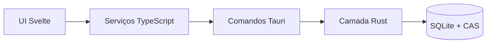
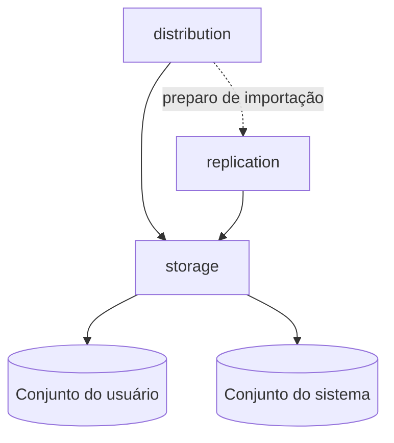

# Arquitetura Geral

Este é o documento raiz de arquitetura do Veterinary Clinic.
Ele serve como mapa para entender as grandes fronteiras do app e apontar para
os documentos específicos de cada parte.

Este arquivo não deve virar documentação profunda de implementação. Quando uma
área precisar de detalhe próprio, crie ou atualize um documento específico e
adicione o link aqui.

## Modelo Mental



A aplicação é local-first: os dados principais vivem no dispositivo do usuário.
A UI é SvelteKit/Tauri, e a persistência fica centralizada no Rust com
`rusqlite` e arquivos CAS.

## Núcleo De Persistência



As três fronteiras principais são:

- `storage`: mantém bancos ativos, conexões SQLite e arquivos CAS.
- `distribution`: importa/exporta pacotes completos nativos ou CSV.
- `replication`: mantém backup/sincronização contínua por patches.

Essa separação é a regra mais importante da persistência atual. Se uma lógica
começa a misturar pacote completo, conexão ativa e sincronização contínua no
mesmo lugar, ela provavelmente está no módulo errado.

## Conjuntos De Dados

Conjunto do usuário:

```text
veterinary_clinic_user.db
veterinary_clinic_user_media.db
veterinary_clinic_user_logs.db
vault/user/xx/yy/<hash_sha256>.bin
```

Conjunto do sistema:

```text
veterinary_clinic_system.db
veterinary_clinic_system_media.db
vault/system/xx/yy/<hash_sha256>.bin
```

O conjunto do usuário é importado, exportado e replicado.
O conjunto do sistema é reconstruído pelo app a partir dos defaults incluídos
no programa.

## Princípios

- Dados do usuário e dados de sistema ficam separados.
- Bytes originais de mídia ficam no CAS, não dentro do SQLite operacional.
- A identidade da base vive em `database_manifest`, dentro do banco de logs do
  usuário.
- Backup contínuo é replicação por patches, não exportação repetida de ZIP.
- Importação/exportação completa pertence a `distribution`.
- Conexões ativas e caminhos de arquivos pertencem a `storage`.
- Conversões externas e adoções de base ficam fora do app em execução, em
  `legacy-to-sqlite`.

## Documentos Específicos

- [Arquitetura De Armazenamento](storage-architecture.md): bancos ativos,
  conexões SQLite, CAS, mídia, manifesto e exclusão definitiva.
- [Arquitetura De Distribuição](distribution-architecture.md): importação e
  exportação completa em ZIP nativo ou CSV.
- [Arquitetura De Replicação Local-First](replication-architecture.md):
  backup/sincronização contínua por patches, outbox e destinos.
- [Política De Backup](backup-policy.md): visão de produto sobre backup
  contínuo, exportação e importação.
- [Versionamento De Banco E Ritual De Lançamento](database-versioning.md):
  regras de versão de estrutura, migração e lançamento.
- [Alvos De Construção](build-targets.md): comandos de desenvolvimento,
  verificações e empacotamento.
- [Desenvolvimento No Debian 13](development-debian13.md): ambiente local,
  dependências e comandos úteis.

## Como Adicionar Novos Docs De Arquitetura

Ao criar uma nova área arquitetural:

1. crie `docs/<area>-architecture.md`;
2. explique fronteira, responsabilidades, relação com outros módulos e riscos;
3. mantenha exemplos concretos de fluxo e caminhos quando ajudarem;
4. adicione o link em "Documentos Específicos";
5. evite duplicar detalhes já documentados em outro arquivo.

## Resumo Em Uma Frase

A arquitetura do app separa **armazenamento ativo**, **distribuição completa** e
**replicação contínua**, mantendo este documento como mapa geral e deixando os
detalhes em arquivos específicos.
