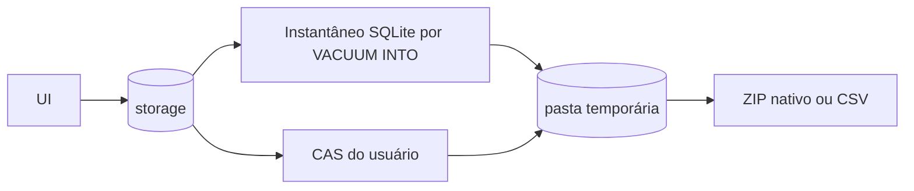
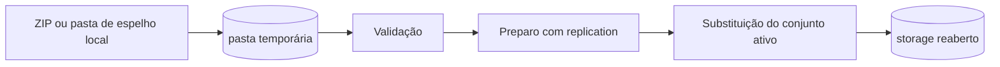
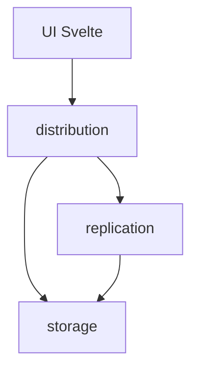

# Arquitetura De Distribuição

Este documento explica a arquitetura de `packages/engine/src/distribution`.
Ele existe para deixar claro que **distribuição** é o fluxo manual de
importação/exportação completa, enquanto **replicação** é o fluxo contínuo de
backup/sincronização por patches.

A separação é intencional:

- `distribution` move um conjunto completo de dados quando o usuário pede;
- `replication` mantém cópias locais/NAS/cloud atualizadas ao longo do tempo;
- `storage` abre os bancos ativos, gerencia caminhos e resolve arquivos CAS.

## Ideia Central

`distribution` é um módulo de transporte completo.

Ele não captura alterações, não mantém fila, não decide conflito contínuo e não
sincroniza em segundo plano. Seu trabalho é criar ou consumir um pacote fechado
com os dados do usuário.

Fluxo de exportação:



Fluxo de importação:



Resumo mental:

```text
distribution = pacote completo entra ou sai
replication  = mudanças pequenas entram e saem continuamente
storage      = arquivos e bancos ativos
```

## Fronteiras

`distribution` faz:

- exportação nativa completa em ZIP;
- exportação CSV completa em ZIP;
- importação nativa a partir de ZIP;
- importação CSV a partir de ZIP;
- importação a partir de uma pasta `local_mirror` já existente;
- validação de identidade da base por `database_manifest`;
- criação de exportação de segurança quando a última sincronização não conclui;
- fechamento, substituição e reabertura controlada do conjunto de usuário.

`distribution` não faz:

- captura de micro-patches;
- entrega para backup local/NAS/cloud;
- fila de saída;
- compactação incremental de patches;
- resolução contínua de conflitos entre dispositivos;
- atualização de linhas-base de replicação;
- geração de catálogos de sistema;
- regra de negócio de tutores, pets, produtos, prontuários ou tratamentos.

Se uma mudança precisa rodar a cada 10 segundos, ela não pertence a
`distribution`.

## Conjunto Do Usuário

Toda distribuição trabalha com o conjunto lógico do usuário:

```text
veterinary_clinic_user.db
veterinary_clinic_user_media.db
veterinary_clinic_user_logs.db
vault/user/xx/yy/<hash_sha256>.bin
```

Esse mesmo conjunto é aberto por `storage` e sincronizado por `replication`.

Dados de sistema ficam fora:

```text
veterinary_clinic_system.db
veterinary_clinic_system_media.db
vault/system/xx/yy/<hash_sha256>.bin
```

Raças, produtos de sistema, fabricantes, princípios ativos, condições e mídias
de referência são reconstruídos pelo app. Eles não devem ser exportados junto
com os dados do cliente.

## Identidade Da Base

A identidade da base vive dentro de `veterinary_clinic_user_logs.db`, na tabela
`database_manifest`.

Essa tabela contém o `database_id`, um UUIDv7 criado quando a base nasce.

Esse identificador resolve um problema importante: impedir que o usuário escolha
por engano uma pasta de backup ou pacote pertencente a outra clínica/base.

Não existe `manifest.json` solto para distribuição. A identidade fica no banco
de logs porque:

- viaja junto com a base;
- entra em exportação nativa;
- entra em exportação CSV;
- entra no espelho de backup;
- é mais difícil ser esquecida ao copiar arquivos manualmente.

Regra: pacote sem `database_manifest` válido deve ser recusado.

## Pacote Nativo

O pacote nativo é o formato preferencial para mover a base entre máquinas.

Estrutura:

```text
data/
  veterinary_clinic_user.db
  veterinary_clinic_user_media.db
  veterinary_clinic_user_logs.db
vault/
  user/
    xx/
      yy/
        <hash_sha256>.bin
```

Os bancos em `data/` são criados com `VACUUM INTO`. Eles nunca são copiados
diretamente do arquivo `.db` ativo.

Isso é obrigatório porque SQLite em WAL pode ter dados válidos nos arquivos
`-wal` e `-shm`. Uma cópia direta do `.db` poderia criar um pacote incompleto.

O CAS é copiado como árvore de arquivos. Os arquivos originais não são
serializados para CSV nem colocados dentro de outro banco.

## Pacote CSV

O pacote CSV existe para inspeção, auditoria e portabilidade emergencial.

Estrutura:

```text
data_csv/
  <tabelas de veterinary_clinic_user.db>.csv
media_csv/
  blobs.csv
logs_csv/
  database_manifest.csv
  permanent_deletion_logs.csv
  system_audit_logs.csv
vault/
  user/
    xx/
      yy/
        <hash_sha256>.bin
```

O CSV carrega linhas e metadados; os arquivos originais continuam no CAS.

Campos binários declarados em `csv_tables.rs`, como hashes e thumbnails, são
serializados em hexadecimal. Isso torna o CSV legível sem perder bytes.

Tabelas de sistema não entram no pacote CSV do usuário.

## Exportação Nativa

Fluxo:

1. normaliza o destino escolhido pelo usuário;
2. cria uma pasta temporária de trabalho;
3. cria instantâneos dos três bancos com `VACUUM INTO`;
4. copia `vault/user`;
5. monta o ZIP final;
6. remove a pasta temporária ao sair do fluxo.

O arquivo final é um pacote fechado e portável. Ele não deixa dependência nos
arquivos ativos do app.

## Exportação CSV

Fluxo:

1. normaliza o destino escolhido pelo usuário;
2. cria uma pasta temporária de trabalho;
3. exporta tabelas do banco operacional para `data_csv`;
4. exporta `blobs` do banco de mídia para `media_csv`;
5. exporta tabelas do banco de logs para `logs_csv`;
6. copia `vault/user`;
7. monta o ZIP final.

O banco de logs precisa entrar no CSV porque ele contém:

- identidade da base;
- trilha de exclusões definitivas;
- trilha de auditoria técnica/jurídica.

## Importação Nativa

Origens aceitas:

- ZIP nativo;
- pasta efetiva de `local_mirror`;
- pasta-pai que contém exatamente um `local_mirror` válido.

Fluxo:

1. normaliza a origem;
2. extrai ZIP para uma pasta temporária, quando necessário;
3. localiza os três bancos e `vault/user`;
4. valida `PRAGMA integrity_check`;
5. valida versão de estrutura;
6. valida `database_manifest`;
7. chama `replication` para preparar a importação;
8. cria exportação de segurança se a última sincronização falhar;
9. fecha conexões do conjunto de usuário;
10. remove sidecars SQLite antigos;
11. substitui bancos e CAS;
12. reabre conexões.

Quando a origem é uma pasta de `local_mirror`, a resposta pode trazer
`replication_target_path`. A UI usa esse caminho para ativar o mesmo local como
backup contínuo depois da importação.

## Importação CSV

Fluxo:

1. extrai o ZIP para uma pasta temporária;
2. exige `data_csv`;
3. cria bancos vazios a partir da estrutura atual do app;
4. importa tabelas do usuário;
5. importa `media_csv/blobs.csv`;
6. importa `logs_csv`;
7. copia `vault/user`;
8. valida integridade e manifesto;
9. segue o mesmo fluxo de preparo e substituição da importação nativa.

A estrutura vem do app atual. O CSV traz dados. Isso evita que um CSV antigo
tente recriar uma estrutura ultrapassada.

## Importação A Partir De Espelho Local (`local_mirror`)

O usuário pode apontar para uma pasta de backup local/NAS/USB.

`distribution` aceita duas formas:

```text
/caminho/escolhido/Veterinary Clinic - <database_id>/
```

ou:

```text
/caminho/escolhido/
  Veterinary Clinic - <database_id>/
```

Se a pasta-pai tiver mais de um espelho válido, a importação é recusada. O app
não escolhe sozinho entre bases possíveis.

Importar de espelho não substitui a arquitetura de backup. Depois da importação,
a UI configura o mesmo caminho em `replication`, que assume o trabalho
contínuo de ida e volta por patches.

## Preparo Antes Da Troca

Antes de substituir a base ativa, `distribution` chama
`replication::orchestrator::prepare_for_database_import`.

Essa ponte existe para evitar perda de dados recentes:

1. se há pasta de backup configurada, `replication` tenta uma última
   sincronização;
2. se essa sincronização conclui, a importação segue;
3. se falha, `distribution` cria uma exportação nativa de segurança em
   `AppData/import_safety_exports/`;
4. o caminho dessa exportação volta como `safety_export_path`.

Essa é a única ponte esperada entre `distribution` e `replication`.

## Substituição Do Conjunto Ativo

Na troca do conjunto ativo:

1. `StorageManager` fecha conexões do usuário;
2. sidecars SQLite `-wal` e `-shm` de destino são removidos;
3. cada banco novo é copiado para um arquivo temporário;
4. o temporário é renomeado para o nome oficial;
5. `vault/user` é substituído pela origem;
6. `StorageManager` reabre as conexões.

Essa sequência evita reaproveitar WAL/SHM de uma base anterior e reduz risco de
arquivo parcialmente escrito virar banco ativo.

## Componentes

### `commands.rs`

Fronteira Tauri IPC.

Mantém os comandos públicos consumidos pela UI:

- `export_user_native_package`;
- `export_user_csv_package`;
- `import_user_native_package`;
- `import_user_csv_package`.

O arquivo deve continuar fino. Ele só adapta `State<StorageManager>` para os
fluxos reais.

### `contracts.rs`

DTOs dos comandos Tauri.

Campos importantes:

- `path`: origem ou destino principal;
- `safety_export_path`: exportação de segurança criada antes da importação;
- `replication_target_path`: raiz de backup contínuo detectada ao importar de
  `local_mirror`.

### `exporter.rs`

Fluxo de exportação nativa e CSV.

Não decide estrutura, não valida domínio clínico e não conhece UI. Só monta
pacote.

### `importer.rs`

Fluxo de importação.

Resolve origem, valida pacote, conversa com `replication` para preparo,
substitui o conjunto ativo e devolve caminhos relevantes.

### `database_package.rs`

Cria instantâneos consistentes dos bancos com `VACUUM INTO`.

Qualquer exportação nativa deve passar por aqui.

### `csv.rs`

Leitura e escrita CSV.

Também converte BLOBs definidos em `csv_tables.rs` entre bytes e hexadecimal.

### `csv_tables.rs`

Lista declarativa das tabelas exportadas/importadas no pacote CSV.

Quando uma tabela de usuário nasce, este é um dos arquivos que precisa ser
revisto.

### `files.rs`

Utilitários de filesystem para pasta temporária, cópia recursiva, substituição de
diretório e substituição segura de SQLite.

### `sqlite.rs`

Helpers SQLite de distribuição:

- `VACUUM INTO`;
- `PRAGMA user_version`;
- validação com `integrity_check`;
- clone de estrutura vazia para importação CSV.

### `zip.rs`

Leitor/escritor ZIP mínimo com entradas sem compressão.

O objetivo é manter o pacote simples, auditável e sem dependência extra.

### `time.rs`

Datas para nome de arquivo e metadados DOS do ZIP.

## Relação Com `storage` E `replication`



- `storage` mantém conexões ativas e caminhos CAS.
- `distribution` usa `storage` para instantâneo e substituição do conjunto.
- `replication` usa `storage` para sincronização contínua.
- `distribution` só chama `replication` no preparo de importação.

## Proteções

### Instantâneo Seguro

Exportação nativa usa `VACUUM INTO`. Não copiar SQLite ativo é regra, não
preferência.

### Validação Antes De Substituir

Importação valida:

- existência dos bancos esperados;
- `PRAGMA integrity_check`;
- versão de estrutura não futura;
- `database_manifest` no banco de logs;
- estrutura mínima do pacote.

### Exportação De Segurança

Se a última sincronização com o backup contínuo falha, o app gera um pacote
nativo de segurança antes de trocar a base ativa.

### Recusa De Ambiguidade

Ao importar de uma pasta-pai, se houver mais de um `local_mirror` válido, a
importação é recusada.

### CAS Por Hash

Arquivos CAS são identificados pelo SHA-256 do conteúdo.

Isso permite copiar mídias sem tentar adivinhar nomes, extensões ou origem. Se
um arquivo já existe, ele pode ser reutilizado. Se um arquivo falta, o metadado
de mídia continua apontando para um hash verificável.

## Onde Ainda Existe Risco

O módulo reduz risco, mas não elimina toda possibilidade operacional:

- pacote ZIP pode estar truncado ou adulterado;
- CSV pode ter sido editado manualmente com valor inválido;
- usuário pode escolher um pacote antigo por engano;
- CAS pode estar incompleto em uma pasta copiada manualmente;
- importação pode falhar depois de fechar conexões, antes de reabrir.

Mitigações atuais:

- validação SQLite antes da substituição;
- manifesto no banco de logs;
- exportação de segurança quando necessário;
- troca de arquivos com temporário;
- reabertura controlada do conjunto;
- limpeza de WAL/SHM antes da troca.

## O Que Não Fazer

- Não colocar timer de backup em `distribution`.
- Não criar outbox aqui.
- Não aplicar patch de `replication` aqui.
- Não exportar tabelas de sistema como dados do usuário.
- Não criar `manifest.json` solto.
- Não copiar `.db` ativo com `std::fs::copy`.
- Não colocar regra de domínio clínico nos pacotes.
- Não deixar `importer.rs` escolher entre múltiplos `local_mirror`.
- Não resetar linha-base de replicação dentro deste módulo.

## Como Ler O Código

Ordem recomendada:

1. `mod.rs`: fronteira e constantes do pacote;
2. `commands.rs`: comandos Tauri expostos;
3. `contracts.rs`: DTOs do IPC;
4. `exporter.rs`: fluxo de exportação;
5. `database_package.rs`: instantâneo seguro dos bancos;
6. `csv_tables.rs`: contrato CSV das tabelas;
7. `csv.rs`: leitura/escrita CSV;
8. `importer.rs`: fluxo completo de importação;
9. `files.rs`: substituição segura de arquivos;
10. `sqlite.rs`: validação e utilitários SQLite;
11. `zip.rs`: empacotamento físico.

## Resumo Em Uma Frase

`distribution` não mantém backup vivo; ele cria e consome **pacotes completos**
do conjunto do usuário, usando `storage` para acessar arquivos reais e
`replication` apenas para preparar uma importação sem perder a última
sincronização possível.
