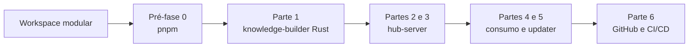

# Pré-fase 0: Migração Do Workspace Para pnpm

## Objetivo

Adotar pnpm como único gerenciador dos projetos TypeScript e JavaScript do
workspace antes da implementação do `knowledge-builder` e do `hub-server`.

A migração preserva o comportamento dos apps, scripts e builds. Seu resultado é
uma base única e determinística para desenvolvimento local, Tauri, Flatpak,
versionamento e CI/CD.

## Resultado Alvo

O workspace usa:

- Node.js 22;
- pnpm `11.22.0`, fixado no `packageManager` da raiz;
- `pnpm-workspace.yaml` como fonte única da composição do workspace;
- `pnpm-lock.yaml` como único lockfile JavaScript;
- protocolo `workspace:*` em todas as dependências entre packages locais;
- resolução estrita de dependências, sem hoisting amplo para compensar manifests
  incompletos;
- comandos públicos executados pela raiz com `pnpm <script>`;
- instalação reproduzível com `pnpm install --frozen-lockfile`.

O escopo de packages `@vet/*` permanece. Ele identifica os packages internos e
não depende do gerenciador usado para instalá-los.

## Posição Na Sequência



Nenhuma parte do Hub começa antes de esta pré-fase passar em todos os critérios
de aceite. As partes seguintes assumem pnpm e não mantêm comandos alternativos
para outro gerenciador.

## Escopo

- fixar Node.js e pnpm no contrato da raiz;
- criar a configuração canônica do workspace pnpm;
- migrar o lockfile sem atualizar deliberadamente dependências;
- converter as dependências locais `@vet/*` para `workspace:*`;
- adaptar scripts da raiz e de `apps/vet-app`;
- incorporar `legacy-to-sqlite` ao mesmo workspace e lockfile;
- adaptar os comandos executados pelo Tauri e pelo empacotamento Flatpak;
- ajustar o script de versionamento para não editar lockfile manualmente;
- detectar e declarar dependências que hoje são acessadas sem estarem no
  `package.json` do package consumidor;
- declarar de forma explícita os pacotes autorizados a executar scripts de
  instalação;
- atualizar documentação ativa e instruções de desenvolvimento;
- estabelecer o contrato pnpm que será usado no CI/CD.

## Fora De Escopo

- implementar `tools/knowledge-builder`;
- criar `apps/hub-server`;
- alterar regras de domínio ou comportamento de telas;
- atualizar versões das dependências da aplicação;
- mudar versões de Svelte, Vite, Vitest, Tauri ou ECharts;
- introduzir Turborepo, Nx ou outro orquestrador de monorepo;
- publicar packages `@vet/*` em registry externo;
- reorganizar pastas de apps ou packages;
- alterar schemas ou dados SQLite.

## Arquivos Canônicos

Ao concluir a migração, a raiz contém:

```text
package.json
pnpm-workspace.yaml
pnpm-lock.yaml
Cargo.toml
Cargo.lock
```

Não permanecem `package-lock.json`, `npm-shrinkwrap.json`, `yarn.lock` ou
lockfiles JavaScript dentro de apps e packages.

O campo `workspaces` é removido do `package.json` da raiz. A descoberta dos
projetos JavaScript pertence somente a `pnpm-workspace.yaml`:

```yaml
packages:
  - "apps/*"
  - "packages/*"
  - "tools/*"
  - "legacy-to-sqlite"

linkWorkspacePackages: false
saveWorkspaceProtocol: true
sharedWorkspaceLockfile: true
disallowWorkspaceCycles: true
strictPeerDependencies: true
engineStrict: true
strictDepBuilds: true
allowBuilds:
  better-sqlite3: true
```

`tools/*` permite ferramentas JavaScript futuras sem interferir no crate Rust
`tools/knowledge-builder`, que não possui `package.json`.

`legacy-to-sqlite` participa do mesmo workspace e lockfile, mas conserva sua
fronteira de ferramenta externa de adoção de bancos.

`linkWorkspacePackages: false` exige que cada vínculo local seja intencional por
meio de `workspace:*`. `disallowWorkspaceCycles: true` transforma ciclos entre
packages em erro de instalação, reforçando o DAG documentado do workspace.

Não configurar `shamefullyHoist`, `nodeLinker: hoisted` ou um `hoistPattern`
amplo. Quando a instalação estrita revelar uma dependência ausente, ela é
declarada no `package.json` do consumidor correto.

## Versões Da Ferramenta

O `package.json` da raiz declara:

```json
{
  "packageManager": "pnpm@11.22.0",
  "engines": {
    "node": ">=22.0.0"
  }
}
```

O ambiente de desenvolvimento usa Node.js 22 e ativa a versão de pnpm declarada
pelo projeto. A documentação fornece instalação por Corepack para Node.js 22 e
um caminho explícito para Windows, Linux e CI.

O CI não instala uma versão flutuante de pnpm. A configuração lê ou replica
exatamente `11.22.0`, e o cache usa `pnpm-lock.yaml` como chave de dependências.

## Contrato Das Dependências Locais

Todos os vínculos entre packages do workspace usam:

```json
{
  "dependencies": {
    "@vet/types": "workspace:*"
  }
}
```

Converter dessa forma os vínculos presentes em:

```text
apps/vet-app/package.json
packages/app-services/package.json
packages/core-local/package.json
packages/modules/package.json
packages/ui/package.json
```

As dependências continuam na seção que representa sua função real:

- `dependencies` quando necessárias no runtime ou na API pública do package;
- `peerDependencies` quando devem ser fornecidas pelo app consumidor;
- `devDependencies` quando usadas somente para compilar, testar ou validar o
  package dono.

Não mover dependências entre essas seções apenas para silenciar a instalação.
Cada mudança precisa corresponder ao uso real do importador.

## Scripts Da Raiz

Os nomes públicos dos scripts permanecem estáveis. A implementação interna usa
filtros pelo nome do package:

```text
pnpm dev
pnpm build
pnpm preview
pnpm check
pnpm check:watch
pnpm test
pnpm test:run
pnpm adopt:version
pnpm version:bump
pnpm tauri
pnpm tauri:dev
pnpm tauri:dev:new
pnpm tauri:build
pnpm tauri:appimage
pnpm tauri:deb
pnpm tauri:flatpak
pnpm tauri:msi
pnpm tauri:android:dev
pnpm tauri:android:build
```

Para comandos pertencentes ao `vet-app`, o `package.json` da raiz usa o padrão:

```text
pnpm --filter vet-app run <script>
```

Os scripts diretos de Vite, SvelteKit e Tauri pertencem ao manifest do
`vet-app`. A raiz apenas expõe os comandos públicos que delegam ao app. O
`prepare` permanece como lifecycle do `vet-app` e não é delegado pela raiz,
evitando duas execuções de `svelte-kit sync` durante a instalação.

Tarefas que operam sobre o repositório, como `version:bump` e
`tauri:flatpak`, existem somente na raiz.

Nesta pré-fase, `pnpm dev` conserva o comportamento atual do `vet-app`. A Parte
4 amplia esse comando para orquestrar também o Hub local.

O script `tauri:dev:new` continua executando `scripts/new-state.mjs`, aguardando
o intervalo definido e iniciando `pnpm tauri:dev`.

## Integrações De Build

Atualizar os pontos que executam o gerenciador diretamente:

- `apps/vet-app/src-tauri/tauri.conf.json` usa `pnpm run dev` em
  `beforeDevCommand` e `pnpm run build` em `beforeBuildCommand`;
- `scripts/build-flatpak.mjs` executa pnpm por argumentos separados, sem shell,
  e filtra `vet-app` pelo nome do package;
- scripts auxiliares não chamam npm por processo filho;
- os comandos continuam resolvendo a CLI Tauri instalada no workspace, sem
  instalação global.

O Tauri, AppImage, `.deb`, Flatpak e MSI continuam consumindo os mesmos arquivos
e produzindo os mesmos tipos de saída. A migração não altera configurações de
bundle.

## Versionamento Do App

`scripts/bump-version/` continua atualizando os manifests do app, packages,
Cargo, Tauri, AppStream e a constante gerada de versão.

O script deixa de abrir ou modificar um lockfile JavaScript. `pnpm-lock.yaml` é
gerado exclusivamente pelo pnpm e não recebe alterações manuais. Alterar somente
o campo `version` dos manifests locais não força reescrita do lockfile.

Os textos de ajuda e o README do versionador usam:

```text
pnpm version:bump -- <major|minor|patch> "Release note"
```

Após um bump, `pnpm install --frozen-lockfile` precisa continuar passando.

## Migração Do Lockfile

Executar a migração com a versão fixada de pnpm:

1. registrar o baseline funcional e o estado do repositório;
2. alterar os manifests e criar `pnpm-workspace.yaml`;
3. usar `pnpm import` para aproveitar as resoluções registradas em
   `package-lock.json`;
4. gerar e revisar `pnpm-lock.yaml` sem solicitar upgrades;
5. remover todos os diretórios `node_modules` gerados pelo gerenciador anterior;
6. instalar a árvore exclusivamente com pnpm;
7. corrigir manifests incompletos revelados pela resolução estrita;
8. validar o workspace em uma instalação limpa com
   `pnpm install --frozen-lockfile`;
9. remover `package-lock.json` somente depois da validação integral.

Não editar `pnpm-lock.yaml` manualmente. Qualquer alteração nele é produzida por
um comando pnpm executado na raiz.

## Scripts De Instalação De Dependências

pnpm mantém scripts de instalação de dependências sob controle explícito. A
migração inspeciona os scripts solicitados pela árvore instalada e registra em
`allowBuilds` somente os packages necessários para o toolchain usado pelo
projeto.

Cada autorização possui uma justificativa verificável. `better-sqlite3` é
autorizado para preparar o binding nativo usado por `legacy-to-sqlite`. Não
habilitar todos os scripts, não aceitar uma allowlist por conveniência e não
manter uma dependência autorizada depois que ela sair do grafo.

Com `strictDepBuilds: true`, um script necessário que não esteja classificado
interrompe a instalação. O lockfile e a allowlist são revisados juntos.

## Auditoria De Dependências

A estrutura estrita de pnpm pode revelar imports que funcionam por hoisting. A
correção segue estas regras:

1. localizar o arquivo importador;
2. identificar o package dono desse arquivo;
3. declarar a dependência no manifest desse package;
4. classificar corretamente como runtime, peer ou desenvolvimento;
5. executar novamente check, testes e build;
6. confirmar que não foi criado ciclo no DAG.

Não criar aliases de resolução, symlinks manuais ou imports relativos entre
packages para contornar a declaração de dependências.

## Documentação E Instruções

Durante a execução, atualizar os documentos operacionais que descrevem comandos
vigentes:

```text
.github/copilot-instructions.md
docs/build-targets.md
docs/database-versioning.md
docs/development-debian13.md
docs/modular-architecture.md
docs/plans/modular-monolith-refactor-map.md
packages/types/src/domain/geo/README.md
scripts/bump-version/README.md
```

Atualizar também qualquer README ativo de app ou package que instrua instalação,
check, teste, build ou empacotamento.

Os documentos usam `pnpm install --frozen-lockfile` para instalações
reproduzíveis e `pnpm <script>` para comandos da raiz. Não apresentam dois
gerenciadores como alternativas equivalentes.

## Contrato Para CI/CD

Os workflows da Parte 6 seguem esta base:

```text
checkout
-> configurar Node.js 22
-> configurar pnpm 11.22.0
-> restaurar cache do store pela chave de pnpm-lock.yaml
-> pnpm install --frozen-lockfile
-> pnpm check
-> pnpm test:run
-> pnpm build
-> cargo check --workspace
```

O cache armazena o store do pnpm, não `node_modules`. Pull requests não podem
alterar manifests sem atualizar coerentemente `pnpm-lock.yaml`.

## Sequência De Implementação

### Atividade 1: Baseline

Executar com a configuração atual:

```sh
npm run check
npm run test:run
npm run build
cargo check --workspace
```

Registrar resultados e `git status --short`. A migração não avança sobre um
baseline funcionalmente quebrado sem que a causa já esteja identificada.

### Atividade 2: Contrato pnpm

- criar `pnpm-workspace.yaml`;
- fixar pnpm e Node.js no `package.json` da raiz;
- adicionar um `preinstall` local que recuse gerenciadores diferentes de pnpm;
- remover o campo `workspaces` do manifest raiz;
- converter dependências locais para `workspace:*`.

O guard de `preinstall` fica em script local simples, sem baixar um package
apenas para verificar `npm_config_user_agent`.

### Atividade 3: Scripts E Ferramentas

- converter scripts da raiz e do `vet-app`;
- ajustar `tauri.conf.json`;
- ajustar `build-flatpak.mjs`;
- ajustar `bump-version` e seus textos de ajuda;
- procurar processos filhos e comandos ativos que ainda invoquem npm.

### Atividade 4: Lockfile E Instalação Estrita

- importar as resoluções;
- gerar `pnpm-lock.yaml`;
- reinstalar em árvore limpa;
- declarar dependências ausentes no package dono;
- configurar `allowBuilds` com justificativas;
- confirmar ausência de ciclos do workspace.

### Atividade 5: Documentação Ativa

- atualizar ambiente de desenvolvimento;
- atualizar alvos de build e versionamento;
- atualizar instruções para agentes e packages;
- verificar que comandos futuros do Hub usam pnpm.

### Atividade 6: Validação Integral

Executar:

```sh
pnpm install --frozen-lockfile
pnpm check
pnpm test:run
pnpm build
cargo check --workspace
pnpm tauri --version
```

Executar os builds empacotáveis suportados pelo ambiente disponível. No Linux,
validar pelo menos o build Tauri sem bundle e o caminho do Flatpak até o ponto
permitido pelas ferramentas instaladas.

Por fim, procurar referências operacionais restantes:

```sh
rg -n "npm|npx|package-lock|npm-shrinkwrap|yarn.lock" \
  package.json pnpm-workspace.yaml apps packages scripts flatpak .github \
  docs/build-targets.md docs/database-versioning.md \
  docs/development-debian13.md docs/modular-architecture.md \
  docs/plans/hub-server docs/plans/modular-monolith-refactor-map.md
```

Uma ocorrência só permanece quando documenta o comando de baseline desta
pré-fase ou um nome técnico inevitável, como `.npmrc` para configuração de
registry. `docs/prompts/` e planos concluídos não são fontes de comandos
operacionais para esta validação. Comandos de execução vigentes usam pnpm.

## Testes

Cobrir:

- instalação limpa com lockfile congelado;
- recusa de npm pelo guard da raiz;
- resolução de todos os packages `@vet/*` pelo protocolo `workspace:*`;
- execução do fluxo atual de `legacy-to-sqlite` pelo workspace raiz;
- ausência de ciclos entre packages;
- ausência de dependências ocultas por hoisting;
- execução dos scripts públicos da raiz;
- `svelte-check`, Vitest e build SvelteKit;
- resolução da CLI Tauri local;
- comando de limpeza e inicialização `tauri:dev:new`;
- build Tauri sem bundle;
- caminho de empacotamento Flatpak;
- version bump sem edição manual de `pnpm-lock.yaml`;
- instalação congelada depois do version bump;
- ausência de lockfiles concorrentes;
- funcionamento em diretório de trabalho limpo.

## Critérios De Aceite

- `pnpm-workspace.yaml` é a única definição do workspace JavaScript.
- O projeto fixa pnpm `11.22.0` e Node.js 22.
- `pnpm-lock.yaml` é o único lockfile JavaScript versionado.
- Todas as dependências locais usam `workspace:*`.
- Não existe ciclo entre packages do workspace.
- Nenhuma dependência depende de hoisting amplo para ser resolvida.
- Scripts de instalação de terceiros usam allowlist explícita.
- npm é recusado como gerenciador do workspace.
- Os nomes dos scripts públicos da raiz permanecem estáveis.
- Tauri e Flatpak executam pnpm diretamente.
- O versionador não lê nem escreve lockfile manualmente.
- Documentação operacional e instruções ativas usam pnpm.
- Instalação, checks, testes, build web e Cargo passam em árvore limpa.
- A Parte 1 pode começar sem carregar comandos ou lockfiles de outro
  gerenciador.

## Próxima Parte

Após cumprir todos os critérios, seguir para a
[Parte 1: preparação local dos artefatos `system`](./01-knowledge-artifacts-preparation.md).

## Referências Técnicas

- [Instalação e compatibilidade de versões do pnpm](https://pnpm.io/installation)
- [Workspaces e protocolo `workspace:`](https://pnpm.io/workspaces)
- [Configuração de `pnpm-workspace.yaml`](https://pnpm.io/settings)
- [pnpm em integração contínua](https://pnpm.io/continuous-integration)
