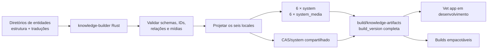

# Parte 1: Preparação Local Dos Artefatos `system`

## Objetivo

Implementar o `knowledge-builder` definitivo em Rust para gerar um par `system`
e `system_media` para cada locale suportado, além do `CAS/system` compartilhado.
A ferramenta é determinística, testável e isolada do runtime. `apps/vet-app`
consome os artefatos completos dos locales selecionados em desenvolvimento e nos
builds empacotáveis.

Cada execução materializa um estado integral dos dados públicos. A identidade
local desse estado é `build_version`, representada por um inteiro positivo.

## Pré-requisito

A [Pré-fase 0](./00-pnpm-workspace-migration.md) está integralmente concluída. O
workspace usa pnpm, um único `pnpm-lock.yaml` e dependências locais com
`workspace:*`. Todos os comandos JavaScript desta parte são executados pela raiz
com pnpm.

## Escopo

- reorganizar todas as fontes públicas de conhecimento no contrato canônico por
  domínio e entidade;
- criar `tools/knowledge-builder/` como binário e biblioteca Rust no Cargo
  Workspace;
- definir uma CLI estável para validação e build;
- produzir `build-result.json` como contrato de saída legível por máquinas;
- substituir fontes paralelas, loaders diretos e imports de JSON que não façam
  parte do contrato canônico;
- gerar um banco completo `system` para cada locale suportado;
- gerar um banco completo `system_media` para cada locale suportado;
- montar e validar o cofre incremental `CAS/system`;
- atribuir uma `build_version` inteira à saída completa;
- calcular o SHA-256 dos bancos e objetos referenciados;
- registrar as versões técnicas independentes de `system` e `system_media` em
  todos os locales;
- retirar a geração dos bancos e do CAS de dentro do app;
- fazer o app resolver o par de bancos pelo locale ativo, sem importar dados
  fonte nem conhecer a estrutura interna do gerador;
- preparar os artefatos para desenvolvimento e builds empacotáveis.

Os locales obrigatórios são definidos por uma lista canônica compartilhada:

```text
pt-BR
pt-PT
gn-PY
en-US
es-ES
fr-FR
```

O contrato público de locales permanece em `@vet/types/i18n/locales`. A
configuração equivalente do Hub é validada contra essa lista no CI para impedir
divergência entre geração, manifest e consumidor.

Uma execução gera os seis pares sob a mesma `build_version`. Ausência ou falha de
qualquer locale invalida a saída completa.

Esta parte produz somente estados completos. O modelo público de releases e a
montagem dos seus meios de distribuição pertencem à Parte 3.

## Fluxo Da Parte



O app consome a saída local nesta parte. Esse meio de aquisição é uma fronteira
intermediária, mas o builder é definitivo: na Parte 3, o `hub-server` passa a
invocar o mesmo binário com outra origem de dados e outro diretório de staging.
Na Parte 4, somente a origem dos artefatos no app é substituída pela API.

## Local Do Código

A implementação fica em:

```text
tools/knowledge-builder/
├── Cargo.toml
├── src/
│   ├── lib.rs
│   ├── main.rs
│   ├── cli.rs
│   ├── source/
│   ├── validation/
│   ├── projection/
│   ├── databases/
│   ├── media/
│   └── report/
├── schemas/
│   ├── source/
│   ├── system/
│   └── system_media/
├── fixtures/
└── tests/
```

O crate usa `src/lib.rs` como núcleo testável e `src/main.rs` como adapter fino de
CLI. Ele é incluído em `members` no `Cargo.toml` da raiz. A ferramenta concentra
a leitura dos dados públicos, a projeção de cada locale, a criação dos doze
bancos, a montagem do CAS, as validações e a escrita da saída versionada.

O builder é o único escritor dos bancos públicos. O DDL e as regras de criação de
`system` e `system_media` pertencem a `tools/knowledge-builder/schemas/` e são
embutidos ou carregados de forma versionada pelo crate. `packages/core-local`
conserva contratos de leitura, queries e validação das versões de schema
suportadas, sem possuir outra rotina de geração dos bancos públicos.

`schemas/source/` contém os JSON Schemas de autoria por domínio. Os tipos Rust
correspondentes usam desserialização estrita, e as validações semânticas do crate
cobrem unicidade, referências cruzadas, locales e mídia além da validação
estrutural dos arquivos.

O app, o `hub-server` e os packages não duplicam DDL, seeds, projeção ou montagem
do CAS. Testes de integração abrem os bancos produzidos pelo builder usando as
queries públicas de `core-local` para validar o contrato entre escritor e leitor.

## Contrato Da CLI

O binário oferece dois comandos públicos:

```text
knowledge-builder validate \
  --source <knowledge-data>

knowledge-builder build \
  --source <knowledge-data> \
  --output <artifact-directory> \
  --context <build-context.json>
```

`--source` e `--output` são sempre explícitos. A ferramenta não depende do
diretório de trabalho, não acessa a base Rails, não consulta rede, não publica
releases e não conhece canais ou providers. `build` sempre projeta os seis
locales obrigatórios como uma única operação.

O contexto local da Parte 1 é:

```json
{
  "schemaVersion": 1,
  "buildVersion": 1,
  "release": null
}
```

`release: null` identifica uma saída integral de desenvolvimento ou build. A
tabela `knowledge_release_metadata` permanece sem linha nesse modo. Na Parte 3,
o Hub fornece no mesmo contrato uma identidade pública já reservada:

```json
{
  "schemaVersion": 1,
  "buildVersion": 42,
  "release": {
    "releaseId": "<uuid>",
    "generation": 2,
    "revision": 1
  }
}
```

Nesse modo, o builder grava a mesma identidade pública nos dois bancos de cada
locale. O contexto é um contrato de artefato e não concede ao builder acesso ao
Rails ou responsabilidade por criar e publicar a release.

Logs humanos vão para `stderr`. O resultado legível por máquinas fica no arquivo
`build-result.json`; sucesso retorna código `0` e qualquer erro retorna código
não zero sem deixar uma versão parcialmente finalizada.

O contrato inicial do relatório é:

```json
{
  "schemaVersion": 1,
  "builderVersion": "0.1.0",
  "buildVersion": 1,
  "release": null,
  "sourceDigestSha256": "<sha256>",
  "systemSchemaVersion": 1,
  "systemMediaSchemaVersion": 1,
  "locales": {
    "pt-BR": {
      "system": {
        "path": "versions/1/locales/pt-BR/veterinary_clinic_system.db",
        "sizeBytes": 0,
        "checksumSha256": "<sha256>"
      },
      "systemMedia": {
        "path": "versions/1/locales/pt-BR/veterinary_clinic_system_media.db",
        "sizeBytes": 0,
        "checksumSha256": "<sha256>"
      },
      "casSetDigestSha256": "<sha256>"
    }
  },
  "cas": {
    "algorithm": "sha256",
    "root": "CAS/system",
    "objectCount": 0,
    "setDigestSha256": "<sha256>"
  },
  "checksumFile": "versions/1/checksums.sha256"
}
```

O exemplo detalha somente `pt-BR`; um relatório válido contém exatamente os seis
locales suportados. `schemaVersion` versiona o contrato da CLI, enquanto
`builderVersion` identifica a versão do binário. Nenhum desses campos substitui
as versões técnicas dos bancos nem a versão pública de conhecimento.

Todos os caminhos do relatório são relativos a `--output`, normalizados e sem
componentes vazios, absolutos ou `..`. O consumidor resolve somente arquivos
dentro do diretório de staging e confirma tamanho e SHA-256 antes de usá-los.
`build-result.json` usa serialização JSON determinística em UTF-8; seu consumidor
calcula o checksum sobre os bytes exatos do arquivo.

Os dados fonte públicos usados nesta parte ficam em:

```text
packages/types/src/catalog/defaults/
packages/types/src/domain/**/defaults/
```

Cada diretório representa uma entidade canônica. `entity.json` contém seus campos
estruturais uma única vez, e `localizations/` contém um arquivo JSON independente
para cada um dos seis locales suportados. O builder combina `entity.json` com a
tradução pedida e preserva IDs, relações, classificações, regiões, referências
CAS e demais dados não localizáveis nas seis projeções.

A organização operacional da Parte 3 conserva esse contrato em uma árvore por
domínio e entidade:

```text
apps/hub-server/data/knowledge/<domain>/<entity>/
├── entity.json
└── localizations/
    ├── pt-BR.json
    ├── pt-PT.json
    ├── gn-PY.json
    ├── en-US.json
    ├── es-ES.json
    └── fr-FR.json
```

Na Parte 3, `apps/hub-server` possui operacionalmente esses dados e invoca o mesmo
builder Rust. `packages/types` conserva contratos, tipos e utilitários
compartilhados.

O contrato de fonte exige:

- `id` global e estável por entidade;
- exatamente um `entity.json` dono de cada `id`;
- exatamente um arquivo de localização para cada locale obrigatório;
- nome do arquivo e campo `locale` interno obrigatoriamente iguais;
- schema estrutural e schema de localização próprios de cada domínio;
- campos estruturais somente em `entity.json`;
- campos traduzíveis somente no arquivo de localização;
- referências entre entidades feitas por IDs, sem depender de nomes traduzidos;
- regiões tratadas como dados de domínio, sem filtrar a entidade pelo idioma;
- referências de mídia compartilhadas em `entity.json`;
- referências de mídia específicas do idioma, legendas e textos alternativos no
  arquivo de localização correspondente.

Nenhum código de geração fica em:

```text
apps/vet-app/
packages/modules/
```

Depois da conversão, cada entidade pública possui uma única fonte canônica.
Arquivos substituídos, índices gerados manualmente, loaders e imports diretos são
removidos na mesma alteração. O app e os packages de negócio não usam os JSONs
como fallback para consultas de conhecimento.

## Saída Local

```text
build/knowledge-artifacts/
├── CAS/
│   └── system/
│       └── <hashes SHA-256>
└── versions/
    └── <build_version>/
        ├── locales/
        │   ├── pt-BR/
        │   │   ├── veterinary_clinic_system.db
        │   │   └── veterinary_clinic_system_media.db
        │   ├── pt-PT/
        │   ├── gn-PY/
        │   ├── en-US/
        │   ├── es-ES/
        │   └── fr-FR/
        ├── checksums.sha256
        └── build-result.json
```

`build_version` aceita somente inteiros positivos e identifica o conjunto
completo produzido pela execução. Ela não representa versão de schema nem versão
pública de distribuição.

`CAS/system` é único e incremental. Objetos existentes são reaproveitados entre
builds; o processo adiciona conteúdo ausente sem duplicar o cofre por versão.

Cada `system_media.db` é o índice canônico das mídias exigidas por seu locale. A
geração lê seus hashes, garante que cada objeto esperado existe em `CAS/system` e
verifica se o conteúdo corresponde ao SHA-256 declarado. O cofre físico é a união
deduplicada dos seis conjuntos. Objetos não referenciados podem permanecer no
cofre, mas não são incluídos nos recursos de um app.

Para cada entidade, o conjunto de mídia de um locale é a união das referências
compartilhadas de `entity.json` com as referências declaradas em seu arquivo de
localização. Uma localização também pode referenciar um hash compartilhado para
fornecer legenda ou texto alternativo sem duplicar o objeto no CAS.

`checksums.sha256` cobre os doze bancos e todos os objetos CAS referenciados pelos
seis índices daquela `build_version`. O diretório `build/` é saída gerada e nunca
é fonte de verdade.

## Determinismo

Para os mesmos dados fonte, `build_version`, versões técnicas, locales e
configuração, o processo produz bancos com o mesmo conteúdo lógico e os mesmos
checksums.
Timestamps e outros valores voláteis não entram na saída sem uma entrada
explícita.

O Cargo lockfile, a versão do toolchain Rust e a implementação SQLite usada pelo
builder são fixados. O processo define explicitamente os PRAGMAs que afetam os
bytes dos bancos, ordena a enumeração de diretórios, entidades, relações e
inserções e canonicaliza as entradas usadas em `sourceDigestSha256`.

`sourceDigestSha256` cobre, em ordem canônica e sem incorporar caminhos absolutos,
todos os JSONs, schemas de autoria e bytes de mídia que participam da compilação.
Alterar qualquer entrada efetiva altera o digest; mover o workspace sem alterar
seu conteúdo lógico não o altera.

O processo valida:

- `build_version` como inteiro positivo;
- schema das entidades canônicas de cada domínio;
- unicidade global dos IDs e integridade das referências entre entidades;
- presença exata dos seis arquivos em `localizations/`;
- correspondência entre nome do arquivo e campo `locale` interno;
- ausência de campos estruturais nos arquivos localizados e de campos
  traduzíveis em `entity.json`;
- presença dos campos localizados obrigatórios de cada domínio;
- presença exata dos seis locales suportados;
- schemas e `PRAGMA user_version` dos doze bancos;
- `PRAGMA integrity_check` dos doze bancos;
- igualdade dos conjuntos de IDs e das relações não localizáveis entre locales;
- locale canônico registrado em cada par de bancos;
- unicidade e formato dos hashes de mídia;
- presença e SHA-256 de todos os objetos CAS referenciados;
- ausência de referência de mídia sem objeto correspondente;
- correspondência entre os arquivos produzidos, `checksums.sha256` e
  `build-result.json`.

Cada execução escreve primeiro em staging, valida toda a saída e só então move o
diretório para `versions/<build_version>`. Objetos CAS são gravados em arquivo
temporário, validados por hash e movidos atomicamente para o cofre.

Uma execução nunca altera uma versão já finalizada com bytes diferentes. Para
materializar outro estado completo, usa-se uma nova `build_version`.

## Consumo Local Em Desenvolvimento

O ambiente de desenvolvimento seleciona explicitamente uma `build_version` e
um ou mais locales e usa:

```text
build/knowledge-artifacts/versions/<build_version>/locales/<locale>/veterinary_clinic_system.db
build/knowledge-artifacts/versions/<build_version>/locales/<locale>/veterinary_clinic_system_media.db
build/knowledge-artifacts/CAS/system/
```

Antes de iniciar o app, o comando de preparação verifica os checksums dos pares
selecionados e a presença dos objetos referenciados. O app abre os bancos como
recursos de sistema e não executa sua geração.

Uma fronteira única resolve os recursos pelo locale solicitado:

```text
resolveKnowledgeResources(locale)
  -> system_database_path
  -> system_media_database_path
  -> cas_system_root
```

Rotas, componentes e módulos de negócio usam os serviços públicos de
conhecimento e não constroem caminhos para `build/`. Ao trocar o idioma ativo, a
camada de conhecimento fecha o par anterior, resolve o novo locale e abre juntos
`system` e `system_media` correspondentes. Locale sem par completo produz erro
explícito e nunca combina bancos de idiomas diferentes.

## Consumo Nos Builds Dos Apps

O build seleciona explicitamente uma `build_version` e uma lista não vazia de
locales. Ele inclui somente os pares selecionados e copia de `CAS/system` a união
dos hashes referenciados pelos respectivos `system_media.db`, sem duplicar
objetos compartilhados.

A regra vale para:

```text
tauri:build
tauri:appimage
tauri:deb
tauri:msi
tauri:flatpak
```

O build empacotável falha com uma mensagem que informa o comando de preparação
quando a versão solicitada, um banco ou um objeto CAS obrigatório está ausente.
O build do app não executa a geração por conta própria.

## Entregáveis

```text
seis veterinary_clinic_system.db completos, um por locale
seis veterinary_clinic_system_media.db completos, um por locale
CAS/system único e incremental
checksums.sha256 por build_version
build-result.json por build_version
binário knowledge-builder
```

## Testes

Cobrir:

- build e testes do crate no Cargo Workspace;
- CLI `validate` e `build` com argumentos explícitos;
- execução a partir de diretórios de trabalho diferentes;
- validação de `build-context.json` local e público;
- contexto local mantendo `knowledge_release_metadata` sem linha;
- contexto público gravando release, geração, revisão e locale correspondentes
  nos doze bancos;
- `build-result.json` válido, completo e coerente com os arquivos produzidos;
- recusa de `schemaVersion` ou configuração de build não suportada;
- geração completa e repetível;
- combinação de um `entity.json` com cada uma de suas seis localizações;
- seleção exclusiva do arquivo correspondente ao locale projetado;
- recusa de arquivo de localização duplicado, ausente ou desconhecido;
- recusa de divergência entre o nome do arquivo e o campo `locale`;
- recusa de campo estrutural em tradução e de campo traduzível em
  `entity.json`;
- recusa de ID duplicado e referência estrutural inexistente;
- preservação de regiões e demais campos estruturais em todas as projeções;
- composição do `system_media` com mídias compartilhadas e específicas do
  locale;
- geração dos seis locales na mesma execução;
- IDs e relações estruturais estáveis entre locales;
- recusa de locale ausente, desconhecido ou incompleto;
- validação e seleção de `build_version` inteira;
- recusa de sobrescrita divergente da mesma `build_version`;
- `PRAGMA integrity_check` dos doze bancos;
- `PRAGMA user_version` independente de cada banco;
- SHA-256 dos bancos;
- correspondência entre cada `system_media.db` e `CAS/system`;
- detecção de objeto CAS ausente ou corrompido;
- reaproveitamento de objetos CAS já existentes;
- consumo dos artefatos pelo app em desenvolvimento;
- resolução do par correto conforme o locale ativo;
- troca de locale sem reutilizar conexão ou banco do idioma anterior;
- recusa de par ausente, incompleto ou com locales divergentes;
- ausência de imports, loaders e caminhos alternativos para as fontes JSON;
- seleção de locales e cópia da união exata dos objetos referenciados para builds
  empacotáveis;
- ausência de geração pelo app;
- abertura dos doze bancos pelas APIs de leitura de `core-local`;
- ausência de outra implementação de DDL, seeds ou geração dos bancos públicos;
- falha clara para entrada inválida ou artefato ausente.

## Critérios De Aceite

- O workspace continua passando em `pnpm install --frozen-lockfile`,
  `pnpm check`, `pnpm test:run` e `pnpm build`.
- A geração roda por comando explícito.
- `tools/knowledge-builder` é membro do Cargo Workspace e passa em build, lint e
  testes.
- A CLI não depende de Rails, Node, diretório de trabalho ou acesso à rede.
- O contexto de build controla de forma explícita a presença de metadados de
  release, sem alterar o restante da projeção.
- A fonte é organizada por domínio e diretório de entidade, com `entity.json` e
  seis arquivos independentes em `localizations/`.
- Cada saída completa possui uma `build_version` inteira positiva.
- Os seis pares possuem versões técnicas próprias e passam na validação SQLite.
- IDs e relações não localizáveis permanecem estáveis entre todos os locales.
- Todo hash de cada `system_media.db` possui objeto CAS válido.
- `checksums.sha256` e `build-result.json` descrevem exatamente os doze bancos e
  objetos referenciados.
- O app consome uma versão explícita de `build/knowledge-artifacts` em
  desenvolvimento.
- Toda consulta de conhecimento do app usa a fronteira localizada e o par do
  locale ativo.
- Não permanecem fontes JSON paralelas nem geração acionada pelo app.
- Os builds empacotáveis recebem somente os pares de locales selecionados e a
  união CAS necessária.
- O app não gera bancos ou CAS públicos em desenvolvimento, runtime ou build.
- O `knowledge-builder` permanece como único compilador quando o `hub-server`
  assume a orquestração na Parte 3.

## Próxima Parte

[Parte 2: Base Rails e contratos públicos](./02-rails-api-contracts.md)
