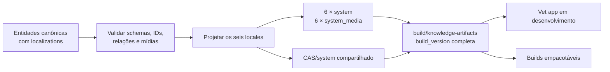

# Parte 1: Preparação Local Dos Artefatos `system`

## Objetivo

Organizar o processo local que gera um par `system` e `system_media` para cada
locale suportado, além do `CAS/system` compartilhado, como uma ferramenta
determinística, testável e isolada do runtime. `apps/vet-app` consome os
artefatos completos dos locales selecionados em desenvolvimento e nos builds
empacotáveis.

Cada execução materializa um estado integral dos dados públicos. A identidade
local desse estado é `build_version`, representada por um inteiro positivo.

## Escopo

- reorganizar todas as fontes públicas de conhecimento no contrato canônico por
  domínio e entidade;
- substituir fontes paralelas, loaders diretos e imports de JSON que não façam
  parte do contrato canônico;
- gerar um banco completo `system` para cada locale suportado;
- gerar um banco completo `system_media` para cada locale suportado;
- montar e validar o cofre incremental `CAS/system`;
- atribuir uma `build_version` inteira à saída completa;
- calcular o SHA-256 dos bancos e objetos referenciados;
- registrar as versões técnicas independentes de `system` e `system_media` em
  todos os locales;
- retirar a geração dos bancos e do CAS de dentro do app;
- fazer o app resolver o par de bancos pelo locale ativo, sem importar dados
  fonte nem conhecer a estrutura interna do gerador;
- preparar os artefatos para desenvolvimento e builds empacotáveis.

Os locales obrigatórios são definidos por uma lista canônica compartilhada:

```text
pt-BR
pt-PT
gn-PY
en-US
es-ES
fr-FR
```

O contrato público de locales permanece em `@vet/types/i18n/locales`. A
configuração equivalente do Hub é validada contra essa lista no CI para impedir
divergência entre geração, manifest e consumidor.

Uma execução gera os seis pares sob a mesma `build_version`. Ausência ou falha de
qualquer locale invalida a saída completa.

Esta parte produz somente estados completos. O modelo público de releases e a
montagem dos seus meios de distribuição pertencem à Parte 3.

## Fluxo Da Parte



O app consome a saída local nesta parte. Esse meio de aquisição é uma fronteira
intermediária: os contratos dos dados, bancos, locales e checksums permanecem; o
gerador local é assumido pelo `hub-server` na Parte 3 e a origem dos artefatos no
app é substituída pela API na Parte 4.

## Local Do Código

A orquestração fica em:

```text
scripts/knowledge-artifacts/
```

Essa pasta concentra a leitura dos dados públicos, a projeção de cada locale, a
criação dos doze bancos, a montagem do CAS, as validações e a escrita da saída
local versionada.

Schemas e utilitários SQLite reutilizáveis permanecem nos packages donos:

```text
packages/core-local/src/sqlite/create/system/main/
packages/core-local/src/sqlite/create/system/media/
packages/core-local/src/sqlite/create/shared/
```

Os dados fonte públicos usados nesta parte ficam em:

```text
packages/types/src/catalog/defaults/
packages/types/src/domain/**/defaults/
```

Cada arquivo representa uma entidade canônica. Seus campos estruturais aparecem
uma única vez e seus campos traduzíveis ficam em `localizations`, um objeto
indexado pelos seis locales suportados. O gerador seleciona a localização pedida
e preserva IDs, relações, classificações, regiões, referências CAS e demais dados
não localizáveis nas seis projeções.

A organização operacional da Parte 3 conserva esse contrato em uma árvore por
domínio e entidade:

```text
apps/hub-server/data/knowledge/<domain>/<entity>.json
```

Na Parte 3, `apps/hub-server` possui operacionalmente esses dados e implementa a
geração em Ruby. `packages/types` conserva contratos, tipos e utilitários
compartilhados.

O contrato de fonte exige:

- `id` global e estável por entidade;
- exatamente um arquivo dono de cada `id`;
- `localizations` como objeto, nunca como lista de traduções;
- uma chave em `localizations` para cada locale obrigatório;
- schema próprio por domínio para definir campos estruturais e localizados;
- referências entre entidades feitas por IDs, sem depender de nomes traduzidos;
- regiões tratadas como dados de domínio, sem filtrar a entidade pelo idioma;
- referências de mídia estruturais por hash, com textos de apresentação da mídia
  dentro da localização quando aplicável.

Nenhum código de geração fica em:

```text
apps/vet-app/
packages/modules/
```

Depois da conversão, cada entidade pública possui uma única fonte canônica.
Arquivos substituídos, índices gerados manualmente, loaders e imports diretos são
removidos na mesma alteração. O app e os packages de negócio não usam os JSONs
como fallback para consultas de conhecimento.

## Saída Local

```text
build/knowledge-artifacts/
├── CAS/
│   └── system/
│       └── <hashes SHA-256>
└── versions/
    └── <build_version>/
        ├── locales/
        │   ├── pt-BR/
        │   │   ├── veterinary_clinic_system.db
        │   │   └── veterinary_clinic_system_media.db
        │   ├── pt-PT/
        │   ├── gn-PY/
        │   ├── en-US/
        │   ├── es-ES/
        │   └── fr-FR/
        └── checksums.sha256
```

`build_version` aceita somente inteiros positivos e identifica o conjunto
completo produzido pela execução. Ela não representa versão de schema nem versão
pública de distribuição.

`CAS/system` é único e incremental. Objetos existentes são reaproveitados entre
builds; o processo adiciona conteúdo ausente sem duplicar o cofre por versão.

Cada `system_media.db` é o índice canônico das mídias exigidas por seu locale. A
geração lê seus hashes, garante que cada objeto esperado existe em `CAS/system` e
verifica se o conteúdo corresponde ao SHA-256 declarado. O cofre físico é a união
deduplicada dos seis conjuntos. Objetos não referenciados podem permanecer no
cofre, mas não são incluídos nos recursos de um app.

`checksums.sha256` cobre os doze bancos e todos os objetos CAS referenciados pelos
seis índices daquela `build_version`. O diretório `build/` é saída gerada e nunca
é fonte de verdade.

## Determinismo

Para os mesmos dados fonte, `build_version`, versões técnicas, locales e
configuração, o processo produz bancos com o mesmo conteúdo lógico e os mesmos
checksums.
Timestamps e outros valores voláteis não entram na saída sem uma entrada
explícita.

O processo valida:

- `build_version` como inteiro positivo;
- schema das entidades canônicas de cada domínio;
- unicidade global dos IDs e integridade das referências entre entidades;
- `localizations` como mapa com exatamente os seis locales suportados;
- presença dos campos localizados obrigatórios de cada domínio;
- presença exata dos seis locales suportados;
- schemas e `PRAGMA user_version` dos doze bancos;
- `PRAGMA integrity_check` dos doze bancos;
- igualdade dos conjuntos de IDs e das relações não localizáveis entre locales;
- locale canônico registrado em cada par de bancos;
- unicidade e formato dos hashes de mídia;
- presença e SHA-256 de todos os objetos CAS referenciados;
- ausência de referência de mídia sem objeto correspondente;
- correspondência entre os arquivos produzidos e `checksums.sha256`.

Cada execução escreve primeiro em staging, valida toda a saída e só então move o
diretório para `versions/<build_version>`. Objetos CAS são gravados em arquivo
temporário, validados por hash e movidos atomicamente para o cofre.

Uma execução nunca altera uma versão já finalizada com bytes diferentes. Para
materializar outro estado completo, usa-se uma nova `build_version`.

## Consumo Local Em Desenvolvimento

O ambiente de desenvolvimento seleciona explicitamente uma `build_version` e
um ou mais locales e usa:

```text
build/knowledge-artifacts/versions/<build_version>/locales/<locale>/veterinary_clinic_system.db
build/knowledge-artifacts/versions/<build_version>/locales/<locale>/veterinary_clinic_system_media.db
build/knowledge-artifacts/CAS/system/
```

Antes de iniciar o app, o comando de preparação verifica os checksums dos pares
selecionados e a presença dos objetos referenciados. O app abre os bancos como
recursos de sistema e não executa sua geração.

Uma fronteira única resolve os recursos pelo locale solicitado:

```text
resolveKnowledgeResources(locale)
  -> system_database_path
  -> system_media_database_path
  -> cas_system_root
```

Rotas, componentes e módulos de negócio usam os serviços públicos de
conhecimento e não constroem caminhos para `build/`. Ao trocar o idioma ativo, a
camada de conhecimento fecha o par anterior, resolve o novo locale e abre juntos
`system` e `system_media` correspondentes. Locale sem par completo produz erro
explícito e nunca combina bancos de idiomas diferentes.

## Consumo Nos Builds Dos Apps

O build seleciona explicitamente uma `build_version` e uma lista não vazia de
locales. Ele inclui somente os pares selecionados e copia de `CAS/system` a união
dos hashes referenciados pelos respectivos `system_media.db`, sem duplicar
objetos compartilhados.

A regra vale para:

```text
tauri:build
tauri:appimage
tauri:deb
tauri:msi
tauri:flatpak
```

O build empacotável falha com uma mensagem que informa o comando de preparação
quando a versão solicitada, um banco ou um objeto CAS obrigatório está ausente.
O build do app não executa a geração por conta própria.

## Entregáveis

```text
seis veterinary_clinic_system.db completos, um por locale
seis veterinary_clinic_system_media.db completos, um por locale
CAS/system único e incremental
checksums.sha256 por build_version
```

## Testes

Cobrir:

- geração completa e repetível;
- leitura de uma única entidade canônica nas seis projeções;
- seleção dos campos de `localizations` correspondentes ao locale projetado;
- recusa de tradução em lista, locale duplicado, ausente ou desconhecido;
- recusa de ID duplicado e referência estrutural inexistente;
- preservação de regiões e demais campos estruturais em todas as projeções;
- geração dos seis locales na mesma execução;
- IDs e relações estruturais estáveis entre locales;
- recusa de locale ausente, desconhecido ou incompleto;
- validação e seleção de `build_version` inteira;
- recusa de sobrescrita divergente da mesma `build_version`;
- `PRAGMA integrity_check` dos doze bancos;
- `PRAGMA user_version` independente de cada banco;
- SHA-256 dos bancos;
- correspondência entre cada `system_media.db` e `CAS/system`;
- detecção de objeto CAS ausente ou corrompido;
- reaproveitamento de objetos CAS já existentes;
- consumo dos artefatos pelo app em desenvolvimento;
- resolução do par correto conforme o locale ativo;
- troca de locale sem reutilizar conexão ou banco do idioma anterior;
- recusa de par ausente, incompleto ou com locales divergentes;
- ausência de imports, loaders e caminhos alternativos para as fontes JSON;
- seleção de locales e cópia da união exata dos objetos referenciados para builds
  empacotáveis;
- ausência de geração pelo app;
- falha clara para entrada inválida ou artefato ausente.

## Critérios De Aceite

- A geração roda por comando explícito.
- A fonte é organizada por domínio e entidade, com traduções reunidas em
  `localizations`.
- Cada saída completa possui uma `build_version` inteira positiva.
- Os seis pares possuem versões técnicas próprias e passam na validação SQLite.
- IDs e relações não localizáveis permanecem estáveis entre todos os locales.
- Todo hash de cada `system_media.db` possui objeto CAS válido.
- `checksums.sha256` descreve exatamente os doze bancos e objetos referenciados.
- O app consome uma versão explícita de `build/knowledge-artifacts` em
  desenvolvimento.
- Toda consulta de conhecimento do app usa a fronteira localizada e o par do
  locale ativo.
- Não permanecem fontes JSON paralelas nem geração acionada pelo app.
- Os builds empacotáveis recebem somente os pares de locales selecionados e a
  união CAS necessária.
- O app não gera bancos ou CAS públicos em desenvolvimento, runtime ou build.
- A geração completa pode ser implementada pelo `hub-server` na Parte 3 sem levar
  responsabilidades de runtime para o app.

## Próxima Parte

[Parte 2: Base Rails e contratos públicos](./02-rails-api-contracts.md)
