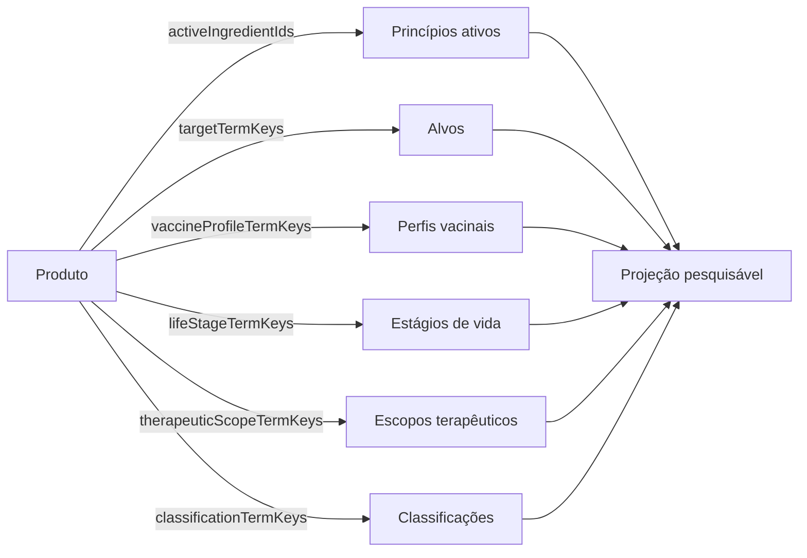

# Parte 1A.2: Relações Semânticas E Documentos Editoriais

## Objetivo

Normalizar os conceitos associados aos produtos conforme seu significado de
domínio. Princípios ativos tornam-se entidades `active_ingredient` relacionadas
por ID; alvos terapêuticos, perfis vacinais e estágios de vida usam vocabulários
controlados próprios; `classificationTermKeys` contém somente classificações
reais de produto.

Consolidar também o conteúdo editorial de cada entidade em um único documento
Markdown por locale. Headings de nível `#` numerados delimitam as seções
declaradas no `_entity.json`; headings de níveis inferiores permanecem livres
para estruturar o conteúdo interno.

A busca é uma projeção derivada dessas entidades, relações e taxonomias. Ela não
define a estrutura do catálogo e não possui termos próprios dentro da taxonomia
de classificações.



Esta parte atua em `data/knowledge`, no contrato de autoria, na organização dos
Markdown, no inventário, na auditoria e nos contratos documentais consumidos
pela Parte 1B. Ela não gera bancos ou CAS, não altera apps ou packages e não
cria migrations.

## Pré-requisito

A [Parte 1A.1](./01a1-localized-json-consolidation.md) está concluída, com
`localizedContent` inline, referências taxonômicas resolvíveis e aliases gerais
centralizados em seus proprietários.

## Documento Editorial Por Locale

Cada entidade que possui seções editoriais declara um único diretório físico em
`contentPath` e mantém exatamente um Markdown para cada locale:

```text
<entidade>/
├── _entity.json
├── _content/
│   ├── pt-BR.md
│   ├── pt-PT.md
│   ├── gn-PY.md
│   ├── en-US.md
│   ├── es-ES.md
│   └── fr-FR.md
└── _media/
    └── <arquivo-editorial>.<extensão>
```

`contentPath` aponta somente para o diretório real dos seis documentos. A
associação entre uma seção do manifesto e um trecho Markdown usa
`sectionNumber`, sem fragmentos ou seletores anexados ao caminho:

```json
{
  "contentPath": "./_content",
  "sections": [
    {
      "sectionKey": "about",
      "sectionNumber": 1
    },
    {
      "sectionKey": "presentations",
      "sectionNumber": 2
    }
  ]
}
```

O documento localizado contém todas as seções da entidade na ordem declarada:

```markdown
# 1. Sobre

Conteúdo geral do item.

## Características

Subseção livre dentro de `about`.

# 2. Apresentações

Conteúdo sobre as apresentações disponíveis.
```

O parser Markdown trabalha sobre o AST e aplica o seguinte contrato:

- somente headings de nível `#` iniciam seções declaradas;
- cada heading de seção começa com `# <sectionNumber>`; um ponto e qualquer
  texto editorial depois do número são opcionais;
- `sectionNumber` é inteiro positivo, único, contíguo a partir de `1` e segue a
  ordem do array `sections`;
- os seis documentos apresentam exatamente os mesmos números, resolvidos para as
  mesmas `sectionKey` pelo manifesto;
- somente `sectionNumber` possui significado no heading delimitador; todo
  conteúdo restante do heading é editorial e descartado integralmente;
- headings de `##` a `######` pertencem ao corpo da seção corrente e seguem o
  perfil Markdown canônico;
- conteúdo não vazio antes do primeiro heading de nível `#` é inválido;
- heading de nível `#` ausente, repetido, fora de ordem ou não declarado é
  inválido;
- cada seção declarada aparece uma única vez em todos os locales;
- uma entidade sem seções usa `sections: []`, omite `contentPath` e não possui
  documentos editoriais vazios.

`sectionKey` permanece como identidade semântica. `sectionNumber` existe somente
no contrato de autoria para associar os trechos aos itens do manifesto e não
integra bancos, DTOs ou APIs. O título apresentado pertence à UI e continua sendo
resolvido pelo i18n associado à `sectionKey`. As seções formam uma lista plana e
ordenada; headings de `##` a `######` organizam somente o corpo Markdown da seção
corrente. O manifesto e o Markdown não exigem nem armazenam campo de título,
rótulo ou chave de tradução para a seção.

O builder remove o heading delimitador inteiro e produz um item neste formato:

```json
{
  "sectionKey": "about",
  "compiledMarkdown": "Conteúdo geral do item."
}
```

Links de mídia no Markdown são resolvidos em relação ao documento localizado e
devem permanecer dentro do diretório da entidade. Com o layout apresentado, uma
mídia usa, por exemplo, `../_media/cover.webp`.

## Contrato Atual Do Produto

O domínio já representa a relação N:N entre produtos e princípios ativos:

```text
product_catalog_items
active_ingredient_catalog_items
product_active_ingredients
```

O contrato público do produto oferece `activeIngredientIds` e
`activeIngredients`. O repository resolve `product_active_ingredients`, e a tela
de produto apresenta cada princípio ativo como link para
`/formulary/active-ingredients/<id>`.

A fonte canônica alimenta esse fluxo com entidades e relações explícitas. Um
nome de princípio ativo não fica em aliases, classificações ou termos dedicados
à busca do produto.

## Invariantes Do Modelo

- Cada substância farmacologicamente distinta possui uma única entidade
  `active_ingredient` com ID estável.
- IDs novos de catálogos usam UUIDv4, conforme as constraints atuais dessas
  entidades. Eles são gerados uma vez e persistem no `_entity.json`.
- `product.activeIngredientIds` contém somente IDs resolvíveis de entidades
  `active_ingredient`.
- Uma combinação farmacológica referencia cada princípio ativo separadamente e
  preserva a ordem declarada da composição.
- Não existe entidade de princípio ativo representando apenas a concatenação de
  várias substâncias.
- `classificationTermKeys` contém somente origem, categoria comercial, ação
  terapêutica, forma farmacêutica, via de administração e outras classificações
  efetivas definidas pelo schema de produto.
- Alvos, perfis vacinais e estágios de vida não entram em
  `classificationTermKeys` nem em aliases próprios do produto.
- Nenhuma chave `searchConcept.*` integra o contrato canônico.
- Nomes e aliases localizados possuem um único proprietário semântico.
- Relações farmacológicas não são inferidas no builder pelo nome do produto,
  por substring, por alias ou pela posição do arquivo.
- Dados regulatórios, CAS, ATCvet e classificações farmacológicas não são
  inventados para completar campos desconhecidos.

## Contrato Canônico Do Produto

Um produto declara suas relações e facetas em campos distintos:

```json
{
  "entityType": "product",
  "id": "<product-id>",
  "typeTermKey": "medication.antiparasitic.ectoparasiticide",
  "classificationTermKeys": [
    "origin.allopathic",
    "therapeuticAction.control"
  ],
  "activeIngredientIds": [
    "<active-ingredient-id>"
  ],
  "targetTermKeys": [
    "parasite.flea",
    "parasite.tick"
  ],
  "vaccineProfileTermKeys": [],
  "lifeStageTermKeys": [],
  "therapeuticScopeTermKeys": []
}
```

Os campos possuem proprietários fechados:

| Campo | Proprietário | Conteúdo |
| --- | --- | --- |
| `activeIngredientIds` | entidades `active_ingredient` | substâncias presentes no produto |
| `targetTermKeys` | taxonomia `product-targets` | doenças, agentes e organismos-alvo |
| `vaccineProfileTermKeys` | taxonomia `product-vaccine-profiles` | perfis e valências vacinais |
| `lifeStageTermKeys` | taxonomia `product-life-stages` | estágios de vida explicitamente indicados |
| `therapeuticScopeTermKeys` | taxonomia `product-therapeutic-scopes` | espectro e escopo terapêutico do produto |
| `classificationTermKeys` | taxonomia `product-classifications` | classificações comerciais, farmacêuticas e terapêuticas |

Campos opcionais são omitidos como unidade quando o produto não possui relações
daquele tipo. Arrays presentes não contêm duplicatas e preservam ordem somente
quando ela possui significado no domínio.

A Parte 1B projeta os quatro vocabulários em tabelas de termos próprias e os
campos em `product_targets`, `product_vaccine_profiles`, `product_life_stages` e
`product_therapeutic_scopes`. Os relacionamentos não ficam armazenados em JSON
genérico, EAV ou texto delimitado no banco `system`.

## Entidades De Princípio Ativo

Cada princípio ativo usado pelos produtos possui diretório próprio:

```text
data/knowledge/catalog/active-ingredients/<active-ingredient>/
└── _entity.json
```

O manifesto segue o contrato `active_ingredient` já definido:

```json
{
  "schemaVersion": 1,
  "entityType": "active_ingredient",
  "id": "<stable-id>",
  "typeTermKey": "antiInfective.antiparasitic.isoxazolines",
  "classificationTermKeys": [],
  "regions": [],
  "nomenclature": {
    "scientificName": null,
    "casNumber": null,
    "denominationStandards": []
  },
  "atcVetCode": null,
  "localizedContent": {
    "name": {
      "pt-BR": "Afoxolaner",
      "pt-PT": "Afoxolaner",
      "gn-PY": "Afoxolaner",
      "en-US": "Afoxolaner",
      "es-ES": "Afoxolaner",
      "fr-FR": "Afoxolaner"
    },
    "aliases": {
      "pt-BR": [],
      "pt-PT": [],
      "gn-PY": [],
      "en-US": [],
      "es-ES": [],
      "fr-FR": []
    }
  },
  "sections": []
}
```

Valores conhecidos e verificáveis são preenchidos. Valores desconhecidos usam a
representação vazia ou nula admitida pelo schema. Uma substância recebe a classe
farmacológica correta; quando a taxonomia não possui o termo necessário, ela é
ampliada com um conceito farmacológico legítimo e suas traduções.

## Composições Farmacológicas

Termos que apresentam várias substâncias são decompostos em relações. Exemplos:

```text
afoxolaner + milbemicina oxima
-> activeIngredientIds: [afoxolanerId, milbemycinOximeId]

emodepsida + praziquantel
-> activeIngredientIds: [emodepsideId, praziquantelId]

praziquantel + pamoato de pirantel + febantel
-> activeIngredientIds: [praziquantelId, pyrantelPamoateId, febantelId]
```

O nome da combinação não permanece como classificação, alias geral ou entidade
farmacológica artificial. A busca encontra a combinação pela composição dos
nomes e aliases das entidades relacionadas.

## Propriedade Dos Demais Conceitos

Todo conceito associado a um produto recebe um destino semântico:

| Categoria | Exemplos | Destino |
| --- | --- | --- |
| Princípio ativo | afoxolaner, fipronil, fluralaner | `activeIngredientIds` |
| Combinação farmacológica | afoxolaner + milbemicina | múltiplos `activeIngredientIds` |
| Doença ou agente-alvo | raiva, cinomose, Giardia | `targetTermKeys` |
| Parasita ou grupo-alvo | pulga, carrapato, nematódeos | `targetTermKeys` |
| Perfil vacinal | V3, V4, V5, V8, V10 | `vaccineProfileTermKeys` |
| Nome equivalente de perfil | tríplice felina, FVRCP | label ou alias do mesmo termo de perfil |
| Estágio de vida | filhote | `lifeStageTermKeys` |
| Escopo terapêutico | amplo espectro | `therapeuticScopeTermKeys` |
| Perfil de valência | polivalente | `vaccineProfileTermKeys` |
| Informação já derivável | antiparasitário tópico felino | tipo + via + espécie, sem termo redundante |

`product-targets` distingue seus ramos por significado, por exemplo
`disease.*`, `pathogen.*` e `parasite.*`. Um label não transforma agente em
doença nem trata o nome de um patógeno como alias da condição causada por ele.

`product-vaccine-profiles` representa um perfil uma única vez. Siglas, nomes por
valência e grafias equivalentes ficam no `localizedContent` do mesmo termo. Por
exemplo, `V3`, “tríplice felina” e `FVRCP` não criam três classificações do
produto.

## Busca Derivada

A projeção pesquisável de um produto combina, conforme o locale:

```text
nome e aliases próprios do produto
+ nome e aliases do fabricante
+ nomes, denominações e aliases dos princípios ativos relacionados
+ labels e aliases dos alvos relacionados
+ labels e aliases dos perfis vacinais e estágios de vida
+ labels e aliases dos escopos terapêuticos
+ labels e aliases de tipos e classificações reais
```

Essa composição pertence ao builder e aos índices de busca do banco localizado.
Ela não copia valores para `localizedContent.aliases` do produto e não cria uma
taxonomia cujo propósito seja apenas reproduzir termos de pesquisa.

O relatório de projeção registra a proveniência dos valores pesquisáveis por
categoria. Isso permite testar cobertura sem misturar os dados autorais.

## Auditoria

`pnpm knowledge:audit` passa a verificar:

- existência de um único Markdown por locale em cada entidade com seções;
- existência exata dos seis documentos declarados por `contentPath`;
- ausência de diretórios ou arquivos Markdown independentes por seção;
- correspondência integral entre `sectionNumber`, `sectionKey` e headings `#`;
- números positivos, contíguos, únicos e ordenados;
- descarte integral de qualquer texto editorial presente depois do número;
- ausência de conteúdo antes da primeira seção e de headings `#` não declarados;
- ausência total de chaves `searchConcept.*` em entidades e taxonomias;
- ausência de propósito taxonômico genérico de busca;
- existência e tipo correto de cada `activeIngredientIds`;
- unicidade e ordem das relações entre produto e princípio ativo;
- decomposição de combinações em substâncias individuais;
- ausência de nomes de princípios ativos nos aliases próprios do produto;
- existência e domínio de cada `targetTermKeys`, `vaccineProfileTermKeys`,
  `lifeStageTermKeys` e `therapeuticScopeTermKeys`;
- uso de `classificationTermKeys` somente para classificações admitidas pelo
  schema;
- ausência de facetas redundantes que já sejam deriváveis de outros campos;
- unicidade semântica de perfis vacinais equivalentes;
- propriedade correta de labels e aliases localizados;
- cobertura pesquisável derivada por produto e locale;
- conservação de IDs de produtos, fabricantes, protocolos, seções, mídias e
  demais relações não afetadas.

A auditoria preserva exatamente os IDs das entidades já inventariadas que não
são substituídas por esta normalização. O conjunto canônico pode crescer com
novas entidades `active_ingredient` e novos termos das taxonomias semânticas
necessários para representar relações explícitas. Esses enriquecimentos devem
ser declarados, resolvíveis e contabilizados no inventário; eles não são tratados
como divergência de paridade.

O `inventory.json` registra separadamente:

- quantidade de entidades com conteúdo editorial;
- quantidade de documentos Markdown por locale;
- quantidade de seções declaradas e compiláveis;
- quantidade de princípios ativos;
- quantidade de relações produto-princípio ativo;
- quantidade de termos por taxonomia semântica;
- quantidade de relações de alvo, perfil vacinal, estágio de vida e escopo
  terapêutico;
- quantidade de valores pesquisáveis por origem semântica;
- zero termos `searchConcept.*`.

## Sequência De Implementação

### Atividade 1: Contrato Editorial

1. Atualizar os schemas de autoria para `contentPath`, `sectionNumber` e
   `sectionKey`.
2. Definir a gramática dos headings iniciados por `# <sectionNumber>` e o
   descarte integral do conteúdo editorial restante do delimitador.
3. Definir a representação compilada plana com `sectionKey` e
   `compiledMarkdown`.
4. Atualizar `data/knowledge/README.md` com o contrato completo e exemplos
   válidos e inválidos.

### Atividade 2: Consolidação Dos Markdown

1. Para cada entidade com seções, criar `_content/<locale>.md` com todas as
   seções na ordem declarada.
2. Numerar os headings de nível `#` conforme o array `sections`.
3. Preservar os corpos, headings internos, links e referências de mídia no
   documento consolidado.
4. Ajustar caminhos relativos de mídia para a posição do novo documento.
5. Remover arquivos e diretórios Markdown independentes por seção depois da
   consolidação da própria entidade.
6. Omitir `contentPath` e documentos editoriais nas entidades com
   `sections: []`.

### Atividade 3: Relações Semânticas De Produtos

1. Inventariar cada ocorrência de `searchConcept.*` e cada produto que a
   referencia.
2. Classificar cada conceito como princípio ativo, composição, alvo, perfil
   vacinal, estágio de vida, escopo terapêutico, classificação real ou valor
   derivável.
3. Revisar a composição farmacológica de cada produto e recusar inferências
   baseadas somente em semelhança textual.
4. Criar uma entidade `active_ingredient` para cada substância distinta que
   ainda não possua identidade canônica.
5. Classificar cada princípio ativo pela taxonomia farmacológica e preencher
   somente fatos verificáveis.
6. Preencher `activeIngredientIds` em cada produto, decompondo combinações e
   preservando a ordem da composição.
7. Criar as taxonomias `product-targets`, `product-vaccine-profiles`,
   `product-life-stages` e `product-therapeutic-scopes` com labels e aliases nos
   seis locales.
8. Consolidar perfis equivalentes em um único termo e distribuir seus nomes
   localizados entre label e aliases.
9. Preencher `targetTermKeys`, `vaccineProfileTermKeys`, `lifeStageTermKeys` e
   `therapeuticScopeTermKeys` conforme o schema.
10. Manter em `classificationTermKeys` somente classificações efetivas e
    eliminar facetas redundantes deriváveis.
11. Remover todos os termos `searchConcept.*` e ajustar a ordem dos termos nas
    taxonomias alteradas.

### Atividade 4: Auditoria Final

1. Atualizar `inventory.json` e `audit-report.json`.
2. Refatorar `scripts/audit-knowledge.mjs` para validar o contrato editorial, o
   contrato semântico e a cobertura das relações.
3. Executar a auditoria e revisar por amostragem documentos editoriais, produtos
   simples, combinações, vacinas e antiparasitários.

A implementação termina com uma única representação canônica. Não permanecem
campos alternativos, aliases de compatibilidade, leitores duplos ou conversores
permanentes para `searchConcept.*`.

## Testes E Verificações

- entidade sem seções e sem `contentPath`;
- entidade com uma seção em cada um dos seis documentos;
- entidade com várias seções e headings internos;
- preservação da ordem plana declarada no array `sections`;
- descarte integral do heading delimitador e de qualquer texto editorial
  opcional;
- recusa de `sectionNumber` ausente, repetido, descontínuo ou fora de ordem;
- recusa de seção ausente ou adicional em qualquer locale;
- aceitação de heading somente numérico e de heading com texto editorial, com a
  mesma representação compilada para ambos;
- recusa de conteúdo antes da primeira seção;
- resolução segura das mídias após a consolidação dos documentos;
- produto com um princípio ativo;
- produto com vários princípios ativos e ordem definida;
- recusa de princípio ativo inexistente ou de outro `entityType`;
- recusa de IDs repetidos na mesma composição;
- recusa de entidade artificial para uma combinação;
- resolução dos nomes localizados de cada princípio ativo relacionado;
- produto vacinal com perfil, aliases e alvos distintos;
- produto antiparasitário com substâncias e organismos-alvo distintos;
- consolidação de `V3`, “tríplice felina” e `FVRCP` no mesmo perfil;
- ausência de agente biológico usado como alias de uma doença;
- remoção de faceta completamente derivável de tipo, via e espécie;
- busca derivada encontrando o produto pelo nome de cada princípio ativo;
- busca derivada encontrando o produto por label e alias de alvo ou perfil;
- auditoria sem `searchConcept.*`;
- JSON válido e cobertura exata dos seis locales nos termos criados;
- conservação das contagens e identidades fora do escopo semântico;
- execução de `pnpm knowledge:audit` e `git diff --check`.

## Entregáveis

- seis documentos Markdown por entidade com conteúdo editorial;
- manifestos com `contentPath` único e seções numeradas;
- contrato de autoria e auditoria dos delimitadores de seção;
- catálogo canônico de princípios ativos efetivamente usados pelos produtos;
- `activeIngredientIds` completos e resolvíveis;
- taxonomias de alvos, perfis vacinais, estágios de vida e escopos terapêuticos;
- produtos com referências semânticas por chave ou ID;
- taxonomia de classificações sem termos genéricos de busca;
- contrato de autoria atualizado;
- inventário e auditoria ajustados;
- relatório com cobertura integral das relações e zero `searchConcept.*`.

## Critérios De Aceite

- Cada entidade com conteúdo editorial possui exatamente um Markdown por locale.
- Cada documento contém exatamente as seções declaradas no manifesto, na mesma
  ordem.
- Apenas headings `#` numerados delimitam seções; headings inferiores permanecem
  internos ao conteúdo.
- `contentPath` referencia somente um diretório físico e não contém fragmentos
  como `#1`.
- `sectionNumber` não aparece no `content_json`, nos bancos ou nos contratos dos
  apps.
- Qualquer texto editorial depois do número não aparece no `content_json`, no
  digest, nos bancos ou nos contratos dos apps.
- O manifesto e o Markdown não declaram título nem chave de tradução para a
  seção.
- A UI resolve o título de cada seção pelo i18n associado à `sectionKey`.
- Todo princípio ativo pesquisável a partir de um produto existe como entidade
  e é alcançado por `activeIngredientIds`.
- Produtos com combinações farmacológicas apontam para cada substância
  individualmente.
- A relação preserva o fluxo produto -> princípio ativo usado pelos consumers do
  catálogo.
- Nenhum nome de princípio ativo é armazenado como classificação ou alias geral
  do produto.
- Alvos, perfis vacinais, estágios de vida e escopos terapêuticos usam
  taxonomias proprietárias.
- `classificationTermKeys` contém somente classificações reais de produto.
- Não existe chave, termo, campo ou propósito `searchConcept` em
  `data/knowledge`.
- A busca pode compor todos os termos necessários exclusivamente a partir das
  entidades, relações e taxonomias canônicas.
- Todos os IDs e chaves referenciados são únicos e resolvíveis.
- A auditoria confirma cobertura integral e paridade dos dados não afetados.
- Apps, packages, bancos, CAS e runtime não são modificados nesta parte.
- Nenhuma migration ou camada de compatibilidade é criada.

## Próxima Parte

Após cumprir todos os critérios, seguir para a
[Parte 1B: `knowledge-builder` e artefatos locais](./01b-knowledge-builder.md).
