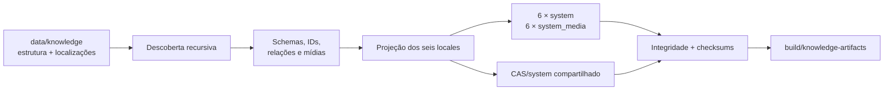

# Parte 1B: `knowledge-builder` E Artefatos Locais

## Objetivo

Implementar `tools/knowledge-builder/` em Rust como compilador definitivo de
`data/knowledge/`. Cada execução valida a fonte canônica, projeta os seis locales,
gera um par completo `system` e `system_media` para cada locale e mantém o
`CAS/system` compartilhado.

Esta parte produz e valida artefatos, sem alterar repositories, rotas,
componentes, desenvolvimento ou builds dos apps. A integração pertence à
[Parte 1C](./01c-app-system-consumption.md).

## Pré-requisito

A [Parte 1A](./01a-canonical-knowledge-data.md) está concluída, com
`data/knowledge/` completo e auditado.

## Escopo

- criar `tools/knowledge-builder/` como binário e biblioteca Rust no Cargo
  Workspace;
- implementar schemas executáveis para todos os `entityType` canônicos;
- validar entidades, localizações, relações, taxonomias e mídias;
- projetar conteúdo localizado diretamente nos bancos de cada locale;
- criar e versionar o DDL de `system` e `system_media` no builder;
- gerar seis bancos `system` completos;
- gerar seis bancos `system_media` completos;
- montar o `CAS/system` único e incremental;
- produzir checksums e `build-result.json`;
- garantir determinismo lógico e escrita atômica;
- oferecer CLI estável para validação e build;
- manter o runtime e o pipeline dos apps inalterados.

Os locales obrigatórios são:

```text
pt-BR
pt-PT
gn-PY
en-US
es-ES
fr-FR
```

O contrato público da lista permanece em `@vet/types/i18n/locales`. O builder
possui uma configuração equivalente validada contra esse contrato no CI. Uma
execução sempre gera os seis locales sob a mesma `build_version`; falha em um
locale invalida toda a saída.

Esta parte produz somente estados integrais. Releases públicas, bootstraps,
deltas, manifests, providers e publicação pertencem à Parte 3.

## Fluxo



## Local Do Código

```text
tools/knowledge-builder/
├── Cargo.toml
├── src/
│   ├── lib.rs
│   ├── main.rs
│   ├── cli.rs
│   ├── source/
│   ├── validation/
│   ├── projection/
│   ├── databases/
│   ├── media/
│   └── report/
├── schemas/
│   ├── source/
│   ├── system/
│   └── system_media/
├── fixtures/
└── tests/
```

O crate usa `src/lib.rs` como núcleo testável e `src/main.rs` como adapter fino
da CLI. Ele é incluído em `members` no `Cargo.toml` da raiz.

O builder é o único escritor dos bancos públicos. DDL, índices, projeção,
normalização pesquisável, inserção dos dados, montagem do CAS e relatório de
build pertencem a esse crate.

## Descoberta Da Fonte

O builder percorre `data/knowledge/` recursivamente e identifica entidades por
diretórios que contenham `entity.json`. O caminho é metadado editorial e não
seleciona schema nem gera identidade.

O carregamento segue esta ordem lógica:

```text
entityType
-> id
-> locale
```

O builder:

- seleciona o schema por `entityType`;
- converte a entrada validada para um modelo canônico Rust;
- seleciona um projector registrado para o tipo canônico;
- percorre `data/knowledge/media/` recursivamente e indexa cada arquivo pelo
  `mediaId` UUIDv7 de seu nome-base;
- recusa identidade duplicada;
- recusa arquivo de localização ausente, duplicado ou desconhecido;
- recusa divergência entre nome do arquivo e `locale` interno;
- resolve referências por IDs;
- não persiste caminhos de autoria como relações;
- produz o mesmo conteúdo lógico quando uma pasta é movida sem alteração dos
  JSONs.

## Padrão De Projeção Relacional

O builder segue uma arquitetura schema-first com Data Mappers explícitos. O DDL
é a fonte de verdade da estrutura SQL; os JSONs são a fonte de verdade do
conteúdo de domínio.

```text
JSON canônico
-> validação pelo schema de fonte
-> modelo canônico Rust
-> projector do entityType
-> tabelas definidas pelo DDL
-> verificação de cobertura e integridade
```

O modelo intermediário usa um enum fechado:

```rust
enum CanonicalEntity {
    Breed(BreedEntity),
    Product(ProductEntity),
    Manufacturer(ManufacturerEntity),
    ActiveIngredient(ActiveIngredientEntity),
    Condition(ConditionEntity),
    GeoPlace(GeoPlaceEntity),
    Taxonomy(TaxonomyEntity),
    TreatmentProtocol(TreatmentProtocolEntity),
}
```

O processamento exaustivo impede aceitar um novo `entityType` sem schema,
modelo e projector correspondentes. Cada projector:

- recebe uma entidade canônica e a localização selecionada;
- grava em uma transação;
- pode preencher uma ou várias tabelas;
- resolve relações somente por IDs;
- registra entidades e relações consumidas;
- falha diante de dado sem destino relacional;
- não infere comportamento pelo caminho da fonte.

Uma entidade `breed`, por exemplo, pode preencher a tabela principal de raças,
as tabelas de aliases, seções, relações com `geo_place` e coleções de mídia. O
projector geográfico materializa lugares, hierarquias e seus textos localizados.
Essas decisões pertencem aos projectors e ao DDL, não aos diretórios nem aos
JSONs de autoria.

Não existe regra “um JSON corresponde a uma tabela”. Também não se usa uma
tabela genérica EAV para evitar a modelagem do domínio. Dados consultáveis,
ordenáveis ou relacionados usam tabelas e constraints próprias; JSON em coluna
é reservado a conteúdo opaco, versionado e validado que não precise dessas
garantias relacionais.

## Contrato Dos Bancos Localizados

Cada `system` contém conteúdo pronto para o locale correspondente. Dados de
conhecimento não dependem de chaves de tradução no consumidor.

As projeções armazenam, conforme o domínio:

- `name` localizado;
- aliases do locale;
- descrição e seções localizadas;
- rótulos localizados de taxonomias e classificações;
- nomes e observações localizados de protocolos;
- campos normalizados usados por busca;
- campos estruturais e relações idênticos entre locales.

Não existem colunas ou payloads `label_key`, `translation_key` ou equivalentes
para conteúdo de conhecimento. IDs técnicos, códigos científicos, códigos
regulatórios, regiões, classificações e relações permanecem estruturais.

O conjunto de IDs e relações não localizáveis é exatamente igual nos seis bancos
`system`. Somente os campos definidos como localizáveis e seus índices derivados
variam por locale.

Cada banco registra:

- seu locale canônico;
- `PRAGMA user_version` de `system` ou `system_media`;
- a `build_version` integral;
- metadados públicos de release somente quando fornecidos no contexto.

## Responsabilidade Dos Schemas

`schemas/source/` descreve a autoria por `entityType`. Os tipos Rust usam
desserialização estrita e recusam campos desconhecidos quando o schema não os
permite.

`schemas/system/` e `schemas/system_media/` concentram o DDL e as versões dos
bancos produzidos. O builder aplica explicitamente tabelas, constraints, índices
e PRAGMAs necessários ao resultado determinístico.

Os projectors não criam tabelas nem alteram o DDL durante a projeção. Primeiro o
builder materializa o schema completo; depois prepara e executa os inserts contra
esse schema. Divergências entre SQL de projeção e DDL falham nos testes e no
build.

`packages/core-local` conserva temporariamente o fluxo usado pelo app. Sua
adaptação para somente leitura dos novos bancos ocorre na Parte 1C. Nenhum DDL do
builder é importado de TypeScript.

## Contrato Relacional Das Mídias

Tabelas de domínio e coleções em `system` referenciam mídias por `media_id`,
nunca pelo hash dos bytes. O DDL de `system_media` mantém a resolução canônica
para o conteúdo físico atual:

```sql
CREATE TABLE media_assets (
    media_id TEXT PRIMARY KEY,
    content_hash BLOB NOT NULL CHECK(length(content_hash) = 32),
    mime_type TEXT NOT NULL,
    size_bytes INTEGER NOT NULL CHECK(size_bytes > 0),
    width INTEGER CHECK(width IS NULL OR width > 0),
    height INTEGER CHECK(height IS NULL OR height > 0)
);

CREATE INDEX idx_media_assets_content_hash
    ON media_assets(content_hash);
```

O DDL definitivo aplica o `CHECK` compartilhado de UUIDv7 a `media_id`. O hash
não é `UNIQUE`: mais de um `mediaId` pode representar logicamente ativos
distintos com bytes idênticos, enquanto o CAS armazena esses bytes uma única vez.

Cada `system_media` contém somente os `mediaId` exigidos pelo locale. Mídias
compartilhadas aparecem em todos os bancos que as referenciam; variantes
localizadas usam IDs próprios e aparecem apenas nos locales correspondentes. Na
mesma build, um `mediaId` resolve obrigatoriamente para o mesmo `contentHash` em
todos os bancos que o incluem.

## Contrato Da CLI

O binário oferece dois comandos públicos:

```text
knowledge-builder validate \
  --source <knowledge-data>

knowledge-builder build \
  --source <knowledge-data> \
  --output <artifact-directory> \
  --context <build-context.json>
```

`--source` e `--output` são sempre explícitos. A ferramenta:

- não depende do diretório de trabalho;
- não consulta rede;
- não acessa Rails;
- não publica releases;
- não conhece canais ou providers;
- não lê fontes TypeScript ou i18n do app;
- sempre projeta os seis locales como uma operação única.

O contexto local é:

```json
{
  "schemaVersion": 1,
  "buildVersion": 1,
  "release": null
}
```

`release: null` identifica uma saída integral local. A tabela
`knowledge_release_metadata` permanece sem linha nesse modo.

O contexto público usado posteriormente pelo Hub segue o mesmo contrato:

```json
{
  "schemaVersion": 1,
  "buildVersion": 42,
  "release": {
    "releaseId": "<uuid>",
    "generation": 2,
    "revision": 1
  }
}
```

O builder materializa a identidade recebida nos dois bancos de cada locale. Ele
não reserva versão, cria release nem publica conteúdo.

Logs humanos vão para `stderr`. Sucesso retorna código `0`; qualquer erro retorna
código não zero sem finalizar uma versão parcial.

## Contrato De `build-result.json`

```json
{
  "schemaVersion": 1,
  "builderVersion": "0.1.0",
  "buildVersion": 1,
  "release": null,
  "sourceDigestSha256": "<sha256>",
  "systemSchemaVersion": 1,
  "systemMediaSchemaVersion": 1,
  "locales": {
    "pt-BR": {
      "system": {
        "path": "versions/1/locales/pt-BR/veterinary_clinic_system.db",
        "sizeBytes": 0,
        "checksumSha256": "<sha256>",
        "schemaFingerprintSha256": "<sha256>"
      },
      "systemMedia": {
        "path": "versions/1/locales/pt-BR/veterinary_clinic_system_media.db",
        "sizeBytes": 0,
        "checksumSha256": "<sha256>",
        "schemaFingerprintSha256": "<sha256>"
      },
      "casSetDigestSha256": "<sha256>"
    }
  },
  "cas": {
    "algorithm": "sha256",
    "root": "CAS/system",
    "objectCount": 0,
    "setDigestSha256": "<sha256>"
  },
  "projection": {
    "reportPath": "versions/1/projection-report.json",
    "checksumSha256": "<sha256>"
  },
  "checksumFile": "versions/1/checksums.sha256"
}
```

O exemplo abrevia os locales; um relatório válido contém exatamente os seis.
`schemaVersion` versiona o contrato da CLI e `builderVersion` identifica o
binário. Esses campos não substituem versões de schema nem versões públicas de
conhecimento.

Todos os caminhos são relativos a `--output`, normalizados e sem componentes
absolutos, vazios ou `..`. O relatório usa serialização JSON determinística em
UTF-8.

## Saída Local

```text
build/knowledge-artifacts/
├── CAS/
│   └── system/
│       └── <hashes SHA-256>
└── versions/
    └── <build_version>/
        ├── locales/
        │   ├── pt-BR/
        │   │   ├── veterinary_clinic_system.db
        │   │   └── veterinary_clinic_system_media.db
        │   ├── pt-PT/
        │   ├── gn-PY/
        │   ├── en-US/
        │   ├── es-ES/
        │   └── fr-FR/
        ├── projection-report.json
        ├── checksums.sha256
        └── build-result.json
```

`build_version` aceita somente inteiros positivos e identifica uma saída
integral. Ela não representa versão de schema nem versão pública de distribuição.

## Auditoria De Projeção

`projection-report.json` prova que toda entidade canônica e toda relação foram
consumidas por um projector. Seu contrato inicial é:

```json
{
  "schemaVersion": 1,
  "source": {
    "entitiesByType": {
      "breed": 410,
      "product": 82
    },
    "relationCount": 560
  },
  "locales": {
    "pt-BR": {
      "projectedByType": {
        "breed": {
          "entities": 410,
          "rowsByTable": {
            "breeds": 410,
            "breed_aliases": 615
          }
        },
        "product": {
          "entities": 82,
          "rowsByTable": {
            "products": 82,
            "product_aliases": 340
          }
        }
      },
      "resolvedRelationCount": 560,
      "unconsumedEntities": [],
      "unresolvedRelations": []
    }
  },
  "media": {
    "sourceMediaIds": 0,
    "referencedMediaIds": 0,
    "uniqueContentHashes": 0,
    "missingMediaIds": [],
    "unreferencedMediaIds": []
  }
}
```

Os nomes concretos das tabelas refletem o DDL implementado. O exemplo abrevia os
tipos de entidade e `locales`, mas um relatório válido cobre todos os tipos e
contém exatamente os seis locales. Ele demonstra o contrato de cobertura e não
fixa antecipadamente a nomenclatura do schema.

Uma saída somente é válida quando:

- cada identidade de origem foi consumida exatamente uma vez por locale pelo
  projector do seu tipo;
- todas as relações foram resolvidas em cada locale;
- as contagens por entidade e por tabela são coerentes;
- `unconsumedEntities`, `unresolvedRelations`, `missingMediaIds` e
  `unreferencedMediaIds` estão vazios;
- o checksum do relatório corresponde ao declarado em `build-result.json`.

Cada banco também possui um `schemaFingerprintSha256` calculado a partir da
representação canônica de `sqlite_schema`, colunas, índices, foreign keys e
`PRAGMA user_version`. Bancos do mesmo tipo compartilham o fingerprint entre os
seis locales.

## CAS E Mídias

`CAS/system` é único e incremental. Objetos existentes são reaproveitados entre
builds e novos bytes são gravados pelo hash SHA-256 do conteúdo.

Para cada arquivo de autoria, o builder:

```text
mediaId do nome-base
-> validar UUIDv7 e unicidade global
-> ler os bytes
-> calcular SHA-256
-> validar extensão, MIME e metadados
-> materializar CAS/system/<contentHash>
-> registrar mediaId -> contentHash em system_media
```

O SHA-256 é recalculado em todo build oficial. O nome não é usado como prova de
integridade e caches locais não substituem essa verificação.

Cada `system_media.db` é o índice canônico das mídias exigidas por seu locale. O
conjunto de IDs de um locale une:

- referências compartilhadas de `entity.json`;
- referências específicas do arquivo localizado;
- referências `knowledge-media://<mediaId>` extraídas de Markdown por parser
  estruturado;
- metadados localizados associados a referências compartilhadas.

O cofre físico contém a união deduplicada dos hashes resolvidos para os seis
locales. Dois `mediaId` com os mesmos bytes apontam para o mesmo objeto CAS.
Arquivos de autoria não referenciados não entram no CAS da build e invalidam a
auditoria da fonte.

Alterar os bytes de um arquivo preservando o mesmo `mediaId` produz outro
`contentHash`, atualiza a linha correspondente nos novos bancos `system_media` e
adiciona um objeto ao CAS. O objeto anterior permanece imutável enquanto puder
ser exigido por outra build ou release retida; sua remoção pertence à política de
garbage collection.

`checksums.sha256` cobre os doze bancos e todos os objetos CAS referenciados pela
`build_version`.

## Digest Lógico Da Fonte

`sourceDigestSha256` representa o conteúdo lógico, não a organização editorial
dos diretórios. Sua entrada canônica é ordenada por:

```text
entityType
id
locale
mediaId
contentHash
```

O digest cobre os JSONs normalizados, os schemas de autoria efetivamente usados
e os bytes de mídia. Caminhos absolutos e caminhos organizacionais não entram na
identidade. Mover uma entidade sem alterar seus conteúdos produz o mesmo digest.
Mover uma mídia entre subpastas sem alterar `mediaId` ou bytes também preserva o
digest.

Adicionar, remover ou alterar uma entrada efetiva muda o digest.

## Determinismo E Atomicidade

Para as mesmas entradas lógicas, contexto, versões técnicas e configuração, o
builder produz o mesmo conteúdo lógico e os mesmos checksums.

O processo:

- fixa Cargo lockfile e toolchain Rust;
- usa uma implementação SQLite definida;
- configura PRAGMAs explicitamente;
- ordena entidades, relações e inserções;
- não introduz timestamps ou valores aleatórios sem entrada explícita;
- escreve bancos e objetos em staging;
- executa todas as validações antes da finalização;
- move a versão validada atomicamente para `versions/<build_version>`;
- nunca sobrescreve uma versão finalizada com bytes diferentes;
- grava objetos CAS temporariamente, valida o hash e move atomicamente.

## Validações

O builder recusa:

- `build_version` não positiva;
- schema ou `entityType` desconhecido;
- campo desconhecido proibido pelo schema;
- ID duplicado;
- referência estrutural inexistente;
- relação por nome ou caminho;
- locale ausente, duplicado ou desconhecido;
- divergência entre arquivo e campo `locale`;
- campo estrutural em localização;
- campo localizado em `entity.json`;
- `labelKey` ou `translationKey` em conteúdo de conhecimento;
- divergência estrutural entre locales;
- `mediaId` ausente, inválido, duplicado ou não correspondente a UUIDv7;
- mais de um arquivo de autoria reivindicando o mesmo `mediaId`;
- referência de JSON ou Markdown sem arquivo de mídia correspondente;
- mídia de autoria não referenciada;
- URI `knowledge-media` malformada ou com ID inexistente;
- arquivo vazio ou extensão, MIME e bytes incoerentes;
- linha de `system_media` sem objeto CAS correspondente;
- mesmo `mediaId` resolvendo hashes diferentes entre locales da mesma build;
- banco com schema, locale ou metadado divergente;
- saída parcial ou checksum incoerente.

Ao final, executa `PRAGMA integrity_check` e `PRAGMA foreign_key_check` nos doze
bancos e confere `PRAGMA user_version`, fingerprint do schema, locale, IDs,
relações, cobertura, hashes e relatórios.

## Sequência De Implementação

1. Criar o crate e integrar ao Cargo Workspace.
2. Implementar modelos estritos e schemas de fonte.
3. Implementar descoberta recursiva e ordenação lógica.
4. Implementar validações estruturais e semânticas.
5. Definir o modelo canônico Rust e o registro exaustivo de projectors.
6. Definir DDL, constraints, índices e versões dos dois bancos.
7. Implementar os Data Mappers e a projeção localizada.
8. Implementar a auditoria de cobertura e os fingerprints dos schemas.
9. Implementar `system_media` e o CAS incremental.
10. Implementar staging, checksums e finalização atômica.
11. Implementar a CLI, `projection-report.json` e `build-result.json`.
12. Validar fixtures, determinismo e os seis locales.

## Testes

Cobrir:

- build, lint e testes do crate;
- `validate` e `build` com argumentos explícitos;
- execução a partir de diretórios de trabalho diferentes;
- descoberta independente da árvore organizacional;
- mesmo digest e mesma saída após mover uma entidade;
- seleção do projector exclusivamente por `entityType`;
- enum canônico e dispatch exaustivos para todos os tipos suportados;
- uma entidade projetada em múltiplas tabelas conforme o DDL;
- recusa de entidade sem projector ou sem destino relacional;
- combinação de estrutura com cada uma das seis localizações;
- campos localizados corretos em cada banco;
- ausência de chaves de i18n nos bancos;
- IDs e relações estruturais iguais entre locales;
- recusa de schema, ID, relação ou locale inválido;
- recusa de campo na camada errada;
- projeção de taxonomias e classificações;
- projeção de `geo_place`, sua hierarquia e relações com raças;
- preservação de múltiplos `originPlaceIds` na ordem definida pela fonte;
- projeção de protocolos e suas relações;
- composição das mídias compartilhadas e localizadas;
- descoberta de mídia independente de sua subpasta editorial;
- referência de JSON e Markdown exclusivamente por `mediaId`;
- recusa de UUIDv7 inválido ou duplicado;
- recusa de `mediaId` ausente ou não referenciado;
- geração da relação `mediaId -> contentHash` em `system_media`;
- igualdade do `contentHash` de um `mediaId` compartilhado entre locales;
- alteração dos bytes preservando `mediaId` e produzindo novo hash;
- conservação do objeto CAS anterior após a alteração;
- deduplicação CAS de dois `mediaId` com bytes idênticos;
- parser de Markdown reconhecendo e validando `knowledge-media://<mediaId>`;
- geração repetível dos doze bancos;
- `PRAGMA integrity_check`, `PRAGMA foreign_key_check` e `PRAGMA user_version`;
- fingerprint do schema igual entre bancos do mesmo tipo;
- detecção de divergência entre projector e DDL;
- relatório com cobertura integral de entidades e relações;
- recusa de entidade não consumida ou relação não resolvida;
- validação do locale registrado em cada par;
- SHA-256 dos bancos e objetos;
- objeto CAS ausente ou corrompido;
- reaproveitamento de objeto CAS existente;
- contexto local sem metadado de release;
- contexto público com identidade igual nos doze bancos;
- `build-result.json` completo e determinístico;
- recusa de sobrescrita divergente da mesma `build_version`;
- ausência de acesso a rede, Rails, TypeScript e i18n do app.

## Entregáveis

- `tools/knowledge-builder/`;
- schemas de fonte, `system` e `system_media`;
- seis `veterinary_clinic_system.db`;
- seis `veterinary_clinic_system_media.db`;
- `CAS/system` único e incremental;
- `checksums.sha256` por `build_version`;
- `projection-report.json` por `build_version`;
- `build-result.json` por `build_version`;
- fixtures e testes do builder.

## Critérios De Aceite

- O crate pertence ao Cargo Workspace e passa em build, lint e testes.
- A CLI funciona sem Node, Rails, rede ou dependência do diretório de trabalho.
- A única entrada de conteúdo é `data/knowledge`.
- A identidade e o digest não dependem da posição das pastas.
- `entityType` seleciona um projector explícito, sem nomes de tabelas nos dados
  canônicos.
- O DDL é a fonte de verdade da disposição relacional.
- Toda entidade e relação possui cobertura comprovada no relatório de projeção.
- Os seis pares de bancos são produzidos na mesma execução.
- Cada banco contém nomes, aliases, descrições e termos do locale projetado.
- Nenhum banco exige i18n do app para resolver conteúdo de conhecimento.
- IDs e relações estruturais são iguais nos seis locales.
- Todo `mediaId` referenciado resolve em `system_media` para um hash com objeto
  válido no CAS.
- Alterações de bytes preservam referências lógicas e produzem novos objetos CAS
  imutáveis.
- Os doze bancos passam em integridade, foreign keys, fingerprint e
  versionamento.
- Checksums e `build-result.json` descrevem exatamente a saída.
- O runtime, os repositories e os builds dos apps permanecem inalterados.
- Não existe publicação, bootstrap, delta ou manifest nesta parte.

## Próxima Parte

Após cumprir todos os critérios, seguir para a
[Parte 1C: consumo local dos artefatos `system`](./01c-app-system-consumption.md).
