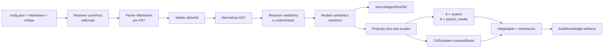

# Parte 1B: `knowledge-builder` E Artefatos Locais

## Objetivo

Implementar `tools/knowledge-builder/` em Rust como compilador definitivo de
`data/knowledge/`. Cada execução valida a fonte canônica, projeta os seis locales,
gera um par completo `system` e `system_media` para cada locale e mantém o
`CAS/system` compartilhado.

Esta parte produz e valida artefatos, sem alterar repositories, rotas,
componentes, desenvolvimento ou builds dos apps. A integração pertence à
[Parte 1C](./01c-app-system-consumption.md).

## Pré-requisito

A [Parte 1A](./01a-canonical-knowledge-data.md) está concluída, com
`data/knowledge/` completo e auditado.

## Escopo

- criar `tools/knowledge-builder/` como binário e biblioteca Rust no Cargo
  Workspace;
- implementar schemas executáveis para todos os `entityType` canônicos;
- validar manifestos JSON, Markdown, relações, taxonomias e mídias;
- analisar Markdown por AST e compilar fragmentos localizados;
- projetar conteúdo localizado diretamente nos bancos de cada locale;
- criar e versionar o DDL de `system` e `system_media` no builder;
- gerar seis bancos `system` completos;
- gerar seis bancos `system_media` completos;
- montar o `CAS/system` único e incremental;
- produzir checksums e `build-result.json`;
- garantir determinismo lógico e escrita atômica;
- oferecer CLI estável para validação e build;
- reproduzir em Rust os contratos válidos da criação atual de `system`,
  `system_media` e `vault/system`, ajustados ao modelo canônico e localizado;
- manter o runtime e o pipeline dos apps inalterados.

Os locales obrigatórios são:

```text
pt-BR
pt-PT
gn-PY
en-US
es-ES
fr-FR
```

O contrato público da lista permanece em `@vet/types/i18n/locales`. O builder
possui uma configuração equivalente validada contra esse contrato no CI. Uma
execução sempre gera os seis locales sob a mesma `build_version`; falha em um
locale invalida toda a saída.

Esta parte produz somente estados integrais. Releases públicas, bootstraps,
deltas, manifests, providers e publicação pertencem à Parte 3.

## Base Da Implementação

O builder parte do comportamento efetivo que produz os dados de sistema no app:

```text
packages/core-local/src/sqlite/create/system/main/schema.ts
packages/core-local/src/sqlite/create/system/main/indexes.ts
packages/core-local/src/sqlite/create/system/main/assertions.ts
packages/core-local/src/sqlite/create/system/main/refresh.ts
packages/core-local/src/sqlite/create/system/main/seeds.ts
packages/engine/src/storage/sqlite.rs
packages/engine/src/storage/media.rs
packages/engine/src/storage/cas.rs
```

O levantamento identifica DDL, constraints, índices, normalização, projeção de
catálogos, composição de coleções de mídia, geração de thumbnails, SHA-256 e
disposição física do CAS. Os schemas preservam as garantias válidas desse
processo e aplicam o contrato canônico de `entity.json`, fragmentos Markdown,
locales e caminhos relativos definido na Parte 1A.

A referência de comportamento está dividida por responsabilidade: `core-local`
descreve e preenche `system`, enquanto o Rust cria `system_media`, calcula hashes
e materializa os objetos em `vault/system`. O builder consolida essas regras como
compilação offline própria e produz sua saída em `build/knowledge-artifacts`.

`knowledge-builder` implementa esse processo dentro do próprio crate. Ele não
importa código TypeScript, não invoca comandos Tauri, não abre IPC com o app e não
usa `@vet/engine` como serviço de geração. A paridade é comprovada por fixtures,
inventário de tabelas, campos, relações e resultados semânticos.

Essa transferência contempla somente `system`, `system_media` e `CAS/system`.
Schemas, migrations, escrita de mídia, sincronização, replicação e CAS do ramo
`user` permanecem sob seus responsáveis atuais.

## Fluxo



O pipeline normativo é:

```text
entity.json + Markdown + mídias
-> validação estrutural do entity.json
-> resolução segura dos caminhos editoriais
-> parser Markdown por AST
-> validação por allowlist
-> normalização determinística do AST
-> resolução das mídias para mediaKey e contentHash
-> construção do modelo semântico canônico
-> cálculo do sourceDigestSha256
-> representação compilada segura
-> projeção relacional
=> build de system, system_media e CAS/system
```

Somente o modelo semântico canônico chega aos projectors. JSON bruto, bytes
Markdown originais e caminhos editoriais de conteúdo não são projetados nem
participam diretamente do digest.

## Local Do Código

```text
tools/knowledge-builder/
├── Cargo.toml
├── src/
│   ├── lib.rs
│   ├── main.rs
│   ├── cli.rs
│   ├── source/
│   ├── markdown/
│   ├── validation/
│   ├── projection/
│   ├── databases/
│   ├── media/
│   └── report/
├── schemas/
│   ├── source/
│   ├── system/
│   └── system_media/
├── fixtures/
└── tests/
```

O crate usa `src/lib.rs` como núcleo testável e `src/main.rs` como adapter fino
da CLI. Ele é incluído em `members` no `Cargo.toml` da raiz.

O builder é o único escritor dos bancos públicos. DDL, índices, projeção,
normalização pesquisável, inserção dos dados, montagem do CAS e relatório de
build pertencem a esse crate.

## Descoberta Da Fonte

O builder percorre `data/knowledge/` recursivamente e identifica entidades por
diretórios que contenham `entity.json`. O caminho é metadado editorial e não
seleciona schema nem gera identidade.

O carregamento segue esta ordem lógica:

```text
entityType
-> id
-> campo localizado ou sectionKey
-> locale
```

O builder:

- seleciona o schema por `entityType`;
- desserializa `entity.json` de forma estrita;
- resolve os caminhos de `localizedContent`, `sections` e mídias em relação ao
  diretório da entidade;
- lê os arquivos `<locale>.md` declarados pelo manifesto;
- analisa Markdown por parser estruturado, sem expressões regulares sobre o
  texto-fonte;
- valida campos simples, listas e seções conforme o schema do domínio e a
  allowlist Markdown;
- normaliza deterministicamente os ASTs aceitos;
- resolve as mídias e converte estrutura, AST normalizado e descritores de mídia
  em um modelo semântico canônico Rust;
- seleciona um projector registrado para o tipo canônico;
- recusa identidade duplicada;
- recusa arquivo localizado ausente, duplicado ou desconhecido;
- resolve referências por IDs;
- não infere significado pelo nome dos diretórios;
- produz o mesmo conteúdo lógico quando uma entidade ou um diretório de texto é
  movido com o manifesto atualizado e sem mudança de conteúdo ou identidade;
- trata o caminho relativo da mídia dentro da entidade como parte de sua
  referência editorial estável.

## Representação Markdown Compilada

O builder implementa o perfil fechado definido na Parte 1A sem depender das
opções permissivas padrão da biblioteca de Markdown escolhida. Antes da projeção,
ele:

1. remove BOM e normaliza quebras de linha;
2. normaliza strings textuais em UTF-8 NFC;
3. descarta posições e metadados sintáticos sem significado de domínio;
4. valida nós, profundidade, quantidade de nós, links e destinos de imagem;
5. normaliza deterministicamente headings internos e estruturas equivalentes;
6. reescreve imagens relativas para `knowledge-media://asset/<media-key>`;
7. serializa o AST aceito em Markdown canônico determinístico.

Campos simples são projetados como valores tipados, aliases como coleções
tipadas e corpos de seção como Markdown canônico compilado. A saída não contém
HTML bruto, caminhos editoriais, imagens remotas ou URI com protocolo não
permitido. A ordem semântica de parágrafos, listas, tabelas e seções é preservada.

O renderer não precisa interpretar a fonte de autoria. O perfil da representação
compilada integra o contrato do schema de `system`; qualquer ampliação que exija
suporte novo no consumidor eleva essa versão.

## Padrão De Projeção Relacional

O builder segue uma arquitetura schema-first com Data Mappers explícitos. O DDL
é a fonte de verdade da estrutura SQL; `entity.json`, os fragmentos Markdown e
as mídias são a fonte de verdade do conteúdo de domínio.

```text
entity.json + Markdown + mídias
-> validação e compilação canônica da fonte
-> modelo canônico Rust
-> projector do entityType
-> tabelas definidas pelo DDL
-> verificação de cobertura e integridade
```

O modelo intermediário usa um enum fechado:

```rust
enum CanonicalEntity {
    Breed(BreedEntity),
    Product(ProductEntity),
    Manufacturer(ManufacturerEntity),
    ActiveIngredient(ActiveIngredientEntity),
    Condition(ConditionEntity),
    GeoPlace(GeoPlaceEntity),
    Taxonomy(TaxonomyEntity),
    TreatmentProtocol(TreatmentProtocolEntity),
}
```

O processamento exaustivo impede aceitar um novo `entityType` sem schema,
modelo e projector correspondentes. Cada projector:

- recebe uma entidade canônica e o conteúdo compilado do locale selecionado;
- grava em uma transação;
- pode preencher uma ou várias tabelas;
- resolve relações somente por IDs;
- registra entidades e relações consumidas;
- falha diante de dado sem destino relacional;
- não infere comportamento pelo caminho da fonte.

Uma entidade `breed`, por exemplo, pode preencher a tabela principal de raças,
as tabelas de aliases, seções, relações com `geo_place` e coleções de mídia. O
projector geográfico materializa lugares, hierarquias e seus textos localizados.
Essas decisões pertencem aos projectors e ao DDL, não aos diretórios nem aos
JSONs de autoria.

Não existe regra “um JSON corresponde a uma tabela”. Também não se usa uma
tabela genérica EAV para evitar a modelagem do domínio. Dados consultáveis,
ordenáveis ou relacionados usam tabelas e constraints próprias; JSON em coluna
é reservado a conteúdo opaco, versionado e validado que não precise dessas
garantias relacionais.

## Contrato Dos Bancos Localizados

Cada `system` contém conteúdo pronto para o locale correspondente. Dados de
conhecimento não dependem de chaves de tradução no consumidor.

As projeções armazenam, conforme o domínio:

- `name` localizado;
- aliases do locale;
- descrição e seções localizadas;
- rótulos localizados de taxonomias e classificações;
- nomes e observações localizados de protocolos;
- campos normalizados usados por busca;
- campos estruturais e relações idênticos entre locales.

Não existem colunas ou payloads `label_key`, `translation_key` ou equivalentes
para conteúdo de conhecimento. IDs técnicos, códigos científicos, códigos
regulatórios, regiões, classificações e relações permanecem estruturais.

O conjunto de IDs e relações não localizáveis é exatamente igual nos seis bancos
`system`. Somente os campos definidos como localizáveis e seus índices derivados
variam por locale.

Cada banco registra:

- seu locale canônico;
- `PRAGMA user_version` de `system` ou `system_media`;
- a identidade integral da compilação em `knowledge_build_metadata`;
- metadados públicos de release somente quando fornecidos no contexto.

## Metadados Da Compilação

Os dois bancos de cada locale possuem exatamente uma linha em
`knowledge_build_metadata`, inclusive quando a saída é local e `release` é
`null`:

```sql
CREATE TABLE knowledge_build_metadata (
    singleton INTEGER PRIMARY KEY CHECK(singleton = 1),
    build_version INTEGER NOT NULL CHECK(build_version > 0),
    builder_version TEXT NOT NULL CHECK(length(trim(builder_version)) > 0),
    build_result_schema_version INTEGER NOT NULL
        CHECK(build_result_schema_version > 0),
    source_digest_sha256 BLOB NOT NULL
        CHECK(length(source_digest_sha256) = 32),
    locale TEXT NOT NULL
        CHECK(locale IN ('pt-BR', 'pt-PT', 'gn-PY', 'en-US', 'es-ES', 'fr-FR'))
);
```

O conteúdo dessa linha é idêntico no par. Cada banco conserva separadamente seu
`PRAGMA user_version`, conforme o próprio schema. A combinação permite provar
que `system` e `system_media` pertencem à mesma compilação antes de abrir o
conjunto.

O padrão segue o princípio de identidade persistida já usado pelo storage em
Rust, mas não reutiliza `database_manifest`: esse manifesto identifica o conjunto
privado do usuário e permanece em `user/logs`. Metadados de compilação de
conhecimento pertencem somente aos bancos públicos gerados pelo builder.

Quando `release` é informado, os dois bancos também recebem uma linha em
`knowledge_release_metadata`, com `release_id`, `generation`, `revision` e
`locale`. Quando `release` é `null`, essa tabela permanece sem linha. O
`build_version` nunca é inferido de `generation` e `revision`.

## Responsabilidade Dos Schemas

`schemas/source/` descreve a autoria por `entityType`. Os tipos Rust usam
desserialização estrita e recusam campos desconhecidos quando o schema não os
permite.

`schemas/system/` e `schemas/system_media/` concentram o DDL e as versões dos
bancos produzidos. O builder aplica explicitamente tabelas, constraints, índices
e PRAGMAs necessários ao resultado determinístico.

Os projectors não criam tabelas nem alteram o DDL durante a projeção. Primeiro o
builder materializa o schema completo; depois prepara e executa os inserts contra
esse schema. Divergências entre SQL de projeção e DDL falham nos testes e no
build.

`packages/core-local` conserva temporariamente o fluxo usado pelo app. Sua
adaptação para somente leitura dos novos bancos ocorre na Parte 1C. Nenhum DDL do
builder é importado de TypeScript.

## Contrato Relacional Das Mídias

Tabelas de domínio e conteúdo compilado em `system` referenciam mídias por
`media_key`, nunca pelo caminho editorial original nem pelo hash dos bytes. O
builder deriva a chave técnica de:

```text
entityType
id da entidade
caminho relativo normalizado da mídia dentro da entidade
```

Essa derivação é determinística e versionada pelo contrato do builder. O mesmo
arquivo referenciado por `cover` e por Markdown dentro da mesma entidade resolve
para a mesma `media_key`.

O formato lógico é:

```text
<entityType>/<entityId>/<caminho-relativo-normalizado>
```

Separadores são `/`, componentes `.` e `..` são resolvidos antes da derivação,
e o caminho final precisa permanecer dentro da entidade. Strings são
normalizadas em UTF-8 NFC. O valor é armazenado dessa forma em SQLite e recebe
percent-encoding por segmento, preservando os separadores `/`, somente quando
inserido na URI interna do Markdown compilado.

O DDL de `system_media` mantém a resolução canônica para o conteúdo físico:

```sql
CREATE TABLE media_assets (
    media_key TEXT PRIMARY KEY,
    content_hash BLOB NOT NULL CHECK(length(content_hash) = 32),
    thumbnail BLOB,
    mime_type TEXT NOT NULL,
    size_bytes INTEGER NOT NULL CHECK(size_bytes > 0),
    width INTEGER CHECK(width IS NULL OR width > 0),
    height INTEGER CHECK(height IS NULL OR height > 0)
);

CREATE INDEX idx_media_assets_content_hash
    ON media_assets(content_hash);
```

O banco usa `media_key`, DTOs e relatórios JSON usam `mediaKey`, e a URI interna
usa o segmento `<media-key>`. Os três nomes representam a mesma chave técnica.

O DDL definitivo limita e valida o formato de `media_key`. O hash não é
`UNIQUE`: referências editoriais diferentes podem possuir bytes idênticos,
enquanto o CAS armazena esses bytes uma única vez. O thumbnail é produzido
deterministicamente pelo builder com os limites e a orientação esperados pelos
consumidores.

Esse schema pertence exclusivamente a `system_media`. O banco `user_media`
continua usando sua tabela `blobs`, identidade por hash, campos de sincronização,
remoção lógica e escrita local. O builder não cria, abre ou modifica bancos de
mídia do usuário.

Cada `system_media` contém somente as `media_key` exigidas pelo locale. Capas e
outras referências estruturais aparecem em todos os bancos aplicáveis; imagens
referenciadas por um fragmento Markdown aparecem nos locales que usam esse
fragmento. Na mesma build, uma `media_key` resolve obrigatoriamente para o mesmo
`contentHash` em todos os bancos que a incluem.

Durante a compilação, links relativos de Markdown são reescritos para o contrato
interno:

```markdown

```

A fonte canônica nunca contém essa URI. Ela existe somente no conteúdo
compilado entregue ao app.

## Contrato Da CLI

O binário oferece dois comandos públicos:

```text
knowledge-builder validate \
  --source <knowledge-data>

knowledge-builder build \
  --source <knowledge-data> \
  --output <artifact-directory> \
  --context <build-context.json>
```

`--source` e `--output` são sempre explícitos. A ferramenta:

- não depende do diretório de trabalho;
- não consulta rede;
- não acessa Rails;
- não publica releases;
- não conhece canais ou providers;
- não lê fontes TypeScript ou i18n do app;
- sempre projeta os seis locales como uma operação única.

O contexto local é:

```json
{
  "schemaVersion": 1,
  "buildVersion": 1,
  "release": null
}
```

`release: null` identifica uma saída integral local. A tabela
`knowledge_release_metadata` permanece sem linha nesse modo.

O contexto público usado posteriormente pelo Hub segue o mesmo contrato:

```json
{
  "schemaVersion": 1,
  "buildVersion": 42,
  "release": {
    "releaseId": "<uuid>",
    "generation": 2,
    "revision": 1
  }
}
```

O builder materializa a identidade recebida nos dois bancos de cada locale. Ele
não reserva versão, cria release nem publica conteúdo.

Logs humanos vão para `stderr`. Sucesso retorna código `0`; qualquer erro retorna
código não zero sem finalizar uma versão parcial.

## Contrato De `build-result.json`

```json
{
  "schemaVersion": 1,
  "builderVersion": "0.1.0",
  "buildVersion": 1,
  "release": null,
  "sourceDigestSha256": "<sha256>",
  "systemSchemaVersion": 1,
  "systemMediaSchemaVersion": 1,
  "locales": {
    "pt-BR": {
      "system": {
        "path": "versions/1/locales/pt-BR/veterinary_clinic_system.db",
        "sizeBytes": 0,
        "checksumSha256": "<sha256>",
        "schemaFingerprintSha256": "<sha256>"
      },
      "systemMedia": {
        "path": "versions/1/locales/pt-BR/veterinary_clinic_system_media.db",
        "sizeBytes": 0,
        "checksumSha256": "<sha256>",
        "schemaFingerprintSha256": "<sha256>"
      },
      "casSetDigestSha256": "<sha256>"
    }
  },
  "cas": {
    "algorithm": "sha256",
    "hashEncoding": "lowercase_hex",
    "root": "CAS/system",
    "layout": "sha256_hex_2_2_bin",
    "pathPattern": "{hash[0..2]}/{hash[2..4]}/{hash}.bin",
    "objectCount": 0,
    "setDigestSha256": "<sha256>"
  },
  "projection": {
    "reportPath": "versions/1/projection-report.json",
    "checksumSha256": "<sha256>"
  },
  "checksumFile": "versions/1/checksums.sha256"
}
```

O exemplo abrevia os locales; um relatório válido contém exatamente os seis.
`schemaVersion` versiona o contrato da CLI e `builderVersion` identifica o
binário. Esses campos não substituem versões de schema nem versões públicas de
conhecimento.

Todos os caminhos são relativos a `--output`, normalizados e sem componentes
absolutos, vazios ou `..`. O relatório usa serialização JSON determinística em
UTF-8.

`cas.root`, `cas.layout` e `cas.pathPattern` formam um contrato único. Nenhum
objeto pode ser gravado diretamente como `CAS/system/<hash>` ou
`CAS/system/<hash>.bin`; os dois níveis derivados do próprio hash são
obrigatórios em toda saída do builder.

## Saída Local

```text
build/knowledge-artifacts/
├── CAS/
│   └── system/
│       └── <primeiros-2-hex>/
│           └── <próximos-2-hex>/
│               └── <hash-sha256-hex>.bin
└── versions/
    └── <build_version>/
        ├── locales/
        │   ├── pt-BR/
        │   │   ├── veterinary_clinic_system.db
        │   │   └── veterinary_clinic_system_media.db
        │   ├── pt-PT/
        │   ├── gn-PY/
        │   ├── en-US/
        │   ├── es-ES/
        │   └── fr-FR/
        ├── projection-report.json
        ├── checksums.sha256
        └── build-result.json
```

`build_version` aceita somente inteiros positivos e identifica uma saída
integral. Ela não representa versão de schema nem versão pública de distribuição.

## Auditoria De Projeção

`projection-report.json` prova que toda entidade canônica e toda relação foram
consumidas por um projector. Seu contrato inicial é:

```json
{
  "schemaVersion": 1,
  "source": {
    "entitiesByType": {
      "breed": 410,
      "product": 82
    },
    "relationCount": 560,
    "localizedFragmentsByLocale": {
      "pt-BR": 1230
    }
  },
  "locales": {
    "pt-BR": {
      "projectedByType": {
        "breed": {
          "entities": 410,
          "rowsByTable": {
            "breeds": 410,
            "breed_aliases": 615
          }
        },
        "product": {
          "entities": 82,
          "rowsByTable": {
            "products": 82,
            "product_aliases": 340
          }
        }
      },
      "resolvedRelationCount": 560,
      "consumedLocalizedFragments": 1230,
      "unconsumedEntities": [],
      "unconsumedLocalizedFragments": [],
      "unresolvedRelations": []
    }
  },
  "media": {
    "sourceFiles": 0,
    "referencedMediaKeys": 0,
    "uniqueContentHashes": 0,
    "missingSourcePaths": [],
    "unreferencedSourcePaths": []
  }
}
```

Os nomes concretos das tabelas refletem o DDL implementado. O exemplo abrevia os
tipos de entidade e `locales`, mas um relatório válido cobre todos os tipos e
contém exatamente os seis locales. Ele demonstra o contrato de cobertura e não
fixa antecipadamente a nomenclatura do schema.

Uma saída somente é válida quando:

- cada identidade de origem foi consumida exatamente uma vez por locale pelo
  projector do seu tipo;
- todas as relações foram resolvidas em cada locale;
- cada fragmento Markdown declarado foi consumido exatamente uma vez no locale
  correspondente;
- as contagens por entidade e por tabela são coerentes;
- `unconsumedEntities`, `unconsumedLocalizedFragments`, `unresolvedRelations`,
  `missingSourcePaths` e `unreferencedSourcePaths` estão vazios;
- o checksum do relatório corresponde ao declarado em `build-result.json`.

Cada banco também possui um `schemaFingerprintSha256` calculado a partir da
representação canônica de `sqlite_schema`, colunas, índices, foreign keys e
`PRAGMA user_version`. Bancos do mesmo tipo compartilham o fingerprint entre os
seis locales.

## CAS E Mídias

`CAS/system` é a raiz lógica única e incremental. Todos os objetos, inclusive na
primeira build, são gravados diretamente no layout fragmentado
`<hash[0..2]>/<hash[2..4]>/<hash>.bin`. Não existe etapa, cache ou saída oficial
com os hashes armazenados de forma plana.

Para cada arquivo de autoria, o builder:

```text
referência relativa de entity.json ou Markdown
-> resolver dentro do diretório da entidade
-> normalizar o caminho relativo
-> derivar media_key de entityType + id + caminho relativo
-> ler os bytes
-> calcular SHA-256
-> validar extensão, MIME e metadados
-> gerar thumbnail e metadados técnicos determinísticos
-> converter o hash para 64 caracteres hexadecimais minúsculos
-> materializar CAS/system/<hex[0..2]>/<hex[2..4]>/<hex>.bin
-> registrar media_key -> contentHash em system_media
-> reescrever links Markdown para knowledge-media://asset/<media-key>
```

O SHA-256 é recalculado em todo build oficial. O nome não é usado como prova de
integridade e caches locais não substituem essa verificação.

O banco armazena `content_hash` como 32 bytes. Relatórios, arquivos de checksum e
caminhos físicos usam exclusivamente a representação hexadecimal minúscula de 64
caracteres. A disposição fragmentada corresponde ao resolvedor CAS já adotado
pelo app e evita diretórios com quantidade excessiva de objetos.

Cada `system_media.db` é o índice canônico das mídias exigidas por seu locale. O
conjunto de chaves de um locale une:

- referências estruturais de `entity.json`, como `cover`;
- links relativos extraídos dos Markdown por parser estruturado;
- mídias exigidas pelo projector do domínio.

O cofre físico contém a união deduplicada dos hashes resolvidos para os seis
locales. Duas `media_key` com os mesmos bytes apontam para o mesmo objeto CAS.
Arquivos de autoria não referenciados não entram no CAS da build e invalidam a
auditoria da fonte.

Alterar os bytes de um arquivo preservando seu caminho relativo produz outro
`contentHash`, mantém a mesma `media_key`, atualiza a linha correspondente nos
novos bancos `system_media` e adiciona um objeto ao CAS. O objeto anterior
permanece imutável enquanto puder ser exigido por outra build ou release retida;
sua remoção pertence à política de garbage collection.

`checksums.sha256` cobre os doze bancos e todos os objetos CAS referenciados pela
`build_version`.

## Digest Lógico Da Fonte

`sourceDigestSha256` representa o conteúdo lógico, não a organização editorial
dos diretórios. Ele é calculado depois da validação, normalização dos ASTs e
resolução das mídias, sobre o mesmo modelo semântico entregue aos projectors. Sua
entrada canônica é ordenada por:

```text
entityType
id
campo estrutural ou relação
campo localizado ou sectionKey
locale
mediaKey
contentHash
```

O digest cobre:

- campos estruturais e relações do `entity.json`, após validação e conversão para
  o modelo tipado;
- campos e seções localizados, identificados por chave semântica e locale;
- conteúdo lógico dos ASTs Markdown normalizados;
- fingerprints canônicos dos schemas de autoria efetivamente usados;
- `mediaKey`, `contentHash` e metadados de mídia com significado no resultado.

O digest não usa os bytes do JSON ou Markdown original. `contentPath`, nomes dos
diretórios de conteúdo, caminhos absolutos, posição organizacional da entidade,
BOM, estilo de quebra de linha e diferenças sintáticas eliminadas pela
normalização não entram na identidade. O caminho relativo normalizado da mídia
participa por meio da `mediaKey`, e seus bytes participam por meio de
`contentHash`.

A serialização usada pelo digest é versionada pelo contrato do builder e
determinística: UTF-8 NFC, chaves de mapas em ordem lexicográfica, conjuntos sem
ordem de domínio classificados por sua identidade e arrays semanticamente
ordenados preservados na ordem da fonte. `buildVersion`, identidade de release,
diretório de saída e timestamps não participam.

Mover uma entidade inteira ou renomear uma pasta de texto com a atualização do
manifesto preserva o digest quando o conteúdo lógico não muda. Renomear ou mover
uma mídia dentro da entidade altera sua `media_key` e o digest; alterar apenas
seus bytes preserva a chave e altera o digest pelo novo `contentHash`.

Adicionar, remover ou alterar uma entrada efetiva muda o digest.

## Determinismo E Atomicidade

Para as mesmas entradas lógicas, contexto, versões técnicas e configuração, o
builder produz o mesmo conteúdo lógico e os mesmos checksums.

O processo:

- fixa Cargo lockfile e toolchain Rust;
- usa uma implementação SQLite definida;
- configura PRAGMAs explicitamente;
- ordena entidades, relações e inserções;
- não introduz timestamps ou valores aleatórios sem entrada explícita;
- deriva de forma determinística qualquer identificador técnico exigido pelo
  DDL para linhas projetadas;
- escreve bancos e objetos em staging;
- executa todas as validações antes da finalização;
- move a versão validada atomicamente para `versions/<build_version>`;
- nunca sobrescreve uma versão finalizada com bytes diferentes;
- grava objetos CAS temporariamente, valida o hash e move atomicamente.

## Validações

O builder recusa:

- `build_version` não positiva;
- schema ou `entityType` desconhecido;
- campo desconhecido proibido pelo schema;
- ID duplicado;
- referência estrutural inexistente;
- relação por nome ou caminho;
- locale ausente, duplicado ou desconhecido;
- caminho de conteúdo ausente, absoluto, remoto ou que escape da entidade;
- front matter em arquivo Markdown;
- AST incompatível com o campo localizado declarado;
- HTML bruto, nó fora da allowlist ou AST acima dos limites definidos;
- link com protocolo não permitido ou imagem que não use mídia relativa da
  própria entidade;
- `sectionKey` desconhecida ou repetida;
- `parentSectionKey` inexistente, proibida ou cíclica;
- conteúdo localizado sem associação no `entity.json`;
- `labelKey` ou `translationKey` em conteúdo de conhecimento;
- divergência estrutural entre locales;
- caminho de mídia ausente, absoluto, remoto ou que resolva fora da entidade;
- colisão de `media_key` entre referências editoriais distintas;
- referência de JSON ou Markdown sem arquivo de mídia correspondente;
- mídia de autoria não referenciada;
- URI `knowledge-media` presente na fonte canônica;
- URI interna compilada com `media_key` inexistente;
- arquivo vazio ou extensão, MIME e bytes incoerentes;
- linha de `system_media` sem objeto CAS correspondente;
- mesma `media_key` resolvendo hashes diferentes entre locales da mesma build;
- banco com schema, locale ou metadado divergente;
- ausência ou divergência de `knowledge_build_metadata` entre os dois bancos do
  locale;
- saída parcial ou checksum incoerente.

Ao final, executa `PRAGMA integrity_check` e `PRAGMA foreign_key_check` nos doze
bancos e confere `PRAGMA user_version`, fingerprint do schema, locale, IDs,
relações, cobertura, hashes e relatórios.

## Sequência De Implementação

1. Criar o crate e integrar ao Cargo Workspace.
2. Implementar modelos estritos e schemas de `entity.json`.
3. Implementar descoberta recursiva e ordenação lógica.
4. Implementar parser Markdown, validação de AST e normalização de fragmentos.
5. Implementar resolução segura de caminhos e derivação de `media_key`.
6. Definir o modelo canônico Rust e o registro exaustivo de projectors.
7. Definir DDL, constraints, índices e versões dos dois bancos.
8. Implementar os Data Mappers e a projeção localizada.
9. Implementar `knowledge_build_metadata` e os metadados opcionais de release.
10. Implementar a auditoria de cobertura e os fingerprints dos schemas.
11. Implementar `system_media`, thumbnails e o CAS incremental fragmentado.
12. Implementar staging, checksums e finalização atômica.
13. Implementar a CLI, `projection-report.json` e `build-result.json`.
14. Validar fixtures, determinismo, paridade semântica e os seis locales.

## Testes

Cobrir:

- build, lint e testes do crate;
- `validate` e `build` com argumentos explícitos;
- execução a partir de diretórios de trabalho diferentes;
- descoberta independente da árvore organizacional;
- mesmo digest e mesma saída após mover uma entidade;
- mesmo digest após renomear diretório de texto e atualizar seu caminho no
  manifesto;
- seleção do projector exclusivamente por `entityType`;
- enum canônico e dispatch exaustivos para todos os tipos suportados;
- uma entidade projetada em múltiplas tabelas conforme o DDL;
- recusa de entidade sem projector ou sem destino relacional;
- combinação do manifesto com cada conjunto de fragmentos dos seis locales;
- parser Markdown baseado em AST;
- validação de texto simples, listas e seções pelo perfil canônico;
- recusa de HTML bruto, nós fora da allowlist, imagens remotas e protocolos
  `javascript:`, `data:`, `file:` ou desconhecidos;
- limites de tamanho, profundidade e quantidade de nós do AST;
- normalização de BOM, quebras de linha, Unicode e estruturas Markdown
  semanticamente equivalentes;
- mesma representação compilada e mesmo digest para fontes que resultem no mesmo
  AST semântico;
- recusa de front matter e conteúdo incompatível com o campo declarado;
- associação de diretório arbitrário à `sectionKey` definida no manifesto;
- composição determinística da hierarquia de seções por `parentSectionKey`;
- normalização da hierarquia de subtítulos internos;
- campos localizados corretos em cada banco;
- ausência de chaves de i18n nos bancos;
- IDs e relações estruturais iguais entre locales;
- recusa de schema, ID, relação ou locale inválido;
- recusa de campo, seção ou caminho não declarado no manifesto;
- projeção de taxonomias e classificações;
- projeção de `geo_place`, sua hierarquia e relações com raças;
- preservação de múltiplos `originPlaceIds` na ordem definida pela fonte;
- projeção de protocolos e suas relações;
- composição de capas estruturais e imagens inseridas em Markdown;
- resolução de caminho relativo em relação à entidade;
- recusa de caminho absoluto, remoto ou que resolva fora da entidade diretamente
  ou por symlink;
- derivação determinística de `media_key`;
- recusa de colisão entre chaves técnicas;
- geração da relação `media_key -> contentHash` em `system_media`;
- geração determinística de thumbnails e metadados técnicos de sistema;
- igualdade do `contentHash` de uma `media_key` compartilhada entre locales;
- alteração dos bytes no mesmo caminho preservando `media_key` e produzindo novo
  hash;
- alteração do caminho produzindo nova `media_key`;
- conservação do objeto CAS anterior após a alteração;
- deduplicação CAS de duas `media_key` com bytes idênticos;
- reescrita de imagem Markdown relativa para
  `knowledge-media://asset/<media-key>`;
- recusa de URI `knowledge-media` na fonte de autoria;
- geração repetível dos doze bancos;
- `PRAGMA integrity_check`, `PRAGMA foreign_key_check` e `PRAGMA user_version`;
- fingerprint do schema igual entre bancos do mesmo tipo;
- detecção de divergência entre projector e DDL;
- relatório com cobertura integral de entidades e relações;
- recusa de entidade, fragmento Markdown não consumido ou relação não resolvida;
- validação do locale registrado em cada par;
- SHA-256 dos bancos e objetos;
- objeto CAS ausente ou corrompido;
- reaproveitamento de objeto CAS existente;
- contexto local sem metadado de release;
- `knowledge_build_metadata` sempre presente e idêntico no par do locale;
- contexto público com identidade igual nos doze bancos;
- ausência de qualquer abertura ou alteração de `user_media` e `vault/user`;
- equivalência entre a disposição CAS gerada e o resolvedor fragmentado do app;
- ausência de objetos diretamente na raiz `CAS/system` ou fora dos dois níveis
  de fragmentação;
- `build-result.json` completo e determinístico;
- recusa de sobrescrita divergente da mesma `build_version`;
- ausência de acesso a rede, Rails, TypeScript e i18n do app.

## Entregáveis

- `tools/knowledge-builder/`;
- schemas de fonte, `system` e `system_media`;
- fixtures e relatório de paridade com o processo de produção de sistema
  inventariado na Parte 1A;
- seis `veterinary_clinic_system.db`;
- seis `veterinary_clinic_system_media.db`;
- `CAS/system` único e incremental;
- `checksums.sha256` por `build_version`;
- `projection-report.json` por `build_version`;
- `build-result.json` por `build_version`;
- fixtures e testes do builder.

## Critérios De Aceite

- O crate pertence ao Cargo Workspace e passa em build, lint e testes.
- A CLI funciona sem Node, Rails, rede ou dependência do diretório de trabalho.
- A única entrada de conteúdo é `data/knowledge`.
- A identidade da entidade e o digest não dependem de sua posição editorial nem
  do nome dos diretórios de texto. O caminho relativo da mídia dentro da entidade
  participa de sua `media_key`.
- `entityType` seleciona um projector explícito, sem nomes de tabelas nos dados
  canônicos.
- O DDL é a fonte de verdade da disposição relacional.
- Toda entidade e relação possui cobertura comprovada no relatório de projeção.
- Os seis pares de bancos são produzidos na mesma execução.
- Cada par possui `knowledge_build_metadata` coerente e verificável mesmo sem
  identidade pública de release.
- Cada banco contém nomes, aliases, descrições e termos do locale projetado.
- Nenhum banco exige i18n do app para resolver conteúdo de conhecimento.
- IDs e relações estruturais são iguais nos seis locales.
- Toda `media_key` compilada resolve em `system_media` para um hash com objeto
  válido no CAS.
- Todo objeto CAS usa exatamente
  `CAS/system/<2-hex>/<2-hex>/<hash-sha256-hex>.bin`; não há variante plana.
- Alterações de bytes no mesmo caminho preservam referências lógicas e produzem
  novos objetos CAS imutáveis.
- Os doze bancos passam em integridade, foreign keys, fingerprint e
  versionamento.
- Checksums e `build-result.json` descrevem exatamente a saída.
- O runtime, os repositories e os builds dos apps permanecem inalterados.
- O processo não cria nem modifica bancos ou objetos CAS do ramo `user`.
- Não existe publicação, bootstrap, delta ou manifest nesta parte.

## Próxima Parte

Após cumprir todos os critérios, seguir para a
[Parte 1C: consumo local dos artefatos `system`](./01c-app-system-consumption.md).
