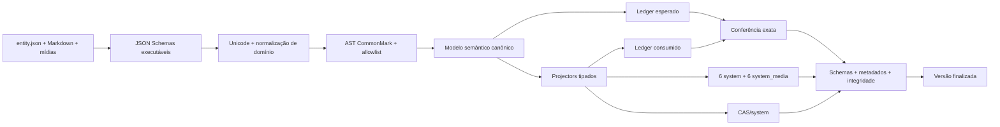

# Parte 1B.1: Consolidação Dos Contratos Do `knowledge-builder`

## Objetivo

Consolidar o `knowledge-builder` como compilador verificável de
`data/knowledge/`. A ferramenta aplica os mesmos contratos de normalização usados
pelas buscas do ecossistema, interpreta Markdown por AST, valida schemas
executáveis, rastreia cada elemento consumido pelos projectors e comprova o fluxo
completo de mídias, bancos, CAS e relatórios.

Esta parte mantém a fronteira da Parte 1B:

```text
data/knowledge
-> validação canônica
-> modelo semântico
-> projeção localizada
-> system + system_media + CAS/system
```

Repositories, serviços, rotas, componentes, desenvolvimento e empacotamento dos
apps permanecem fora desta parte. O consumo dos artefatos começa na
[Parte 1C](./01c-app-system-consumption.md).

## Pré-Requisito

A [Parte 1B](./01b-knowledge-builder.md) está implementada, com o crate
`tools/knowledge-builder/`, CLI, DDL, projectors, saída por `build_version` e
testes executáveis.

## Resultado Esperado

Ao final, uma build somente é finalizada quando consegue demonstrar que:

- todo valor normalizado segue um contrato explícito e testado;
- todo JSON obedece ao schema executável correspondente;
- todo Markdown aceito foi interpretado e normalizado por AST;
- toda entidade, relação, fragmento localizado, seção e referência de mídia foi
  consumida exatamente uma vez pelo destino correto;
- toda mídia resolve para `system_media` e para um objeto íntegro no CAS;
- todo relatório descreve fatos observados durante a compilação;
- todo artefato final satisfaz seu schema, metadados, checksum e disposição
  física.

## Escopo

- separar normalização de identidade e normalização de busca;
- normalizar texto canônico com Unicode NFC completo;
- substituir o parser Markdown manual por parser CommonMark baseado em AST;
- tornar os schemas JSON parte executável da validação;
- modelar referências estruturais de mídia;
- gerar thumbnails reais e determinísticos;
- implementar um ledger de consumo dos projectors;
- validar relatórios e `build-result.json` pelos schemas públicos;
- fortalecer a verificação da saída final e da reutilização de versões;
- criar fixtures próprias e ampliar os testes de aceitação do builder;
- manter `data/knowledge/` como única fonte de conteúdo.

## Dependências Rust

A implementação solicita autorização antes de adicionar dependências ao Cargo
Workspace. O conjunto previsto é:

- `comrak`, para AST CommonMark, extensões permitidas e serialização canônica;
- `unicode-normalization`, para NFC, NFD e identificação de combining marks;
- `jsonschema`, para JSON Schema Draft 2020-12 com resolução local;
- `image`, para decodificação, dimensões, orientação e redimensionamento;
- o encoder JPEG da própria crate `image`, para thumbnails determinísticos;
- nenhuma biblioteca EXIF adicional, pois o decoder escolhido expõe e aplica a
  orientação necessária.

As versões ficam fixadas por `Cargo.lock`. Nenhum schema usa referência remota em
tempo de execução e nenhuma validação acessa a rede.

## Arquitetura



Somente o modelo semântico validado chega aos projectors. Schemas, normalização,
AST, ledger e validação de artefatos são etapas obrigatórias, não relatórios
informativos opcionais.

## 1. Normalização Canônica

Criar um módulo próprio, por exemplo:

```text
tools/knowledge-builder/src/normalization/
├── mod.rs
├── unicode.rs
└── search.rs
```

### Texto De Autoria

Toda string com significado de conteúdo é normalizada para Unicode NFC antes de
entrar no modelo semântico. Isso inclui:

- IDs e chaves textuais quando seu contrato permitir Unicode;
- valores de `localizedContent`;
- labels e aliases taxonômicos;
- texto extraído do AST Markdown;
- caminhos lógicos e `media_key` depois da resolução segura dos componentes.

O builder não usa uma tabela manual limitada a caracteres latinos. A
normalização cobre Unicode de forma geral por uma implementação consolidada.
O módulo remove compositores parciais e não mantém outra normalização em
paralelo.

### Identidade Pesquisável

Existem duas funções distintas:

```rust
fn normalize_identity_key(value: &str) -> String;
fn normalize_search_text(value: &str) -> String;
```

`normalize_identity_key` segue o contrato dos nomes canônicos usados por
unicidade e resolução exata:

```text
NFD
-> remover combining marks
-> lowercase
-> manter somente ASCII a-z e 0-9
```

`normalize_search_text` segue o contrato de busca textual:

```text
NFD
-> remover combining marks
-> lowercase
-> substituir sequências fora de ASCII a-z e 0-9 por um espaço
-> colapsar espaços
-> trim
```

Aplicação no DDL:

- `normalized_name` usa `normalize_identity_key`;
- `normalized_label` usa `normalize_search_text`;
- `entity_search_terms.normalized_value` usa `normalize_search_text`;
- comparações de aliases e proveniência usam a normalização correspondente ao
  papel do campo.

Criar vetores de contrato que cubram acentos, pontuação, whitespace, caracteres
decompostos, caixa, Guarani, português, espanhol e francês. Exemplos mínimos:

```text
Narú                         -> naru
São João, Cão e Gato         -> sao joao cao e gato
  Méloxicam   2 mg           -> meloxicam 2 mg
Cafe\u{301}                  -> cafe
```

Os testes comprovam que nomes e consultas normalizadas convergem para o mesmo
valor esperado.

## 2. Schemas JSON Executáveis

### Fonte

Compilar localmente os schemas de `schemas/source/` antes de ler entidades. O
fluxo obrigatório é:

```text
bytes JSON
-> parse para serde_json::Value
-> identificar entityType
-> selecionar schema fechado
-> validar Draft 2020-12
-> desserializar no tipo Rust correspondente
-> executar validações semânticas e relacionais
```

Cada schema define integralmente:

- campos obrigatórios e opcionais;
- `additionalProperties: false` em todos os objetos fechados;
- tipos, enums, limites, formatos e unicidade de arrays;
- mapas exatos dos seis locales;
- objetos aninhados, como nomenclatura, identificadores regulatórios,
  centroides, doses, ranges e mídia;
- referências exclusivamente locais para schemas comuns.

Serde continua oferecendo tipos fechados. JSON Schema governa forma e limites;
Rust governa o modelo tipado; a validação semântica governa referências,
taxonomias e regras entre campos. A mesma regra estrutural não é mantida em três
implementações manuais concorrentes.

Validações manuais de chaves obrigatórias, campos adicionais, tipos e limites
saem quando o schema executável assume essas garantias. Permanecem em Rust apenas
regras semânticas que dependem de mais de um campo, entidade, taxonomia, arquivo
ou artefato.

### Saída

Executar também os schemas de:

- `content-document.schema.json`, antes de inserir `content_json`;
- `projection-report.schema.json`, antes de escrever e ao reutilizar uma versão;
- `build-result.schema.json`, antes de finalizar e ao reutilizar uma versão.

Fortalecer os schemas de saída para exigir:

- exatamente os seis locales conhecidos;
- hashes SHA-256 em hexadecimal minúsculo;
- caminhos relativos canônicos;
- objetos de banco completos;
- contrato fechado de `release` local ou público;
- contrato fechado de CAS e relatório;
- ausência de campos desconhecidos.

Adicionar testes que compilam todos os schemas sem rede e validam fixtures
positivas e negativas.

## 3. Markdown Por AST

Substituir a análise por linhas e a procura manual de referências pelo AST do
`comrak`.

O módulo não conserva parser por linhas, scanner próprio de links ou fallback
para documentos que o parser AST recusar.

### Perfil Permitido

Aceitar somente os nós necessários ao conteúdo de conhecimento:

- documento;
- parágrafo e texto;
- quebra suave e quebra explícita;
- ênfase e negrito;
- headings de `#` a `######`;
- listas ordenadas e não ordenadas;
- item de lista;
- citação;
- separador;
- código inline e bloco de código tratados como texto;
- tabela, cabeçalho, linha e célula;
- link externo `https`;
- imagem com caminho relativo dentro da entidade.

Recusar nós ou extensões não listados, inclusive HTML bruto, links inseguros,
imagens remotas, front matter e estruturas acima dos limites do contrato.

### Seções

Percorrer os nós de primeiro nível do documento:

1. um heading AST de nível `#` inicia uma seção;
2. seu texto começa por um inteiro positivo correspondente a `sectionNumber`;
3. o restante do heading é descartado;
4. todos os nós seguintes pertencem à seção até o próximo heading de nível `#`;
5. headings de `##` a `######` permanecem no corpo;
6. conteúdo não vazio antes da primeira seção é inválido;
7. números e `sectionKey` precisam coincidir exatamente com o manifesto.

Links e imagens são obtidos dos respectivos nós do AST. Conteúdo de código não é
interpretado como link ou imagem.

### Serialização Canônica

Normalizar o AST aceito e serializar cada seção em CommonMark canônico. A
serialização:

- não preserva a escolha autoral entre marcadores semanticamente equivalentes;
- preserva a ordem e o significado dos nós;
- usa quebras de linha estáveis;
- reescreve imagens para `knowledge-media://asset/<media-key>`;
- não contém HTML bruto nem caminhos editoriais;
- produz os mesmos bytes e o mesmo digest para ASTs semanticamente equivalentes.

Limites de bytes, nós e profundidade são aplicados ao documento e ao AST real.

## 4. Mídias Estruturais E Thumbnails

### Contrato De Autoria

Os schemas das entidades que possuem página editorial aceitam opcionalmente:

```json
{
  "media": {
    "cover": "./media/cover.webp",
    "gallery": [
      "./media/lateral.webp",
      "./media/detalhe.webp"
    ]
  }
}
```

O contrato inicial se aplica a `breed`, `product`, `manufacturer`,
`active_ingredient` e `condition`. `cover` possui no máximo um item e `gallery`
preserva a ordem declarada. Um mesmo arquivo pode ser usado por `cover` e pelo
Markdown, resolvendo para a mesma `media_key`. A capa não é repetida em
`gallery`.

Adicionar ao banco `system` uma relação explícita:

```sql
CREATE TABLE entity_media_references (
    entity_type TEXT NOT NULL,
    entity_id TEXT NOT NULL,
    role TEXT NOT NULL CHECK(role IN ('cover', 'gallery')),
    media_key TEXT NOT NULL,
    sort_order INTEGER NOT NULL CHECK(sort_order >= 0),
    PRIMARY KEY(entity_type, entity_id, role, sort_order),
    UNIQUE(entity_type, entity_id, role, media_key)
);
```

O projector valida a entidade proprietária antes do insert. A resolução física
permanece em `system_media`; o builder comprova a integridade entre os bancos,
pois SQLite não aplica foreign key entre arquivos diferentes.

Referências estruturais entram em todos os locales da entidade. Referências
Markdown entram somente nos locales cujos documentos as utilizam. O CAS contém a
união deduplicada dos hashes.

### Processamento

Para cada mídia:

1. resolver o caminho sem symlink e dentro da entidade;
2. validar extensão, assinatura, MIME, tamanho e dimensões;
3. ler a orientação EXIF aplicável;
4. preservar os bytes originais no CAS;
5. registrar dimensões visuais considerando a orientação;
6. gerar thumbnail JPEG com maior lado de `200 px`, sem ampliação, qualidade
   fixa `72` e transparência composta sobre branco;
7. usar encoder, filtro de resize e opções fixados;
8. registrar o thumbnail real em `system_media`.

O thumbnail nunca recebe os bytes integrais da fonte como substituição do
processamento.

O perfil inicial limita a fonte a `25 MiB`, dimensão máxima de `16.384 px` por
lado e `100.000.000` pixels decodificados. Arquivos fora desses limites são
recusados antes de consumir memória desproporcional.

Os testes usam pelo menos PNG, JPEG com orientação, GIF e WebP. Eles verificam
dimensões, MIME, thumbnail, hash, deduplicação, alteração de bytes, alteração de
caminho e disposição fragmentada do CAS.

## 5. Ledger De Projeção

Implementar um `ProjectionLedger` que compare o conjunto esperado com os eventos
realmente consumidos.

### Identidades Rastreáveis

O validador constrói tokens tipados e determinísticos para:

- cada entidade;
- cada campo estrutural escalar, item de array e folha de objeto aninhado;
- cada relação por campo e posição;
- cada valor localizado por campo, locale e posição;
- cada termo taxonômico localizado;
- cada dose e fragmento localizado de protocolo;
- cada documento e seção Markdown por locale;
- cada referência estrutural ou localizada de mídia.

Exemplos lógicos:

```text
entity/product/<id>
structural/product/<id>/regulatoryIdentifiers/brazilMapa
structural/product/<id>/species/0
relation/product/<id>/activeIngredientIds/0/<ingredient-id>
localized/product/<id>/name/pt-BR
localized/product/<id>/aliases/pt-BR/0
section/product/<id>/pt-BR/about
media/product/<id>/pt-BR/cover/<media-key>
```

Os tokens são tipos Rust, não strings montadas nos projectors. A representação
textual existe somente no relatório.

Cada campo do modelo canônico possui uma disposição declarada e exaustiva:

```rust
enum ConsumptionDestination {
    System,
    SystemMedia,
    Cas,
    CompiledContent,
    BuildMetadata,
}
```

Campos de autoria usados somente durante a compilação, como `contentPath`,
`sectionNumber` e `schemaVersion`, também possuem destino explícito. Eles são
consumidos pela etapa responsável e não são confundidos com colunas ausentes. Um
novo campo em qualquer tipo canônico exige definir seu destino e seus tokens; a
compilação falha quando não existe disposição registrada.

### Consumo

Cada projector recebe um ledger do locale e registra o token somente depois de
o insert ou a serialização correspondente ter sucesso. O ledger:

- recusa consumo duplicado;
- recusa token não esperado;
- conserva a tabela e a quantidade de linhas produzidas;
- diferencia validação de referência e consumo de projeção;
- exige consumo de todos os campos estruturais, inclusive opcionais presentes e
  folhas de objetos aninhados;
- exige que todos os tokens esperados sejam consumidos.

Ao concluir um locale:

```text
expected - consumed = unconsumed
consumed - expected = unexpected
consumo repetido = duplicated
```

Qualquer conjunto não vazio invalida a build. O relatório é serializado a partir
do ledger concluído, sem preencher sucesso por convenção.

As contagens `rowsByTable` são conferidas por consultas ao banco após a transação.
`resolvedRelationCount` e `consumedLocalizedFragments` vêm dos tokens efetivamente
consumidos.

## 6. Validação E Finalização Dos Artefatos

Antes da finalização, verificar em staging:

- exatamente seis diretórios de locale;
- exatamente doze bancos esperados;
- `PRAGMA application_id`, `user_version`, `integrity_check` e
  `foreign_key_check`;
- uma linha de `knowledge_build_metadata` em cada banco;
- igualdade de identidade entre o par do locale;
- igualdade de source digest e contexto nos doze bancos;
- fingerprints iguais entre bancos do mesmo tipo;
- referências `entity_media_references -> media_assets -> CAS` completas;
- checksums de bancos, relatórios e objetos referenciados;
- schemas executáveis do relatório e do resultado;
- ausência de arquivos adicionais dentro da versão.

A movimentação de `versions/<build_version>` é a última operação que publica a
versão local. Não existe verificação falível inédita depois desse rename. Objetos
CAS podem ser incorporados antes porque são imutáveis por hash e somente passam a
ser referenciados por uma versão já verificada.

Ao reutilizar uma versão existente, validar novamente:

- schema fechado de `build-result.json` e `projection-report.json`;
- cobertura exata dos seis locales;
- contexto, source digest e versões técnicas;
- todos os bancos, metadados, fingerprints e checksums;
- conjunto CAS e seu digest;
- ausência de caminhos ou arquivos não declarados.

Uma versão adulterada, incompleta ou com campos adicionais não é reutilizada.

## 7. Fixtures E Testes

Criar fixtures autocontidas sob:

```text
tools/knowledge-builder/fixtures/
├── valid-minimal/
├── valid-markdown/
├── valid-media/
├── invalid-schema/
├── invalid-markdown/
├── invalid-media/
└── contexts/
```

Os testes do compilador usam essas fixtures para contratos específicos. A build
de `data/knowledge/` permanece como teste de integração da fonte atual, sem
contagens, IDs ou valores fixos.

Cobrir, no mínimo:

- normalização de identidade e busca com todos os locales;
- equivalência entre strings NFC e decompostas;
- schemas locais compilados sem rede;
- campos desconhecidos e objetos aninhados inválidos;
- locale ausente, adicional ou com tipo incorreto;
- AST permitido e um teste negativo por categoria de nó proibido;
- Markdown semanticamente equivalente produzindo conteúdo e digest iguais;
- links com parênteses, títulos, escapes e código cercado;
- seções ausentes, repetidas, adicionais e fora de ordem;
- imagem em código não sendo tratada como referência;
- mídia estrutural, mídia localizada e arquivo compartilhado;
- thumbnail real com dimensões máximas de `200 px`;
- deduplicação e persistência incremental do CAS;
- token esperado consumido exatamente uma vez;
- campo estrutural presente sem destino de consumo;
- falha por token ausente, inesperado e duplicado;
- divergência entre linhas declaradas e linhas presentes no banco;
- relatório preenchido por evidência do ledger;
- schemas fechados dos arquivos de saída;
- versão existente incompleta ou adulterada;
- finalização somente depois de todas as verificações;
- build repetida com mesmos bancos, relatórios, checksums e digest;
- execução dos comandos `validate` e `build` fora da raiz do workspace;
- ausência de acesso a fontes de conteúdo em `apps/` e `packages/`;
- ausência de abertura ou alteração do ramo `user`.

## Sequência De Implementação

1. Solicitar autorização para as dependências Rust necessárias.
2. Criar o módulo de normalização e seus vetores de contrato.
3. Completar e tornar executáveis os schemas de fonte e saída.
4. Substituir o parser Markdown pelo pipeline AST.
5. Implementar o contrato estrutural de mídia e a relação no DDL.
6. Implementar decodificação, orientação e thumbnails determinísticos.
7. Introduzir o `ProjectionLedger` e integrar todos os projectors.
8. Derivar `projection-report.json` exclusivamente do ledger.
9. Fortalecer staging, finalização e reutilização de versões.
10. Criar as fixtures e ampliar os testes por contrato.
11. Atualizar o README do builder e o contrato de autoria de
    `data/knowledge/`.
12. Executar os testes específicos e o gate geral definido para implementações
    provenientes de planos.

Uma etapa somente avança quando seus testes específicos passam. O ledger entra
depois que schemas, normalização, Markdown e mídia já fornecem identidades
canônicas estáveis.

## Entregáveis

- módulo de normalização canônica;
- schemas JSON executáveis e completos;
- parser e normalizador Markdown por AST;
- contrato opcional de mídias estruturais;
- thumbnails reais e determinísticos;
- `entity_media_references` no DDL de `system`;
- `ProjectionLedger` integrado aos projectors;
- relatório de projeção baseado em consumo observado;
- validação fechada de `build-result.json` e `projection-report.json`;
- fixtures positivas e negativas independentes;
- testes completos do pipeline de mídia e CAS;
- documentação atualizada do builder e da fonte canônica.

## Critérios De Aceite

- Consultas sem acento encontram valores de conhecimento com acento pela mesma
  normalização usada no ecossistema.
- `normalized_name`, `normalized_label` e `normalized_value` usam funções
  adequadas aos seus papéis.
- Strings Unicode canonicamente equivalentes produzem o mesmo modelo e digest.
- Todo `entity.json` é validado por um schema executável antes da
  desserialização tipada.
- Todo documento e relatório de saída é validado por seu schema executável.
- Nenhum schema depende de rede ou referência remota em runtime.
- Markdown é interpretado por AST CommonMark e somente a allowlist é aceita.
- Conteúdo de código não gera links nem referências de mídia.
- Fontes Markdown semanticamente equivalentes produzem a mesma representação
  compilada.
- Mídias estruturais e Markdown convergem para a mesma `media_key` quando
  apontam para o mesmo arquivo.
- Thumbnails não repetem os bytes integrais da fonte e respeitam orientação,
  tamanho, formato e opções fixadas.
- O ledger detecta consumo ausente, inesperado e duplicado.
- Nenhum campo do modelo canônico existe sem uma disposição de consumo
  declarada.
- O relatório não declara cobertura sem eventos reais dos projectors.
- As contagens declaradas correspondem às linhas observadas nos bancos.
- Os seis pares de bancos e o CAS passam pela verificação integral em staging.
- Somente uma versão integral e validada aparece em `versions/<build_version>`.
- Uma versão existente adulterada ou incompleta é recusada.
- As fixtures exercitam mídia e CAS mesmo quando a fonte canônica atual não
  contém mídias.
- O crate passa em formatação, compilação, Clippy e testes.
- O workspace passa pelo gate geral de validação.
- Apps, runtime e bancos do ramo `user` permanecem inalterados.

## Próxima Parte

Após cumprir todos os critérios, seguir para a
[Parte 1B.2: evidência de projeção e verificação integral dos artefatos](./01b2-projection-evidence-and-artifact-verification.md).
