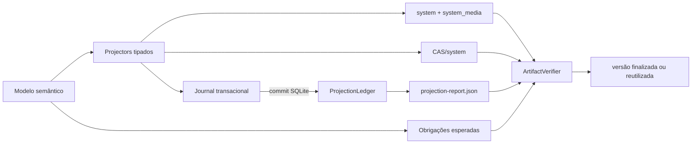

# Parte 1B.2: Evidência De Projeção E Verificação Integral Dos Artefatos

## Objetivo

Concluir o contrato verificável do `knowledge-builder` com evidências produzidas
pelas operações reais de projeção. Cada valor da fonte canônica possui
obrigações explícitas, cada operação confirma somente as obrigações que
materializa e todo artefato é validado pelo mesmo processo antes da publicação
local ou da reutilização.

Esta parte mantém a fronteira do compilador:

```text
data/knowledge
-> modelo semântico validado
-> obrigações de projeção
-> system + system_media + CAS/system
-> evidências observadas
-> verificação integral
-> versão finalizada
```

O formato atual dos thumbnails é JPEG. Os originais permanecem no CAS e os
previews permanecem em `system_media` com qualidade fixa `72`, maior lado de
`200 px`, sem ampliação, orientação aplicada e transparência composta sobre
branco.

## Pré-Requisito

[Parte 1B.1](./01b1-knowledge-builder-contract-consolidation.md) está
implementada com schemas JSON executáveis, normalização Unicode, AST
CommonMark, mídias estruturais, thumbnails JPEG, bancos por locale e o primeiro
contrato do `ProjectionLedger`.

## Resultado Esperado

Ao final:

- o ledger recebe eventos dos projectors e não conclui tokens por categoria;
- cada obrigação somente é confirmada depois da operação correspondente ter
  sucesso;
- transações SQLite somente publicam evidências depois do `commit`;
- campos, relações, documentos, referências de mídia, linhas e objetos CAS
  possuem identidades tipadas;
- o relatório deriva integralmente das obrigações e eventos observados;
- staging e versões existentes passam pelo mesmo verificador;
- tamanhos, hashes, digests, bancos, referências de mídia e contagens são
  recalculados a partir dos bytes produzidos;
- todas as fixtures declaradas são executadas por testes identificáveis;
- falhas de cobertura ou integridade impedem a finalização e a reutilização.

## Escopo

- substituir consumo em lote do ledger por eventos por operação;
- declarar obrigações exaustivas por campo e por destino materializado;
- rastrear separadamente referências estruturais e referências Markdown;
- derivar contagens de linhas de eventos confirmados;
- unificar a verificação de staging e de versões finalizadas;
- completar a verificação do `build-result.json` e do
  `projection-report.json`;
- verificar o conjunto localizado de mídias e seu CAS;
- tornar as fixtures positivas e negativas parte efetiva da suíte;
- adicionar testes de falha por omissão, duplicidade, divergência e adulteração;
- atualizar a documentação do `knowledge-builder` conforme o contrato final.

Apps, packages de runtime, consumo dos bancos e o ramo `user` permanecem fora
desta parte. Nenhuma migration, conversão de dados ou camada de compatibilidade
faz parte da implementação.

## Dependências

A implementação usa as crates presentes no `knowledge-builder`. Não há nova
dependência prevista.

Se uma dependência adicional se tornar indispensável, a implementação informa
o pacote, a versão, a finalidade e as validações bloqueadas e aguarda
autorização textual antes de alterar o Cargo Workspace.

## Arquitetura



Existem duas identidades complementares:

```text
SourceToken
  elemento lógico da fonte canônica

ProjectionObligation
  materialização exigida para aquele elemento em um destino específico
```

Um mesmo `SourceToken` pode originar mais de uma obrigação. Um alias, por
exemplo, pode alimentar o JSON do item e também uma linha pesquisável. Cada uso
possui uma obrigação própria e precisa ser confirmado pelo projector
responsável.

## 1. Modelo De Evidência

### Tokens Da Fonte

Definir tipos Rust fechados para identificar:

- entidade;
- campo estrutural escalar;
- folha de objeto aninhado;
- item de array por posição;
- relação por papel e identidade relacionada;
- valor localizado por campo, locale e posição;
- documento localizado;
- seção localizada;
- referência estrutural de mídia por papel e ordem;
- referência Markdown por seção e ordem de ocorrência;
- ativo de mídia por `media_key` e locale;
- objeto CAS por hash e locale;
- metadado de build por banco e locale.

A representação textual existe para diagnóstico e digest. Os projectors usam
construtores tipados e não montam caminhos livres em strings.

### Obrigações De Projeção

Modelar o destino concreto da materialização, por exemplo:

```rust
enum ProjectionTarget {
    TableRow {
        database: DatabaseKind,
        table: SystemTable,
        row: RowIdentity,
    },
    TableColumn {
        database: DatabaseKind,
        table: SystemTable,
        row: RowIdentity,
        column: ColumnIdentity,
    },
    SearchTerm {
        entity: EntityIdentity,
        provenance: SearchProvenance,
    },
    CompiledDocument {
        entity: EntityIdentity,
        locale: KnowledgeLocale,
    },
    CompiledSection {
        entity: EntityIdentity,
        locale: KnowledgeLocale,
        section_key: SectionKey,
    },
    SystemMediaAsset {
        locale: KnowledgeLocale,
        media_key: MediaKey,
    },
    CasObject {
        locale: KnowledgeLocale,
        content_hash: Sha256,
    },
    BuildMetadata {
        database: DatabaseKind,
        locale: KnowledgeLocale,
    },
}
```

Os nomes são orientativos. A implementação pode separar os enums por banco ou
domínio quando isso mantiver os tipos menores e mais claros.

Cada `ProjectionObligation` contém:

- o `SourceToken` que justifica a projeção;
- o `ProjectionTarget` esperado;
- a identidade do locale quando aplicável;
- a classificação usada pelo relatório: entidade, relação, conteúdo
  localizado, mídia, CAS ou metadado.

### Disposição Exaustiva

Construir as obrigações por correspondência exaustiva sobre cada variante de
`CanonicalEntity` e por desestruturação explícita dos structs, sem `..`.

Objetos aninhados, como `RegulatoryIdentifiers`, `Nomenclature`, doses,
taxonomias, seções e mídia, também usam funções exaustivas próprias. A criação
de obrigações não usa serialização genérica para `serde_json::Value`, lista de
campos superiores nem destino padrão.

Com esse contrato:

- adicionar um campo ao modelo exige classificá-lo;
- adicionar uma folha a um objeto aninhado exige classificá-la;
- cada campo declara um ou mais destinos concretos;
- campos de autoria declaram a etapa de compilação que os consome;
- não existe fallback genérico para `System` ou `SystemMedia`.

## 2. Journal Transacional E Projectors

### Fronteira De Registro

Cada projector recebe um journal associado ao locale. O journal acumula:

- obrigações concluídas;
- eventos de linhas inseridas;
- identidades de relações resolvidas;
- fragmentos localizados materializados;
- referências de mídia materializadas;
- diagnósticos da operação em andamento.

O `ProjectionLedger` não oferece uma operação para consumir todas as obrigações
de um destino. APIs equivalentes a `consume_destination` não pertencem ao
contrato final.

### Inserts SQLite

Cada insert segue a sequência:

```text
preparar valores
-> validar serializações necessárias
-> executar o insert
-> exigir quantidade de linhas esperada
-> registrar obrigações e RowEvent no journal
```

O journal da transação somente é incorporado ao ledger depois de
`Transaction::commit()` concluir. Em caso de erro ou rollback, nenhum evento
daquela transação aparece como consumido.

Um insert pode cumprir várias obrigações. O lote é explícito e contém somente
os campos efetivamente materializados naquela linha. Inserts de relações
registram a obrigação da relação somente depois da linha N:N correspondente
existir.

### Conteúdo Compilado

A preparação de `content_json` registra evidência em duas etapas:

1. a serialização AST válida produz o documento e suas seções;
2. o insert da entidade confirma que o documento compilado foi persistido.

O documento e suas seções só aparecem como concluídos depois do insert da linha
que contém `content_json` e do commit da transação.

### Busca Derivada

Cada termo de busca possui obrigação por proveniência. A obrigação somente é
concluída depois do insert correspondente em `entity_search_terms`.

Uma fonte usada tanto no item principal quanto na busca possui obrigações
distintas. Dessa forma, a ausência do termo pesquisável não é mascarada pela
persistência do mesmo valor em outra coluna.

### Metadados

Cada banco possui uma obrigação própria para `knowledge_build_metadata` e,
quando aplicável, `knowledge_release_metadata`. A evidência é confirmada depois
do insert e da verificação de cardinalidade.

## 3. Evidências De Mídia

### Referência Estrutural

Cada `cover` e item de `gallery` gera um token com:

- tipo e ID da entidade;
- papel `cover` ou `gallery`;
- `sort_order`;
- `media_key`;
- locale ao qual a referência se aplica.

A obrigação de referência estrutural aponta para
`system.entity_media_references` e é concluída depois do insert correspondente.
O ativo em `system_media` e o objeto CAS possuem obrigações independentes.

### Referência Markdown

O resultado da compilação AST conserva uma lista ordenada de referências por
documento:

```rust
struct CompiledMediaReference {
    section_key: String,
    occurrence: usize,
    media_key: String,
}
```

A estrutura pode usar tipos específicos para as identidades, mas preserva
seção e ocorrência. A deduplicação de `MediaAsset` não elimina as referências
individuais do documento.

Cada imagem Markdown gera:

- uma obrigação de incorporação no `compiledMarkdown` daquela seção;
- uma obrigação do ativo localizado em `system_media`;
- uma obrigação do objeto por hash no CAS, deduplicada por locale e hash.

Uma mídia compartilhada entre capa, galeria e Markdown possui um ativo e um
objeto CAS, mas conserva todas as obrigações de referência.

### Persistência De Ativos

Depois do insert em `system_media.media_assets`, registrar:

- `media_key`;
- hash do original;
- MIME e dimensões do original;
- bytes, MIME e dimensões do thumbnail JPEG;
- evento da linha inserida.

Depois da escrita do objeto CAS, confirmar a obrigação somente após reler os
bytes e comparar seu SHA-256 com o nome do objeto.

## 4. Relatório De Projeção

`projection-report.json` representa uma build concluída. Falhas de ledger são
diagnósticos da compilação e impedem a criação do relatório final.

Para cada locale, o relatório contém pelo menos:

```json
{
  "expectedObligationCount": 0,
  "completedObligationCount": 0,
  "rowEventCount": 0,
  "resolvedRelationCount": 0,
  "consumedLocalizedFragments": 0,
  "evidenceDigestSha256": "<sha256>"
}
```

As contagens e o digest vêm do `CompletedLedger`. O relatório não preenche
listas vazias como substituição da auditoria.

O objeto raiz também declara `sourceDigestSha256`, `buildVersion` e as versões
dos schemas `system` e `system_media`, permitindo vinculá-lo ao
`build-result.json` e aos metadados SQLite.

`rowsByTable` deriva dos `RowEvent` confirmados. Para cada banco e locale, o
builder executa `COUNT(*)` nas tabelas declaradas e exige igualdade com os
eventos. Tabelas projetáveis conhecidas com zero linhas também entram na
conferência, evitando que a ausência de um evento retire a tabela da auditoria.

O schema executável do relatório exige:

- exatamente os seis locales;
- hashes em hexadecimal minúsculo;
- tabelas e categorias conhecidas;
- objetos fechados e ausência de campos desconhecidos.

O validador semântico exige igualdade entre obrigações esperadas e concluídas e
recalcula o digest das obrigações esperadas a partir do modelo validado. Essa
comparação não depende de uma extensão não padronizada do JSON Schema.

Quando a forma serializada mudar, atualizar `schemaVersion`, os tipos Rust e o
JSON Schema em conjunto. O repositório mantém somente o contrato atual.

## 5. Verificador Único De Artefatos

Implementar uma única fronteira, por exemplo `ArtifactVerifier`, que recebe o
modelo validado, as obrigações esperadas, o contexto, a raiz da versão e a raiz
do CAS. Ela valida:

- o diretório de staging antes da finalização;
- uma versão em `versions/<build_version>` antes da reutilização.

As duas chamadas usam o mesmo núcleo de regras. A diferença entre staging e
versão finalizada limita-se à resolução física do diretório do CAS.

### Estrutura Física

Verificar:

- exatamente seis diretórios de locale;
- exatamente doze bancos com nomes e caminhos canônicos;
- `build-result.json`, `projection-report.json` e `checksums.sha256` nos locais
  definidos;
- ausência de arquivos, diretórios, symlinks e tipos especiais adicionais
  dentro da versão;
- caminhos relativos normalizados e confinados às raízes esperadas;
- objetos CAS referenciados na disposição
  `<2-hex>/<2-hex>/<hash>.bin`.

O CAS compartilhado pode conter objetos de outras versões. O verificador exige
integridade e cobertura exata apenas do conjunto referenciado pela versão em
avaliação.

### Manifest E Arquivos

Validar e recalcular:

- schema fechado de `build-result.json`;
- `sizeBytes` de cada banco;
- SHA-256 de cada banco e do relatório;
- fingerprint de cada schema SQLite;
- `objectCount` e `setDigestSha256` do conjunto CAS global;
- `casSetDigestSha256` de cada locale;
- cobertura exata de `checksums.sha256`;
- relação entre cada entrada de checksum e seu arquivo real.

O verificador não aceita campos apenas porque possuem formato válido. Todo valor
derivável dos artefatos é recalculado e comparado.

### Bancos

Para cada banco, verificar:

- `PRAGMA application_id`;
- `PRAGMA user_version`;
- `PRAGMA integrity_check`;
- `PRAGMA foreign_key_check`;
- cardinalidade e conteúdo de `knowledge_build_metadata`;
- cardinalidade e conteúdo de `knowledge_release_metadata`;
- locale, build, release, builder e source digest;
- igualdade dos fingerprints entre bancos do mesmo tipo.

Para cada locale, abrir o par `system` e `system_media` conjuntamente e
verificar:

- cada referência estrutural resolve para um `media_assets.media_key`;
- cada URI `knowledge-media://asset/<media-key>` encontrada no
  `compiledMarkdown` resolve para `media_assets`;
- não existem ativos localizados sem referência estrutural ou Markdown;
- cada entidade proprietária de mídia existe na tabela de seu tipo;
- cada `content_hash` resolve para um objeto CAS íntegro;
- a união dos hashes do locale produz o `casSetDigestSha256` declarado;
- thumbnails são JPEG válidos, possuem as dimensões declaradas e respeitam o
  limite de `200 px`.

Para conferir referências editoriais, o verificador desserializa
`content_json` pelo tipo fechado e seu schema, interpreta cada
`compiledMarkdown` pelo AST CommonMark e coleta somente nós `Image`. Cada URI
deve usar exatamente `knowledge-media://asset/<media-key-percent-encoded>`, ser
decodificada de forma canônica e resolver para o mesmo `media_key` em
`system_media`. Scanner textual ou expressão regular não substitui essa etapa.

Reutilização e staging aplicam todas essas regras.

### Relatório

Validar o relatório pelo schema e comparar com os bancos:

- `rowsByTable` contra `COUNT(*)`;
- entidades projetadas contra as linhas proprietárias;
- relações resolvidas contra os eventos e tabelas de relação;
- ativos e hashes contra `system_media` e CAS;
- source digest e identidade de build contra `build-result.json` e metadados
  SQLite;
- contagens esperadas e concluídas contra as obrigações regeneradas a partir do
  modelo validado;
- `evidenceDigestSha256` contra a representação canônica dessas obrigações.

O relatório e o manifest formam um contrato interno consistente. Assinatura e
confiança de publicação pertencem às partes do Hub responsáveis por releases.

## 6. Finalização Atômica

O fluxo permanece:

```text
projetar em staging
-> concluir todos os ledgers
-> escrever relatório e manifest
-> executar ArtifactVerifier integral
-> incorporar objetos CAS imutáveis
-> renomear a versão de staging
-> retornar sucesso
```

O rename de `versions/<build_version>` é a última operação de publicação. Não
há verificação inédita depois dele.

Uma versão existente segue:

```text
ler e validar manifest
-> comparar fonte e contexto solicitados
-> executar o mesmo ArtifactVerifier integral
-> reutilizar somente em caso de sucesso
```

## 7. Fixtures Executáveis

Cada diretório de fixture representa uma entrada consumida por teste. Arquivos
de descrição podem complementar a fixture, mas não substituem a execução do
caso.

Organizar casos autocontidos para:

- fonte mínima válida;
- Markdown válido e semanticamente equivalente;
- mídia estrutural e Markdown compartilhada;
- PNG, JPEG orientado, GIF e WebP;
- schema inválido;
- Markdown inválido por categoria de nó;
- caminho, symlink, extensão, assinatura, tamanho e dimensões de mídia
  inválidos;
- seções ausentes, repetidas, adicionais e fora de ordem;
- versão e artefatos adulterados.

Criar um registro de fixtures usado pelos testes. Um teste de cobertura percorre
os diretórios de casos e falha quando:

- existe fixture sem caso registrado;
- existe caso registrado sem fixture;
- uma fixture declarada não executa nenhuma asserção de sucesso ou falha.

`data/knowledge/` permanece teste de integração mutável. Contratos específicos
usam fixtures pequenas e não dependem de IDs, quantidades ou conteúdo do
catálogo canônico.

## 8. Matriz De Testes

### Ledger

Cobrir:

- obrigação concluída exatamente uma vez;
- obrigação ausente;
- obrigação inesperada;
- obrigação duplicada;
- novo campo sem disposição;
- campo com múltiplos destinos;
- rollback sem publicação de evidência;
- insert com quantidade de linhas divergente;
- omissão de evento depois de um insert bem-sucedido;
- termo de busca omitido enquanto o valor principal existe;
- referência de mídia omitida enquanto o ativo existe.

Usar um harness disponível somente em testes para suprimir, duplicar ou
substituir eventos. A implementação de produção não recebe flags capazes de
ignorar o ledger.

### Markdown E Mídia

Cobrir:

- allowlist AST completa;
- um caso negativo por categoria proibida;
- equivalência de representação e digest;
- links com título, escapes e parênteses;
- código inline e cercado sem referência de mídia;
- referências repetidas e compartilhadas;
- ordem das ocorrências por seção;
- orientação EXIF;
- thumbnail JPEG determinístico;
- composição de transparência sobre branco;
- ausência de ampliação;
- limites de bytes, dimensões e pixels;
- deduplicação por hash e disposição fragmentada do CAS.

### Schemas

Cobrir:

- compilação offline de todos os schemas;
- fixture válida por tipo de entidade;
- campo superior e aninhado desconhecido;
- campo obrigatório ausente;
- locale ausente ou adicional;
- tipo, enum, limite e formato inválidos;
- schema fechado do conteúdo, relatório e resultado.

### Artefatos

Depois de gerar uma versão válida, produzir uma alteração isolada por caso e
exigir recusa na reutilização:

- `sizeBytes` divergente;
- checksum divergente;
- `casSetDigestSha256` de locale divergente;
- digest ou contagem global do CAS divergente;
- objeto CAS ausente ou alterado;
- linha de mídia ausente ou adicional;
- referência estrutural sem ativo;
- URI de mídia compilada sem ativo;
- thumbnail inválido ou com dimensões divergentes;
- metadado SQLite divergente;
- fingerprint divergente;
- contagem do relatório divergente;
- relatório com campo adicional;
- arquivo adicional, ausente ou symlink;
- locale ausente;
- versão incompleta.

Cobrir também:

- duas builds idênticas com os mesmos bancos, relatórios e checksums;
- `validate` e `build` executados fora da raiz do workspace;
- build integral dos seis locales a partir de `data/knowledge/`;
- ausência de leitura de conteúdo em `apps/` e `packages/`;
- ausência de abertura ou alteração de bancos e CAS do ramo `user`.

## Sequência De Implementação

1. Definir `SourceToken`, `ProjectionTarget`, `ProjectionObligation` e
   `RowEvent`.
2. Substituir a descoberta genérica de disposições por mapeamento exaustivo dos
   tipos canônicos.
3. Implementar o journal transacional e os testes unitários do ledger.
4. Integrar o journal aos projectors de metadados, taxonomias, entidades,
   relações, protocolos, busca e conteúdo.
5. Preservar ocorrências de mídia do AST e integrá-las ao ledger.
6. Integrar `system_media` e a escrita verificada do CAS ao ledger.
7. Derivar contagens e relatório exclusivamente dos eventos concluídos.
8. Atualizar o tipo Rust e o schema executável do relatório.
9. Implementar o `ArtifactVerifier` único.
10. Aplicar o verificador ao staging e à reutilização.
11. Transformar todas as fixtures em casos executáveis e adicionar o teste de
    cobertura do registro.
12. Implementar a matriz de falhas do ledger e dos artefatos.
13. Atualizar os READMEs do builder e da fonte canônica.
14. Executar testes específicos do crate e o gate geral do workspace.

Cada etapa mantém os testes diretamente relacionados em estado aprovado antes
do avanço para a seguinte.

## Entregáveis

- modelo tipado de obrigações de projeção;
- disposição exaustiva dos campos canônicos;
- journal transacional integrado a todos os projectors;
- referências Markdown preservadas por ocorrência;
- ledger sem consumo em lote por destino;
- relatório derivado de eventos observados;
- schema executável atualizado do relatório;
- verificador único de staging e reutilização;
- verificação de tamanhos, digests por locale e referências entre bancos e CAS;
- fixtures positivas e negativas efetivamente executadas;
- testes de injeção de falhas do ledger;
- testes de adulteração dos artefatos;
- documentação atualizada.

## Critérios De Aceite

- Nenhum método conclui todas as obrigações de um destino por convenção.
- Cada projector registra as obrigações que materializa no ponto da operação.
- Um rollback não deixa evidências concluídas.
- Um campo novo sem disposição explícita impede a compilação ou a validação.
- Um valor usado em múltiplas projeções possui uma obrigação por uso.
- Omissão, duplicidade e evento inesperado invalidam a build.
- Referências estruturais e Markdown permanecem individualmente auditáveis.
- `rowsByTable` deriva dos inserts confirmados e coincide com os bancos.
- O relatório deriva somente do `CompletedLedger`.
- `sizeBytes`, checksums, fingerprints e todos os digests são recalculados.
- O digest CAS de cada locale corresponde exatamente ao seu `system_media`.
- Todas as referências de mídia em `system` resolvem para `system_media` e CAS.
- Thumbnails armazenados são JPEG válidos e correspondem aos metadados.
- Staging e reutilização executam o mesmo núcleo de verificação.
- Uma versão incompleta ou com qualquer campo derivado divergente é recusada.
- Toda fixture possui teste registrado e toda categoria do plano possui caso
  positivo ou negativo correspondente.
- A build integral gera os seis pares de bancos e o CAS esperado.
- O crate passa em formatação, compilação, Clippy e testes.
- O workspace passa pelo gate geral de validação.
- Apps, runtime e ramo `user` permanecem inalterados.

## Próxima Parte

Após cumprir todos os critérios, seguir para a
[Parte 1B.3: evidência explícita e equivalência semântica](./01b3-explicit-evidence-and-semantic-equivalence.md).
