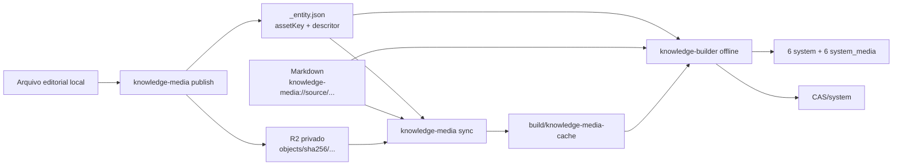

# Parte 1B.8.11: Mídias Canônicas No Cloudflare R2

## Objetivo

Armazenar no Cloudflare R2 os bytes originais das mídias públicas de
conhecimento, manter no Git somente suas identidades lógicas e descritores de
integridade e fazer o `knowledge-builder` compilar os artefatos a partir de um
cache local verificado.

Esta parte estabelece três identidades distintas:

```text
assetKey       identidade editorial estável dentro da entidade
SHA-256        identidade física e imutável dos bytes
mediaKey       identidade compilada usada por system e system_media
```

O comando operacional de build sincroniza os objetos necessários e, em seguida,
executa o compilador. O acesso ao R2 pertence a `tools/knowledge-media`; o
`knowledge-builder` permanece offline.

## Resultado Esperado

Ao concluir esta parte:

- `data/knowledge` contém JSON, Markdown e descritores de mídia, sem bytes
  editoriais;
- cada mídia declarada possui `assetKey`, SHA-256, tipo MIME e tamanho
  esperados;
- Markdown e campos estruturais referenciam `assetKey`, não URL, caminho local
  ou hash diretamente;
- o bucket R2 guarda os bytes em chaves derivadas exclusivamente do SHA-256;
- `tools/knowledge-media` publica e sincroniza objetos usando a API S3 do R2;
- o cache local contém somente objetos cujo tamanho e SHA-256 foram verificados;
- o `knowledge-builder` recebe o cache explicitamente e nunca acessa a rede;
- `mediaKey` continua sendo a fronteira pública entre `system` e
  `system_media`;
- `system_media` e `CAS/system` conservam seus contratos de runtime;
- nenhuma credencial, URL de provider ou nome de bucket entra nos dados
  canônicos, bancos ou artefatos compilados;
- a Parte 1C começa com os artefatos completos já produzidos por esse fluxo.

## Pré-Requisitos

- A
  [Parte 1B.8.10](./10-knowledge-domain-layout.md)
  está concluída.
- A
  [pré-fase transversal do `workspace-validator`](../../workspace-validator.md)
  está concluída, e `pnpm validate` executa o gate geral definido em
  `.validation/config.json`.
- `tools/knowledge-builder` gera e verifica os seis pares `system` e
  `system_media` e o `CAS/system` compartilhado.
- O usuário confirma a criação do bucket e fornece as credenciais somente no
  checkpoint de integração real com o R2.
- Dependências novas seguem o checkpoint de autorização definido em
  `AGENTS.md` e na skill `$validate-workspace`.

## Decisões De Arquitetura

### Uma Fonte Lógica, Dois Planos Físicos

A fonte canônica de conhecimento é composta por duas partes complementares:

```text
Git
  estrutura, relações, conteúdo, assetKey e descritores de integridade

Cloudflare R2
  bytes imutáveis identificados pelo SHA-256 declarado no Git
```

Nenhuma parte substitui a outra. Um objeto presente apenas no R2 não integra o
conhecimento. Uma declaração presente apenas no Git não é compilável até que o
objeto correspondente seja obtido e validado.

### R2 De Autoria E R2 De Distribuição

O bucket desta parte é uma infraestrutura de autoria e build:

```text
veterinary-knowledge-source
  objetos originais usados pelo knowledge-builder
```

O nome efetivo é configurável e não aparece no código de domínio. O bucket que
recebe bancos, pacotes, manifests e CAS publicados é outra fronteira:

```text
veterinary-system-artifacts
  artefatos produzidos e distribuídos pelo hub-server
```

Esta parte implementa somente o primeiro papel. A habilitação do R2 como source
de distribuição de releases permanece em fase própria. Os apps não acessam o
bucket de autoria.

### Fronteira De Rede

```text
tools/knowledge-media     rede, autenticação, upload e download
tools/knowledge-builder   parsing, validação, compilação e verificação offline
```

`knowledge-media` pode depender da API pública e pura de inspeção de mídia do
`knowledge-builder`. A dependência inversa é proibida. Dependências de S3,
Cloudflare ou runtime assíncrono não entram no crate do builder.

### Sem Provider Nos Dados

Os seguintes valores não pertencem a `_entity.json`, Markdown, inventário de
domínio ou bancos SQLite:

- endpoint do R2;
- account ID;
- nome de bucket;
- access key;
- secret key;
- URL pública ou assinada;
- chave física completa do objeto remoto;
- caminho absoluto de cache.

O algoritmo de endereço físico pertence à ferramenta de sincronização. O dado
canônico conserva somente a descrição verificável do conteúdo.

## Arquitetura Final



O fluxo operacional da raiz é:

```text
pnpm knowledge:build
  -> sincronizar os hashes declarados que não estão válidos no cache
  -> executar o knowledge-builder sobre data/knowledge + cache
  -> verificar e publicar build/knowledge-artifacts atomicamente
```

Também existe um comando offline explícito para ambientes cujo cache já está
hidratado.

## Contrato Canônico De Mídia

### Estrutura Em `_entity.json`

Cada entidade que possui mídia declara um objeto `media`:

```json
{
  "media": {
    "assets": {
      "cover": {
        "contentHashSha256": "0123456789abcdef0123456789abcdef0123456789abcdef0123456789abcdef",
        "contentType": "image/jpeg",
        "sizeBytes": 245821
      },
      "anatomy.lateral": {
        "contentHashSha256": "abcdef0123456789abcdef0123456789abcdef0123456789abcdef0123456789",
        "contentType": "image/png",
        "sizeBytes": 481022
      }
    },
    "cover": "cover",
    "gallery": ["anatomy.lateral"]
  }
}
```

`assets` é o registro de objetos pertencentes à entidade. `cover`, `gallery` e
as referências Markdown selecionam entradas desse registro.

### `assetKey`

`assetKey`:

- é local à entidade;
- usa de 1 a 160 caracteres;
- segue `^[a-z0-9]+(?:[._-][a-z0-9]+)*$`;
- não contém `/`, espaço, `%`, `:`, query ou fragmento;
- permanece estável quando os bytes mudam;
- descreve o papel editorial, como `cover`, `anatomy.lateral` ou
  `administration.diagram`;
- não incorpora nome de arquivo, extensão, locale, provider ou hash.

Duas entidades podem usar o mesmo `assetKey`. A identidade completa continua
escopada pelo tipo e ID da entidade.

### Descritor Físico

Cada valor de `assets` exige exatamente:

```text
contentHashSha256   64 caracteres hexadecimais minúsculos
contentType         tipo MIME permitido e confirmado pelos bytes
sizeBytes           inteiro entre 1 e 26.214.400
```

Os tipos iniciais aceitos são:

```text
image/jpeg
image/png
image/gif
image/webp
```

Extensão, nome original, URL e dimensões não fazem parte do descritor. O builder
detecta formato e dimensões pelos bytes, compara o tipo detectado com
`contentType` e mantém largura, altura e thumbnail no contrato compilado.

### Integridade Das Referências

A validação semântica exige:

- `cover` apontando para uma chave existente em `assets`;
- cada item de `gallery` apontando para uma chave existente;
- `gallery` sem duplicatas;
- cada URI de imagem Markdown apontando para uma chave existente;
- toda entrada de `assets` referenciada ao menos uma vez por `cover`, `gallery`
  ou Markdown de algum locale;
- um mesmo `assetKey` resolvendo para um único descritor na entidade;
- os bytes do cache correspondendo a `contentHashSha256`, `sizeBytes` e
  `contentType` antes da compilação.

Mídias usadas apenas por determinado locale entram somente no
`system_media.db` desse locale. `cover` e `gallery` são estruturais e integram os
seis locales da entidade.

## Contrato Markdown

Uma imagem de autoria usa:

```markdown

```

O parser aceita `knowledge-media://source/<assetKey>` exclusivamente como
destino de nó de imagem. Ele recusa:

- URL HTTP ou HTTPS;
- caminho relativo ou absoluto;
- URI compilada `knowledge-media://asset/...` na fonte;
- chave desconhecida;
- autoridade diferente de `source`;
- query, fragmento, credenciais, porta ou segmentos adicionais;
- codificação percentual e caracteres fora do contrato de `assetKey`.

Após resolver a entidade proprietária, o builder reescreve a URI para:

```text
knowledge-media://asset/<mediaKey codificada>
```

Texto alternativo e título continuam localizados no documento Markdown.

## Identidade Compilada

O builder deriva:

```text
mediaKey = <entity_type>/<entity_id>/media/<assetKey>
```

Exemplo:

```text
product/550e8400-e29b-41d4-a716-446655440000/media/cover
```

As propriedades são:

- substituir os bytes altera `contentHashSha256`, mas preserva `mediaKey`;
- renomear `assetKey` altera `mediaKey` e todas as referências editoriais
  correspondentes;
- duas `mediaKey` podem apontar para o mesmo hash;
- a deduplicação física acontece pelo SHA-256 no CAS;
- `system.entity_media_references` conserva `mediaKey` e papel;
- `system_media.media_assets` resolve `mediaKey -> contentHash` e metadados;
- o app não conhece `assetKey`, bucket ou chave R2.

## Contrato Do Bucket R2

### Configuração

O bucket usa:

- acesso privado pela API S3;
- storage class `Standard`;
- região S3 `auto`;
- token limitado ao bucket;
- HTTPS obrigatório;
- nenhuma lifecycle rule que remova `objects/sha256/`;
- acesso público `r2.dev` desativado;
- ausência de sobrescrita deliberada e de exclusão automática.

O nome recomendado é `veterinary-knowledge-source`, mas o código lê o nome da
configuração e não o fixa como contrato.

O provisionamento é explícito e feito pelo usuário no checkpoint externo:

1. criar o bucket privado;
2. manter `r2.dev` e custom domains desativados;
3. confirmar que nenhuma lifecycle rule expira `objects/sha256/`;
4. criar um token de leitura e escrita limitado ao bucket para autoria;
5. criar um token somente de leitura limitado ao bucket para CI e jobs;
6. disponibilizar as credenciais apenas no ambiente autorizado;
7. executar o smoke test antes de aceitar a integração real.

O código desta parte não cria, remove ou reconfigura buckets e tokens.

### Chave Dos Objetos

Cada objeto usa:

```text
objects/sha256/<hash[0..2]>/<hash[2..4]>/<hash>.bin
```

Exemplo:

```text
objects/sha256/01/23/0123456789abcdef...cdef.bin
```

A chave é derivada somente após validar o hash. Nenhum valor fornecido pelo
usuário é concatenado como caminho remoto.

### Metadados Do Objeto

O upload define:

```text
Content-Type          valor detectado e declarado
Content-Length        tamanho verificado
x-amz-meta-sha256     SHA-256 hexadecimal canônico
Cache-Control         private, max-age=31536000, immutable
```

O ETag não é usado como prova de integridade. O SHA-256 calculado localmente e
declarado no Git é a autoridade.

### Imutabilidade Operacional

`publish` executa `HEAD` antes do upload:

- objeto ausente: envia os bytes para a chave canônica;
- objeto existente com tamanho e metadados coerentes: reutiliza o objeto;
- objeto existente com metadados divergentes: interrompe sem sobrescrever;
- falha de upload: não altera `_entity.json`;
- upload concluído e falha na atualização local: mantém um objeto remoto órfão,
  que não entra em builds porque não existe declaração canônica.

Objetos deixam de participar de builds quando não são referenciados pelos dados.
A remoção física e a coleta de objetos órfãos não pertencem a esta parte, pois
releases publicadas podem continuar referenciando seus hashes.

## Configuração E Credenciais

A ferramenta lê variáveis dedicadas:

```text
KNOWLEDGE_MEDIA_R2_ACCOUNT_ID
KNOWLEDGE_MEDIA_R2_BUCKET
KNOWLEDGE_MEDIA_R2_ACCESS_KEY_ID
KNOWLEDGE_MEDIA_R2_SECRET_ACCESS_KEY
KNOWLEDGE_MEDIA_R2_ENDPOINT
```

`KNOWLEDGE_MEDIA_R2_ENDPOINT` é opcional e, quando ausente, deriva
`https://<account-id>.r2.cloudflarestorage.com`. A configuração recusa endpoint
sem HTTPS fora dos testes.

O repositório mantém `.env.example` somente com nomes e valores ilustrativos.
Nenhum comando registra segredos, cabeçalhos de autorização ou URLs assinadas.

Permissões operacionais:

- autoria local usa token `Object Read & Write` limitado ao bucket;
- CI e jobs de build usam token `Object Read only` limitado ao bucket;
- apps e packages de runtime não recebem token;
- o `knowledge-builder` não recebe essas variáveis em sua API nem em seus
  argumentos.

## Cache Local

O cache padrão é:

```text
build/knowledge-media-cache/
└── sha256/
    └── <2-hex>/
        └── <2-hex>/
            └── <hash>.bin
```

`/build` permanece ignorado pelo Git. O caminho também pode ser informado por
`--cache`, sem entrar no digest da fonte.

### Escrita Segura

Para cada hash, `sync`:

1. valida o formato do descritor;
2. verifica o arquivo já existente no cache, inclusive SHA-256;
3. remove apenas o temporário ou objeto de cache corrompido sob a raiz
   controlada;
4. executa `GET` somente quando o objeto válido não está presente;
5. grava em arquivo temporário exclusivo dentro da mesma partição;
6. limita a leitura a 25 MiB e confere `Content-Length` quando disponível;
7. calcula SHA-256 durante a escrita;
8. compara tamanho, hash e tipo MIME;
9. sincroniza o arquivo e o publica no cache por renomeação atômica;
10. informa todos os hashes ausentes ou inválidos em erro estruturado.

O sincronizador não lista o bucket para descobrir mídias. Ele calcula o conjunto
exato a partir de `data/knowledge` e pede somente as chaves esperadas.

Objetos extras podem permanecer no cache e não entram no build. Um comando de
limpeza não integra esta parte.

### Concorrência E Retentativas

`sync` usa concorrência limitada e configurável, com padrão conservador de
quatro downloads. Retentativas se aplicam somente a timeout, `408`, `429` e
erros `5xx`, com backoff exponencial limitado e jitter. Erros de autenticação,
permissão, chave ausente e contrato inválido encerram a execução sem loop de
retentativa.

## `tools/knowledge-media`

Criar um crate binário próprio no Cargo workspace:

```text
tools/knowledge-media/
├── Cargo.toml
├── README.md
└── src/
    ├── main.rs
    ├── cli.rs
    ├── config.rs
    ├── error.rs
    ├── object_key.rs
    ├── publish.rs
    ├── sync.rs
    ├── cache.rs
    └── r2.rs
```

Usar `aws-sdk-s3`, conforme a integração S3 oficial do Cloudflare R2. Manter o
cliente atrás de uma fronteira estreita testável. Não criar um framework
genérico de providers nesta parte.

### `publish`

```text
knowledge-media publish \
  --source data/knowledge \
  --entity catalog/products/editorial/<diretório>/_entity.json \
  --asset-key cover \
  --file <arquivo-local>
```

Responsabilidades:

1. resolver o `_entity.json` estritamente dentro de `--source`;
2. recusar symlink, arquivo vazio, arquivo acima do limite e formato inválido;
3. reutilizar a inspeção pura de mídia do builder;
4. calcular hash, tipo MIME, tamanho e dimensões;
5. enviar ou confirmar o objeto imutável no R2;
6. adicionar `media.assets[assetKey]` somente depois da confirmação remota;
7. gravar o JSON de forma determinística, com tabulação e newline final, usando
   arquivo temporário e renomeação atômica;
8. não alterar `cover`, `gallery` ou Markdown implicitamente;
9. recusar uma chave já declarada com outro hash, salvo uso explícito de
   `--replace`;
10. preservar o objeto anterior no R2 quando `--replace` atualiza a declaração.

O comando não aceita bucket, endpoint ou credenciais em `_entity.json`. Opções
de CLI podem substituir apenas configurações operacionais não secretas para uma
execução explícita.

O arquivo passado por `--file` é uma entrada transitória de autoria. Depois da
confirmação do upload e do descritor, sua permanência no computador não integra
o contrato. O R2 conserva os bytes canônicos e o cache pode ser reconstruído a
qualquer momento.

O fluxo editorial completo é:

```text
publish do asset
-> referência por cover, gallery ou Markdown
-> atualização deliberada de inventory.json
-> knowledge:media:sync
-> knowledge:validate
-> knowledge:build:offline
```

`publish` não atualiza o inventário nem oculta o estado intermediário de um asset
ainda sem referência.

### `sync`

```text
knowledge-media sync \
  --source data/knowledge \
  --cache build/knowledge-media-cache
```

Responsabilidades:

1. carregar e validar os descritores canônicos pela API do builder;
2. deduplicar o conjunto por SHA-256;
3. concluir com sucesso e sem carregar configuração R2 quando o conjunto estiver
   vazio;
4. validar o cache existente;
5. baixar somente objetos ausentes ou corrompidos;
6. comprovar todos os descritores antes de concluir;
7. produzir resumo determinístico de objetos reutilizados, baixados e falhos;
8. retornar código diferente de zero se qualquer objeto necessário não estiver
   disponível e íntegro.

### `verify-cache`

```text
knowledge-media verify-cache \
  --source data/knowledge \
  --cache build/knowledge-media-cache
```

Esse comando não usa rede. Ele valida o conjunto necessário e pode ser usado em
diagnóstico, CI e testes de build offline.

## Adaptação Do `knowledge-builder`

### API Pura Compartilhada

Expor uma API pública pequena para:

- desserializar e validar descritores de mídia;
- enumerar os assets exigidos pela fonte;
- derivar `mediaKey` por entidade e `assetKey`;
- derivar caminho content-addressed de cache;
- inspecionar bytes e detectar formato, tamanho e dimensões;
- comparar os bytes com o descritor;
- gerar o thumbnail JPEG determinístico já exigido pelo compilador.

A API não contém cliente S3, variáveis de ambiente, retry ou conceito de R2.

### CLI Offline

Os comandos recebem o cache explicitamente:

```text
knowledge-builder validate \
  --source data/knowledge \
  --media-cache build/knowledge-media-cache

knowledge-builder build \
  --source data/knowledge \
  --media-cache build/knowledge-media-cache \
  --output build/knowledge-artifacts \
  --context <build-context.json>
```

Se a fonte não declara mídia, o caminho pode estar vazio ou ausente. Havendo ao
menos uma declaração, todo objeto necessário precisa estar presente e válido.
Nenhum comando do builder tenta sincronizar ou usar fallback de rede.

### Modelo Interno

Substituir conceitos baseados em caminho editorial por:

```text
SourceMediaDescriptor
  asset_key
  content_hash_sha256
  content_type
  size_bytes

ResolvedMediaAsset
  entity_type
  entity_id
  asset_key
  media_key
  descriptor
  cache_path
  bytes verificados
  dimensões detectadas
  thumbnail determinístico
```

`MediaAsset` e consumidores deixam de exigir `source_path`, `relative_path` e
`internal_path`. A extensão do arquivo deixa de participar da validação, pois o
cache usa `.bin`; o codec detectado nos bytes precisa concordar com
`contentType`.

### Layout Da Fonte

Remover `_media` do contrato reservado de `data/knowledge`:

- `MEDIA_DIRECTORY_NAME`, `STRUCTURAL_MEDIA_PREFIX` e
  `MARKDOWN_MEDIA_PREFIX` deixam de existir;
- `_media` não é aceito como diretório técnico;
- referências de caminho local deixam de ser válidas;
- o validador de filesystem não procura arquivos editoriais de mídia;
- `_entity.json` e `_content` permanecem nas posições vigentes;
- testes comprovam a recusa de `_media`, caminhos e URLs no contrato canônico.

Não manter leitura dupla entre diretórios e descritores.

### Compilação E CAS

Depois de validar o cache, o pipeline conserva:

```text
assetKey + descritor
-> bytes verificados do cache
-> mediaKey estável
-> thumbnail JPEG
-> rows de entity_media_references
-> rows de system_media.media_assets
-> CAS/system/<2-hex>/<2-hex>/<hash>.bin
```

O DDL de `system` e `system_media`, seus application IDs e o layout do CAS não
mudam. Esta parte não cria migration.

## Digest, Inventário E Relatórios

### Digest Da Fonte

O modelo semântico usado pelo digest inclui, em ordem determinística:

- entidade proprietária;
- `assetKey`;
- `contentHashSha256`;
- `contentType`;
- `sizeBytes`;
- papel estrutural e ordem de `cover` ou `gallery`;
- referências por locale encontradas no AST Markdown.

Endpoint, bucket, credencial, chave R2 derivada, ETag, horário de upload, caminho
de cache e ordem de download não participam do digest.

Alterar bytes exige outro hash e altera o digest. Transferir os mesmos bytes
entre caches ou providers conserva o digest e os artefatos.

### Inventário Editorial

Atualizar `data/knowledge/inventory.json` para representar:

```json
{
  "media": {
    "declaredAssets": 0,
    "referencedAssets": 0,
    "uniqueContentHashes": 0
  }
}
```

O inventário mede declarações canônicas, não objetos encontrados por listagem no
R2. O script de auditoria permanece offline e atualiza os mesmos conceitos em
`audit-report.json`.

### Relatório De Projeção

Substituir `media.sourceFiles` por campos coerentes com o contrato externo:

```text
declaredAssets
verifiedSourceObjects
referencedMediaKeys
uniqueContentHashes
```

O relatório comprova que todo descritor usado foi resolvido por bytes válidos do
cache. Ele não expõe provider nem localização remota.

## Versionamento

Aplicar a matriz de versionamento de `tools/knowledge-builder/MAINTENANCE.md`:

- alterar `SOURCE_ENTITY_SCHEMA_VERSION` de `1` para `2`, pois o envelope
  observável de `media` muda;
- atualizar todos os `_entity.json`, schemas e fixtures para `schemaVersion: 2`;
- alterar `SOURCE_DIGEST_SCHEMA_VERSION` de `5` para `6`, pois identidade e
  conteúdo do digest de mídia mudam;
- alterar `PROJECTION_REPORT_SCHEMA_VERSION` de `5` para `6`, pois o bloco
  `media` do relatório muda;
- alterar o crate `knowledge-builder` de `0.5.0` para `0.6.0`;
- iniciar `knowledge-media` em `0.1.0`;
- alterar `inventory.json` e `audit-report.json` de `schemaVersion: 2` para
  `schemaVersion: 3`;
- manter `SYSTEM_SCHEMA_VERSION = 7`;
- manter `SYSTEM_MEDIA_SCHEMA_VERSION = 2`;
- manter `CONTENT_DOCUMENT_SCHEMA_VERSION` e `BUILD_RESULT_SCHEMA_VERSION`
  quando seus formatos permanecerem iguais.

Não preservar a leitura de versões substituídas da fonte.

## Scripts Do Workspace

Definir na raiz:

```text
knowledge:media:publish
  executa knowledge-media publish e encaminha argumentos

knowledge:media:sync
  hidrata build/knowledge-media-cache a partir do R2

knowledge:media:verify
  verifica o cache sem rede

knowledge:validate
  valida data/knowledge usando o cache local

knowledge:build:offline
  gera artefatos sem rede usando o cache local

knowledge:build
  executa knowledge:media:sync e knowledge:build:offline em sequência
```

O comando online é explícito no nível de orquestração. Nenhum hook de instalação,
build do frontend, `tauri dev` ou teste geral baixa mídias automaticamente.

## Segurança E Falhas

Implementar e testar:

- tokens com menor privilégio e limitados ao bucket;
- ausência de segredo em logs, erros, snapshots e argumentos exibidos;
- endpoint HTTPS e região `auto`;
- derivação de object key somente a partir de SHA-256 validado;
- recusa de symlinks e arquivos locais irregulares no upload;
- limite de 25 MiB antes e durante upload ou download;
- validação por bytes, sem confiar em extensão ou ETag;
- arquivos temporários exclusivos e publicação atômica do cache;
- cache confinado à raiz informada, sem travessia ou symlinks;
- timeout, retry limitado e concorrência limitada;
- falha fechada em `404`, `401`, `403`, hash divergente, tamanho divergente,
  MIME divergente ou objeto truncado;
- upload remoto concluído antes da mutação canônica local;
- ausência de exclusão remota automática;
- nenhum acesso ao R2 por app, `core-local`, `engine` ou Rails nesta parte.

## Testes

### `knowledge-builder`

- schema aceita descritor completo e recusa campo ausente ou adicional;
- `assetKey` aceita somente o alfabeto e o tamanho definidos;
- `cover`, `gallery` e Markdown exigem assets existentes;
- asset não referenciado é recusado;
- URI Markdown de source válida é compilada para URI de asset;
- caminho, URL remota e URI compilada na fonte são recusados;
- mesma chave com novos bytes preserva `mediaKey`;
- mudança de chave altera `mediaKey`;
- bytes iguais em chaves distintas compartilham objeto CAS;
- cache ausente, truncado ou adulterado é recusado;
- hash, tamanho ou tipo MIME divergente é recusado;
- codecs e limites vigentes continuam testados;
- mídia usada em um locale entra somente no par correspondente;
- `system_media` e CAS permanecem semanticamente equivalentes;
- digest independe do caminho de cache e da configuração R2;
- fixture integral cria seu cache em diretório temporário e não acessa a rede.

### `knowledge-media`

Usar uma fronteira de object store substituível por fake em memória nos testes:

- chave R2 derivada corretamente do hash;
- publish novo envia uma única vez e atualiza o descritor;
- objeto existente e coerente é reutilizado;
- objeto existente e divergente é recusado;
- substituição exige `--replace`;
- falha remota não altera `_entity.json`;
- falha de escrita local deixa apenas objeto remoto não referenciado;
- sync deduplica hashes compartilhados;
- cache válido evita download;
- cache inválido é refeito atomicamente;
- resposta maior que o limite é interrompida;
- retry ocorre somente para falhas transitórias;
- credenciais não aparecem nos erros;
- `verify-cache` não cria cliente de rede;
- source sem assets conclui `sync` sem exigir credenciais ou criar cliente R2;
- ausência de variáveis obrigatórias produz erro acionável.

### Integração Real Com R2

Executar somente após autorização e fornecimento das credenciais pelo usuário:

1. usar bucket ou prefixo de teste isolado;
2. publicar um objeto pequeno;
3. sincronizá-lo para um cache vazio;
4. executar `verify-cache`;
5. executar um build integral com a declaração de teste;
6. comprovar hash, `system_media` e objeto CAS;
7. não remover objetos fora do prefixo criado pelo teste.

As suítes regulares não dependem de internet, conta Cloudflare ou credenciais.

## Documentação

Atualizar durante a implementação:

- `data/knowledge/README.md`, com `assetKey`, descritor e URI Markdown;
- `tools/knowledge-builder/README.md`, com cache explícito e build offline;
- `tools/knowledge-builder/MAINTENANCE.md`, com invariantes, versões e receitas
  de alteração de mídia;
- `tools/knowledge-media/README.md`, com configuração, publish, sync,
  substituição e recuperação de erros;
- `.env.example`, sem segredos;
- `docs/plans/hub-server/README.md`, com a fronteira R2 editorial;
- [Parte 1C](../01c-app-system-consumption.md), que recebe somente artefatos;
- [Parte 3](../03-public-knowledge-publication.md), cujo job sincroniza o cache
  antes de invocar o builder;
- [Parte 6](../06-github-releases-ci.md), distinguindo o bucket editorial do R2
  como provider de distribuição.

Os documentos usam somente o contrato canônico final e não mantêm instruções de
autoria baseadas em `_media`.

## Sequência De Implementação

1. Definir os tipos canônicos de `assetKey`, descritor e referências.
2. Atualizar schemas de source e versões aplicáveis.
3. Atualizar os `_entity.json`, fixtures, inventário e auditoria para a versão
   canônica.
4. Adaptar o parser Markdown para `knowledge-media://source/<assetKey>`.
5. Extrair a API pura de inspeção, validação e identidade de mídia no builder.
6. Fazer `validate` e `build` receberem `--media-cache`.
7. Adaptar o pipeline para ler objetos content-addressed do cache.
8. Remover `_media` e referências por caminho de todos os validadores e testes.
9. Preservar a projeção `mediaKey -> contentHash`, thumbnails e CAS.
10. Atualizar digest, inventário, relatório e verificação integral.
11. Criar o crate `tools/knowledge-media` e adicioná-lo ao Cargo workspace.
12. Implementar configuração e cliente R2 com credenciais explícitas.
13. Implementar `publish`, incluindo atualização atômica do descritor.
14. Implementar `sync` e `verify-cache` com limites e atomicidade.
15. Adicionar scripts pnpm online e offline.
16. Atualizar documentação e os planos consumidores.
17. Executar os testes específicos sem rede.
18. Solicitar autorização para o smoke test real do R2.
19. Executar `$validate-workspace` como gate geral final.

## Fora De Escopo

- acesso do app ao bucket de autoria;
- distribuição pública dos objetos editoriais;
- R2 como provider de manifests, releases, bancos ou CAS compilado;
- criação de bootstrap ou delta;
- presigned URLs para apps;
- upload por navegador ou painel administrativo;
- outros providers de origem editorial;
- framework genérico de object stores;
- coleta ou exclusão de objetos órfãos do R2;
- edição automática de Markdown, `cover` ou `gallery` pelo comando `publish`;
- novos codecs ou novos tipos de mídia;
- alterações em `user_media` ou `CAS/user`;
- migrations de banco;
- execução da Parte 1C.

## Critérios De Aceite

- Nenhum byte editorial existe sob `data/knowledge`.
- Nenhum `_media` integra o contrato ou as fixtures da fonte.
- Toda mídia canônica possui `assetKey` e descritor completo no `_entity.json`.
- Toda referência estrutural ou Markdown resolve para um asset declarado.
- Nenhum asset declarado permanece sem referência.
- O R2 usa exclusivamente chaves content-addressed por SHA-256.
- `knowledge-media sync` baixa somente hashes exigidos e ausentes ou inválidos.
- O cache é verificado e gravado atomicamente.
- `knowledge-builder` executa sem rede e falha diante de cache incompleto.
- Alterar os bytes preservando `assetKey` preserva `mediaKey` e altera o hash.
- `system`, `system_media`, thumbnails e `CAS/system` passam pela verificação
  integral vigente.
- Schemas e relatórios usam as versões definidas nesta parte.
- Credenciais e detalhes do R2 não aparecem na fonte, nos artefatos ou nos apps.
- Testes regulares passam sem acesso ao R2.
- O smoke test real, quando autorizado, comprova publish, sync e build.
- A skill `$validate-workspace` conclui sem falhas não autorizadas.

## Referências Técnicas

- [Cloudflare R2: S3 API](https://developers.cloudflare.com/r2/get-started/s3/)
- [Cloudflare R2: AWS SDK for Rust](https://developers.cloudflare.com/r2/examples/aws/aws-sdk-rust/)
- [Cloudflare R2: API tokens](https://developers.cloudflare.com/r2/api/tokens/)
- [Cloudflare R2: upload de objetos](https://developers.cloudflare.com/r2/objects/upload-objects/)
