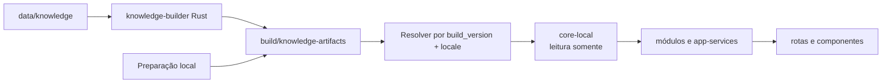

# Parte 1C: Consumo Local Dos Artefatos `system`

## Objetivo

Refatorar os apps e packages para consumir exclusivamente os artefatos completos
produzidos pelo `knowledge-builder`: o par localizado `system` e `system_media` e
o `CAS/system` compartilhado.

Esta parte conclui a separação entre autoria, compilação e consumo:

```text
data/knowledge       autoria de conteúdo
knowledge-builder    validação e compilação
apps e packages      leitura dos artefatos
```

O app não executa nem incorpora o builder. Comandos explícitos da raiz produzem
os artefatos; desenvolvimento e builds verificam e consomem a saída preparada.

## Pré-requisito

A [Parte 1B](./01b-knowledge-builder.md) está concluída e gera uma
`build_version` válida com os seis pares de bancos e o CAS compartilhado.

## Escopo

- criar uma fronteira única de resolução dos artefatos locais;
- abrir sempre `system` e `system_media` do mesmo locale e da mesma versão;
- adaptar contratos, repositories e serviços aos campos localizados dos bancos;
- fazer buscas usarem nomes e aliases armazenados em `system`;
- retirar chaves de i18n dos modelos de conhecimento;
- retirar conteúdo de conhecimento dos arquivos de i18n do app;
- retirar agregadores, defaults, seeds e loaders substituídos;
- retirar a geração de `system`, `system_media` e `CAS/system` dos apps e de
  `core-local`;
- preparar o fluxo local de desenvolvimento;
- preparar os builds empacotáveis por lista de locales;
- manter o i18n de interface;
- preservar a API pública de negócio quando ela continuar semanticamente válida.

Esta parte usa artefatos integrais em `build/knowledge-artifacts`. Aquisição por
manifest, instalação de releases, bootstraps e deltas pertencem à Parte 4.

## Fluxo



O builder é executado por comando explícito. Iniciar o app ou empacotar um app
não dispara geração implicitamente.

## Fronteiras De Responsabilidade

### `data/knowledge`

- contém entidades, localizações e referências de mídia;
- não é importado por código do app;
- não é servido diretamente ao runtime;
- não contém TypeScript executável.

### `tools/knowledge-builder`

- escreve os bancos públicos e o CAS;
- valida e relata a saída;
- não é biblioteca de runtime do app.

### `packages/types`

- conserva tipos, IDs, DTOs e contratos de domínio;
- não contém catálogos padrão, raças padrão, protocolos públicos ou JSONs de
  autoria;
- não usa `import.meta.glob` para carregar dados de conhecimento;
- não exporta arrays `default*` que representem conteúdo público.

### `packages/core-local`

- abre conexões de leitura para `system` e `system_media`;
- valida versões de schema, locale e identidade do par;
- oferece queries e repositories de infraestrutura;
- não cria, semeia, atualiza nem migra os bancos públicos;
- não resolve conteúdo de conhecimento por i18n;
- mantém i18n e demais recursos locais que não sejam dados públicos.

### `packages/modules`

- oferece APIs de negócio para catálogos, raças, protocolos e demais domínios;
- consome repositories públicos de leitura;
- não conhece caminhos de `build/`, JSONs de autoria ou schemas de geração.

### `packages/app-services`

- compõe buscas e análises reutilizáveis sobre as APIs públicas dos módulos;
- pesquisa os campos localizados e normalizados disponibilizados pelos bancos;
- não carrega fontes de conhecimento diretamente.

### `apps/vet-app`

- seleciona locale e versão preparados;
- compõe serviços e UI;
- não gera bancos nem CAS;
- não importa dados canônicos;
- não traduz nomes ou descrições de entidades retornadas pelos repositories.

## Resolução Local

O desenvolvimento seleciona explicitamente uma `build_version` e um ou mais
locales disponíveis em:

```text
build/knowledge-artifacts/versions/<build_version>/locales/<locale>/veterinary_clinic_system.db
build/knowledge-artifacts/versions/<build_version>/locales/<locale>/veterinary_clinic_system_media.db
build/knowledge-artifacts/CAS/system/
```

Uma fronteira única resolve os recursos:

```text
resolveKnowledgeResources({ buildVersion, locale })
  -> systemDatabasePath
  -> systemMediaDatabasePath
  -> casSystemRoot
```

Antes de abrir os bancos, a fronteira:

1. lê `build-result.json`;
2. valida seu contrato;
3. resolve somente caminhos internos ao diretório de artefatos;
4. confere tamanho e SHA-256 dos dois bancos;
5. confere `PRAGMA integrity_check` quando exigido pela política local;
6. valida versões e fingerprints dos schemas;
7. confirma o locale e a `build_version` nos dois bancos;
8. confirma a presença dos objetos exigidos por `system_media`.

Um par incompleto, divergente ou corrompido produz erro explícito. O consumidor
nunca combina `system` de um locale com `system_media` de outro.

Rotas, componentes, módulos e app-services não constroem caminhos para
`build/knowledge-artifacts`.

## Troca De Locale

Ao alterar o locale ativo, a camada de conhecimento:

1. encerra ou drena as leituras do par ativo;
2. resolve o novo par completo;
3. valida bancos e CAS;
4. abre as duas conexões;
5. troca a referência ativa como uma unidade;
6. invalida caches e read models dependentes do locale.

Falha durante a preparação conserva o par anterior. Uma tela nunca combina
resultados de locales diferentes.

## Contratos Localizados

DTOs e modelos de conhecimento expõem valores resolvidos:

```text
id
name
aliases
description
sections
classification
relations
originPlaces
media
```

Campos como `labelKey`, `originLabelKey` e equivalentes deixam os contratos de
conhecimento. Relações de origem expõem `geo_place` por ID e conteúdo localizado,
sem reconstruir localizações no módulo de raças. Códigos técnicos continuam
disponíveis em campos próprios quando possuem significado de domínio.

Repositories não chamam `translate()` para montar uma entidade. O locale é
determinado pelo banco ativo, e o retorno já contém o conteúdo correto.

## Resolução De Mídia

Contratos de domínio expõem `mediaId`, papel e metadados localizados. Eles não
expõem caminho de autoria nem usam o hash como identidade lógica.

Uma fronteira única resolve a mídia no par ativo:

```text
mediaId
-> consultar system_media.media_assets
-> obter contentHash e metadados técnicos
-> resolver CAS/system/<contentHash>
-> fornecer URL ou stream seguro ao consumidor
```

O renderer de Markdown reconhece somente o contrato interno:

```markdown

```

Ele extrai e valida o UUIDv7, usa a mesma fronteira de resolução e nunca converte
o ID em caminho diretamente. Uma referência ausente produz estado explícito de
mídia indisponível, sem buscar arquivos em `data/knowledge` ou aceitar caminhos
relativos.

Ao ativar outra build ou locale, o mesmo `mediaId` pode resolver para outro
`contentHash` conforme o `system_media` ativo. Caches de URLs e metadados usam a
identidade composta por versão, locale, `mediaId` e `contentHash`, evitando
reutilizar bytes de outra versão.

## Busca E Normalização

Os bancos armazenam campos normalizados derivados do conteúdo de cada locale.
As APIs de busca utilizam:

- nome localizado;
- aliases do locale;
- nomes localizados de relações relevantes;
- termos de taxonomia localizados;
- campos estruturais pesquisáveis definidos pelo domínio.

`@vet/app-services/search` continua responsável pela composição reutilizável das
buscas. SQL e filtros pertencentes a um domínio permanecem no repository ou
módulo dono. Nenhuma busca mantém mapas paralelos de aliases em i18n.

## Limpeza Do I18n

Remover dos bundles de i18n os conteúdos transferidos para os bancos:

- nomes de raças;
- nomes de origens usados como dados;
- descrições e seções de raças;
- aliases de catálogo;
- rótulos das taxonomias e classificações armazenadas em `system`;
- nomes e observações de protocolos públicos.

Permanecem no i18n:

- títulos e subtítulos de telas;
- ações e comandos;
- rótulos de campos e controles;
- mensagens de validação e erro;
- estados vazios;
- textos de acessibilidade da interface;
- unidades ou termos de UI que não representem uma entidade pública.

O nome do mecanismo `i18n` não é removido do projeto. A refatoração elimina
somente seu uso como banco paralelo de conhecimento.

## Remoção Das Fontes Substituídas

Após todas as leituras apontarem para os novos bancos, remover:

```text
packages/types/src/catalog/defaults/
packages/types/src/domain/pet/defaults/
packages/types/src/domain/treatment/defaults/
```

Remover também:

- agregadores TypeScript que carregam esses arquivos;
- arrays públicos de conteúdo `default*`;
- imports `import.meta.glob` de conhecimento;
- seeds de catálogo, raças e protocolos em `core-local`;
- criação e atualização de bancos `system` pelo app;
- loaders de mídia pública usados para preencher `system_media`;
- mapas de traduções de conhecimento substituídos;
- fallbacks que consultem as fontes removidas.

Arquivos compartilhados de tipos, validação e lógica de domínio permanecem
quando não contêm dados publicados.

## Preparação Local

A raiz oferece comandos explícitos e documentados para:

```text
validar data/knowledge
gerar uma build_version integral
verificar uma build_version existente
iniciar o app com build_version e locales selecionados
```

O comando de desenvolvimento verifica a saída existente e informa o comando de
geração quando ela estiver ausente. Ele não executa o builder silenciosamente.

O diretório `build/` é saída descartável, não é versionado e nunca se torna fonte
de verdade.

## Builds Empacotáveis

Cada build declara:

- uma `build_version` existente;
- uma lista não vazia de locales.

O empacotamento inclui somente:

- o par `system` e `system_media` de cada locale selecionado;
- a união dos hashes referenciados por esses bancos `system_media`;
- metadados necessários para validar os recursos incorporados.

Objetos CAS compartilhados são copiados uma vez. O build falha quando faltar um
banco, checksum, locale ou objeto obrigatório.

A regra vale para:

```text
tauri:build
tauri:appimage
tauri:deb
tauri:msi
tauri:flatpak
```

O app instalado abre esses recursos como o estado local integral disponível. A
Parte 4 substitui sua aquisição por releases publicadas sem mudar as APIs de
consulta de conhecimento.

## Sequência De Implementação

1. Definir configuração explícita de `build_version` e locales.
2. Implementar o resolver único e suas validações.
3. Adaptar conexões de `system` e `system_media` para o par localizado.
4. Adaptar repositories e DTOs aos campos resolvidos.
5. Adaptar módulos, buscas e consumidores.
6. Implementar a troca atômica de locale e invalidação de caches.
7. Remover o conteúdo de conhecimento do i18n.
8. Remover defaults, agregadores, seeds e geração substituídos.
9. Integrar a preparação explícita ao desenvolvimento.
10. Integrar a seleção de locales aos builds empacotáveis.
11. Auditar imports, caminhos, termos e fontes paralelas.
12. Executar a validação integral do workspace e dos bundles.

## Testes

Cobrir:

- resolução de cada um dos seis locales;
- validação de `build-result.json`, tamanho e SHA-256;
- validação dos fingerprints de `system` e `system_media`;
- recusa de par ausente, incompleto ou divergente;
- recusa de schema ou locale incompatível;
- abertura dos doze bancos pelas APIs de leitura;
- nomes, aliases, descrições e taxonomias corretos por locale;
- queries e buscas sem consulta a i18n de conhecimento;
- troca de locale sem reutilizar conexão ou cache anterior;
- conservação do par ativo quando a troca falha;
- leitura das mídias pelo `system_media` correspondente;
- resolução de `mediaId` para `contentHash` e objeto CAS;
- Markdown resolvendo `knowledge-media://<mediaId>`;
- mesmo `mediaId` resolvendo novo conteúdo após troca de build;
- invalidação de cache de mídia após troca de locale ou hash;
- recusa de UUID, caminho ou URI de mídia inválido;
- detecção de objeto CAS ausente ou corrompido;
- ausência de imports de `data/knowledge` no runtime;
- ausência de JSONs, defaults, seeds e agregadores substituídos;
- ausência de `labelKey` nos contratos de conhecimento;
- permanência e funcionamento do i18n de interface;
- desenvolvimento com artefatos preparados;
- falha clara quando os artefatos não estão preparados;
- seleção de locales no empacotamento;
- cópia da união exata dos objetos CAS;
- bundles Tauri suportados;
- `pnpm check`, `pnpm test:run`, `pnpm build` e testes Rust.

## Critérios De Aceite

- Apps e packages consultam conhecimento somente pelos bancos produzidos.
- O app não executa o builder nem lê `data/knowledge`.
- `packages/types` não armazena conteúdo público padrão.
- `core-local` não cria, semeia, atualiza ou migra bancos públicos.
- Os contratos retornam conteúdo localizado, sem chaves de tradução.
- Busca, catálogo, raças e protocolos usam nomes e aliases dos bancos.
- O i18n contém somente textos pertencentes à interface e a outras
  responsabilidades locais legítimas.
- Não permanecem fontes paralelas nem fallbacks de conhecimento.
- O par do locale é validado e aberto como unidade indivisível.
- Entidades e Markdown referenciam mídia por `mediaId`; somente a fronteira de
  mídia conhece hashes e caminhos CAS.
- Desenvolvimento consome uma `build_version` explicitamente preparada.
- Builds empacotáveis incluem somente os locales e objetos CAS necessários.
- O app não gera bancos ou CAS em desenvolvimento, runtime ou build.
- O workspace e os bundles suportados passam na validação integral.

## Próxima Parte

Após cumprir todos os critérios, seguir para a
[Parte 2: base Rails e contratos públicos](./02-rails-api-contracts.md).
