# Parte 1C: Consumo Local Dos Artefatos `system`

## Objetivo

Refatorar os apps e packages para consumir exclusivamente os artefatos completos
produzidos pelo `knowledge-builder`: o par localizado `system` e `system_media` e
o `CAS/system` compartilhado.

Esta parte conclui a separação entre autoria, compilação e consumo:

```text
data/knowledge       autoria de conteúdo
knowledge-builder    validação e compilação
apps e packages      leitura dos artefatos
```

O app não executa nem incorpora o builder. Comandos explícitos da raiz produzem
os artefatos; uma fronteira de preparação verifica e instala seus bytes nos
locais já gerenciados pelo app. Desenvolvimento e builds consomem somente essa
saída preparada.

## Pré-requisito

A [Parte 1B.8.5](./01b8-knowledge-builder-maintainability/05-test-topology-maintenance-guide.md)
está concluída. O `knowledge-builder` gera uma `build_version` válida com os seis
pares de bancos e o CAS compartilhado, usa contratos coesos de rows, inventário,
ownership e recibos confirmados, verifica integralmente os artefatos por uma
fachada de componentes, expõe erros estruturados e mantém uma suíte organizada
por custo e responsabilidade. Os artefatos usam schema 4 de `system` e projetam
os oito níveis taxonômicos em `animal_reference_items`. Toda linha possui filo;
as posições seguintes formam um prefixo contínuo até o nível da própria entidade
e as inferiores são nulas. Todas as colunas classificatórias são anuláveis.

## Escopo

- criar uma fronteira única de resolução dos artefatos locais;
- instalar o par ativo nos arquivos de sistema já gerenciados pelo app;
- instalar objetos CAS em `vault/system` pela disposição fragmentada vigente;
- abrir sempre `system` e `system_media` do mesmo locale e da mesma versão;
- adaptar contratos, repositories e serviços aos campos localizados dos bancos;
- preservar a resolução N:N entre produtos e princípios ativos e os links para
  as entidades farmacológicas relacionadas;
- consumir classificações de catálogo, alvos, perfis vacinais, estágios de vida
  e escopos terapêuticos por `entity_taxonomy_terms`;
- consumir a taxonomia e as classificações diretamente de
  `animal_reference_items` e a aplicabilidade de produtos e protocolos pelos
  IDs canônicos das entidades de espécie;
- expor conteúdo e navegação entre pai, filhos e descendentes nos oito níveis
  taxonômicos;
- resolver conhecimento animal pela entidade mais específica disponível:
  variedade, raça e, quando não houver raça, espécie;
- fazer buscas usarem nomes e aliases armazenados em `system`;
- retirar chaves de i18n dos modelos de conhecimento;
- retirar conteúdo de conhecimento dos arquivos de i18n do app;
- retirar agregadores, defaults, seeds e loaders substituídos;
- retirar a geração de `system`, `system_media` e `CAS/system` dos apps e de
  `core-local` e dos ramos de criação do `engine/storage`;
- conservar sem alterações funcionais a criação, migrations, escrita,
  sincronização, replicação e CAS do ramo `user`;
- preparar o fluxo local de desenvolvimento;
- preparar os builds empacotáveis por lista de locales;
- manter o i18n de interface;
- preservar a API pública de negócio quando ela continuar semanticamente válida.

Esta parte usa artefatos integrais em `build/knowledge-artifacts`. Aquisição por
manifest, instalação de releases, bootstraps e deltas pertencem à Parte 4.

## Fluxo

```mermaid
flowchart LR
    DATA["data/knowledge"] --> BUILDER["knowledge-builder Rust"]
    BUILDER --> OUTPUT["build/knowledge-artifacts"]
    OUTPUT --> PREPARE["Validar e instalar<br/>locale selecionado"]
    PREPARE --> ACTIVE["app_database_dir + vault/system"]
    ACTIVE --> ENGINE["engine/storage<br/>system somente leitura"]
    ENGINE --> CORE["core-local<br/>queries de leitura"]
    CORE --> MODULES["módulos e app-services"]
    MODULES --> ROUTES["rotas e componentes"]
```



O builder é executado por comando explícito. Iniciar o app ou empacotar um app
não dispara geração implicitamente.

## Fronteiras De Responsabilidade

### `data/knowledge`

- contém entidades, localizações e referências de mídia;
- não é importado por código do app;
- não é servido diretamente ao runtime;
- não contém TypeScript executável.

### `tools/knowledge-builder`

- escreve os bancos públicos e o CAS;
- valida e relata a saída;
- não é biblioteca de runtime do app.

### `packages/engine/storage`

- conserva integralmente a criação e a escrita de `user/main`, `user/media`,
  `user/logs` e `vault/user`;
- abre o `system` ativo por um perfil próprio de banco operacional de sistema;
- abre `system` e `system_media` com flags SQLite de somente leitura e
  `PRAGMA query_only = ON`;
- valida `PRAGMA user_version` e os metadados do par sem criar tabelas, elevar
  versões ou modificar os arquivos;
- resolve objetos de sistema em `vault/system/<2-hex>/<2-hex>/<hash>.bin`;
- recusa comandos SQL de escrita direcionados a `system` e `system_media`.

`DbType::MediaIndex` continua sendo o perfil gravável de `user_media`.
`DbType::SystemMediaIndex` passa a ser exclusivamente leitor do schema
`media_assets` produzido pelo builder. O perfil operacional de `system` não
reutiliza o modo gravável de `user/main`.

### `packages/engine/distribution`

- recebe bancos e objetos CAS já produzidos pelo builder;
- valida tamanho, checksum, identidade e caminhos antes da instalação;
- copia bytes para staging e finaliza arquivos por operações atômicas ou
  recuperáveis;
- é a única fronteira autorizada a substituir os arquivos ativos de sistema ou
  incorporar objetos prontos em `vault/system`;
- não executa SQL de escrita, DDL, seeds, projeção, geração de thumbnail ou
  autoria de objetos CAS.

Essa escrita é instalação de artefato, não criação de dados de sistema. Depois
da ativação, `engine/storage` mantém somente a leitura do conjunto.

### `packages/types`

- conserva tipos, IDs, DTOs e contratos de domínio;
- não contém catálogos padrão, raças padrão, protocolos públicos ou JSONs de
  autoria;
- não usa `import.meta.glob` para carregar dados de conhecimento;
- não exporta arrays `default*` que representem conteúdo público.

### `packages/core-local`

- solicita ao engine as conexões ativas de leitura para `system` e
  `system_media`;
- valida versões de schema, locale e identidade do par;
- oferece queries e repositories de infraestrutura;
- não cria, semeia, atualiza nem migra os bancos públicos;
- não resolve conteúdo de conhecimento por i18n;
- mantém i18n e demais recursos locais que não sejam dados públicos.

A criação e as migrations dos bancos de usuário permanecem no fluxo atual de
`core-local` e `engine`. A remoção de DDL, seeds e configuração de mídia nesta
parte se limita aos bancos públicos de sistema.

### `packages/modules`

- oferece APIs de negócio para catálogos, raças, protocolos e demais domínios;
- consome repositories públicos de leitura;
- não conhece caminhos de `build/`, JSONs de autoria ou schemas de geração.

### `packages/app-services`

- compõe buscas e análises reutilizáveis sobre as APIs públicas dos módulos;
- pesquisa os campos localizados e normalizados disponibilizados pelos bancos;
- não carrega fontes de conhecimento diretamente.

### `apps/vet-app`

- seleciona locale e versão preparados;
- compõe serviços e UI;
- não gera bancos nem CAS;
- não importa dados canônicos;
- não traduz nomes ou descrições de entidades retornadas pelos repositories.

## Resolução Local

O `knowledge-builder` sempre produz os seis locales. Desenvolvimento e bundles
selecionam quais desses artefatos ficam disponíveis localmente por uma
configuração explícita:

```text
buildVersion
includedKnowledgeLocales
defaultKnowledgeLocale
```

`includedKnowledgeLocales` é uma lista não vazia, sem duplicatas e composta
somente pelos seis locales suportados. `defaultKnowledgeLocale` pertence
obrigatoriamente a essa lista. Essa configuração não altera nem reduz a saída
integral do builder; ela controla apenas a preparação local e os recursos
incorporados ao app.

## Contrato De `knowledge-bundle.json`

A preparação materializa a configuração do app em
`<knowledge_resource_root>/knowledge-bundle.json`. O arquivo é gerado, não é
versionado como fonte e não substitui `build-result.json` nem o manifest assinado
de releases. Seu contrato inicial é:

```json
{
  "schemaVersion": 1,
  "buildVersion": 42,
  "includedKnowledgeLocales": ["pt-BR", "en-US"],
  "defaultKnowledgeLocale": "pt-BR",
  "resources": {
    "kind": "builder_output",
    "buildResultPath": "versions/42/build-result.json",
    "buildResultChecksumSha256": "<sha256>"
  }
}
```

`schemaVersion` versiona exclusivamente esse contrato de recursos do app.
`resources.kind` é um discriminador fechado; nesta parte, o único valor aceito é
`builder_output`. A Parte 4 acrescenta a variante `published_bootstraps` para os
recursos incorporados a partir de releases, preservando os campos superiores de
seleção de locales.

O diretório que contém `knowledge-bundle.json` é a raiz para os caminhos de
recursos que o contrato manda resolver. A preparação recusa caminhos absolutos,
componentes `..`, symlinks que escapem dessa raiz e arquivos cujo checksum não
corresponda ao contrato.

Antes de preparar um locale, o app valida:

1. `schemaVersion` e `resources.kind` suportados;
2. `buildVersion` como inteiro positivo;
3. lista não vazia, sem duplicatas e restrita aos seis locales suportados;
4. presença de `defaultKnowledgeLocale` na lista;
5. caminho relativo e SHA-256 de `build-result.json`;
6. igualdade de `buildVersion` entre os dois documentos;
7. presença, no resultado do builder, de cada locale declarado.

O `build-result.json` preserva o relatório integral dos seis locales produzido
pela Parte 1B. Na raiz reduzida do app, as entradas que não pertencem a
`includedKnowledgeLocales` servem somente como proveniência e não obrigam a
presença de seus bancos ou objetos CAS. O runtime resolve e valida arquivos apenas
para os locales incluídos. Ele também não resolve `projection.reportPath`,
`checksumFile` nem o digest CAS global dessa saída integral.

O arquivo usa UTF-8 e serialização JSON determinística. A preparação local da
raiz gera a árvore em `build/app-resources/<app-name>/knowledge/`. O bundle Tauri
incorpora a mesma árvore como seu recurso lógico `knowledge/`, de modo que
desenvolvimento, empacotamento e primeira inicialização exercitam o mesmo parser
e as mesmas validações.

Os artefatos selecionados ficam disponíveis em:

```text
build/knowledge-artifacts/versions/<build_version>/locales/<locale>/veterinary_clinic_system.db
build/knowledge-artifacts/versions/<build_version>/locales/<locale>/veterinary_clinic_system_media.db
build/knowledge-artifacts/CAS/system/<2-hex>/<2-hex>/<hash-sha256-hex>.bin
```

A origem do builder e o cofre ativo usam a mesma disposição relativa abaixo de
`system/`. A instalação copia um objeto de
`CAS/system/ab/cd/<hash>.bin` para `vault/system/ab/cd/<hash>.bin`, sem criar uma
representação plana intermediária.

Esses caminhos são fontes preparadas e nunca são abertos diretamente pelos
repositories. Uma fronteira de preparação recebe a origem de artefatos:

```text
prepareLocalKnowledgeResources({ knowledgeResourceRoot, locale })
  -> ler e validar knowledge-bundle.json
  -> validar a saída do builder
  -> instalar o par ativo
  -> incorporar os objetos CAS ausentes
  -> ativar o conjunto
```

Antes de instalar, a fronteira:

1. lê e valida `knowledge-bundle.json`;
2. lê `build-result.json` pelo caminho interno declarado e confere seu SHA-256;
3. valida o contrato integral de `build-result.json`, incluindo suas seis entradas
   de locale, sem exigir na raiz reduzida os arquivos dos locales não incluídos;
4. resolve somente caminhos internos à raiz de recursos de conhecimento;
5. confere tamanho e SHA-256 dos dois bancos;
6. confere `PRAGMA integrity_check` quando exigido pela política local;
7. valida versões e fingerprints dos schemas;
8. confirma a linha singleton de `knowledge_build_metadata` nos dois bancos;
9. confirma `build_version`, builder, digest da fonte e locale idênticos no par;
10. deriva de `system_media` o conjunto CAS exato do locale e confere seu
    `casSetDigestSha256` declarado em `build-result.json`;
11. confirma a presença dos objetos exigidos por esse conjunto;
12. verifica cada objeto CAS pelo hash antes de instalá-lo.

O destino ativo preserva os locais gerenciados pelo app:

```text
<app_database_dir>/veterinary_clinic_system.db
<app_database_dir>/veterinary_clinic_system_media.db
<app_data_dir>/vault/system/<2-hex>/<2-hex>/<hash-sha256-hex>.bin
```

`<app_database_dir>` é o nome lógico do diretório que reúne os arquivos SQLite
gerenciados pelo app. Na implementação Tauri, ele resolve para
`app.path().app_data_dir()/databases`.

Os objetos CAS são aditivos e imutáveis. A preparação copia somente hashes
ausentes para um arquivo temporário no diretório de destino, confirma o SHA-256 e
finaliza por `rename`. O par de bancos é copiado para staging, validado e
substituído como uma unidade recuperável antes da reabertura.

O runtime consulta uma fronteira estável, sem receber `buildVersion` ou caminhos
da origem editorial:

```text
getActiveKnowledgeResources()
  -> identity
  -> locale
  -> systemDatabase
  -> systemMediaDatabase
  -> systemCasResolver
```

Na Parte 1C, `identity` representa uma compilação local. A Parte 4 fornece o
mesmo contrato a partir de uma release instalada, sem alterar repositories,
módulos ou app-services.

Um par incompleto, divergente ou corrompido produz erro explícito. O consumidor
nunca combina `system` de um locale com `system_media` de outro.

Rotas, componentes, módulos e app-services não constroem caminhos para
`build/knowledge-artifacts`, `app_database_dir` ou `vault/system`.

## Ordem De Inicialização

O setup nativo respeita esta ordem:

1. validar `includedKnowledgeLocales` e `defaultKnowledgeLocale`;
2. resolver a origem local ou incorporada;
3. recuperar qualquer substituição interrompida;
4. usar o locale persistido quando ele estiver incluído ou, na primeira
   inicialização sem seleção persistida, usar `defaultKnowledgeLocale`;
5. instalar e validar o par ativo quando ele estiver ausente ou não corresponder
   à seleção;
6. construir o `StorageManager`;
7. abrir os bancos de usuário por seus perfis graváveis;
8. abrir `system` e `system_media` pelos perfis de somente leitura;
9. disponibilizar o storage ao restante do app.

Uma seleção persistida que não esteja incluída produz estado explícito de locale
indisponível. Com um par válido já ativo, o app conserva esse par. Sem par ativo,
ele registra a indisponibilidade solicitada e inicializa interface e conhecimento
com `defaultKnowledgeLocale`. A interface e o conhecimento confirmam qualquer
mudança posterior somente depois que o novo par estiver validado, sem combinar
silenciosamente idiomas diferentes.

Assim, `StorageManager::new` não cria arquivos de sistema vazios quando ainda não
há artefato preparado. Em um bundle instalado, a cópia inicial dos recursos
incorporados ocorre antes da abertura do par. Em desenvolvimento, o comando da
raiz pode concluir a mesma preparação antes de iniciar o processo Tauri.

## Troca De Locale

Na Parte 1C, somente integrantes de `includedKnowledgeLocales` podem ser
ativados. A UI não oferece os demais como disponíveis offline, e uma chamada
programática para um locale ausente é recusada antes de fechar conexões ou
alterar estado persistido.

Ao alterar o locale ativo, a camada de conhecimento:

1. resolve e valida o novo par completo na origem preparada;
2. incorpora e verifica os objetos ausentes em `vault/system`;
3. prepara os dois bancos em staging ao lado dos arquivos ativos;
4. grava um marcador de substituição recuperável;
5. encerra ou drena as leituras do par ativo;
6. substitui os dois arquivos ativos e os abre em modo somente leitura;
7. remove o marcador e os backups somente depois da validação final;
8. invalida caches e read models dependentes do locale.

Falha antes do fechamento conserva o par anterior. Falha ou encerramento durante
a substituição usa o marcador e os backups para restaurar o par anterior na
mesma execução ou na próxima inicialização. Como as conexões permanecem fechadas
durante essa janela, uma tela nunca observa arquivos de locales diferentes.

## Contratos Localizados

DTOs e modelos de conhecimento expõem valores resolvidos:

```text
id
name
aliases
description
sections
taxonomy
classification
relations
originPlaces
level
parentId
media
```

Campos como `labelKey`, `originLabelKey` e equivalentes deixam os contratos de
conhecimento. Relações de origem expõem `geo_place` por ID e conteúdo localizado,
sem reconstruir localizações no módulo de raças. Códigos técnicos continuam
disponíveis em campos próprios quando possuem significado de domínio.

Cada item de `sections` expõe somente `sectionKey` e `compiledMarkdown`.
`sectionKey` é um enum semântico do domínio, não uma chave de conteúdo. A camada
de interface resolve o título padronizado pelo i18n associado à `sectionKey`,
enquanto o corpo vem integralmente resolvido pelo banco ativo.

Para entidades animais, `taxonomy` expõe filo, classe, ordem, família, gênero,
espécie, raça e variedade em posições nomeadas. Cada posição não nula resolve ID
e nome por `animal_reference_items`. O repository não deriva nenhum nível do
caminho editorial. `level` corresponde à última posição não nula e `parentId`
corresponde à posição imediatamente anterior; o filo não possui `parentId`.

O repository lê o `content_json` da entidade, valida a `schemaVersion` suportada
e desserializa o documento para um DTO tipado. A página percorre o array plano
`sections` na ordem recebida; ela não reordena nem interpreta caminhos de
autoria. Cada item entrega seu `compiledMarkdown` diretamente ao renderer seguro.

Repositories não chamam `translate()` para montar uma entidade. O locale é
determinado pelo banco ativo, e o retorno já contém o conteúdo correto.

## Resolução De Mídia

Contratos de domínio expõem `mediaKey`, papel e metadados compilados. Eles não
expõem caminho de autoria nem usam o hash como identidade lógica.

Uma fronteira única resolve a mídia no par ativo:

```text
mediaKey
-> consultar system_media.media_assets
-> obter contentHash e metadados técnicos
-> converter contentHash BLOB(32) para hexadecimal minúsculo
-> resolver vault/system/<2-hex>/<2-hex>/<hash>.bin pelo engine
-> fornecer URL ou stream seguro ao consumidor
```

Para mídias, o renderer de Markdown reconhece somente o contrato interno:

```markdown

```

Ele extrai e valida a `media_key`, usa a mesma fronteira de resolução e nunca a
converte em caminho físico diretamente. Uma referência ausente produz estado
explícito de mídia indisponível, sem buscar arquivos em `data/knowledge` nem
aceitar caminhos relativos de autoria.

O renderer recebe somente Markdown canônico compilado dos bancos `system` e usa
um perfil compatível com o schema ativo. HTML bruto permanece desabilitado, nós
desconhecidos não são convertidos em DOM e URLs são validadas novamente por
protocolo. Referências `knowledge-media` passam exclusivamente pelo resolvedor
acima; links externos `https` usam a fronteira de abertura externa da plataforma.
`javascript:`, `data:`, `file:`, imagens remotas e outros protocolos não
permitidos são recusados mesmo diante de um artefato inválido.

Ao ativar outra build ou locale, a mesma `mediaKey` pode resolver para outro
`contentHash` conforme o `system_media` ativo. Caches de URLs e metadados usam a
identidade composta por versão, locale, `mediaKey` e `contentHash`, evitando
reutilizar bytes de outra versão.

Esse fluxo é exclusivo de mídias públicas de sistema. Mídias do usuário
continuam identificadas por hash em `user_media.blobs`, com escrita, remoção
lógica, status de sincronização e CAS em `vault/user`.

Os contratos nativos refletem essa diferença: operações de conhecimento recebem
`mediaKey` e resolvem o hash internamente; operações de mídia do usuário continuam
recebendo o hash. Não se adiciona `mediaKey` a `user_media` nem se mantém uma API
gravável comum aos dois ramos.

## Busca E Normalização

Os bancos armazenam campos normalizados derivados do conteúdo de cada locale.
As APIs de busca utilizam:

- nome localizado;
- aliases do locale;
- nomes localizados de relações relevantes;
- termos de taxonomia localizados;
- campos estruturais pesquisáveis definidos pelo domínio.

Para produtos, os nomes e aliases de princípios ativos, alvos, perfis vacinais,
estágios de vida e escopos terapêuticos entram pela projeção derivada pelo
builder. A busca não lê classificações genéricas ou campos `searchConcept`.

Quando o corpo das seções participar de uma busca, o repository usa o texto ou o
índice FTS derivado pelo builder. A busca não interpreta nem percorre
`content_json` em tempo de execução.

`@vet/app-services/search` continua responsável pela composição reutilizável das
buscas. SQL e filtros pertencentes a um domínio permanecem no repository ou
módulo dono. Nenhuma busca mantém mapas paralelos de aliases em i18n.

## Limpeza Do I18n

Remover dos bundles de i18n os conteúdos transferidos para os bancos:

- nomes de raças;
- nomes de origens usados como dados;
- descrições e seções de raças;
- aliases de catálogo;
- rótulos das taxonomias e classificações armazenadas em `system`;
- nomes e observações de protocolos públicos.

Permanecem no i18n:

- títulos e subtítulos de telas;
- ações e comandos;
- rótulos de campos e controles;
- mensagens de validação e erro;
- estados vazios;
- textos de acessibilidade da interface;
- unidades ou termos de UI que não representem uma entidade pública.

O nome do mecanismo `i18n` não é removido do projeto. A refatoração elimina
somente seu uso como banco paralelo de conhecimento.

## Remoção Das Fontes Substituídas

Após todas as leituras apontarem para os novos bancos, remover:

```text
packages/types/src/catalog/defaults/
packages/types/src/domain/pet/defaults/
packages/types/src/domain/treatment/defaults/
```

Remover também:

- agregadores TypeScript que carregam esses arquivos;
- arrays públicos de conteúdo `default*`;
- imports `import.meta.glob` de conhecimento;
- seeds de catálogo, raças e protocolos em `core-local`;
- criação e atualização de bancos `system` pelo app;
- loaders de mídia pública usados para preencher `system_media`;
- DDL, criação automática e elevação de versão de `system_media` no
  `engine/storage`;
- escrita de mídia com `StorageDomain::System`, incluindo inserção de metadados,
  geração de CAS e atualização de status;
- uso da API de autoria `write_cas_file` para produzir conteúdo de sistema; a
  instalação usa uma operação própria que exige hash e bytes já publicados;
- mapas de traduções de conhecimento substituídos;
- fallbacks que consultem as fontes removidas.

Arquivos compartilhados de tipos, validação e lógica de domínio permanecem
quando não contêm dados publicados.

Não remover nem generalizar junto com esse trabalho:

- DDL e validação de `user_media.blobs`;
- `save_media`, remoção lógica e atualização de sincronização para
  `StorageDomain::User`;
- criação e migrations de `user/main` e `user/logs`;
- replicação, exportação, importação e CAS em `vault/user`.

## Preparação Local

A raiz oferece comandos explícitos e documentados para:

```text
validar data/knowledge
gerar uma build_version integral
verificar uma build_version existente
iniciar o app com buildVersion, includedKnowledgeLocales e defaultKnowledgeLocale
```

O comando de desenvolvimento verifica a saída existente e informa o comando de
geração quando ela estiver ausente. Em seguida, prepara o locale selecionado nos
caminhos ativos do app antes de iniciar o runtime. Ele não executa o builder
silenciosamente.

O diretório `build/` é saída descartável, não é versionado e nunca se torna fonte
de verdade.

## Builds Empacotáveis

Cada build declara:

- uma `build_version` existente;
- `includedKnowledgeLocales` como lista não vazia de locales;
- `defaultKnowledgeLocale` como integrante obrigatório dessa lista.

Antes de selecionar recursos, o pipeline valida a saída integral da Parte 1B em
`build/knowledge-artifacts`:

1. confere o contrato de `build-result.json` e suas seis entradas de locale;
2. confere o checksum e a cobertura integral de `projection-report.json`;
3. confere `checksums.sha256` contra os doze bancos e todos os objetos CAS da
   `build_version`;
4. valida metadados, fingerprints, integridade e digests do conjunto completo;
5. encerra o empacotamento diante de qualquer divergência.

Somente depois dessa auditoria o pipeline cria a raiz reduzida de recursos do app.

O empacotamento inclui somente:

- `knowledge-bundle.json` com o contrato validado do conjunto incorporado;
- o `build-result.json` referenciado, com seu checksum;
- o par `system` e `system_media` de cada locale selecionado;
- a união dos hashes referenciados por esses bancos `system_media`;
- os metadados necessários para validar os recursos incorporados.

`projection-report.json` e `checksums.sha256` permanecem na saída integral de
build e não são incorporados ao app. O `build-result.json` copiado permanece
integral, mas o runtime usa somente os descritores dos locales incluídos. Para
cada um deles, o conjunto CAS incorporado é derivado do respectivo
`system_media`, comparado com `casSetDigestSha256` e copiado sem objetos extras.
O digest CAS global do resultado integral é validado pelo pipeline antes da
seleção e não é usado para exigir no bundle objetos pertencentes a outros locales.

Objetos CAS compartilhados são copiados uma vez. O build falha quando faltar um
banco, checksum, locale ou objeto obrigatório, quando a lista estiver vazia ou
duplicada e quando o locale padrão não estiver incluído.

Os artefatos incorporados são uma origem somente leitura do bundle. Na primeira
ativação de um locale, a fronteira de preparação instala o par nos nomes fixos do
`app_database_dir` e incorpora os objetos ausentes no `vault/system` fragmentado.
Esse processo copia e valida bytes prontos; ele não executa DDL, seeds, geração
de thumbnail ou criação de conteúdo CAS.

A regra vale para:

```text
tauri:build
tauri:appimage
tauri:deb
tauri:msi
tauri:flatpak
```

O app instalado abre somente o par ativo nos caminhos gerenciados pelo storage.
A Parte 4 substitui a origem incorporada por releases publicadas sem mudar as
APIs de consulta de conhecimento nem o formato físico do CAS local.

## Sequência De Implementação

1. Definir o schema versionado de `knowledge-bundle.json` e seu gerador a partir
   de `buildVersion`, `includedKnowledgeLocales` e `defaultKnowledgeLocale`.
2. Implementar a validação da raiz de recursos, do contrato do bundle e do
   `build-result.json` referenciado.
3. Implementar a preparação e instalação nos caminhos gerenciados pelo app.
4. Separar no engine os perfis graváveis de usuário dos perfis de sistema em
   somente leitura.
5. Adaptar conexões de `system` e `system_media` para o par ativo localizado.
6. Implementar o contrato estável de recursos ativos e suas validações.
7. Adaptar a leitura de `system_media` de `blobs` para `media_assets` por
   `mediaKey`.
8. Adaptar repositories e DTOs aos campos resolvidos.
9. Adaptar módulos, buscas, filtros e consumidores à relação taxonômica
   universal.
10. Implementar a troca recuperável de locale e invalidação de caches.
11. Remover o conteúdo de conhecimento do i18n.
12. Remover defaults, agregadores, seeds e produção de sistema substituídos em
    `core-local` e `engine`.
13. Integrar a geração e o consumo da raiz de recursos ao desenvolvimento.
14. Integrar aos builds empacotáveis a auditoria da saída integral, a seleção de
    locales e a geração da raiz reduzida com o conjunto CAS exato.
15. Auditar que os ramos de criação e escrita de usuário permanecem funcionais.
16. Auditar imports, caminhos, termos e fontes paralelas.
17. Executar a validação integral do workspace e dos bundles.

## Testes

Cobrir:

- resolução de cada um dos seis locales;
- geração determinística de `knowledge-bundle.json`;
- recusa de schema, discriminador, `buildVersion`, lista ou locale padrão
  inválido no contrato do bundle;
- recusa de caminho absoluto, travessia, symlink externo ou checksum divergente
  declarado em `knowledge-bundle.json`;
- divergência de `buildVersion` ou locale entre `knowledge-bundle.json` e
  `build-result.json`;
- validação de `build-result.json`, tamanho e SHA-256;
- auditoria integral de `projection-report.json`, `checksums.sha256`, dos doze
  bancos e do CAS antes da seleção de locales;
- ausência de `projection-report.json` e `checksums.sha256` na raiz reduzida sem
  impedir sua validação prévia no pipeline;
- `build-result.json` integral em bundle com subconjunto de locales, sem tentativa
  de resolver bancos ou CAS dos locales não incluídos;
- derivação do conjunto CAS por `system_media` e igualdade com o
  `casSetDigestSha256` do locale selecionado;
- validação de `knowledge_build_metadata` nos dois bancos;
- validação dos fingerprints de `system` e `system_media`;
- recusa de par ausente, incompleto ou divergente;
- recusa de schema ou locale incompatível;
- abertura dos doze bancos pelas APIs de leitura;
- nomes, aliases, descrições e taxonomias corretos por locale;
- produtos resolvendo seus princípios ativos pela relação N:N, na ordem
  declarada;
- entidades dos oito níveis expondo sua cadeia pelos campos autorreferenciados de
  `animal_reference_items`;
- filtros por filo, classe, ordem, família, gênero, espécie, raça e variedade
  usando os campos indexados de `animal_reference_items`;
- fabricantes, princípios ativos, condições e produtos resolvendo suas
  classificações N:N exclusivamente por `entity_taxonomy_terms`;
- cada entidade animal resolvendo somente as classificações e medidas presentes,
  sem preencher campos ausentes por inferência;
- pet sem raça definida consumindo diretamente o conteúdo da entidade de
  espécie, sem criar raça genérica;
- produtos e protocolos resolvendo aplicabilidade pelos IDs presentes em
  `applicable_species_ids_json`;
- produtos resolvendo tipos, classificações, alvos, perfis vacinais, estágios de
  vida e escopos terapêuticos pelo propósito da taxonomia associada;
- recusa de associação com termo pertencente a outro domínio, propósito ou
  vocabulário;
- navegação do produto para cada página de princípio ativo relacionado;
- busca de produto pelos nomes e aliases localizados de seus princípios ativos;
- ausência de `searchConcept` nos DTOs, repositories e índices consumidos;
- desserialização de `content_json` para a lista tipada de seções;
- resolução do título de cada seção pelo i18n da `sectionKey`;
- montagem da página na ordem do array `sections`;
- entrega exclusiva de `compiledMarkdown` normalizado ao renderer;
- recusa de `schemaVersion` de conteúdo não suportada ou documento malformado;
- ausência de consultas JSON ad hoc para montar páginas ou pesquisar seções;
- queries e buscas sem consulta a i18n de conhecimento;
- troca de locale sem reutilizar conexão ou cache anterior;
- conservação do par ativo quando a troca falha;
- leitura das mídias pelo `system_media` correspondente;
- resolução de `mediaKey` para `contentHash` e objeto CAS;
- Markdown resolvendo `knowledge-media://asset/<media-key>`;
- renderização do perfil Markdown compilado com HTML bruto desabilitado;
- recusa no runtime de nós desconhecidos, imagens remotas e protocolos de URI
  não permitidos;
- abertura de links `https` pela fronteira externa da plataforma;
- mesma `mediaKey` resolvendo novo conteúdo após troca de build;
- invalidação de cache de mídia após troca de locale ou hash;
- recusa de `mediaKey`, caminho físico ou URI de mídia inválida;
- detecção de objeto CAS ausente ou corrompido;
- instalação CAS em `vault/system/<2-hex>/<2-hex>/<hash>.bin`;
- recusa de artefato CAS em layout plano ou cujos prefixos não correspondam ao
  próprio hash;
- recuperação após falha em cada etapa da substituição do par ativo;
- recusa de escrita SQL, criação de schema ou elevação de versão em `system` e
  `system_media`;
- leitura de sistema por `media_assets.media_key`;
- recusa de `save_media` e atualização de sincronização para
  `StorageDomain::System`;
- criação, escrita, remoção lógica e sincronização de `user_media.blobs` sem
  regressão;
- criação e migrations dos três bancos de usuário sem regressão;
- escrita e leitura do CAS em `vault/user` sem regressão;
- ausência de imports de `data/knowledge` no runtime;
- ausência de JSONs, defaults, seeds e agregadores substituídos;
- ausência de `labelKey` nos contratos de conhecimento;
- permanência e funcionamento do i18n de interface;
- desenvolvimento com artefatos preparados;
- falha clara quando os artefatos não estão preparados;
- inicialização sem arquivos ativos instalando o locale incorporado antes de
  construir o `StorageManager`;
- ausência de criação de banco de sistema vazio durante a inicialização;
- seleção de locales no empacotamento;
- recusa de lista vazia, duplicada, desconhecida ou sem o locale padrão;
- primeira inicialização usando `defaultKnowledgeLocale`;
- recusa de locale não incorporado sem alterar o par ativo;
- confirmação conjunta do locale da interface e do conhecimento;
- cópia da união exata dos objetos CAS;
- bundles Tauri suportados;
- `pnpm check`, `pnpm test:run`, `pnpm build` e testes Rust.

## Critérios De Aceite

- Apps e packages consultam conhecimento somente pelos bancos produzidos.
- O app não executa o builder nem lê `data/knowledge`.
- `packages/types` não armazena conteúdo público padrão.
- `core-local` não cria, semeia, atualiza ou migra bancos públicos.
- `engine/storage` não cria, eleva, semeia ou aceita escrita nos bancos públicos
  ativos.
- `knowledge_build_metadata` prova a identidade comum do par antes da abertura.
- Os contratos retornam conteúdo localizado, sem chaves de tradução.
- As páginas são compostas pela lista tipada de `content_json`, sem consultas ou
  tabelas independentes por seção.
- Cada item da lista fornece a `sectionKey`, e a UI resolve seu título pelo i18n.
- Busca, catálogo, raças e protocolos usam nomes e aliases dos bancos.
- Produtos exibem e vinculam princípios ativos carregados pelas relações
  canônicas do banco.
- O i18n contém textos pertencentes à interface, incluindo os títulos
  padronizados das seções.
- Não permanecem fontes paralelas nem fallbacks de conhecimento.
- O par do locale é validado e aberto como unidade indivisível.
- Entidades e Markdown compilado referenciam mídia por `mediaKey`; somente a
  fronteira de mídia conhece hashes e caminhos CAS.
- Desenvolvimento consome uma `build_version` explicitamente preparada.
- Builds empacotáveis incluem somente os locales e objetos CAS necessários.
- O pipeline valida a saída integral do builder antes de produzir a raiz reduzida
  do app.
- O runtime resolve somente os descritores de locales declarados no
  `knowledge-bundle.json` e deriva seu conjunto CAS pelo respectivo
  `system_media`.
- Desenvolvimento e bundles usam o mesmo contrato versionado
  `knowledge-bundle.json` para descrever os recursos incorporados.
- Todo bundle possui `defaultKnowledgeLocale` dentro de sua lista não vazia de
  `includedKnowledgeLocales`.
- Um locale localmente indisponível nunca substitui o par ativo nem produz
  combinação silenciosa de idiomas.
- O app não gera bancos ou CAS em desenvolvimento, runtime ou build.
- A preparação instala os bancos nos nomes ativos do `app_database_dir` e os
  objetos no `vault/system` fragmentado.
- Bancos e CAS do usuário conservam criação, migrations, escrita, sincronização,
  replicação, exportação e importação.
- O workspace e os bundles suportados passam na validação integral.

## Próxima Parte

Após cumprir todos os critérios, seguir para a
[Parte 2: base Rails e contratos públicos](./02-rails-api-contracts.md).
