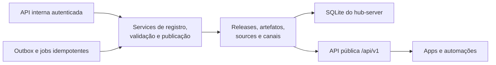

# Parte 2: Base Rails E Contratos Públicos

## Objetivo

Criar `apps/hub-server/` com a API, o modelo de releases, os contratos de
distribuição e a fronteira de publicação interna.

Esta parte implementa os modelos e as regras definidos no
[índice arquitetural](./README.md).

## Fluxo Da Parte



Esta parte estabelece o plano de controle e seus contratos. Dados públicos,
geração de bancos, publicação efetiva e consumo pelos apps entram nas partes
seguintes sem alterar a identidade dos modelos definidos aqui.

## Aplicação

Criar a aplicação:

```sh
rails new apps/hub-server --api --database=sqlite3 --skip-asset-pipeline
```

Configurar:

- Rails 8 API;
- SQLite;
- `solid_queue`;
- `solid_cache`;
- `GET /up`;
- `GET /api/v1/health`;
- CORS somente para origens públicas que realmente consumam a API em navegador;
- autenticação interna via `Authorization: Bearer <INTERNAL_RELEASE_TOKEN>`.

Clientes Tauri nativos não dependem de CORS. As rotas internas não são expostas
pela política pública de CORS.

## Modelos

Criar:

```text
Release
ReleaseArtifact
ReleaseArtifactSource
AppChannelRelease

KnowledgeRelease
KnowledgeReleaseLocale
KnowledgeArtifact
KnowledgeArtifactSource
KnowledgeReleasePackage
KnowledgeReleaseComponent
KnowledgeCasObjectSource
KnowledgeDeliverySource
KnowledgeManifestSnapshot
KnowledgeManifestSource
KnowledgeManifestReplica
KnowledgeChannelRelease
```

Restrições principais:

- checksum usa exatamente 64 caracteres hexadecimais minúsculos;
- `size_bytes` é positivo;
- `priority` é positiva e única no escopo de cada lista de sources;
- versão, canal, tipo de artefato, provider e transport usam enums validados;
- `KnowledgeRelease` guarda `generation` e `revision` como inteiros não negativos;
- a combinação de geração e revisão é globalmente única;
- status de conhecimento aceita `draft`, `building`, `failed`, `validating`,
  `published` ou `withdrawn`;
- o fluxo normal é `draft -> building -> validating -> published -> withdrawn`;
- falha do builder produz `building -> failed`, e retry explícito usa
  `failed -> building` sobre o mesmo draft;
- bootstrap exige revisão zero e não possui `previous_release_id`;
- delta exige revisão positiva e aponta para a revisão imediatamente anterior;
- `KnowledgeRelease` guarda versões independentes de `system` e `system_media`;
- `KnowledgeRelease.build_version` é inteiro positivo e único;
- `builder_version` é SemVer válido e identifica o binário Rust usado;
- `build_result_schema_version` é inteiro positivo suportado pelo Hub;
- `build_result_checksum_sha256` e `source_digest_sha256` usam SHA-256 válido;
- uma release só alcança estado validado depois que a identidade do draft, a
  proveniência do builder e os artefatos coincidem com `build-result.json`;
- locale usa a allowlist canônica `pt-BR`, `pt-PT`, `gn-PY`, `en-US`, `es-ES` e
  `fr-FR`;
- cada release possui exatamente um `KnowledgeReleaseLocale` para cada locale da
  allowlist;
- a combinação de `knowledge_release_id` e `locale` é única;
- cada `KnowledgeReleaseLocale` possui exatamente um componente `system`, um
  `system_media` e um `cas_system`;
- a combinação de `knowledge_release_locale_id` e `component` é única;
- cada `KnowledgeReleaseLocale` possui exatamente um
  `KnowledgeReleasePackage`;
- o pacote referencia um `KnowledgeArtifact` do tipo compatível com
  `release_kind` e pertencente ao mesmo locale;
- `descriptor_checksum_sha256` corresponde ao `release.json` canônico interno;
- `delivery_mode` aceita `snapshot`, `patch`, `index_only` ou `unchanged` conforme
  o componente e o tipo da release;
- bootstrap exige `snapshot` nos três componentes;
- delta exige `patch` em `system` e `system_media`;
- `index_only` e `unchanged` são permitidos somente em `cas_system`;
- componente `patch` exige checksums de base e resultado;
- `snapshot` e patches de banco exigem `entry_path`, checksum e tamanho da entrada;
- `cas_system` em `snapshot` ou `patch` exige `entry_prefix: CAS/` e uma lista
  ordenada, única e íntegra de hashes no `release.json`;
- componentes `index_only` e `unchanged` não possuem campos de entrada;
- `cas_system` declara digest e quantidade do conjunto final;
- `KnowledgeDeliverySource` é única por canal, tipo de entrega e provider;
- prioridades de `KnowledgeDeliverySource` são únicas por canal e tipo de entrega;
- todo `KnowledgeDeliverySource.url_pattern` contém exatamente um `{releaseId}`
  e um `{locale}` e somente placeholders permitidos;
- `KnowledgeCasObjectSource` é única por canal e provider;
- `KnowledgeManifestSnapshot.sequence` é inteiro positivo, monotônico e único por
  canal;
- `snapshotId`, `manifestSequence`, `channel`, `releaseId`, `publishedAt` e
  `expiresAt` do payload correspondem exatamente ao registro persistido;
- `KnowledgeManifestSnapshot` aponta somente para release publicada;
- `expires_at` é posterior a `published_at` e respeita a duração máxima
  configurada para snapshots;
- o snapshot é imutável depois de publicado;
- `KnowledgeManifestSource` é única por canal e provider;
- prioridades de manifest sources são positivas e únicas por canal;
- `current_url_pattern` contém `{channel}`, pode conter `{appName}` e
  `{appVersion}` e não aceita outros placeholders;
- `snapshot_url_pattern` contém exatamente uma ocorrência de `{channel}`,
  `{sequence}` e `{snapshotId}` e não aceita outros placeholders;
- esquema, host e base de URL das duas formas pertencem à allowlist do provider;
- `KnowledgeManifestReplica` é única por snapshot e source e somente alcança
  status `verified` quando seus bytes coincidem com o checksum canônico;
- status de réplica aceita `pending`, `published`, `verified` ou `failed`;
- providers externos não geram sequência, payload ou assinatura;
- releases publicadas não aceitam alteração de proveniência do builder;
- registros associados a uma release publicada não aceitam alteração ou remoção;
- ponteiros de canal referenciam somente releases com status `published`;
- o snapshot e a release de `KnowledgeChannelRelease` pertencem ao mesmo estado
  publicado;
- versões de app são únicas por `app_name`, independentemente de canal.

`KnowledgeReleaseLocale` é a projeção localizada de uma release global.
`KnowledgeReleaseComponent` descreve as entradas e o estado final dentro do
pacote daquele locale. A cadeia pertence às `KnowledgeRelease`; bancos e CAS não
possuem contadores públicos de atualização independentes.

IDs de entidades e relações não localizáveis precisam formar conjuntos
equivalentes entre os seis bancos `system` de uma release. Campos de texto,
aliases, descrições e índices de busca podem variar conforme o locale.

`KnowledgeArtifactSource` atende artefatos de endereço fixo.
`KnowledgeDeliverySource` resolve pacotes por `{releaseId}` e `{locale}` e pode
usar `{generation}` e `{revision}` na composição do nome. Ela é uma configuração
do canal, e o manifest assinado captura o conjunto vigente no momento da
publicação. Cada provider aparece uma vez por `delivery_kind`, sem sources dentro
dos componentes ou repetidas em cada release.

`KnowledgeManifestSnapshot` separa a evolução do manifest da evolução dos dados.
Promover outra release ou alterar apenas sources cria o próximo snapshot do
canal, sem modificar releases, artefatos ou snapshots publicados.

## Rotas Públicas

```text
GET /api/v1/health
GET /api/v1/apps/:app_name/updates/:platform/:current_version
GET /api/v1/knowledge/manifest
GET /api/v1/knowledge/channels/:channel/manifests/:sequence/:snapshot_id
GET /api/v1/knowledge/releases/:release_id/locales/:locale/package
GET /api/v1/downloads/:artifact_id
GET /api/v1/cas/system/:hash
```

`/api/v1/apps/:app_name/updates/:platform/:current_version` recebe o canal por
query param e devolve o contrato do updater para uma plataforma suportada.

`/api/v1/knowledge/manifest` recebe `channel`, `app_name` e `app_version`. A
resposta seleciona o ponteiro vigente do canal e respeita a faixa de versões
suportadas. A API devolve o `KnowledgeManifestSnapshot` vigente, oferece `ETag`
derivado de seu checksum, aplica
`Cache-Control: public, max-age=300, must-revalidate` e responde
`304 Not Modified` quando aplicável.

O endpoint não filtra o payload por locale. O mesmo snapshot contém as seis
cadeias, é replicável byte a byte em sources estáticas e permite que o cliente
selecione localmente quais pacotes baixar.

`/api/v1/knowledge/channels/:channel/manifests/:sequence/:snapshot_id` devolve os
bytes canônicos e imutáveis de um snapshot publicado. Canal, sequência e ID
precisam identificar o mesmo registro. A resposta usa o checksum persistido como
`ETag` e nunca reconstrói o payload a partir do estado vigente.

`/api/v1/knowledge/releases/:release_id/locales/:locale/package` resolve
exatamente o pacote localizado de uma release publicada e o entrega ou
redireciona por uma `KnowledgeDeliverySource` habilitada. O resolver confere que
`release_id`, `locale` e tipo correspondem ao pacote registrado. O cliente
confere a mesma identidade contra o snapshot assinado.
Locale é validado pela allowlist canônica e não recebe normalização implícita.

`/api/v1/downloads/:artifact_id` resolve somente um artefato publicado. O
servidor entrega seus bytes ou redireciona para uma source habilitada e permitida.

`/api/v1/cas/system/:hash` aceita apenas SHA-256 hexadecimal minúsculo e resolve o
objeto sem concatenar entrada pública a caminhos arbitrários.

## Rotas Internas

```text
POST /api/v1/internal/releases
POST /api/v1/internal/knowledge_releases
POST /api/v1/internal/releases/:id/validate
POST /api/v1/internal/releases/:id/publish
POST /api/v1/internal/knowledge_releases/:id/validate
POST /api/v1/internal/knowledge_releases/:id/publish
POST /api/v1/internal/app_channels/:app_name/:channel/promote
POST /api/v1/internal/knowledge_channels/:channel/snapshots
PUT /api/v1/internal/knowledge_delivery_sources/:delivery_kind/:provider
PUT /api/v1/internal/knowledge_cas_object_sources/:provider
PUT /api/v1/internal/knowledge_manifest_sources/:provider
```

Criação e publicação são operações distintas. As rotas de mutação exigem token,
`Idempotency-Key`, limite de payload e transições válidas do ciclo de publicação.
Uma repetição com a mesma chave e o mesmo payload retorna o mesmo resultado;
payload diferente com a mesma chave é recusado.

Publicar uma release valida e torna seu conteúdo imutável, sem alterar canais. A
rota de promoção de app troca `AppChannelRelease`. A rota de snapshot de
conhecimento recebe uma release publicada, calcula a próxima sequência, monta o
payload com as sources vigentes, assina, persiste e troca
`KnowledgeChannelRelease` na mesma transação.

A rota de snapshot também pode apontar para a release já ativa. Esse fluxo
publica alterações de sources ou validade sem criar uma versão de conhecimento.

As rotas de source fazem upsert por canal e chave natural. Alterar uma source não
reescreve manifests publicados; a configuração passa a integrar somente novos
snapshots assinados.

A configuração de manifest source define os padrões `current` e imutável, a
prioridade, o estado habilitado e se a réplica é necessária para considerar o
canal saudável. Ela não é incorporada ao próprio manifest descoberto.

## Segurança Dos Resolvers

- HTTPS é obrigatório fora do desenvolvimento local.
- Providers têm esquema, hosts e bases de URL configurados no servidor.
- A API não aceita uma URL arbitrária como destino de redirect público.
- Redirects têm quantidade limitada e nunca apontam para esquema não permitido.
- Caminhos locais são derivados de IDs e hashes previamente validados.
- Downloads definem `Content-Type`, `Content-Length`, `ETag` e
  `Content-Disposition` seguros.
- Respostas não revelam `storage_key`, tokens ou caminhos internos.
- O token interno usa comparação em tempo constante, aceita rotação controlada e
  nunca aparece em logs.
- Rate limit separado protege rotas públicas de objetos e rotas internas.

## Services

```text
app/services/releases/app_manifest_builder.rb
app/services/releases/knowledge_manifest_builder.rb
app/services/releases/manifest_signer.rb
app/services/releases/publisher.rb
app/services/releases/knowledge_chain_validator.rb
app/services/releases/knowledge_snapshot_publisher.rb
app/services/releases/knowledge_manifest_replica_publisher.rb
app/services/releases/knowledge_manifest_replica_verifier.rb
app/services/releases/channel_promoter.rb
app/jobs/knowledge/renew_channel_snapshot_job.rb
app/jobs/knowledge/replicate_channel_snapshot_job.rb
app/services/artifacts/resolver.rb
app/services/knowledge/package_resolver.rb
app/services/cas/system_object_resolver.rb
app/services/knowledge/package_importer.rb
```

Builders recebem modelos validados e não consultam estado global oculto. O
`publisher` valida artefatos e publica releases sem alterar canais. O
`knowledge_snapshot_publisher` aloca a próxima sequência sob lock do canal,
persiste o payload assinado imutável e troca os ponteiros na mesma transação.
Na mesma confirmação, ele grava uma outbox para cada manifest source habilitada.

`knowledge_manifest_replica_publisher` envia exatamente os bytes persistidos
ao adapter da source. O adapter publica diretamente ou aciona o mecanismo
próprio do provider para preencher os caminhos imutável e `current` do canal. O
verifier lê as duas cópias, compara tamanho e checksum e atualiza
`KnowledgeManifestReplica`.
Falhas ficam registradas e são retomadas por
`replicate_channel_snapshot_job`, sem gerar outro snapshot.

`renew_channel_snapshot_job` seleciona snapshots próximos da expiração e publica
a próxima sequência apontando para a mesma release. A renovação usa as sources
vigentes, preserva o canal diante de falha e nunca reescreve o snapshot anterior.

`package_importer` valida release, locale e `release.json`, extrai as entradas
permitidas e materializa objetos ausentes no armazenamento persistente do Hub.
Ele aplica os mesmos limites de extração, validação por hash e gravação atômica
exigidos do app.

## Testes

Cobrir:

- healthcheck público;
- ausência de release publicada;
- ciclo `draft -> building -> validating -> published -> withdrawn`;
- falha e retry `building -> failed -> building` sem outra identidade;
- recusa de transições inválidas;
- imutabilidade de release publicada;
- troca transacional do ponteiro de canal;
- publicação de release sem alteração de canal;
- promoção da mesma release entre canais;
- novo snapshot para a mesma release após alteração de source;
- sequência monotônica, expiração e imutabilidade do snapshot;
- unicidade, prioridade e allowlist de manifest sources;
- réplica externa byte a byte e verificação por checksum;
- retry idempotente de réplica sem nova sequência;
- source externa atrasada preservando o snapshot canônico;
- criação e repetição idempotente pela API interna;
- recusa sem token ou com token inválido;
- limites de payload e rate limit;
- validações de artefato, delivery source e pacote de locale;
- seis locales obrigatórios, únicos e completos por release;
- IDs e relações estruturais equivalentes entre os bancos localizados;
- resolução de pacote por `release_id` e `locale` sem ambiguidade entre canais;
- recusa de prioridade, versão global ou checksum inválido;
- recusa de delivery source sem `{releaseId}` ou `{locale}`, com placeholder
  desconhecido ou repetido;
- recusa de manifest source com placeholder desconhecido, host fora da allowlist
  ou padrão imutável incompleto;
- recusa de geração, revisão ou predecessor incoerente;
- recusa de `build_version`, `builder_version`, contrato do relatório ou digest da
  fonte inválido;
- imutabilidade da proveniência depois da validação;
- recusa de componente ausente, duplicado ou incompatível com `delivery_mode`;
- recusa de `entry_path` ausente, duplicado ou fora da allowlist;
- recusa de `artifactHashes` divergente das entradas CAS do pacote;
- recusa de `release.json` divergente do manifest da release;
- recusa de patch cuja base não corresponda ao estado final anterior;
- recusa de bancos com `knowledge_release_metadata` divergente da release ou do
  locale;
- recusa de contagem ou digest CAS divergente do `system_media` do locale;
- recusa de hash CAS malformado;
- recusa de redirect para provider ou host não permitido;
- geração determinística dos dois manifests;
- assinatura e verificação do manifest de conhecimento;
- renovação antecipada do snapshot sem mudança de release;
- falha de renovação preservando o snapshot e o ponteiro vigentes;
- `ETag` e resposta `304`;
- `Cache-Control` e expiração coerentes com o snapshot assinado.

## Critérios De Aceite

- Rails sobe e `bin/rails db:prepare` passa em `apps/hub-server`.
- `bin/rails test` passa.
- Artefatos e sources possuem entidades separadas.
- Releases possuem identidade independente de canal, geração, revisão e
  predecessor explícitos.
- Releases de conhecimento persistem a proveniência verificável do builder e da
  fonte compilada.
- Cada release possui seis locales completos, cada um com um pacote e três
  componentes internos.
- Sources de entrega aparecem uma vez por provider e tipo de pacote.
- Os dois schemas SQLite são representados separadamente.
- Releases publicadas são imutáveis.
- A publicação da release não altera ponteiros de canal.
- A promoção cria e assina um snapshot sequencial e troca o canal de forma
  transacional.
- Snapshots são renovados antes da expiração sem criar release de conhecimento.
- O manifest vigente pode ser obtido por mais de uma source permitida.
- O Hub permanece o único emissor; as demais sources entregam réplicas idênticas.
- Resolvers validam entradas e destinos.
- Nenhum código do SaaS fechado entra no servidor.

## Próxima Parte

[Parte 3: Dados públicos e publicação](./03-public-knowledge-publication.md)
