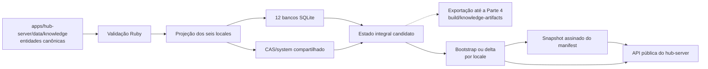
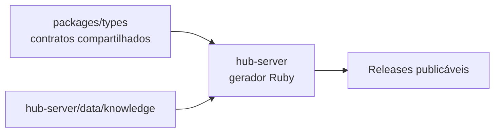

# Parte 3: Dados Públicos E Publicação

## Objetivo

Fazer `apps/hub-server` concentrar os dados públicos, gerar os artefatos de
referência por locale e publicar releases globais de conhecimento completas e
assinadas.

Cada release coordena seis pares `system` e `system_media` sob a mesma versão,
com `CAS/system` compartilhado. Esta parte depende da
[base Rails](./02-rails-api-contracts.md) e segue os [contratos comuns](./README.md).

## Fluxo Da Parte



## Dados Públicos

Modelar e validar:

- raças;
- fabricantes;
- produtos;
- princípios ativos;
- condições clínicas;
- protocolos públicos;
- mídias públicas associadas aos catálogos.

`apps/hub-server` possui operacionalmente os dados fonte públicos e a geração dos
artefatos. `packages/types` conserva contratos compartilhados, sem armazenar o
catálogo publicado.

Os dados fonte ficam organizados por domínio e entidade:

```text
apps/hub-server/data/knowledge/
├── breeds/
│   ├── canine/
│   │   └── <entity>.json
│   └── feline/
│       └── <entity>.json
├── manufacturers/
│   └── <entity>.json
├── products/
│   └── <entity>.json
├── active_ingredients/
│   └── <entity>.json
├── conditions/
│   └── <entity>.json
├── protocols/
│   └── <entity>.json
└── media/
    └── <entity>.json
```

Cada arquivo contém uma entidade canônica. IDs, relações, classificações,
regiões, identificadores regulatórios e referências CAS aparecem uma única vez.
Nomes localizados, aliases, descrições, seções editoriais, legendas e textos
alternativos ficam em `localizations` quando forem traduzíveis naquele domínio.

`localizations` é um objeto indexado pelo locale, e não uma lista:

```json
{
  "id": "<uuid-estavel>",
  "species": ["canine"],
  "regions": ["BRA", "PRT"],
  "media": ["<sha256>"],
  "localizations": {
    "pt-BR": {
      "name": "Pastor Alemão",
      "aliases": ["capa-preta"],
      "description": "<conteúdo localizado>"
    },
    "pt-PT": {
      "name": "Pastor-alemão",
      "aliases": [],
      "description": "<conteúdo localizado>"
    },
    "gn-PY": {
      "name": "<conteúdo localizado>",
      "aliases": [],
      "description": "<conteúdo localizado>"
    },
    "en-US": {
      "name": "German Shepherd",
      "aliases": ["Alsatian"],
      "description": "<localized content>"
    },
    "es-ES": {
      "name": "Pastor alemán",
      "aliases": [],
      "description": "<contenido localizado>"
    },
    "fr-FR": {
      "name": "Berger allemand",
      "aliases": [],
      "description": "<contenu localisé>"
    }
  }
}
```

Cada domínio possui um schema que declara seus campos estruturais, campos
localizados obrigatórios e campos localizados opcionais. Nomes próprios,
denominações científicas e marcas que não exigem tradução permanecem no nível
estrutural. Relações usam IDs estáveis e nunca nomes localizados. Regiões definem
aplicabilidade de domínio e não controlam em quais bancos localizados a entidade
existe.

A validação exige exatamente as seis chaves de locale em cada entidade e recusa
ID duplicado, referência inexistente, locale desconhecido, campo estrutural
localizado ou campo traduzível fora de `localizations`. A projeção de cada locale
combina a estrutura comum com a localização correspondente, produzindo o mesmo
conjunto de IDs e relações não localizáveis nos seis bancos.

## Fronteira Com A Preparação Local

O gerador Ruby produz primeiro um estado integral candidato, composto pelos seis
pares de bancos finais e pela união CAS referenciada. A publicação transforma
esse estado em uma release pública:

- uma nova geração produz um bootstrap completo por locale;
- uma revisão compara cada locale com a release anterior e produz um delta por
  locale;
- os pacotes, patches e manifests são derivados e validados no `hub-server`.

Nesta parte, a posse operacional da geração fica integralmente no
`apps/hub-server`:



Para concluir essa transferência:

- mover as entidades canônicas para `apps/hub-server/data/knowledge/`;
- implementar em Ruby a validação, projeção, geração dos bancos e montagem do
  `CAS/system`;
- comparar uma geração Ruby com fixtures e checksums lógicos produzidos pela
  preparação local;
- remover `scripts/knowledge-artifacts/` depois da equivalência validada;
- remover os catálogos publicados de `packages/types`, conservando somente
  contratos, tipos e utilitários compartilhados;
- impedir que o `hub-server` invoque o gerador local em TypeScript como etapa de
  produção.

Ao concluir esta parte, existe um único gerador operacional e uma única fonte
canônica dos dados publicados, ambos pertencentes ao `hub-server`. O app ainda
mantém sua integração local até a refatoração de consumo da Parte 4.

A `build_version` inteira usada na preparação local identifica somente uma saída
de desenvolvimento ou build. Ela não entra no manifest público e não determina
`generation` ou `revision`. A release pública recebe sua identidade dentro do
`hub-server`.

## Comandos Operacionais

```text
rails knowledge:validate
rails knowledge:build_system
rails knowledge:build_system_media
rails knowledge:build_cas_system
rails knowledge:build_database_patches
rails knowledge:build_release_components
rails knowledge:build_release_package
rails knowledge:export_workspace
rails knowledge:publish_release
rails knowledge:promote_channel
rails knowledge:replicate_manifests
```

`knowledge:publish_release` orquestra geração, validação e publicação do conteúdo
imutável. `knowledge:promote_channel` cria o próximo snapshot assinado e troca o
ponteiro do canal. Uma execução repetida com a mesma entrada, versão e
configuração produz os mesmos artefatos e reutiliza objetos CAS existentes.
`knowledge:replicate_manifests` retoma cópias pendentes sem alterar o snapshot, a
sequência ou a release do canal.

`knowledge:export_workspace` materializa, a partir da geração Ruby, o layout
`build/knowledge-artifacts` consumido pelo app ao final da Parte 1. Essa tarefa
mantém o desenvolvimento e os builds executáveis durante esta parte sem
preservar o gerador independente ou duplicar dados fonte. Ela não publica
release, não cria outra identidade de versão e é retirada na Parte 4, quando o
app passa a consumir a API.

Os comandos de build e publicação operam sobre o conjunto completo de seis
locales. Não existe publicação parcial de um locale sob uma versão global.

## Versão Global

A versão de conhecimento possui dois inteiros:

```text
generation.revision
```

Exemplos:

```text
1.0  bootstrap completo da geração 1
1.1  delta de 1.0 para 1.1
1.2  delta de 1.1 para 1.2
2.0  bootstrap completo consolidado da geração 2
2.1  delta de 2.0 para 2.1
```

`1.10` representa geração `1`, revisão `10`. Versões são comparadas como pares de
inteiros, nunca como números decimais. O par é globalmente único e uma release
pode ser promovida para mais de um canal.

Uma versão é criada somente quando o conjunto público está pronto para ser
entregue aos apps. Alterações editoriais ainda não publicadas permanecem fora da
cadeia pública.

## Artefatos De Bootstrap

Uma release `generation.0` produz seis pacotes:

```text
knowledge-bootstrap-2.0-pt-BR-<release-id>.zip
knowledge-bootstrap-2.0-pt-PT-<release-id>.zip
knowledge-bootstrap-2.0-gn-PY-<release-id>.zip
knowledge-bootstrap-2.0-en-US-<release-id>.zip
knowledge-bootstrap-2.0-es-ES-<release-id>.zip
knowledge-bootstrap-2.0-fr-FR-<release-id>.zip
```

Cada pacote contém:

```text
knowledge-bootstrap-2.0-pt-BR-<release-id>.zip
├── release.json
├── databases/
│   ├── system.db
│   └── system_media.db
└── CAS/
    └── <hashes referenciados>
```

Os bancos são snapshots completos do locale. `CAS/` contém todos os objetos
referenciados pelo `system_media.db` daquele locale e versão. Objetos sem
referência não entram no pacote. O mesmo objeto pode aparecer em mais de um ZIP,
mas converge para um único arquivo no CAS compartilhado do app e do servidor.

## Artefatos De Delta

Uma release com revisão positiva produz seis pacotes equivalentes a:

```text
knowledge-delta-2.2-pt-BR-<release-id>.zip
```

O pacote contém:

```text
knowledge-delta-2.2-pt-BR-<release-id>.zip
├── release.json
├── database-patches/
│   ├── system.bsdiff
│   └── system_media.bsdiff
└── CAS/
    └── <objetos adicionados, quando houver>
```

Patches de banco usam `bsdiff_v1`, compatível com BSDIFF40, sobre os bytes exatos
dos bancos da release anterior. Cada descritor declara:

- checksum SHA-256 exigido da base;
- checksum SHA-256 do patch compactado;
- checksum SHA-256 do banco final;
- tamanho do patch e do banco final;
- formato e caminho interno do patch.

O delta CAS contém somente objetos adicionados ao locale na revisão. Remoções
acontecem pela retirada de referências em seu `system_media`; objetos físicos
permanecem no cofre para permitir rollback e são tratados por uma rotina
posterior de garbage collection.

Cada locale da release sempre descreve os três componentes. `cas_system` usa
`deliveryMode: unchanged` quando seu conjunto não muda e `index_only` quando a
mudança ocorre apenas pela retirada de referências. Esses modos não publicam um
arquivo artificial.

Os doze bancos sempre recebem a nova versão e seu locale em
`knowledge_release_metadata`. Consequentemente, toda revisão delta publica um
patch para `system` e outro para `system_media` em cada locale, mesmo quando a
alteração adicional de um deles é vazia.

## Manifest De Conhecimento

O payload assinado contém todos os locales. O exemplo detalha `pt-BR`; `pt-PT`,
`gn-PY`, `en-US`, `es-ES` e `fr-FR` repetem a mesma estrutura e são obrigatórios
no documento publicado:

```json
{
  "schemaVersion": 1,
  "snapshotId": "<snapshot-uuid-stable-42>",
  "manifestSequence": 42,
  "releaseId": "<uuid-2.2>",
  "currentVersion": {
    "generation": 2,
    "revision": 2
  },
  "channel": "stable",
  "supportedAppVersions": {
    "min": "0.2.0",
    "max": null
  },
  "supportedLocales": [
    "pt-BR",
    "pt-PT",
    "gn-PY",
    "en-US",
    "es-ES",
    "fr-FR"
  ],
  "locales": {
    "pt-BR": {
      "bootstrap": {
        "releaseId": "<uuid-2.0>",
        "version": {
          "generation": 2,
          "revision": 0
        },
        "package": {
          "locale": "pt-BR",
          "artifactType": "knowledge_bootstrap_package",
          "descriptorPath": "release.json",
          "descriptorChecksumSha256": "<release-json-sha256>",
          "checksumSha256": "<bootstrap-package-sha256>",
          "sizeBytes": 123456,
          "signature": "<signature>"
        },
        "components": {
          "system": {
            "deliveryMode": "snapshot",
            "entryPath": "databases/system.db",
            "entryChecksumSha256": "<system-2.0-sha256>",
            "entrySizeBytes": 123456,
            "schemaVersion": 1,
            "targetChecksumSha256": "<system-2.0-sha256>",
            "targetSizeBytes": 123456
          },
          "systemMedia": {
            "deliveryMode": "snapshot",
            "entryPath": "databases/system_media.db",
            "entryChecksumSha256": "<system-media-2.0-sha256>",
            "entrySizeBytes": 123456,
            "schemaVersion": 1,
            "targetChecksumSha256": "<system-media-2.0-sha256>",
            "targetSizeBytes": 123456
          },
          "casSystem": {
            "deliveryMode": "snapshot",
            "entryPrefix": "CAS/",
            "targetSetDigestSha256": "<sorted-hash-set-sha256>",
            "artifactHashCount": 1234,
            "targetHashCount": 1234
          }
        }
      },
      "deltas": [
        {
          "releaseId": "<uuid-2.1>",
          "fromVersion": {
            "generation": 2,
            "revision": 0
          },
          "toVersion": {
            "generation": 2,
            "revision": 1
          },
          "package": {
            "locale": "pt-BR",
            "artifactType": "knowledge_delta_package",
            "descriptorPath": "release.json",
            "descriptorChecksumSha256": "<release-json-sha256>",
            "checksumSha256": "<delta-package-sha256>",
            "sizeBytes": 17845,
            "signature": "<signature>"
          },
          "components": {
            "system": {
              "deliveryMode": "patch",
              "entryPath": "database-patches/system.bsdiff",
              "entryChecksumSha256": "<system-patch-sha256>",
              "entrySizeBytes": 2500,
              "patchFormat": "bsdiff_v1",
              "baseChecksumSha256": "<system-2.0-sha256>",
              "targetChecksumSha256": "<system-2.1-sha256>",
              "targetSizeBytes": 124000
            },
            "systemMedia": {
              "deliveryMode": "patch",
              "entryPath": "database-patches/system_media.bsdiff",
              "entryChecksumSha256": "<system-media-patch-sha256>",
              "entrySizeBytes": 3000,
              "patchFormat": "bsdiff_v1",
              "baseChecksumSha256": "<system-media-2.0-sha256>",
              "targetChecksumSha256": "<system-media-2.1-sha256>",
              "targetSizeBytes": 124000
            },
            "casSystem": {
              "deliveryMode": "patch",
              "entryPrefix": "CAS/",
              "baseSetDigestSha256": "<cas-2.0-set-digest>",
              "targetSetDigestSha256": "<cas-2.1-set-digest>",
              "artifactHashCount": 42,
              "targetHashCount": 1276
            }
          }
        },
        {
          "releaseId": "<uuid-2.2>",
          "fromVersion": {
            "generation": 2,
            "revision": 1
          },
          "toVersion": {
            "generation": 2,
            "revision": 2
          },
          "package": {
            "locale": "pt-BR",
            "artifactType": "knowledge_delta_package",
            "descriptorPath": "release.json",
            "descriptorChecksumSha256": "<release-json-sha256>",
            "checksumSha256": "<delta-package-sha256>",
            "sizeBytes": 8989,
            "signature": "<signature>"
          },
          "components": {
            "system": {
              "deliveryMode": "patch",
              "entryPath": "database-patches/system.bsdiff",
              "entryChecksumSha256": "<system-patch-sha256>",
              "entrySizeBytes": 400,
              "patchFormat": "bsdiff_v1",
              "baseChecksumSha256": "<system-2.1-sha256>",
              "targetChecksumSha256": "<system-2.2-sha256>",
              "targetSizeBytes": 124100
            },
            "systemMedia": {
              "deliveryMode": "patch",
              "entryPath": "database-patches/system_media.bsdiff",
              "entryChecksumSha256": "<system-media-patch-sha256>",
              "entrySizeBytes": 1800,
              "patchFormat": "bsdiff_v1",
              "baseChecksumSha256": "<system-media-2.1-sha256>",
              "targetChecksumSha256": "<system-media-2.2-sha256>",
              "targetSizeBytes": 125000
            },
            "casSystem": {
              "deliveryMode": "patch",
              "entryPrefix": "CAS/",
              "baseSetDigestSha256": "<cas-2.1-set-digest>",
              "targetSetDigestSha256": "<cas-2.2-set-digest>",
              "artifactHashCount": 18,
              "targetHashCount": 1294
            }
          }
        }
      ]
    }
  },
  "deliverySources": {
    "bootstrap": [
      {
        "provider": "hub_server",
        "priority": 1,
        "enabled": true,
        "transport": "http",
        "urlPattern": "/api/v1/knowledge/releases/{releaseId}/locales/{locale}/package"
      },
      {
        "provider": "github",
        "priority": 2,
        "enabled": false,
        "transport": "http",
        "urlPattern": "https://<github-assets-base>/knowledge-bootstrap-{generation}.{revision}-{locale}-{releaseId}.zip"
      },
      {
        "provider": "cloudflare_r2",
        "priority": 3,
        "enabled": false,
        "transport": "http",
        "urlPattern": "https://<r2-assets-base>/knowledge-bootstrap-{generation}.{revision}-{locale}-{releaseId}.zip"
      },
      {
        "provider": "gitlab",
        "priority": 4,
        "enabled": false,
        "transport": "http",
        "urlPattern": "https://<gitlab-assets-base>/knowledge-bootstrap-{generation}.{revision}-{locale}-{releaseId}.zip"
      }
    ],
    "delta": [
      {
        "provider": "hub_server",
        "priority": 1,
        "enabled": true,
        "transport": "http",
        "urlPattern": "/api/v1/knowledge/releases/{releaseId}/locales/{locale}/package"
      },
      {
        "provider": "github",
        "priority": 2,
        "enabled": false,
        "transport": "http",
        "urlPattern": "https://<github-assets-base>/knowledge-delta-{generation}.{revision}-{locale}-{releaseId}.zip"
      },
      {
        "provider": "cloudflare_r2",
        "priority": 3,
        "enabled": false,
        "transport": "http",
        "urlPattern": "https://<r2-assets-base>/knowledge-delta-{generation}.{revision}-{locale}-{releaseId}.zip"
      },
      {
        "provider": "gitlab",
        "priority": 4,
        "enabled": false,
        "transport": "http",
        "urlPattern": "https://<gitlab-assets-base>/knowledge-delta-{generation}.{revision}-{locale}-{releaseId}.zip"
      }
    ]
  },
  "cas": {
    "branch": "system",
    "indexDatabase": "system_media",
    "hashAlgorithm": "sha256",
    "hashEncoding": "hex",
    "objects": {
      "pathTemplate": "CAS/system/{hash}",
      "sources": []
    }
  },
  "publishedAt": "2026-08-13T12:00:00Z",
  "expiresAt": "2026-08-20T12:00:00Z",
  "changelog": []
}
```

O envelope `authenticity` definido no índice envolve o payload inteiro.
`deliverySources` resolve cada pacote obrigatoriamente por `{releaseId}` e
`{locale}`. `{generation}` e `{revision}` podem compor o nome legível do arquivo,
mas não são a identidade completa usada pelo resolver.
`cas.objects.sources[]` permanece um contrato separado para reconciliação por
`{hash}`.

O `release.json` interno usa a mesma identidade, versão, locale, tipo de pacote e
descritores de componentes declarados no item correspondente do manifest. Seu
campo `artifactHashes` lista, em ordem lexicográfica e sem duplicatas, cada hash
presente sob `CAS/`. `artifactHashCount` deve ser igual ao tamanho dessa lista.

Sources previstas inicialmente:

```text
hub_server       priority 1  enabled true
github           priority 2  enabled false
cloudflare_r2    priority 3  enabled false
gitlab           priority 4  enabled false
ipfs             priority 5  enabled false, somente objects
```

IPFS usa `cidField` para localizar o CID no índice de mídia. O app sempre valida
o conteúdo recebido pelo SHA-256 local, independentemente do provider.

As manifest sources formam uma configuração de descoberta separada:

```text
hub_server       priority 1  enabled true
github           priority 2  enabled false
cloudflare_r2    priority 3  enabled false
gitlab           priority 4  enabled false
```

Cada manifest source define `currentUrlPattern`, `snapshotUrlPattern` e
`requiredForHealthyChannel`. O caminho `current` entrega o snapshot assinado
vigente do canal. O caminho de snapshot inclui `{channel}`, `{sequence}` e
`{snapshotId}` e permanece imutável.

Os padrões da source `hub_server` são:

```text
/api/v1/knowledge/manifest?channel={channel}&app_name={appName}&app_version={appVersion}
/api/v1/knowledge/channels/{channel}/manifests/{sequence}/{snapshotId}
```

Uma source estática usa:

```text
manifests/{channel}/current.json
manifests/{channel}/{sequence}-{snapshotId}.json
```

A configuração não integra o payload do manifest, pois o app precisa conhecê-la
antes da descoberta. Os providers recebem os bytes canônicos produzidos pelo Hub
e não executam serialização ou assinatura próprias.

Os padrões da source `hub_server` seguem:

```text
/api/v1/knowledge/releases/{releaseId}/locales/{locale}/package
/api/v1/cas/system/{hash}
```

Cada provider aparece uma vez em `deliverySources.bootstrap` e uma vez em
`deliverySources.delta`. Os itens de `locales[locale].bootstrap` e
`locales[locale].deltas[]` informam versão, locale, pacote, integridade e estado
dos componentes; a URL efetiva resulta da substituição dos placeholders na
source habilitada.

## Snapshots De Canal

`KnowledgeRelease` não pertence a um canal. Depois que uma release está
publicada, ela pode ser promovida para qualquer canal compatível.

Cada promoção cria um `KnowledgeManifestSnapshot` com:

- `snapshotId` imutável;
- `manifestSequence` inteiro, positivo e imediatamente posterior ao vigente;
- release publicada selecionada pelo canal;
- sources vigentes capturadas no payload;
- `publishedAt` e `expiresAt` assinados;
- checksum, assinatura e `keyId`.

Uma alteração somente de source ou validade cria outro snapshot apontando para a
mesma release. A sequência é alocada sob lock do canal. Persistência do snapshot
e troca de `KnowledgeChannelRelease` ocorrem na mesma transação.

A transação também grava uma outbox para replicação. Cada worker publica
exatamente o documento persistido no caminho imutável da source, atualiza o
caminho `current` e lê novamente a resposta para conferir tamanho e checksum.
Falhas registram a réplica como pendente ou falha e são retomadas de forma
idempotente.

A transação do banco e a publicação em providers externos não formam uma
transação distribuída. O Hub oferece o novo snapshot imediatamente após a
promoção, enquanto as réplicas convergem. Quando houver source externa marcada
como obrigatória, o canal só é considerado saudável quando ela e a source
`hub_server` entregam o mesmo checksum. Uma réplica anterior ainda vigente é
segura durante essa janela, e o atraso gera diagnóstico operacional.

Um job periódico renova canais cujo snapshot se aproxima de `expiresAt`. A
renovação cria a próxima sequência para a mesma release usando as sources
vigentes. Falha de assinatura ou publicação conserva o snapshot e o ponteiro
atuais e gera alerta operacional antes da expiração.

## Cadeia De Releases

- Cada bootstrap de locale possui revisão zero e não depende de outra release.
- Todo delta de locale aponta para a revisão imediatamente anterior da mesma
  geração.
- A cadeia publicada não contém revisões ausentes ou duplicadas.
- Cada locale declara seus três componentes e o estado final na versão.
- Os doze bancos registram geração, revisão e locale em
  `knowledge_release_metadata`.
- A base de cada patch coincide com o checksum final do componente anterior.
- O digest CAS de cada locale é calculado sobre a lista ordenada dos hashes
  referenciados por seu `system_media`.
- `artifactHashCount` conta objetos transportados no pacote do locale;
  `targetHashCount` conta hashes referenciados no estado final daquele locale.
- O último delta de cada locale termina exatamente em `currentVersion`.
- O manifest contém, para cada locale, somente o bootstrap da geração vigente e
  os deltas necessários até a versão atual.

## Consolidação

Uma nova geração é publicada quando a política operacional determina. A decisão
considera:

- período desde o bootstrap vigente;
- quantidade de deltas acumulados;
- soma dos tamanhos dos deltas em relação ao bootstrap;
- mudanças relevantes nos schemas;
- custo de instalação e recuperação para clientes novos ou atrasados.

Cada bootstrap consolidado contém o par de bancos final de seu locale e apenas os
objetos CAS referenciados pelo respectivo `system_media`. A geração começa em
revisão zero para os seis locales. Mudança incompatível de schema exige nova
geração e faixa de versões de app compatível. Mudança aditiva somente entra como
delta quando os apps suportados conseguem consumir o schema resultante.

O Hub conserva os doze bancos finais exatos das revisões publicadas na cadeia
vigente. Esses arquivos são as bases imutáveis usadas para gerar e verificar
patches posteriores.

## Publicação Da Release

```text
criar KnowledgeRelease em draft
-> criar os seis KnowledgeReleaseLocale
-> gerar os seis pares de bancos e a união CAS em staging
-> validar IDs e relações estruturais equivalentes entre locales
-> gerar bancos completos ou patches para cada locale conforme release_kind
-> calcular checksums, tamanhos e digest CAS de cada locale
-> criar os três KnowledgeReleaseComponent de cada locale
-> gerar um release.json canônico por locale
-> montar e validar os seis ZIPs
-> criar KnowledgeArtifact e KnowledgeReleasePackage para cada locale
-> validar os doze bancos finais e todos os objetos CAS
-> materializar no armazenamento persistente do Hub os objetos CAS ausentes
-> validar a cadeia global e os estados de todos os locales
-> mudar release para published
```

Publicar a release não modifica `KnowledgeChannelRelease` nem cria um manifest.

## Promoção Do Canal

```text
selecionar uma KnowledgeRelease publicada
-> adquirir lock do canal
-> alocar a próxima manifestSequence
-> carregar as KnowledgeDeliverySource e KnowledgeCasObjectSource vigentes
-> montar o payload canônico com release e sources vigentes
-> definir publishedAt e expiresAt
-> assinar e verificar o KnowledgeManifestSnapshot
-> persistir o snapshot e trocar KnowledgeChannelRelease na mesma transação
-> gravar outbox para as manifest sources habilitadas
-> publicar os mesmos bytes nos caminhos imutável e current
-> verificar checksum de cada réplica
-> confirmar a saúde do canal conforme as sources obrigatórias
```

Nenhum arquivo de staging fica publicamente acessível antes da conclusão. Falha
na publicação deixa a release indisponível. Falha anterior à confirmação da
transação de promoção preserva o snapshot e o ponteiro vigentes. Falha posterior
em uma réplica conserva o novo snapshot no Hub, marca o canal como degradado e
aciona retry sem gerar outra sequência.

## Regras De Publicação

- Todos os artefatos obrigatórios existem antes de publicar.
- Os seis locales obrigatórios pertencem à mesma versão global.
- Cada locale possui exatamente um pacote e três componentes.
- Os doze bancos registram a mesma versão global e o locale correspondente em
  `knowledge_release_metadata`.
- IDs e relações não localizáveis permanecem equivalentes entre locales.
- Patches reproduzem exatamente os checksums finais declarados.
- Hash, tamanho e assinatura de cada pacote correspondem aos bytes entregues.
- Cada `release.json` corresponde à release e ao locale declarados no manifest.
- `artifactHashes` corresponde exatamente às entradas CAS do pacote do locale.
- Todas as delivery sources resolvem os mesmos pacotes imutáveis.
- URLs habilitadas usam providers, hosts e transports permitidos.
- O manifest é gerado a partir dos registros normalizados.
- `manifestSequence` incrementa exatamente uma unidade em relação ao snapshot
  vigente do canal.
- `expiresAt` é posterior a `publishedAt` e respeita a duração máxima configurada.
- A source `hub_server` para objeto individual somente é habilitada quando o
  armazenamento persistente do Hub contém todos os hashes da release.
- O snapshot assinado persiste exatamente os bytes devolvidos pela API.
- Uma release publicada não aceita alterações em artefatos ou componentes.
- Um snapshot publicado não aceita alterações de payload, sources, validade ou
  assinatura.
- Somente o Hub aloca `manifestSequence` e assina snapshots.
- Toda réplica contém exatamente os bytes canônicos persistidos no Hub.
- O caminho `current` nunca contém um ponteiro sem assinatura nem depende de
  resolução `latest`.
- Falha de réplica não cria nova sequência e é retomada pela outbox.
- Retirada ou substituição altera os ponteiros por meio de novo snapshot, sem
  reescrever snapshots existentes.

## Testes

Cobrir:

- equivalência lógica entre a última fixture da preparação local e a primeira
  geração Ruby;
- ausência do gerador independente depois da transferência validada;
- ausência de catálogos publicados em `packages/types`;
- exportação do layout local pelo gerador Ruby em um workspace limpo;
- inicialização do app com os artefatos exportados durante esta parte;
- validação dos schemas canônicos por domínio;
- uma entidade por ID e integridade de todas as referências estruturais;
- mapa `localizations` completo e restrito aos seis locales suportados;
- projeção isolada de cada localização sem alterar campos estruturais;
- recusa de campos estruturais divergentes entre traduções;
- geração e integridade dos bancos finais;
- geração dos seis pares de bancos;
- igualdade de IDs e relações estruturais entre locales;
- recusa de locale ausente, desconhecido ou incompleto;
- geração dos seis bootstraps na mesma versão global;
- geração e verificação de `release.json` por locale;
- geração de seis ZIPs por release;
- geração e aplicação de patch binário para cada banco;
- patches dos doze bancos em toda revisão;
- componente CAS `index_only` e `unchanged` sem artefato;
- geração do delta CAS e digest do conjunto final;
- consolidação em nova geração;
- materialização segura do CAS persistente do Hub;
- recusa de revisão ausente, duplicada ou com predecessor incorreto;
- recusa de patch com base ou resultado divergente;
- recusa de conjunto CAS incompatível com o `system_media` do locale;
- geração canônica e assinatura do manifest;
- promoção da mesma release para mais de um canal;
- snapshot posterior para a mesma release após alteração de source;
- sequência concorrente sob lock, expiração e recusa de validade excessiva;
- publicação e verificação das réplicas de manifest;
- retry idempotente de réplica sem alteração de sequência;
- source `current` contendo exatamente o snapshot canônico;
- atraso de réplica mantendo o canal disponível pelo Hub;
- renovação antecipada para a mesma release e alerta diante de falha;
- recusa de assinatura inválida;
- recusa de source habilitada com destino não permitido;
- fallback do pacote completo entre delivery sources habilitadas;
- publicação idempotente completa;
- preservação do canal diante de falha parcial;
- imutabilidade após publicação;
- resolução de pacotes de locale e objetos individuais pela API pública;
- resolução do pacote exclusivamente pelo par `releaseId` e `locale`.

## Critérios De Aceite

- O `hub-server` possui e valida os dados públicos.
- O gerador Ruby é o único gerador operacional dos artefatos públicos.
- Os catálogos publicados pertencem somente a
  `apps/hub-server/data/knowledge/`.
- O gerador Ruby consegue materializar a saída local necessária ao app até a
  Parte 4.
- Os dados fonte são organizados por domínio e entidade, com campos localizados
  reunidos no mapa `localizations` de cada entidade.
- Toda versão coordena os seis pares de bancos e o `CAS/system` compartilhado.
- A versão usa geração e revisão inteiras.
- Os doze bancos registram a mesma versão global e seus respectivos locales.
- Cada bootstrap instala o estado completo de um locale na geração.
- Os deltas de cada locale formam uma cadeia contínua até `currentVersion`.
- Cada release é distribuída por seis pacotes, um para cada locale.
- Sources são declaradas uma vez por provider e tipo de entrega.
- Todo patch de banco exige a base correta e produz o checksum final esperado.
- Cada `system_media.db` descreve o conjunto CAS final de seu locale.
- O manifest representa separadamente as versões técnicas dos bancos.
- O armazenamento persistente do Hub resolve todos os hashes antes de habilitar
  sua source individual.
- O manifest é assinado e verificável pelas chaves confiáveis do app.
- O mesmo manifest assinado é resolvível pela source principal e, quando
  configurada, por uma source externa habilitada.
- Publicar uma release não altera canais.
- A promoção cria um snapshot sequencial e troca o canal de forma transacional.
- A replicação externa é verificável, idempotente e observável.
- Release ou snapshot canônico incompleto não se torna visível pelo Hub.

## Próxima Parte

[Parte 4: Consumo dos artefatos nos apps](./04-app-artifact-consumption.md)
