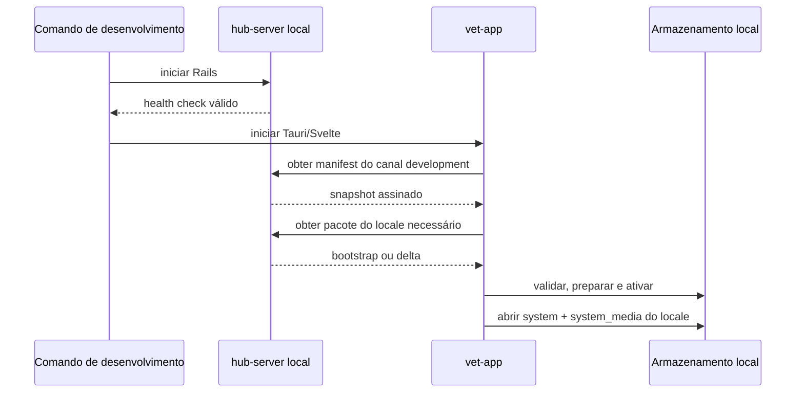
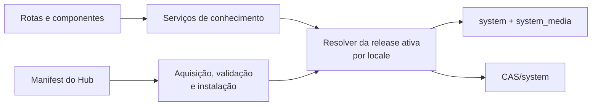

# Parte 4: Consumo Dos Artefatos Nos Apps

## Objetivo

Adaptar os apps e os packages compartilhados responsáveis por distribuição para
consumir releases globais de conhecimento por manifest e baixar somente os
locale packs necessários.

Cada atualização prepara e ativa o par `system` e `system_media` de um locale sob
a mesma versão, usando o `CAS/system` compartilhado. Esta parte consome a
publicação definida na [Parte 3](./03-public-knowledge-publication.md).

## Escopo

- consultar e verificar o manifest de conhecimento;
- aplicar fallback entre manifest sources conhecidas e permitidas;
- comparar versões como pares inteiros de geração e revisão;
- impedir replay, downgrade e schema incompatível;
- selecionar os locales necessários para o app;
- baixar um pacote por locale, bootstrap ou revisão delta;
- instalar snapshots completos de `system` e `system_media` a partir do bootstrap;
- aplicar os dois patches binários contidos em cada delta;
- incorporar as entradas `CAS/<hash>` do mesmo pacote;
- manter os bancos de sistema em modo somente leitura;
- reconciliar objetos ausentes pelo índice `system_media` do locale;
- ativar o par de bancos do locale e seu conjunto CAS como unidade indivisível;
- aplicar fallback somente entre sources habilitadas;
- retomar atualizações interrompidas;
- substituir no app a resolução direta de `build/knowledge-artifacts` pelo
  consumo de releases publicadas no `hub-server`;
- subir o `hub-server` local como parte do fluxo padrão de desenvolvimento;
- integrar o fluxo ao desenvolvimento e aos builds empacotáveis.

## Fluxo Da Parte



A refatoração desta parte altera deliberadamente a aquisição e a instalação dos
artefatos no app. A API pública usada pelas consultas de conhecimento pode
preservar seus contratos, mas sua resolução passa a apontar para a release ativa
instalada, e não para a saída local da Parte 1C.



## Estado Local

Persistir por canal:

```text
accepted_manifest_snapshot_id
highest_manifest_sequence
accepted_manifest_checksum_sha256
accepted_manifest_expires_at
verified_manifest_key_id
accepted_manifest_source_provider
```

Persistir por locale instalado:

```text
locale
active_knowledge_release_id
active_knowledge_generation
active_knowledge_revision
system_schema_version
system_media_schema_version
system_checksum_sha256
system_media_checksum_sha256
cas_set_digest_sha256
```

O cache HTTP de cada manifest source persiste separadamente `ETag`, instante da
última tentativa e resultado da última validação. Esses dados são diagnósticos e
otimizações de transporte; nunca substituem sequência, assinatura ou expiração.

Staging mantém separadamente por locale:

```text
prepared_locale
prepared_knowledge_release_id
prepared_knowledge_generation
prepared_knowledge_revision
prepared_system_checksum_sha256
prepared_system_media_checksum_sha256
prepared_cas_set_digest_sha256
```

O estado ativo de um locale muda somente depois da validação completa de seu par.
O estado preparado permite retomar a cadeia sem apresentar uma revisão
intermediária ao app. A sequência aceita do manifest continua única por canal,
independentemente de quantos locales estão instalados.

A organização lógica local é:

```text
knowledge/
├── locales/
│   └── <locale>/
│       ├── active
│       ├── staging/
│       └── releases/
│           └── <releaseId>/
│               ├── veterinary_clinic_system.db
│               └── veterinary_clinic_system_media.db
└── CAS/
    └── system/
        └── <hashes SHA-256>
```

`active` é um ponteiro atômico próprio do locale. O cofre CAS é compartilhado
entre todos eles.

## Descoberta Do Manifest

O app recebe em sua configuração de distribuição uma lista mínima de manifest
sources permitidas por canal. A lista começa com `hub_server` e pode habilitar
GitHub e outros providers implementados. Ela não é carregada a partir do próprio
manifest.

Cada item local declara somente o necessário para a descoberta:

```text
provider
priority
enabled
currentUrlPattern
allowedHosts
```

`currentUrlPattern` pode usar `{channel}`, `{appName}` e `{appVersion}`. A source
estática pode ignorar os dois últimos valores; nesse caso, o próprio app executa
a validação de compatibilidade declarada no snapshot.

Para cada consulta:

```text
ordenar manifest sources habilitadas por prioridade
-> consultar a primeira com timeout e limite de resposta
-> aceitar 304 somente quando o snapshot em cache continua vigente
-> validar integralmente a resposta recebida
-> encerrar no primeiro snapshot aceitável
-> tentar a próxima source diante de falha ou snapshot inaceitável
-> conservar a release ativa quando nenhuma source produz snapshot aceitável
```

Indisponibilidade, timeout, erro HTTP, estrutura inválida, assinatura inválida,
expiração, sequência regressiva ou sequência repetida divergente acionam a
próxima source e geram diagnóstico. Uma resposta válida da source prioritária
encerra a descoberta; o app não consulta todos os providers para procurar uma
sequência maior.

As sources externas entregam o mesmo documento assinado em
`manifests/<channel>/current.json`. O app pode registrar qual provider respondeu,
mas a confiança decorre exclusivamente da assinatura, da sequência e das
invariantes do payload.

## Validação Do Manifest

Antes de usar URLs ou metadados, o app:

1. limita o tamanho da resposta;
2. valida a estrutura JSON e `schemaVersion`;
3. canonicaliza o payload;
4. verifica `keyId` e assinatura Ed25519;
5. valida `snapshotId`, canal e faixa de versões suportadas;
6. valida `publishedAt`, `expiresAt` e a tolerância de relógio permitida;
7. recusa `manifestSequence` inferior à maior sequência aceita no canal;
8. para sequência igual, exige o mesmo `snapshotId` e checksum já persistidos;
9. interpreta geração e revisão como inteiros;
10. exige exatamente os seis locales suportados no manifest;
11. para cada locale instalado, recusa versão anterior à ativa;
12. valida o bootstrap, a cadeia de deltas e os três componentes de cada locale;
13. valida providers, prioridades, placeholders, checksums, tamanhos e formatos
    suportados.

O app conserva a release ativa quando qualquer etapa falha. Um snapshot expirado
não autoriza novo download, mas também não invalida a release já instalada.
Downgrade requer um comando explícito de recuperação e não acontece como
consequência de um manifest anterior servido por cache ou provider.

Uma sequência maior pode apontar para a mesma release ativa. Nesse caso, o app
persiste a identidade, o checksum, a expiração e as sources do novo snapshot sem
reinstalar bancos ou CAS. A maior sequência aceita nunca diminui, inclusive após
rollback de dados.

Depois de validar todo o manifest e antes de iniciar downloads, o app persiste
atomicamente a aceitação e o documento assinado completo do snapshot. Uma
interrupção posterior permite repetir a mesma sequência somente com o mesmo
`snapshotId` e checksum.

## Seleção De Locales

O conjunto necessário é formado pelo locale ativo da interface e pelos locales
marcados para uso offline. O app avalia e atualiza cada um separadamente. Um
locale não selecionado permanece apenas no manifest e não produz download.

Ao escolher um locale ainda não instalado, o app prepara seu bootstrap e deltas
antes de trocar o locale usado pelas consultas de conhecimento. Uma falha mantém
o locale anterior ativo. Pares anteriormente instalados podem ser conservados
para troca offline conforme a política de espaço local.

Todos os IDs de entidades permanecem iguais entre locales. Dados privados podem
referenciar esses IDs sem depender do banco localizado atualmente aberto.

## Escolha Do Caminho De Atualização

Para cada locale necessário:

```text
se não existe release ativa para o locale:
  preparar bootstrap da geração vigente
  aplicar todos os deltas posteriores em ordem

senão se active_generation do locale != current_generation:
  preparar bootstrap da geração vigente
  aplicar todos os deltas posteriores em ordem

senão se active_revision do locale < current_revision:
  preparar cópia dos bancos ativos
  aplicar deltas de active_revision + 1 até current_revision

senão se active_revision do locale == current_revision:
  verificar os bancos, reconciliar o CAS e encerrar sem download desnecessário

senão:
  recusar manifest anterior à versão ativa
```

Se a base local do locale não corresponde ao checksum exigido pelo primeiro
patch, o app descarta seu staging e usa o bootstrap da geração vigente. O CAS
local pode ser reaproveitado porque seus objetos são imutáveis e validados por
hash.

O app usa somente releases declaradas no manifest. Ele não tenta descobrir uma
revisão construindo URLs ausentes.

## Instalação Do Bootstrap

```text
resolver deliverySources.bootstrap com bootstrap.releaseId e locale
-> baixar knowledge-bootstrap-<generation>.0-<locale>-<releaseId>.zip para staging
-> limitar tamanho comprimido e descomprimido
-> validar checksum e assinatura do pacote
-> validar release.json pelo descriptorChecksumSha256
-> exigir identidade, versão, locale e componentes iguais aos do manifest
-> extrair somente as entradas declaradas
-> validar checksum dos bancos resultantes
-> executar PRAGMA integrity_check
-> conferir PRAGMA user_version com o manifest
-> conferir release, versão e locale em knowledge_release_metadata nos dois bancos
-> abrir os bancos em modo somente leitura
-> incorporar entradas CAS/<hash> no cofre compartilhado
-> validar digest do conjunto esperado pelo system_media preparado do locale
-> registrar staging do locale na versão generation.0
```

Os bancos ficam em um diretório versionado por locale. O pacote adiciona somente
objetos CAS ausentes e nunca substitui conteúdo válido existente.

## Aplicação Dos Deltas

Para cada delta, em ordem:

```text
exigir fromVersion == preparedVersion
-> validar os três componentes
-> resolver deliverySources.delta com delta.releaseId e locale
-> baixar knowledge-delta-<generation>.<revision>-<locale>-<releaseId>.zip
-> validar checksum e assinatura do pacote
-> validar release.json pelo descriptorChecksumSha256
-> exigir identidade, versão, locale e componentes iguais aos do manifest
-> extrair somente as entradas declaradas
-> exigir deliveryMode patch nos dois bancos
-> verificar baseChecksumSha256 de cada banco
-> localizar os dois patches por entryPath
-> validar entryChecksumSha256 e entrySizeBytes dos patches
-> aplicar bsdiff_v1 em novos arquivos temporários
-> validar targetChecksumSha256 e targetSizeBytes
-> executar PRAGMA integrity_check nos bancos resultantes
-> conferir schemaVersion e knowledge_release_metadata
-> incorporar CAS/<hash> quando deliveryMode é patch
-> aceitar ausência de entradas CAS somente para index_only ou unchanged
-> validar cada objeto CAS pelo SHA-256 de seu nome
-> calcular o digest do conjunto declarado pelo system_media resultante do locale
-> exigir targetSetDigestSha256
-> persistir preparedVersion = toVersion
```

O patch nunca é aplicado diretamente ao banco ativo ou ao arquivo preparado da
revisão anterior. A saída usa outro arquivo temporário e só substitui o estado de
staging depois da validação completa daquela revisão.

O adapter `bsdiff_v1` usa uma biblioteca Rust mantida e compatível com BSDIFF40.
A aplicação limita tempo, memória e tamanho de saída conforme `targetSizeBytes`;
o algoritmo de patch não é implementado manualmente no app. Fixtures douradas
garantem que geração e aplicação produzam os mesmos bytes entre as plataformas
suportadas.

`system` e `system_media` não recebem escritas de negócio. A abertura em modo
somente leitura preserva os bytes necessários para o próximo patch e impede
divergência silenciosa da cadeia.

## Ativação Atômica

Depois do último delta do locale:

```text
exigir preparedVersion == currentVersion
-> reconciliar todos os hashes do system_media preparado do locale
-> baixar individualmente qualquer objeto ausente
-> validar os checksums finais dos dois bancos
-> validar o digest final do conjunto CAS
-> sincronizar arquivos e diretórios de staging
-> trocar atomicamente o ponteiro da release ativa do locale
-> persistir os metadados ativos
-> abrir a nova release em modo somente leitura
-> conservar a release anterior para rollback
```

Os dois bancos de um locale nunca são substituídos individualmente. Uma falha
conserva a release ativa daquele locale e o staging válido para retomada. O
primeiro uso confirmado permite aplicar a política de retenção da release
anterior.

## Download E Fallback

- Sources são ordenadas por prioridade e filtradas por `enabled`.
- Manifest sources e delivery sources possuem listas, fallbacks e caches
  independentes.
- `primary_first` usa a source habilitada de maior prioridade e tenta as seguintes
  em erro.
- `balanced` pode distribuir objetos individuais entre providers habilitados.
- Cada pacote de locale usa fallback como uma unidade: a falha em uma source
  tenta o mesmo pacote completo na próxima `deliverySource` habilitada.
- Retry usa backoff curto, jitter e quantidade limitada de tentativas.
- `404` de um pacote ou objeto referenciado é erro de publicação e produz
  diagnóstico.
- Concorrência inicial por objetos fica entre quatro e oito downloads.
- Timeouts, redirects, tamanho máximo e espaço livre são verificados.
- Downloads parciais ficam em staging e podem ser retomados quando a source
  suporta ranges.

O app não depende de URL `latest`. Toda URL resolve uma release, versão ou
conteúdo imutável explicitamente declarado no manifest assinado. Pacotes usam
obrigatoriamente `releaseId` e `locale`; geração e revisão nunca bastam para
formar sua identidade.

## Extração Segura Do Pacote De Locale

Antes da extração, o app valida checksum, assinatura e tamanho do ZIP. Durante a
extração:

- aceita somente arquivos regulares;
- rejeita caminhos absolutos, `..`, links simbólicos e hard links;
- exige `release.json` na raiz;
- exige que release, versão e locale correspondam ao item do manifest;
- aceita somente os caminhos fixos declarados em `components.entryPath`;
- aceita objetos CAS somente sob `components.casSystem.entryPrefix`;
- exige que cada objeto CAS apareça em `release.json.artifactHashes` e rejeita
  hashes declarados sem entrada correspondente;
- limita quantidade de entradas e tamanho total descompactado;
- rejeita entradas duplicadas;
- extrai bancos e patches no staging da release;
- extrai objetos CAS em diretório temporário no mesmo filesystem do cofre;
- valida checksums dos bancos, patches e objetos antes do uso;
- move cada objeto validado atomicamente para `CAS/system/<hash>`;
- ignora objeto já presente somente depois de verificar seu conteúdo.

O pacote não pode conter entradas além da allowlist derivada do manifest e de
`release.json`. Arquivos temporários são removidos ou reaproveitados de forma
controlada após falha.

## Reconciliação CAS

O app lê os hashes esperados no `system_media.db` do locale preparado e compara
com o cofre compartilhado. Objetos ausentes ou inválidos são obtidos
individualmente usando `cas.objects.sources[]`.

Para cada objeto:

```text
validar hash solicitado
-> resolver source habilitada
-> baixar para arquivo temporário
-> limitar tamanho e redirects
-> calcular SHA-256 durante o streaming
-> comparar com o hash solicitado
-> sincronizar e mover atomicamente para o destino
```

Objetos não referenciados não bloqueiam a atualização. Garbage collection usa a
união de hashes de todos os locales ativos, stagings e releases retidas para
rollback. Ela é uma operação própria e nunca ocorre durante a ativação.

## Desenvolvimento E Build

O fluxo padrão de desenvolvimento sobe uma instância local do `hub-server`,
aguarda `GET /api/v1/health` e inicia o app configurado para o canal
`development`. Um comando raiz orquestra os dois processos sem tornar o Tauri
responsável pelo ciclo de vida do Rails:

```text
pnpm dev
├── hub-server
└── vet-app
```

O `hub-server` local possui uma release de desenvolvimento previamente gerada e
publicada. Requisições `GET` não disparam geração de bancos: uma tarefa explícita
do servidor valida os dados, gera a release e promove o canal local. O app
consulta e instala essa release pelo mesmo contrato de manifest e pacotes usado
nos demais ambientes.

Fixtures assinadas são usadas somente em testes automatizados. Chaves de
desenvolvimento não são aceitas em builds de produção. Se o Hub local estiver
indisponível, uma release já ativa continua utilizável; uma instalação sem
release ativa informa que o serviço de desenvolvimento precisa ser iniciado.

Ao concluir esta parte, o runtime do app não lê
`build/knowledge-artifacts`, não conhece o diretório dos dados fonte e não possui
um provider de pasta solta. A tarefa transitória
`rails knowledge:prepare_workspace` é removida. A fronteira de leitura resolve
exclusivamente o armazenamento de releases instaladas.

O pipeline do build empacotável declara uma lista não vazia de locales e obtém do
`hub-server` os respectivos bootstraps publicados e verificados. Os bootstraps
iniciais são incorporados como recursos do instalador; no primeiro uso, passam
pelo mesmo validador e instalador de releases antes da ativação. A união dos
objetos CAS é copiada sem duplicação. Ausência do Hub, de uma release publicada
ou de qualquer artefato obrigatório encerra o build com mensagem explícita.

## Testes

Cobrir:

- manifest válido, assinatura inválida e `keyId` desconhecido;
- fallback do manifest entre Hub e source estática externa;
- réplica externa com os mesmos bytes, atrasada, expirada e adulterada;
- `304` com cache vigente e com cache expirado;
- sequência nova para a mesma release sem reinstalação;
- sequência regressiva, sequência repetida divergente e snapshot expirado;
- tolerância limitada para relógio local e validade excessiva;
- comparação inteira de `1.9`, `1.10` e `2.0`;
- schema incompatível, replay e downgrade;
- `ETag`, `Cache-Control` e resposta sem alteração;
- seleção do locale ativo e de locales para uso offline;
- ausência de download para locale não selecionado;
- instalação transacional do bootstrap de locale;
- uma requisição de pacote por locale e release;
- resolução do pacote por `releaseId` e `locale` correspondentes;
- fallback do pacote de locale entre delivery sources;
- divergência entre manifest e `release.json`;
- divergência entre `artifactHashes` e as entradas CAS do pacote;
- atualização incremental dos dois bancos por patch;
- `knowledge_release_metadata` com release, versão e locale iguais nos dois bancos;
- base de patch incorreta e checksum final divergente;
- componente CAS `index_only` ou `unchanged` sem download;
- aplicação ordenada de múltiplos deltas de locale;
- recusa de revisão ausente ou fora de ordem;
- retomada a partir do staging preparado;
- fallback para bootstrap quando a base local diverge;
- validação do digest CAS contra o `system_media` do locale;
- deduplicação de objeto CAS compartilhado entre locales;
- garbage collection preservando a união dos locales e rollbacks;
- rollback antes e depois da troca do ponteiro;
- fallback de provider por pacote de locale e por objeto individual;
- checksum incorreto, ZIP bomb, ZIP Slip, links e entrada duplicada;
- limite de concorrência, timeout e espaço insuficiente;
- retomada sem baixar novamente objetos válidos;
- inicialização orquestrada do Hub local antes do app;
- consumo real do manifest e do pacote pela API no ambiente de desenvolvimento;
- continuidade com release ativa quando o Hub local fica indisponível;
- recusa da primeira inicialização sem Hub e sem release ativa;
- ausência de leitura direta de `build/knowledge-artifacts` no runtime;
- ausência da tarefa `knowledge:prepare_workspace` e de seu provider local;
- importação e ativação do bootstrap incorporado ao build pelo mesmo instalador;
- falha explícita do build sem todos os bootstraps selecionados.

## Critérios De Aceite

- O app confia somente em manifests válidos e assinados.
- O app descobre o manifest por uma lista local de sources permitidas e usa
  fallback sem mudar o contrato de validação.
- O app aceita somente snapshots vigentes e sequência monotônica por canal.
- Sequência igual exige identidade e checksum previamente aceitos.
- Geração e revisão são comparadas como inteiros.
- O app baixa somente os locales ativos ou selecionados para uso offline.
- Bootstrap instala os três componentes do locale sob a mesma versão.
- Deltas atualizam os três componentes do locale como uma única cadeia.
- Cada locale exige somente seu pacote antes da reconciliação individual.
- Patches nunca alteram os bancos ativos diretamente.
- A release anterior do locale permanece utilizável diante de falha.
- A ativação ocorre somente quando os estados finais coincidem com o manifest.
- A reconciliação usa o `system_media.db` do locale como índice canônico.
- Todo objeto gravado corresponde ao SHA-256 de seu caminho.
- Extração e downloads respeitam limites e entradas seguras.
- Desenvolvimento e builds consomem artefatos prontos.
- O desenvolvimento padrão sobe o Hub local e consome sua API.
- O runtime não usa pasta solta como source de artefatos.
- O Hub não exporta artefatos para o workspace como requisito de execução do app.
- O pipeline de build obtém seus bootstraps iniciais de uma release publicada no
  Hub.
- O app não gera bancos ou CAS públicos.

## Próxima Parte

[Parte 5: Updater Tauri com ambiente local](./05-tauri-updater-local.md)
