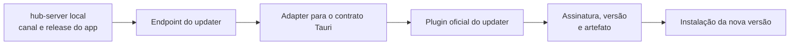
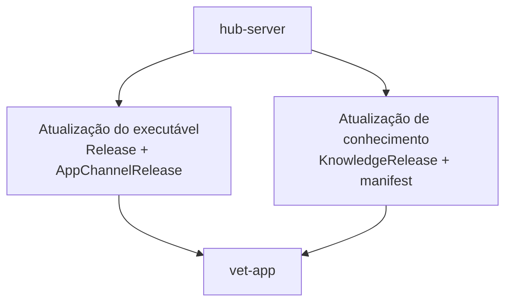

# Parte 5: Updater Tauri Com Ambiente Local

## Objetivo

Adicionar o fluxo de atualização própria do app Tauri e validar todo o consumidor
com manifest e artefatos locais antes da publicação externa.

O updater de app é independente da atualização dos dados de conhecimento da
[Parte 4](./04-app-artifact-consumption.md), embora ambos usem o `hub-server` como
plano de controle.

## Fluxo Da Parte



Os dois ciclos continuam separados:



## Escopo

Configurar no `vet-app`:

- plugin oficial `@tauri-apps/plugin-updater`;
- permissões e capabilities do Tauri v2;
- endpoint de update na configuração do Tauri;
- geração de chave exclusiva para o ambiente local de teste;
- geração local de manifest e artefato de update;
- verificação de versão disponível;
- download, validação e aplicação do update;
- tratamento de ausência de update e falhas recuperáveis.

## Contrato Do Updater

O endpoint público do `hub-server` recebe app, plataforma, versão atual e canal.
Ele seleciona `AppChannelRelease`, monta a resposta esperada pelo updater e inclui
somente um `ReleaseArtifact` compatível com a plataforma.

`Release` é independente de canal. Publicar seus artefatos não altera o updater;
a versão passa a ser oferecida somente quando `AppChannelRelease` é promovido de
forma explícita.

O contrato lógico contém:

```text
schemaVersion
appName
platform
channel
currentVersion
availableVersion
publishedAt
artifact
  artifactType
  url
  checksumSha256
  sizeBytes
  signature
```

Um adapter pequeno transforma esse contrato no formato exato consumido pelo
plugin oficial. O adapter não implementa download, instalação ou criptografia por
conta própria.

## Regras

- O primeiro provider é `local`.
- A chave privada de assinatura não entra no repositório nem no app.
- O app incorpora somente a chave pública necessária para verificar updates.
- Chaves locais de desenvolvimento não são aceitas por builds de produção.
- Versões seguem SemVer e atualização ocorre somente para versão superior.
- O canal solicitado seleciona um ponteiro publicado próprio.
- A mesma release publicada pode ser promovida para mais de um canal.
- Manifest ou artefato sem assinatura válida é recusado.
- Checksum e tamanho são conferidos antes da aplicação quando o fluxo permitir.
- O app não usa URL mutável como identidade da release.
- Cancelamento ou falha mantém a versão instalada utilizável.

## Testes

Cobrir:

- parsing e adaptação do manifest local;
- detecção de versão superior;
- ausência de update para versão igual ou inferior;
- separação entre canais;
- publicação sem promoção e promoção da mesma release entre canais;
- plataforma sem artefato compatível;
- assinatura válida, inválida e chave desconhecida;
- checksum ou tamanho divergente;
- download interrompido;
- recusa de URL ou redirect não permitido;
- smoke test documentado com dois builds locais consecutivos.

## Critérios De Aceite

- O app consulta o endpoint local do updater.
- O app reconhece e aplica uma versão local superior assinada.
- Manifest ou artefato inválido é recusado.
- O fluxo não depende de GitHub.
- O adapter permanece pequeno e isolado.
- O procedimento local completo está documentado e reproduzível.

## Próxima Parte

[Parte 6: Repositório dedicado e GitHub Releases](./06-github-releases-ci.md)
