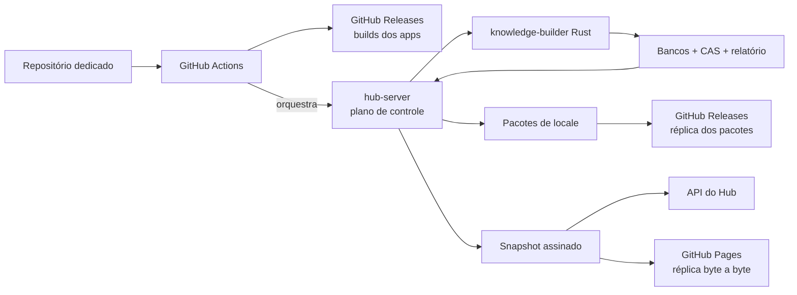
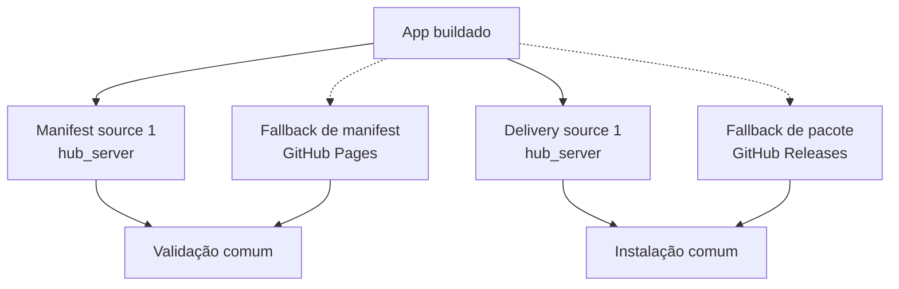

# Parte 6: Repositório Dedicado E GitHub Releases

## Objetivo

Publicar builds de apps e artefatos de conhecimento com GitHub Actions e GitHub
Releases, registrando cada release no `hub-server` sem alterar os contratos
validados localmente.

Esta parte depende do [updater local](./05-tauri-updater-local.md) e do consumo de
conhecimento já funcional pela API.

## Fluxo Da Parte



No consumo, Hub e GitHub oferecem o mesmo contrato assinado e os mesmos
artefatos imutáveis:



O app não possui um fluxo de atualização específico para GitHub. Sources são
ordenadas por prioridade, e a mesma validação de assinatura, identidade,
checksum, versão e locale é aplicada independentemente do provider.

## Pré-Requisito

O código está em um repositório dedicado ao projeto. A automação nasce nesse
repositório e usa environments protegidos para canais que publicam releases.

## Papel Do GitHub

GitHub é o primeiro provider externo de:

- binários e bundles dos apps;
- pacotes `knowledge-bootstrap-<version>-<locale>-<release-id>.zip`;
- pacotes `knowledge-delta-<version>-<locale>-<release-id>.zip`;
- réplicas estáticas dos manifests assinados por canal.

O Hub permanece o único emissor do manifest de conhecimento. GitHub Pages entrega
uma réplica byte a byte de cada snapshot e do caminho `current` do canal. A
renovação não cria GitHub Release e não concede ao GitHub autoridade para gerar
sequência ou assinatura.

GitHub Releases não representa, nesta parte, uma árvore arbitrária com um asset
por hash. O download individual de `CAS/system` continua pela source
`hub_server`. A source `github` em `knowledge_cas_object` permanece desativada até
existir um mecanismo explícito, imutável e testado para objetos individuais.

GitHub distribui cada release de conhecimento como seis assets, um por locale,
sem depender de milhares de arquivos individuais. Cloudflare R2 e IPFS são os
providers previstos para distribuição direta por conteúdo.

O `hub-server` mantém um armazenamento persistente para sua cópia de
`CAS/system`. Durante a validação de uma release, ele baixa os seis pacotes pela
delivery source, extrai com validação defensiva e materializa somente os objetos
ausentes. A source `hub_server` para hash individual só fica habilitada depois
que todos os hashes dos seis `system_media.db` forem resolvíveis.

## Workflows

Separar workflows reutilizáveis:

```text
.github/workflows/ci.yml
.github/workflows/release-app.yml
.github/workflows/release-knowledge.yml
.github/workflows/publish-knowledge-manifest.yml
```

`ci.yml` valida código, testes e geração determinística sem publicar. Para o
`knowledge-builder`, executa formatação, lint, testes do Cargo Workspace,
validação das fixtures e duas compilações da mesma entrada para comparar
`build-result.json` e checksums.

Os jobs JavaScript fixam Node.js 22 e pnpm `11.18.0`, restauram o store do pnpm
pela chave de `pnpm-lock.yaml` e executam `pnpm install --frozen-lockfile`. O
cache não armazena `node_modules`. Checks, testes, builds web e comandos Tauri
usam os scripts públicos da raiz.

`publish-knowledge-manifest.yml` recebe ou descobre um snapshot publicado pelo
Hub, valida identidade, assinatura e checksum e implanta no GitHub Pages:

```text
manifests/<channel>/<sequence>-<snapshotId>.json
manifests/<channel>/current.json
```

O workflow executa por chamada explícita após promoção, por agendamento para
reconciliar renovações e manualmente para recuperação. Ele publica exatamente os
bytes recebidos do endpoint imutável do Hub.

Para a source GitHub, o adapter de replicação do Hub aciona esse workflow e
acompanha sua conclusão. O agendamento funciona como reconciliação independente
caso a chamada imediata falhe.

Uma branch gerada e dedicada à hospedagem mantém os snapshots anteriores. Cada
execução adiciona o novo caminho imutável e atualiza `current.json` no mesmo
commit, sem alterar snapshots existentes e sem aceitar regressão de sequência.

`release-app.yml`:

```text
recebe versão e canal
-> valida tag e estado do repositório
-> builda a matriz de plataformas
-> assina cada artefato
-> calcula SHA-256 e tamanho
-> publica em GitHub Release imutável
-> registra draft pela API interna
-> solicita validação e publicação
-> promove a release no canal solicitado
-> confirma manifest público
```

`release-knowledge.yml`:

```text
invoca as tarefas knowledge do hub-server
-> Hub reserva o draft e invoca o knowledge-builder Rust
-> valida proveniência, build-result.json e artefatos gerados
-> valida os seis locales, componentes e pacotes
-> publica os seis pacotes no GitHub Release
-> confirma a KnowledgeDeliverySource GitHub configurada para o canal
-> solicita validação da KnowledgeRelease
-> Hub materializa objetos CAS ausentes a partir do pacote publicado
-> CI solicita publicação da KnowledgeRelease
-> CI solicita promoção da release no canal
-> confirma KnowledgeManifestSnapshot assinado, sequência e ponteiro do canal
-> publica e verifica a réplica do manifest no GitHub Pages
```

## URLs E Imutabilidade

- Cada URL de pacote inclui `releaseId` e `locale` e aponta para tag e nome de
  asset imutáveis.
- O manifest não usa endpoint `latest` como URL de artefato.
- O manifest vigente usa um caminho estável por canal, e cada snapshot também
  possui um caminho imutável por sequência e `snapshotId`.
- `current.json` contém o envelope assinado completo e possui o mesmo checksum
  dos bytes servidos pelo Hub.
- O endpoint de pacote do `hub-server` recebe `releaseId` e `locale` e resolve
  exatamente o `KnowledgeReleasePackage` imutável correspondente.
- Substituir bytes de um asset exige nova release e novo registro.
- Checksums são calculados sobre os bytes efetivamente enviados ao provider.
- O CI verifica novamente o asset publicado antes de solicitar `published`.
- O armazenamento persistente do Hub nunca depende do filesystem efêmero do
  processo Rails ou do runner do GitHub Actions.

## Registro No Hub Server

O CI usa a API interna com:

- token armazenado em GitHub Environment Secret;
- `Idempotency-Key` derivada de workflow, release e tentativa lógica;
- payload com artefatos e sources separados;
- locale, checksum, tamanho e assinatura de cada pacote;
- geração, revisão, predecessor e seis locales da release global;
- checksums de base e resultado dos doze patches de banco;
- nenhuma chave privada ou credencial de provider.

Uma falha no upload ou na verificação impede a publicação no Hub. Reexecutar o
workflow não cria releases duplicadas e não troca o canal até a conclusão.

O registro e a publicação da release são independentes do canal. A promoção
informa o canal e o `releaseId`; o Hub aloca `manifestSequence`, monta o snapshot
com as sources vigentes e troca o ponteiro de forma transacional.

A configuração inicial ou alteração do provider usa a rota interna idempotente de
`KnowledgeDeliverySource`, com provider, prioridade, `urlPattern` e canal. Ela não
é repetida no payload de cada release.

A manifest source GitHub é registrada separadamente com os padrões `current` e
imutável. Sua réplica é considerada verificada somente depois que o Hub ou o
workflow lê os bytes publicados e confirma o checksum canônico.
Nesta parte, ela usa `enabled: true`, prioridade `2` e
`requiredForHealthyChannel: true`.

## Sources Externas

Depois da publicação do provider:

- GitHub fica habilitado para artefatos de app, pacotes de locale, delivery sources
  e manifest source;
- `hub_server` permanece prioridade 1 para o contrato consumido pelo app;
- GitHub Pages fica como fallback de descoberta do manifest;
- GitHub Releases pode ser fallback ou destino do redirect controlado para
  pacotes;
- Cloudflare R2, GitLab e IPFS permanecem `enabled: false`;
- GitHub para objeto CAS individual permanece `enabled: false` nesta parte.

O `hub-server` pode entregar o pacote localmente ou redirecionar para GitHub
conforme a delivery source. A URL externa não precisa ser conhecida previamente
pelo app.

## Segurança Do CI/CD

- Workflows fixam actions de terceiros por commit SHA.
- Permissões de `GITHUB_TOKEN` usam o mínimo necessário por job.
- Publicação stable usa environment protegido e aprovação configurável.
- Pull requests de forks não recebem secrets de publicação.
- Artefatos são assinados antes do upload.
- Proveniência do build e logs de publicação são preservados.
- O token interno aceita rotação e fica restrito ao endpoint do Hub.
- Falhas não imprimem secrets, assinatura privada ou payload sensível.
- Concorrência por canal impede duas publicações simultâneas.
- O workflow de réplica possui somente permissões de leitura do Hub e publicação
  no GitHub Pages; ele não recebe a chave privada do manifest.

## Testes

Cobrir:

- CI sem publicação em pull request;
- instalação pnpm com lockfile congelado;
- falha do CI quando manifest e `pnpm-lock.yaml` divergem;
- ausência de `package-lock.json` e lockfiles JavaScript internos;
- build, lint e testes do `knowledge-builder` no Cargo Workspace;
- determinismo do builder sob toolchain e lockfile fixados;
- proveniência do builder registrada na release;
- matriz de builds suportada;
- assinatura, checksum e tamanho dos assets;
- cadeia global com bootstrap e deltas dos seis locales;
- nomes e URLs de pacote vinculados a `releaseId` e `locale`;
- seis pacotes, cada um contendo seu par de bancos ou patches e as entradas CAS
  aplicáveis;
- patches internos vinculados à base e ao resultado corretos;
- payload idempotente para releases de app e conhecimento;
- recusa de registro com asset ausente ou divergente;
- reexecução segura depois de falha parcial;
- sources GitHub habilitadas somente para os tipos implementados;
- source GitHub desativada para objeto individual CAS;
- resolução pública por redirect controlado;
- manifest público apontando para a release registrada;
- igualdade byte a byte entre manifest do Hub e GitHub Pages;
- fallback de descoberta quando o endpoint do Hub está indisponível;
- réplica estática adulterada, expirada ou regressiva sendo recusada;
- reconciliação agendada de snapshot renovado;
- sequência monotônica do snapshot promovido;
- manutenção do canal anterior quando a publicação falha.

## Critérios De Aceite

- O projeto usa um repositório dedicado.
- GitHub Actions executa CI sem acesso indevido a secrets.
- GitHub Actions usa Node.js 22, pnpm `11.18.0` e
  `pnpm install --frozen-lockfile`.
- O CI valida o mesmo `knowledge-builder` executado pelo Hub.
- GitHub Releases hospeda os artefatos versionados definidos nesta parte.
- Cada release de conhecimento publica exatamente um asset para cada locale
  suportado.
- Releases de app e conhecimento são registradas de forma idempotente.
- O Hub valida os assets e publica a release antes da promoção de canal.
- A promoção publica um snapshot assinado com sequência e expiração válidas.
- GitHub Pages hospeda a cópia `current` e os snapshots imutáveis por canal.
- O app pode descobrir o mesmo snapshot pelo Hub ou pelo GitHub sem alterar o
  fluxo de validação.
- O Hub materializa em armazenamento persistente todos os objetos exigidos pelo
  índice antes de habilitar download individual.
- O updater recebe um manifest válido gerado pelo `hub-server`.
- O app obtém cada release por uma delivery source publicada e verificada.
- O download individual CAS continua funcional pela source `hub_server`.
- Cloudflare R2, GitLab e IPFS permanecem previstos e desativados.

## Expansões

As expansões de Cloudflare R2, GitLab e IPFS estão descritas no
[índice arquitetural](./README.md) e entram em planos próprios.
