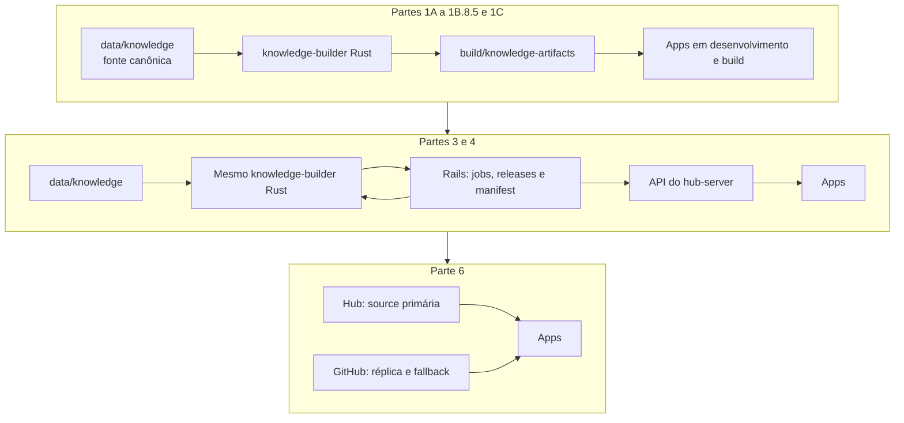
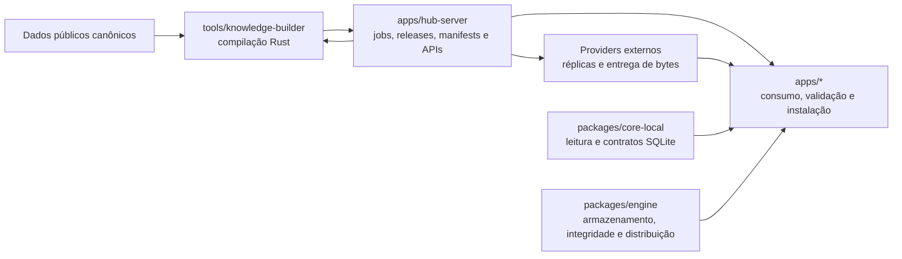

# Plano De Implementação Do Hub Server

## Objetivo

`apps/hub-server/` é o hub aberto do ecossistema veterinário. Ele orquestra a
publicação dos dados públicos e concentra manifests, releases, artefatos de
conhecimento e distribuição pública dos apps.

O `hub-server` não é o servidor operacional do SaaS. Dados privados de usuários,
billing, permissões comerciais, sincronização privada e recursos fechados
pertencem a outro servidor.

## Partes

0. [Migração do workspace para pnpm](./00-pnpm-workspace-migration.md)
1. [Parte 1A: dados canônicos de conhecimento](./01a-canonical-knowledge-data.md)
2. [Parte 1A.1: consolidação JSON e referências taxonômicas](./01a1-localized-json-consolidation.md)
3. [Parte 1A.2: relações semânticas e documentos editoriais](./01a2-semantic-product-relations.md)
4. [Parte 1B: `knowledge-builder` e artefatos locais](./01b-knowledge-builder.md)
5. [Parte 1B.1: consolidação dos contratos do `knowledge-builder`](./01b1-knowledge-builder-contract-consolidation.md)
6. [Parte 1B.2: evidência de projeção e verificação integral](./01b2-projection-evidence-and-artifact-verification.md)
7. [Parte 1B.3: evidência explícita e equivalência semântica](./01b3-explicit-evidence-and-semantic-equivalence.md)
8. [Parte 1B.4: propriedade explícita e disposição fechada](./01b4-explicit-operation-ownership.md)
9. [Parte 1B.5: cobertura exaustiva dos contratos de persistência](./01b5-projection-contract-test-coverage.md)
10. [Parte 1B.6: projeção taxonômica universal](./01b6-universal-taxonomy-projection.md)
11. [Parte 1B.7: contratos centrais do `knowledge-builder`](./01b7-central-builder-contracts.md)
12. [Parte 1B.7A: taxonomia canônica da vida](./01b7a-canonical-life-taxonomy.md)
13. [Parte 1B.7B: layout reservado da fonte canônica](./01b7b-reserved-knowledge-layout.md)
14. [Parte 1B.8.1: contratos de rows e persistência](./01b8-knowledge-builder-maintainability/01-row-persistence-contracts.md)
15. [Parte 1B.8.2: ledger e recibos confirmados](./01b8-knowledge-builder-maintainability/02-ledger-confirmed-receipts.md)
16. [Parte 1B.8.3: verificação integral decomposta](./01b8-knowledge-builder-maintainability/03-artifact-verification.md)
17. [Parte 1B.8.4: erros estruturados e fronteiras](./01b8-knowledge-builder-maintainability/04-structured-errors-boundaries.md)
18. [Parte 1B.8.5: topologia de testes e guia de manutenção](./01b8-knowledge-builder-maintainability/05-test-topology-maintenance-guide.md)
19. [Parte 1C: consumo local dos artefatos `system`](./01c-app-system-consumption.md)
20. [Parte 2: base Rails e contratos públicos](./02-rails-api-contracts.md)
21. [Parte 3: dados públicos e publicação](./03-public-knowledge-publication.md)
22. [Parte 4: consumo dos artefatos nos apps](./04-app-artifact-consumption.md)
23. [Parte 5: updater Tauri com ambiente local](./05-tauri-updater-local.md)
24. [Parte 6: repositório dedicado e GitHub Releases](./06-github-releases-ci.md)

## Referências Futuras Não Sequenciais

- [Expansão futura de `LifeEntity.bodyMetrics`](./future-life-body-metrics-expansion.md)

Essas referências preservam possibilidades de evolução e não integram a ordem
de implementação. Sua presença não autoriza execução nem alteração do contrato
vigente sem uma solicitação explícita.

A pré-fase, as subpartes 1A, 1A.1, 1A.2, 1B, 1B.1, 1B.2, 1B.3, 1B.4, 1B.5,
1B.6, 1B.7, 1B.7A, 1B.7B, 1B.8.1, 1B.8.2, 1B.8.3, 1B.8.4, 1B.8.5 e 1C e as
partes seguintes são executadas em ordem. Cada documento termina com testes e
critérios de aceite próprios.

## Evolução Do Fluxo

```mermaid
flowchart LR
    P0["Pré-fase 0<br/>workspace pnpm"]
    P1A["Parte 1A<br/>fonte canônica"]
    P1A1["Parte 1A.1<br/>conteúdo inline + chaves taxonômicas"]
    P1A2["Parte 1A.2<br/>relações + documentos editoriais"]
    P1B["Parte 1B<br/>builder Rust"]
    P1B1["Parte 1B.1<br/>contratos verificáveis"]
    P1B2["Parte 1B.2<br/>evidência + verificação integral"]
    P1B3["Parte 1B.3<br/>evidência explícita + equivalência semântica"]
    P1B4["Parte 1B.4<br/>owners explícitos + disposição fechada"]
    P1B5["Parte 1B.5<br/>cobertura estrutural dos contratos"]
    P1B6["Parte 1B.6<br/>taxonomias universais"]
    P1B7["Parte 1B.7<br/>contratos centrais"]
    P1B7A["Parte 1B.7A<br/>taxonomia da vida"]
    P1B7B["Parte 1B.7B<br/>layout reservado"]
    P1B81["Parte 1B.8.1<br/>rows + persistência"]
    P1B82["Parte 1B.8.2<br/>ledger + recibos"]
    P1B83["Parte 1B.8.3<br/>verificação"]
    P1B84["Parte 1B.8.4<br/>erros + fronteiras"]
    P1B85["Parte 1B.8.5<br/>testes + manutenção"]
    P1C["Parte 1C<br/>consumo local"]
    P2["Parte 2<br/>base Rails + contratos"]
    P3["Parte 3<br/>Rails orquestra builder + releases"]
    P4["Parte 4<br/>apps consomem a API"]
    P5["Parte 5<br/>updater Tauri local"]
    P6["Parte 6<br/>GitHub + CI/CD"]

    P0 --> P1A --> P1A1 --> P1A2 --> P1B --> P1B1 --> P1B2 --> P1B3 --> P1B4 --> P1B5 --> P1B6 --> P1B7 --> P1B7A --> P1B7B --> P1B81 --> P1B82 --> P1B83 --> P1B84 --> P1B85 --> P1C --> P2 --> P3 --> P4 --> P5 --> P6
```



As mudanças de origem dos artefatos são deliberadas:



A Pré-fase 0 estabelece pnpm como único gerenciador do workspace JavaScript. A
Parte 1A estabelece `data/knowledge` como fonte canônica, e a Parte 1A.1
consolida o conteúdo localizado simples no JSON e normaliza as referências
taxonômicas. A Parte 1A.2 atribui princípios ativos e demais conceitos de produto
a entidades, relações e taxonomias com significado de domínio e consolida cada
entidade em um documento Markdown por locale. A Parte 1B implementa o
`knowledge-builder` definitivo em Rust, a Parte 1B.1 consolida seus contratos
executáveis, a Parte 1B.2 estrutura a auditoria e o verificador integral, a
Parte 1B.3 exige evidência explícita e equivalência semântica, a Parte 1B.4
fecha a propriedade operacional e a disposição de colunas, a Parte 1B.5 fecha
a cobertura estrutural dos contratos de persistência, a Parte 1B.6 consolida
todas as taxonomias e associações em um contrato universal, e a Parte 1B.7
centraliza os contratos transversais do builder e fecha o conjunto taxonômico.
A Parte 1B.7A representa os dez níveis de domínio, reino, filo, classe, ordem,
família, gênero, espécie, raça e variedade como entidades de vida; qualquer
entidade pode manter classificações opcionais de origem, porte e métricas
corporais.
O mesmo contrato representa organismos que podem ser pacientes e organismos
etiológicos associados a condições clínicas; o papel pertence ao domínio
consumidor. Os diretórios servem somente à organização editorial. A Parte
1B.7B reserva `_entity.json`, `_content` e `_media` para a infraestrutura de
autoria e mantém os demais diretórios livres de significado implícito. A Parte
1B.8.1 consolida rows e persistência, a Parte 1B.8.2 separa
inventário, ownership e recibos confirmados, a Parte 1B.8.3 decompõe a
verificação integral, a Parte 1B.8.4 estrutura erros e fronteiras, e a Parte
1B.8.5 organiza testes e o guia de manutenção. A Parte 1C faz os apps consumirem
os artefatos locais. A Parte 3 faz o `hub-server` invocar a mesma ferramenta e
assumir releases, assinatura e publicação. A Parte 4 substitui a aquisição local
pelo contrato de distribuição do Hub. A Parte 6 acrescenta o GitHub como
provider externo.

## Decisões De Arquitetura

- A aplicação Rails fica em `apps/hub-server/`, seguindo o padrão `apps/*` do
  workspace.
- O workspace JavaScript exige Node.js `>=22.0.0`, usa a linha 22.x no ambiente
  local e no CI, adota pnpm `11.22.0`,
  `pnpm-workspace.yaml`, um único `pnpm-lock.yaml` e dependências internas com
  `workspace:*`.
- As partes do Hub usam somente comandos pnpm; não mantêm lockfiles ou comandos
  concorrentes de outro gerenciador.
- `tools/knowledge-builder/` é um binário Rust membro do Cargo Workspace e o
  único compilador de dados canônicos para `system`, `system_media` e
  `CAS/system`.
- Cada `LifeEntity` declara `domain`, `kingdom`, `phylum`, `class`, `order`,
  `family`, `genus`, `species`, `breed` e `variety`. As posições não nulas formam
  um prefixo contínuo, o `id` ocupa a posição da própria entidade e os níveis
  inferiores são nulos. Todos os dez níveis são identidades de entidades de
  vida.
  `classifications` concentra origem e `bodyMetrics`. `bodyMetrics.size`
  representa o porte geral, enquanto `bodyMetrics.stageMetrics` organiza peso
  vivo, altura e comprimento por sexo e estágio. O objeto e cada parte interna
  são opcionais nos dez níveis. Nenhum desses valores é inferido pela disposição
  das pastas ou por outra entidade.
- Produtos e protocolos declaram aplicabilidade pelos IDs canônicos de qualquer
  um dos dez níveis. Cada alvo alcança a própria entidade e seus descendentes.
- Contratos transversais do `knowledge-builder` vivem em `src/contracts/`,
  organizados por artefato, banco, locale, taxonomia e versão. Constantes
  exclusivas de um subsistema permanecem com seu proprietário.
- A manutenção do `knowledge-builder` reduz declarações paralelas sem unir
  provas independentes: inventário esperado, ownership das operações e recibos
  confirmados continuam comparáveis como conjuntos distintos.
- Cada `SystemRow` possui um descritor único de caso, tabela, identidade e
  colunas ordenadas. Writers mantêm `INSERT` fixos e readers mantêm `SELECT`
  independentes com equivalência integral das rows.
- Build novo e reutilização passam pela mesma fachada de verificação decomposta.
  Erros do builder preservam estágio, contexto e causa por tipos estruturados.
- `data/knowledge/` na raiz é a única fonte de autoria dos dados públicos. O
  diretório não pertence ao app, ao Rails nem a um package de código.
- `geo/` é um domínio de conhecimento compartilhado. Localizações usam
  `entityType: "geo_place"`; raças e outros domínios apenas referenciam seus IDs
  conforme o papel exercido pela relação.
- O `hub-server` executa o builder por uma CLI versionada e valida seu
  `build-result.json`; ele não mantém outra implementação do compilador em Ruby.
- O servidor começa em Rails 8 API com SQLite.
- A API pública usa o namespace `/api/v1`.
- A API interna usa Bearer Token via `INTERNAL_RELEASE_TOKEN`.
- O manifest é o contrato público usado pelos apps para descobrir releases,
  fontes e downloads.
- O `hub-server` é o único emissor dos manifests de conhecimento. Providers
  externos hospedam réplicas byte a byte dos snapshots assinados.
- O `hub-server` é o plano de controle. Providers como GitHub, Cloudflare R2 e
  IPFS podem armazenar e entregar os bytes.
- A source `hub_server` de prioridade 1 é o caminho padrão para descoberta do
  manifest e entrega dos pacotes.
- GitHub Releases é o primeiro provider externo de artefatos versionados.
- Cloudflare R2, GitLab e IPFS ficam previstos no contrato e desativados até suas
  fases próprias.
- Os dados fonte de conhecimento são organizados por domínio e entidade. Cada
  entidade possui `_entity.json` para estrutura, composição, relações e todo
  conteúdo localizado simples, `_content/` com um documento Markdown por locale
  para as seções editoriais e `_media/` com os bytes editoriais referenciados.
- `localizedContent` contém diretamente mapas dos seis locales. Ele não contém
  caminhos de arquivos; campos escalares e listas possuem tipos definidos pelo
  schema do objeto proprietário.
- Entidades de catálogo referenciam seus tipos e classificações por chaves
  taxonômicas completas. `LifeEntity` referencia somente
  `bodyMetrics.size` como taxonomia classificatória. Labels e aliases gerais
  pertencem ao termo da taxonomia e não são repetidos nas entidades relacionadas.
- Toda taxonomia classificatória é projetada em `taxonomy_registry` e
  `taxonomy_terms`. As identidades dos dez níveis de vida usam as colunas
  autorreferenciadas de `life_reference_items`; fabricantes, princípios
  ativos, condições e produtos usam
  `entity_taxonomy_terms` como única relação taxonômica indexada. Domínio e
  propósito pertencem ao registro da taxonomia e não são repetidos na relação.
- Produtos referenciam princípios ativos por IDs de entidades
  `active_ingredient`. Combinações farmacológicas preservam uma relação por
  substância, e a navegação do catálogo usa essas entidades relacionadas.
- Alvos, perfis vacinais, estágios de vida e escopos terapêuticos possuem
  taxonomias próprias. `classificationTermKeys` não recebe conceitos criados
  apenas para busca.
- A busca de produtos deriva termos das entidades, relações e taxonomias
  canônicas. O contrato de conhecimento não contém `searchConcept.*`.
- A busca de `LifeEntity` projeta somente nome e aliases próprios. Consultas por
  ancestralidade e subárvore usam as colunas taxonômicas de
  `life_reference_items`, sem duplicar termos ancestrais nos descendentes.
- `_entity.json` declara `contentPath: "./_content"` e associa cada `sectionNumber` a
  uma `sectionKey` padronizada. Headings iniciados por `# <n>` delimitam as
  seções no documento localizado. Qualquer texto editorial depois do número é
  descartado, e o builder não deduz semântica dele ou do nome das pastas.
- Os JSONs não contêm nomes de tabelas ou colunas. `entityType` seleciona um Data
  Mapper explícito, e o DDL do builder é a fonte de verdade da projeção
  relacional.
- Cada projector registra obrigações concluídas somente depois da operação que
  materializa o dado. O relatório de cobertura deriva desses eventos e das
  linhas efetivamente confirmadas.
- Um `ProjectionContract` tipado e imutável define valores, operações e
  obrigações esperados por locale antes da abertura dos bancos. Writers
  persistem esse contrato e o verificador exige equivalência semântica com as
  linhas relidas dos artefatos.
- O ledger recebe obrigações concretas declaradas pela operação. A identidade
  compartilhada de um destino não conclui outras obrigações por inferência.
- Staging e versões locais reutilizadas passam pelo mesmo verificador integral
  de bancos, relatório, mídias, CAS, checksums, tamanhos e digests por locale.
- Cada build registra fingerprints dos schemas efetivamente materializados.
- Nomes, aliases, labels, denominações e outros valores simples vêm dos mapas JSON
  por locale. Seções de conhecimento ficam em Markdown puro, sem front matter.
  Todos são projetados diretamente no banco correspondente; o app não usa i18n
  como fonte paralela de conhecimento.
- As seções de cada item são compiladas em um único `content_json` versionado. A
  lista plana e ordenada organiza a página, e cada item contém `sectionKey` e
  Markdown normalizado; não existem tabelas independentes por seção. A UI resolve
  o título da seção pelo i18n associado à `sectionKey`.
- O builder interpreta Markdown por AST, aplica uma allowlist fechada, normaliza
  o resultado deterministicamente e projeta somente a representação compilada
  segura. O digest da fonte usa o modelo semântico canônico, sem depender de
  caminhos editoriais de conteúdo.
- Mídias de autoria usam nomes e caminhos relativos legíveis. O builder deriva
  uma `media_key`, calcula o SHA-256, reescreve as referências Markdown para o
  contrato interno e registra `media_key -> contentHash` em `system_media`.
- Cada locale possui seu próprio `system_media.db`, que indexa somente as mídias
  exigidas por aquele conjunto localizado.
- `CAS/system` contém objetos imutáveis endereçados por SHA-256.
- No app, o cofre físico de sistema usa
  `vault/system/<2-hex>/<2-hex>/<hash>.bin`, conforme o resolvedor do
  `engine/storage`.
- `system`, `system_media` e `vault/system` são instalados a partir de artefatos
  prontos e permanecem em somente leitura para o runtime de conhecimento.
- `engine/distribution` instala bytes públicos verificados;
  `engine/storage` apenas abre e lê o conjunto de sistema ativo.
- A criação, as migrations e a escrita de `user/main`, `user/media`, `user/logs`
  e `vault/user` permanecem independentes desse fluxo.
- A preparação local usa uma `build_version` inteira e sempre produz bancos
  completos para os seis locales suportados.
- Cada bundle declara `includedKnowledgeLocales` e um `defaultKnowledgeLocale`
  obrigatoriamente incluído. Um locale ausente só é ativado depois de seus
  artefatos serem obtidos e validados.
- Recursos de conhecimento incorporados são descritos por um
  `knowledge-bundle.json` versionado. Ele registra a seleção de locales e sua
  origem local ou publicada, sem substituir o manifest assinado de releases.
- Cada versão de conhecimento coordena os seis pares `system` e `system_media`
  sob uma release global. Cada par é instalado como unidade indivisível e usa o
  `CAS/system` compartilhado.
- Releases de app e de conhecimento são independentes de canal. Os canais mantêm
  apenas ponteiros para releases publicadas.
- Cada canal de conhecimento possui snapshots assinados, sequenciais e
  expirantes do manifest.
- Revisões `generation.0` são bootstraps completos; revisões
  `generation.revision` posteriores são deltas encadeados.
- Pacotes de locale de bootstrap e delta são meios de transporte; não são fontes
  de verdade.
- Artefatos e manifests publicados são imutáveis.
- Versão do app, versão dos schemas SQLite e versão global de conhecimento são
  conceitos independentes.
- Site público e painel administrativo entram em uma fase própria.

## Fronteiras De Responsabilidade



```text
data/knowledge/
  autoria dos dados públicos canônicos

apps/hub-server/
  orquestração, publicação, manifests e APIs

tools/knowledge-builder/
  validação, projeção, geração dos bancos, CAS e relatório do build

apps/vet-app/
  consumo, validação, instalação e atualização

packages/core-local/
  queries, contratos de leitura e validação de compatibilidade SQLite

packages/engine/
  armazenamento gravável do usuário, leitura dos recursos ativos de sistema,
  integridade e distribuição

providers externos/
  armazenamento e entrega de bytes publicados
```

O app não gera `system`, `system_media` ou `CAS/system` em desenvolvimento,
runtime ou build empacotável. O servidor não recebe dados privados dos usuários.

## Modelo De Releases

### Releases De Apps

```text
Release
  app_name
  version
  notes
  status
  published_at
  metadata

ReleaseArtifact
  release_id
  artifact_type
  platform
  checksum_sha256
  size_bytes
  signature
  metadata

ReleaseArtifactSource
  release_artifact_id
  provider
  priority
  enabled
  transport
  url
  storage_key
  metadata
```

`ReleaseArtifact` identifica um conteúdo imutável. `ReleaseArtifactSource`
informa onde os mesmos bytes estão disponíveis. Adicionar um provider não cria
outro artefato.

### Releases De Conhecimento

```text
KnowledgeRelease
  generation
  revision
  release_kind
  previous_release_id
  build_version
  builder_version
  build_result_schema_version
  build_result_checksum_sha256
  source_digest_sha256
  system_schema_version
  system_media_schema_version
  status
  notes
  published_at
  metadata

KnowledgeReleaseLocale
  knowledge_release_id
  locale

KnowledgeArtifact
  knowledge_release_locale_id
  artifact_type
  checksum_sha256
  size_bytes
  signature
  metadata

KnowledgeArtifactSource
  knowledge_artifact_id
  provider
  priority
  enabled
  transport
  url
  storage_key
  metadata
```

`generation` e `revision` são inteiros e formam a versão apresentada como
`generation.revision`. `release_kind` aceita `bootstrap` ou `delta`.
`previous_release_id` é nulo no bootstrap e obrigatório no delta.
O par `generation`, `revision` é globalmente único e não depende de canal.

`build_version`, `builder_version`, `build_result_schema_version`,
`build_result_checksum_sha256` e `source_digest_sha256` registram a proveniência
da compilação. Retry do mesmo draft conserva esses valores quando repete a mesma
entrada e o mesmo builder; qualquer mudança exige descartar o resultado preparado
e executar outra compilação antes da validação.

`system_schema_version` e `system_media_schema_version` permanecem separados da
versão de conhecimento. Cada `KnowledgeArtifact` representa um conteúdo.
`KnowledgeArtifactSource` atende artefatos de conhecimento com endereço fixo.

Cada release possui exatamente um `KnowledgeReleaseLocale` para cada locale
suportado: `pt-BR`, `pt-PT`, `gn-PY`, `en-US`, `es-ES` e `fr-FR`. A release só
pode ser publicada quando os seis filhos estão completos e validados.

### Componentes Da Release

```text
KnowledgeReleasePackage
  knowledge_release_locale_id
  knowledge_artifact_id
  package_kind
  descriptor_checksum_sha256

KnowledgeReleaseComponent
  knowledge_release_locale_id
  component
  delivery_mode
  entry_path
  entry_prefix
  entry_checksum_sha256
  entry_size_bytes
  patch_format
  base_checksum_sha256
  target_checksum_sha256
  target_size_bytes
  base_set_digest_sha256
  target_set_digest_sha256
  artifact_hash_count
  target_hash_count

KnowledgeCasObjectSource
  channel
  provider
  priority
  enabled
  transport
  url_pattern
  cid_field
  hash_algorithm
  hash_encoding
  metadata

KnowledgeDeliverySource
  channel
  delivery_kind
  provider
  priority
  enabled
  transport
  url_pattern
  metadata

KnowledgeManifestSnapshot
  channel
  sequence
  knowledge_release_id
  payload
  checksum_sha256
  signature
  key_id
  published_at
  expires_at

KnowledgeManifestSource
  channel
  provider
  priority
  enabled
  transport
  current_url_pattern
  snapshot_url_pattern
  required_for_healthy_channel
  metadata

KnowledgeManifestReplica
  knowledge_manifest_snapshot_id
  knowledge_manifest_source_id
  checksum_sha256
  immutable_url
  current_url
  status
  published_at
  verified_at
  error_code
```

`KnowledgeReleasePackage` liga um locale da release ao seu único ZIP de bootstrap
ou delta. Cada release possui seis pacotes, um por locale. `package_kind`
corresponde a `bootstrap` ou `delta`. O checksum do artefato protege o ZIP
completo, enquanto `descriptor_checksum_sha256` protege o `release.json` interno.

`component` aceita `system`, `system_media` ou `cas_system`. `delivery_mode`
aceita `snapshot`, `patch`, `index_only` ou `unchanged`:

- `snapshot` entrega o componente completo em uma release bootstrap;
- `patch` entrega a diferença entre a release anterior e a atual;
- `index_only` altera o conjunto lógico CAS por meio de `system_media`, sem
  entregar novos objetos;
- `unchanged` registra que o estado final é igual ao anterior e não possui
  entrada de conteúdo no pacote.

`entry_path`, `entry_checksum_sha256` e `entry_size_bytes` validam a entrada fixa
de banco ou patch no pacote. `entry_prefix` identifica exclusivamente o diretório
`CAS/`; o `release.json` enumera os hashes transportados sob esse prefixo. Esses
campos são nulos em `index_only` e `unchanged`. Componentes não possuem source
própria.

Patches de `system` e `system_media` usam `bsdiff_v1`, compatível com o formato
BSDIFF40, sempre sobre os bytes exatos do banco publicado anterior.
`base_checksum_sha256` protege a entrada e `target_checksum_sha256` protege o
banco resultante. Os bancos de sistema são abertos em modo somente leitura pelo
app. Toda revisão delta possui patches para os dois bancos de cada locale, pois
todos registram a versão global em seus próprios metadados.

O componente `cas_system` usa entradas `CAS/<hash>` dentro do pacote do locale.
Seu estado final é definido pelos hashes do `system_media` do mesmo locale e da
mesma versão. Objetos iguais em pacotes diferentes convergem para o mesmo caminho
do CAS compartilhado.

`KnowledgeCasObjectSource` não cria um registro por hash. Os hashes e os
metadados das mídias vêm do `system_media.db` do locale instalado. A configuração
é própria do canal e permanece separada da entrega dos pacotes.

`KnowledgeDeliverySource` define um padrão que inclui obrigatoriamente
`{releaseId}` e `{locale}` para resolver um pacote sem ambiguidade.
`{generation}` e `{revision}` podem compor o nome legível. Cada provider aparece
no máximo uma vez por canal e tipo de entrega. O manifest publicado captura essas configurações em
`deliverySources.bootstrap[]` e `deliverySources.delta[]`; releases e componentes
não recebem cópias dessas linhas.

`KnowledgeManifestSnapshot` é imutável depois de publicado. `sequence` é um
inteiro positivo, monotônico e único por canal. Um novo snapshot pode apontar
para a mesma `KnowledgeRelease` quando mudam apenas sources, validade ou outros
metadados de distribuição.

`KnowledgeManifestSource` configura onde o documento canônico pode ser
descoberto. `current_url_pattern` resolve a cópia vigente do canal;
`snapshot_url_pattern` resolve a cópia imutável por `{channel}`, `{sequence}` e
`{snapshotId}`. `current_url_pattern` também pode usar `{appName}` e
`{appVersion}` quando a source possui resolução dinâmica. Essa configuração não
vive dentro do manifest que está sendo descoberto. Os apps recebem uma lista
mínima e permitida de manifest sources em sua configuração de distribuição.

`KnowledgeManifestReplica` registra a publicação e a verificação de cada cópia.
Uma réplica válida possui exatamente os mesmos bytes e o mesmo checksum do
snapshot persistido pelo Hub nos caminhos imutável e `current`. Providers nunca
remontam, alteram ou assinam o payload.

### Ponteiros De Canal

```text
AppChannelRelease
  app_name
  channel
  release_id

KnowledgeChannelRelease
  channel
  knowledge_release_id
  knowledge_manifest_snapshot_id
```

Esses registros apontam para a release publicada vigente em cada canal. O
snapshot indicado por `knowledge_manifest_snapshot_id` pertence ao mesmo canal e
aponta para a mesma release. A promoção troca os dois ponteiros na mesma
transação que publica o novo snapshot assinado.

## Ciclo De Publicação

Releases de app e de conhecimento seguem o mesmo ciclo:

```text
draft -> validating -> published -> withdrawn
```

- `draft`: recebe metadados e artefatos.
- `validating`: verifica arquivos, hashes, tamanhos, assinaturas e contratos.
- `published`: fica imutável e pode ser apontada por um canal.
- `withdrawn`: deixa de ser oferecida sem alterar seu conteúdo histórico.

Uma release somente muda para `published` quando todos os artefatos obrigatórios
estão disponíveis. Publicar a release não altera canais. A promoção de canal
carrega as configurações de entrega, cria o próximo snapshot assinado e troca os
ponteiros do canal em uma transação idempotente própria. Uma outbox durável
replica os bytes assinados nas manifest sources habilitadas e verifica cada cópia
por checksum. A saúde operacional do canal exige a source `hub_server` e ao menos
uma source externa marcada como obrigatória quando essa source estiver
implementada.

## Contrato De Artefatos

Todo artefato recompõe publicamente estes dados:

```text
artifact_type
app_name
platform
locale
version
checksum_sha256
size_bytes
signature
published_at
metadata
```

Artefatos de endereço fixo usam `sources[]`, com estes campos públicos:

```text
provider
priority
enabled
transport
url
```

Pacotes de locale usam `deliverySources.bootstrap[]` ou
`deliverySources.delta[]`, com `urlPattern` no lugar de `url`. O padrão resolve o
pacote por `{releaseId}` e `{locale}`, podendo também usar `{generation}` e
`{revision}` no nome do arquivo. `storage_key` permanece um dado interno do
servidor e componentes internos não possuem source própria.

Providers aceitos pelo contrato:

```text
hub_server
github
cloudflare_r2
gitlab
ipfs
local
```

Tipos de artefato persistidos:

```text
app_binary
app_bundle
app_updater_manifest
knowledge_bootstrap_package
knowledge_delta_package
```

`knowledge_cas_object` é um tipo de entrega do manifest. Ele resolve um objeto
por hash sem criar um `KnowledgeArtifact` para cada mídia.

## Versionamento

- `app_version`: versão SemVer do app publicado.
- `system_schema_version`: versão técnica do banco `system`.
- `system_media_schema_version`: versão técnica do banco `system_media`.
- `knowledge_generation`: geração dos bootstraps de locale, iniciada em `1`.
- `knowledge_revision`: revisão incremental dentro da geração, iniciada em `0`.
- `manifest_schema_version`: versão do contrato JSON do manifest.
- `manifest_sequence`: sequência monotônica do snapshot assinado dentro do canal.

`knowledge_generation` e `knowledge_revision` são armazenados e comparados como
inteiros. A versão textual `1.10` significa geração `1`, revisão `10`; ela nunca
é tratada como número decimal.

Uma versão `1.0` contém, para cada locale, snapshots completos dos dois bancos e
do conjunto CAS correspondente. As versões `1.1`, `1.2` e seguintes contêm
deltas encadeados para os seis locales. A versão `2.0` inicia outra geração com
seis bootstraps completos consolidados.

Os bancos `system` e `system_media` contêm uma tabela singleton:

```sql
CREATE TABLE knowledge_release_metadata (
    singleton INTEGER PRIMARY KEY CHECK(singleton = 1),
    release_id TEXT NOT NULL,
    generation INTEGER NOT NULL CHECK(generation >= 1),
    revision INTEGER NOT NULL CHECK(revision >= 0),
    locale TEXT NOT NULL
);
```

`PRAGMA user_version` continua representando somente a versão técnica do schema.
Os campos de `knowledge_release_metadata` identificam o conteúdo público global.

O consumidor recusa schema de manifest que não entende, versão de app fora da
faixa suportada e release anterior à instalada. Downgrade somente ocorre por um
fluxo explícito de recuperação.

## Manifest Assinado

O manifest de conhecimento é um snapshot assinado e imutável. Sua forma lógica é:

```json
{
  "payload": {
    "schemaVersion": 1,
    "snapshotId": "<uuid>",
    "manifestSequence": 42,
    "releaseId": "<uuid>",
    "currentVersion": {
      "generation": 2,
      "revision": 2
    },
    "channel": "stable",
    "supportedAppVersions": {
      "min": "0.2.0",
      "max": null
    },
    "supportedLocales": ["pt-BR", "pt-PT", "gn-PY", "en-US", "es-ES", "fr-FR"],
    "locales": {
      "pt-BR": {
        "bootstrap": {},
        "deltas": []
      }
    },
    "deliverySources": {
      "bootstrap": [],
      "delta": []
    },
    "cas": {
      "objects": {}
    },
    "publishedAt": "2026-08-11T12:00:00Z",
    "expiresAt": "2026-08-18T12:00:00Z",
    "changelog": []
  },
  "authenticity": {
    "algorithm": "ed25519",
    "canonicalization": "jcs",
    "keyId": "knowledge-2026-01",
    "signature": "<base64>"
  }
}
```

O esqueleto detalha somente a chave `pt-BR`. Um snapshot publicável contém as
seis chaves declaradas em `supportedLocales`, cada uma com bootstrap e cadeia de
deltas completos.

A assinatura cobre o `payload` serializado com JSON Canonicalization Scheme. O
app mantém as chaves públicas confiáveis por `keyId`, verifica a assinatura antes
de interpretar URLs e persiste a maior `manifestSequence` aceita por canal.
Sequência menor é replay; sequência igual só é aceita para o mesmo `snapshotId` e
checksum. O app recusa snapshots expirados, respeitando uma tolerância de relógio
limitada. Rotação de chave exige uma versão do app que já confie na nova chave
antes de seu uso na publicação.

O endpoint usa `ETag` derivado do checksum do snapshot e
`Cache-Control: public, max-age=300, must-revalidate`. A expiração assinada é a
barreira final contra respostas antigas mantidas por cache ou provider. Quando
não consegue obter um snapshot vigente, o app conserva a release ativa, mas não
instala conteúdo novo a partir de um snapshot expirado.

O app conhece uma lista ordenada de manifest sources permitidas. Ele consulta a
source habilitada de maior prioridade e usa a seguinte diante de indisponibilidade,
timeout, resposta inválida, assinatura inválida, expiração ou sequência anterior
à já aceita. O primeiro snapshot aceitável encerra a descoberta; o app não
consulta todos os providers em cada inicialização.

Cada source publica o mesmo documento em dois endereços lógicos:

```text
manifests/<channel>/current.json
manifests/<channel>/<sequence>-<snapshotId>.json
```

`current.json` contém o snapshot assinado completo, não um ponteiro sem
assinatura. Ele é um alias mutável de descoberta do canal e não identifica o
artefato. O caminho com sequência e `snapshotId` é a identidade imutável usada
para auditoria e recuperação. Nenhuma source usa `latest` como identidade. A
replicação externa converge por outbox e retry; uma réplica temporariamente
atrasada pode oferecer o snapshot anterior ainda vigente, mas nunca outro
conteúdo sob a mesma sequência.

Um job periódico publica uma nova sequência para a mesma release antes da
expiração. Falha de renovação preserva o snapshot vigente e produz alerta com
antecedência suficiente para intervenção.

O updater Tauri conserva o mecanismo oficial de assinatura do próprio updater.
O adapter do `hub-server` não substitui nem enfraquece essa verificação.

## Contrato De Atualização Por Locale

O manifest declara:

- `currentVersion`: geração e revisão vigentes;
- `locales`: mapa completo dos locales suportados;
- `locales[locale].bootstrap`: pacote `generation.0` com snapshots do par de
  bancos e do conjunto CAS daquele locale;
- `locales[locale].deltas[]`: cadeia ordenada dos pacotes posteriores;
- `components`: estado e entrega de `system`, `system_media` e `cas_system` em
  cada pacote de locale;
- `package`: locale, checksum, tamanho, assinatura e descritor do ZIP;
- `deliverySources`: padrões por provider para resolver pacotes de bootstrap e
  delta;
- `objects`: sources para reconciliação individual do CAS por hash.

Cada pacote contém um `release.json` canônico. O descritor repete a identidade, a
versão e o locale da release, o tipo do pacote e os descritores dos três
componentes. Para o CAS, ele inclui `artifactHashes`, uma lista ordenada e sem
duplicatas com os hashes transportados naquele ZIP. O checksum do descritor e o
checksum do pacote devem coincidir com o manifest assinado.

Cada delta de locale contém `fromVersion`, `toVersion` e os três componentes. Os
dois bancos usam `deliveryMode: patch`, com checksum da base, checksum do
resultado e o `entryPath` correspondente. O CAS usa `patch`, `index_only` ou
`unchanged` conforme a mudança no conjunto de hashes daquele locale.

Invariantes obrigatórias:

- o manifest declara exatamente os seis locales suportados;
- cada release possui exatamente um pacote por locale;
- cada `bootstrap.version.revision` é `0`;
- cada `bootstrap.version.generation` é igual a `currentVersion.generation`;
- para cada locale, o primeiro delta parte da versão do bootstrap;
- para cada locale, cada `fromVersion` é igual ao `toVersion` anterior;
- todo `toVersion` pertence à geração vigente e incrementa a revisão em uma
  unidade;
- o último `toVersion` de cada locale é igual a `currentVersion`;
- cada pacote descreve os três componentes e seus estados finais;
- o `release.json` pertence à mesma release e ao mesmo locale declarados no
  manifest;
- todo delta de locale possui patches válidos para `system` e `system_media`;
- componentes `patch` possuem base idêntica ao estado final anterior;
- os IDs e relações não localizáveis são equivalentes entre os seis bancos
  `system` da mesma release;
- os hashes de cada `system_media` final são resolvíveis no `CAS/system`;
- cada URL de pacote inclui o `releaseId` e o `locale` correspondentes;
- sources habilitadas não repetem prioridade dentro do mesmo tipo;
- toda source habilitada resolve os mesmos pacotes de locale imutáveis.

O servidor recusa a publicação quando alguma invariante falha. O app nunca tenta
descobrir uma revisão incrementando URLs que não estejam declaradas.

## Regras De Segurança

- Manifests de produção, artefatos executáveis e pacotes de locale exigem assinatura
  válida.
- SHA-256 é obrigatório para bancos, pacotes e objetos CAS.
- A API usa HTTPS fora do desenvolvimento local.
- URLs de redirect são construídas a partir da configuração do provider e usam
  esquemas e hosts permitidos.
- O parâmetro de objeto CAS aceita exatamente 64 caracteres hexadecimais
  minúsculos.
- Nenhum parâmetro público é concatenado diretamente a um caminho local.
- A API interna aplica comparação segura do token, rotação, rate limit,
  idempotência e limites de payload.
- Tokens, assinaturas privadas e URLs sensíveis não aparecem em logs.
- Downloads usam limites de tamanho, tempo, redirects e concorrência.
- Publicação parcial da release ou do snapshot canônico no Hub nunca troca o
  ponteiro do canal.
- O Hub é o único emissor de sequência e assinatura de manifest.
- Réplicas externas são verificadas contra o checksum canônico antes de serem
  consideradas saudáveis.

## Ordem Recomendada

1. Implementar e validar a Pré-fase 0.
2. Implementar e validar a Parte 1A.
3. Implementar e validar a Parte 1A.1.
4. Implementar e validar a Parte 1A.2.
5. Implementar e validar a Parte 1B.
6. Implementar e validar a Parte 1B.1.
7. Implementar e validar a Parte 1B.2.
8. Implementar e validar a Parte 1B.3.
9. Implementar e validar a Parte 1B.4.
10. Implementar e validar a Parte 1B.5.
11. Implementar e validar a Parte 1B.6.
12. Implementar e validar a Parte 1B.7.
13. Implementar e validar a Parte 1B.7A.
14. Implementar e validar a Parte 1B.7B.
15. Implementar e validar a Parte 1B.8.1.
16. Implementar e validar a Parte 1B.8.2.
17. Implementar e validar a Parte 1B.8.3.
18. Implementar e validar a Parte 1B.8.4.
19. Implementar e validar a Parte 1B.8.5.
20. Implementar e validar a Parte 1C.
21. Implementar e validar a Parte 2.
22. Implementar e validar a Parte 3.
23. Implementar e validar a Parte 4.
24. Implementar e validar a Parte 5.
25. Mover o projeto para o repositório dedicado.
26. Implementar e validar a Parte 6.

## Expansões Previstas

- **Cloudflare R2:** armazenamento de objetos por hash, cache imutável, upload
  incremental e fallback HTTP.
- **GitLab:** espelhamento do repositório, CI, releases e fallback de artefatos.
- **IPFS:** CID em `system_media`, publicação de objetos e validação final pelo
  SHA-256 local antes da gravação.

As sources dessas expansões permanecem no contrato com `enabled: false` até que
tenham implementação, publicação e testes próprios.

## Fora De Escopo

- front-end web separado;
- painel administrativo visual;
- site público do projeto;
- implementação de Cloudflare R2, GitLab ou IPFS;
- servidor SaaS fechado;
- dados privados de usuários;
- sincronização privada;
- billing e permissões comerciais;
- geração de prontuários ou dados clínicos privados.
