# Plano de segurança da cadeia de software

## Estado

Proposto. Este documento define o protocolo canônico a implementar para
dependências Rust e TypeScript, builds, acessos externos em runtime e artefatos
de release. Ele não autoriza atualização de dependências nem instalação de
ferramentas por si só.

A execução está dividida, nesta ordem, em:

1. [`software-supply-chain-security/01-supply-chain-guard-package.md`](software-supply-chain-security/01-supply-chain-guard-package.md), para criar o pacote autocontido;
2. [`software-supply-chain-security/02-project-build-integration.md`](software-supply-chain-security/02-project-build-integration.md), para integrar policy, comandos, aquisição, CI e build isolado;
3. [`software-supply-chain-security/03-runtime-network-protection.md`](software-supply-chain-security/03-runtime-network-protection.md), para restringir os acessos externos do aplicativo;
4. [`software-supply-chain-security/04-release-continuous-operations.md`](software-supply-chain-security/04-release-continuous-operations.md), para tornar releases verificáveis e manter o protocolo em operação.

Esses quatro arquivos definem sequência e critérios de entrega; este documento
permanece como fonte canônica das regras de segurança compartilhadas entre eles.

## Objetivo

Adicionar uma camada de segurança proporcional ao risco de um aplicativo da
área de saúde, com foco em confidencialidade, integridade e disponibilidade dos
dados clínicos e cadastrais. Um build oficial pode levar minutos adicionais: a
qualidade e a atualidade da análise prevalecem sobre uma meta artificial de
latência.

O resultado deve:

- impedir que builds oficiais resolvam versões diferentes das aprovadas;
- detectar dependências conhecidamente maliciosas, vulneráveis, revogadas ou de
  origem não autorizada nos dois ecossistemas;
- tornar explícita a revisão de código de terceiros novo ou alterado;
- executar a compilação sem acesso à rede e sem segredos;
- restringir os acessos externos legítimos do aplicativo por finalidade,
  protocolo, host e caminho;
- gerar inventário, evidência e proveniência dos componentes de cada release;
- emitir evidências interoperáveis nos formatos in-toto, SLSA e CycloneDX,
  mantendo formatos próprios somente como índices internos de cache;
- permitir adoção antecipada somente por decisão humana para pacote/versão
  exatos, justificada e com prazo, nunca por severidade automática;
- reutilizar análises anteriores somente quando evidências provam que entradas,
  políticas, ferramentas, targets e fontes temporais continuam equivalentes.

Este plano é uma camada de defesa em profundidade. Ele não substitui revisão de
código, atualizações de segurança do sistema operacional/WebView, proteção de
segredos, backups ou controles de acesso aos dados de saúde.

## Perfil de referência

- NIST SSDF organiza práticas, responsabilidades e operação contínua do ciclo de
  desenvolvimento seguro.
- SLSA 1.2 orienta identidade do builder, proveniência, isolamento entre builds,
  prevenção de cache poisoning e verificação do artefato.
- in-toto define Statements, predicates e envelopes autenticados para as
  evidências intercambiáveis.
- CycloneDX define SBOM e VEX; formatos internos não duplicam esses contratos.
- Reproducible Builds e cache endereçado por conteúdo orientam fingerprints e
  reaproveitamento determinístico, sem transformar cache em autoridade.

No início de cada fase, confirmar a versão final vigente dessas referências e
registrá-la em `security/policy.json`; mudança de versão normativa exige revisão
da policy, não adoção silenciosa. O projeto não declara conformidade NIST nem um
nível SLSA apenas por implementar controles semelhantes. Um nível SLSA só pode
ser declarado depois que a plataforma real de build cumprir e for avaliada
contra os requisitos correspondentes. Build sem rede é um endurecimento
adicional deste projeto e não deve ser confundido com a definição de isolamento
do SLSA.

## Contexto observado em 2026-08-25

- Os pacotes de `Cargo.lock` provenientes de registry possuem checksum, e não
  foram encontradas dependências Git.
- As entradas de pacote em `pnpm-lock.yaml` possuem integridade, sem tarballs ou
  repositórios Git como fonte.
- O lockfile Rust atualizado removeu os alertas anteriormente encontrados em
  `quick-xml`, `anyhow` e `event-listener`.
- `cargo audit` ainda encontra `rkyv 0.7.46` em `Cargo.lock`
  (`RUSTSEC-2026-0235`) e 17 avisos permitidos de manutenção/solidez. Como a
  auditoria do lockfile não prova alcançabilidade, a implementação deve
  confirmar o grafo de todos os targets suportados e remover a entrada pelo
  Cargo se ela for apenas resíduo do lockfile, ou atualizar o consumidor se ela
  estiver ativa. O lockfile nunca deve ser corrigido manualmente.
- O grafo Rust observado é grande e inclui muitas superfícies que executam na
  compilação: aproximadamente 109 custom build scripts e 40 proc macros no
  levantamento anterior. Um lockfile correto não impede esse código de executar.
- O pnpm já usa `strictDepBuilds: true` e autoriza somente o build de
  `better-sqlite3`, o que é uma base boa e deve ser preservada.
- `packageManager` fixa `pnpm@11.22.0`, mas a versão exata do toolchain Rust não
  está fixada e `.nvmrc` fixa apenas a major do Node.
- A CSP da WebView está desativada (`csp: null`), `shell:allow-open` permite uma
  classe ampla de links e o Flatpak concede `--share=network`.
- Os acessos externos legítimos atuais são pequenos: ViaCEP, WhatsApp Web,
  `whatsapp:`, `mailto:` e `tel:`. Há também um `fetch(source)` genérico no
  carregamento de imagens de catálogos padrão, ainda que os catálogos atuais não
  forneçam imagens remotas.

Esses fatos formam a baseline inicial. A implementação deve regenerar as
contagens e relatórios, não copiá-los como verdade permanente.

## Modelo de ameaça e limites das garantias

| Fronteira | Cenários principais | Controle que realmente contém o risco |
| --- | --- | --- |
| Resolução e aquisição | versão recém-publicada maliciosa, typosquatting, dependency confusion, fonte Git/URL, lockfile adulterado | registries permitidos, idade mínima, checksums, lockfile congelado, revisão do delta e política de fontes |
| Instalação e compilação | `build.rs`, proc macro ou lifecycle script lê arquivos, rouba segredo ou baixa payload | ambiente sem segredos, filesystem mínimo e isolamento de rede no sistema operacional/container |
| Runtime | `fetch`, WebSocket ou abertura de URL para destino arbitrário; exfiltração de dados | gateway único, CSP, capability Tauri com escopo e, onde necessário, firewall/sandbox do sistema |
| Gate e cache | resultado forjado, cache poisoning, relógio regredido ou entrada relevante omitida do fingerprint | fechamento completo das entradas, estados fail-closed, cache não autoritativo e evidência autenticada pelo CI |
| Transição gate/build | fonte ou configuração alterada depois da aprovação e antes da compilação | snapshot imutável vinculado por digest do gate até o artefato |
| Release | artefato recompilado fora do processo, dependências desconhecidas, substituição do binário | build isolado, SBOM, hash, assinatura e atestação de proveniência |

Limites que devem permanecer explícitos:

- `cargo --offline` impede o Cargo de acessar a rede, mas não impede um
  `build.rs`, proc macro ou executável iniciado durante a compilação de abrir um
  socket. A mesma distinção vale para `pnpm --offline` e lifecycle scripts.
- CSP restringe a WebView, mas não código Rust nativo.
- Capabilities Tauri restringem chamadas originadas da WebView, mas não contêm
  uma crate Rust maliciosa incorporada ao aplicativo.
- Em um desktop comum, uma biblioteca nativa maliciosa pode tentar abrir sockets
  enquanto o processo tiver rede. Garantia forte de ausência de egress em
  runtime exige sandbox/firewall do sistema; a allowlist do aplicativo é uma
  defesa adicional, não um substituto.
- O Flatpak oferece isolamento útil, mas `--share=network` concede rede de forma
  ampla, não por domínio. A permissão deve ser mantida apenas enquanto uma
  funcionalidade de runtime realmente depender dela.
- Nenhum hook do repositório consegue tornar impossível executar `cargo build`
  diretamente. O contrato verificável é: nenhum artefato oficial ou de release
  é aceito se não tiver sido produzido pelo caminho protegido.
- A configuração versionada faz um `pnpm install` comum reaplicar a idade, mas
  alguém que deliberadamente sobrescreva a configuração ou execute `cargo fetch`
  estável fora do wrapper pode causar download local. O repositório não promete
  interceptar comandos brutos; promete que os comandos canônicos fazem preflight
  antes do payload e que nenhum output externo a eles pode ser promovido. Bloqueio
  absoluto também na estação exigiria ambiente gerenciado/firewall e não entra na
  baseline de usabilidade.
- Um cache local não protege contra um processo que já controla a mesma conta do
  sistema operacional. Ele é somente uma otimização de desenvolvimento; a raiz
  de confiança de releases permanece no pipeline protegido.
- Hashes detectam divergência entre conteúdo e identidade esperada, mas um campo
  textual `authority.id` não autentica seu emissor. Evidência autoritativa exige
  assinatura verificável contra uma raiz de confiança configurada.

## Fluxo completo

```mermaid
flowchart TD
    COMMAND[Comando protegido do package] --> GATE_ENTRY
    BUILD[Build oficial<br/>web, Rust, Tauri ou pacote] --> GATE_ENTRY
    CI[Pull request ou CI] --> GATE_ENTRY
    SCHEDULE[Agenda semanal ou pré-release] --> GATE_ENTRY
    INCIDENT[Incidente ou novo IOC] --> IOC[security:incident<br/>normaliza e procura indicadores]
    IOC --> GATE_ENTRY

    subgraph GATE[Gate único, completo e incremental]
        GATE_ENTRY[security:gate] --> INPUTS[Construir manifesto completo<br/>dos inputs efetivos do build e checks]
        INPUTS --> FINGERPRINT[Calcular fingerprints por domínio<br/>dependências, código, gate, policy,<br/>ambiente, targets e ferramentas]
        FINGERPRINT --> FRESHNESS[Confirmar revisões atuais de<br/>RustSec, npm, IOCs e tempo confiável]
        FRESHNESS --> LOOKUP[Procurar registros e evidências<br/>pelo fingerprint composto]
        LOOKUP --> REUSABLE{Evidência completa, autêntica quando<br/>exigido, não expirada e equivalente?}
        REUSABLE -- Sim --> ATTESTED[Revalidar schema, hashes, assinatura,<br/>autoridade, expirações e aprovação]
        ATTESTED --> GATE_OK[Gate aprovado]
        REUSABLE -- Não --> INVALIDATION[Calcular exatamente quais<br/>domínios foram invalidados]
        INVALIDATION --> RUST[cargo metadata por target<br/>cargo-audit + cargo-deny + cargo-vet<br/>quando o domínio Rust exigir]
        INVALIDATION --> JS[pnpm audit completo e produção<br/>quando o domínio JS exigir]
        INVALIDATION --> POLICY[IOC, fontes, checksums, licenças,<br/>toolchains, CSP e boundary de rede<br/>conforme fingerprints alterados]
        INVALIDATION --> ADVISORY[Reavaliar inventário preservado<br/>quando apenas advisories mudaram]
        RUST --> REPORT[Relatório agregado e alcançabilidade]
        JS --> REPORT
        POLICY --> REPORT
        ADVISORY --> REPORT
        REPORT --> LOCK_CHANGE{Lockfiles mudaram?}
        LOCK_CHANGE -- Sim --> REVIEW[Quarentena geral de 72 horas<br/>criticidade apenas alerta;<br/>adoção precoce exige pacote + versão exatos]
        REVIEW --> REVIEW_OK{Mudança aprovada?}
        REVIEW_OK -- Sim --> BASELINE[Registrar baseline aprovada<br/>com hashes e evidências]
        REVIEW_OK -- Não --> BLOCK
        BASELINE --> RISK
        LOCK_CHANGE -- Não --> RISK{Advisories, IOCs e exceções<br/>estão dentro da policy?}
        RISK -- Não --> BLOCK[Fail closed<br/>denied ou indeterminate]
        RISK -- Sim --> ATTEST[Emitir registro de cache e evidências<br/>com validade e resultados por domínio]
        ATTEST --> GATE_OK
    end

    BLOCK --> TRIAGE[Triagem: atualizar/remover dependência<br/>ou aprovar manualmente pacote + versão<br/>exatos, com justificativa e expiração]
    TRIAGE --> GATE_ENTRY

    GATE_OK --> PURPOSE{Há build solicitado?}
    PURPOSE -- Não, somente auditoria --> AUDIT_REPORT[Publicar relatório de segurança<br/>sem alterar dependências]
    PURPOSE -- Sim --> SNAPSHOT[Congelar snapshot imutável do código,<br/>configs e parâmetros pelo digest aprovado]
    SNAPSHOT --> ACQUIRE

    subgraph PIPELINE[Pipeline de build protegido]
        ACQUIRE[Aquisição após idade aprovada<br/>payload somente de registries permitidos<br/>sem scripts e sem segredos] --> BUNDLE[Bundle imutável de dependências<br/>por hashes, targets e toolchains]
        BUNDLE --> SANDBOX[Instalação, build e testes<br/>offline + rede desabilitada<br/>sem segredos + filesystem mínimo]
        SANDBOX --> CANARY[Canários de DNS, sockets,<br/>segredos e filesystem]
        CANARY --> BUILD_OK{Isolamento e testes passaram?}
        BUILD_OK -- Não --> BLOCK
        BUILD_OK -- Sim --> ARTIFACT[Artefato + SBOM + hashes<br/>ligados ao snapshot e à evidência do gate]
    end

    ARTIFACT --> RELEASE{É release?}
    RELEASE -- Não --> LOCAL_ARTIFACT[Artefato oficial não publicado]
    RELEASE -- Sim --> SIGN[Etapa separada de assinatura<br/>recebe artefato, não recompila]
    SIGN --> PUBLISH[Publicar artefato, CycloneDX,<br/>in-toto/SLSA assinados e hashes]

    LOCAL_ARTIFACT --> APP[Aplicativo em execução]
    PUBLISH --> APP

    subgraph RUNTIME[Controle de saída em runtime]
        APP --> INTENT{Operação precisa sair<br/>do processo?}
        INTENT -- Não --> LOCAL[SQLite e assets locais]
        INTENT -- Sim --> GATEWAY[Gateway tipado por intent<br/>sem aceitar URL arbitrária]
        GATEWAY --> NET_POLICY{Scheme, host, path, método,<br/>tamanho e dados autorizados?}
        NET_POLICY -- Não --> RUNTIME_BLOCK[Negar e registrar somente<br/>metadados sem PII]
        NET_POLICY -- Sim, requisição WebView --> CSP[CSP connect-src]
        NET_POLICY -- Sim, link externo --> OPENER[Tauri opener com scope exato]
        NET_POLICY -- Sim, cliente nativo futuro --> NATIVE[Policy nativa e sandbox/firewall<br/>quando disponível]
        CSP --> APPROVED_ENDPOINT[Destino externo aprovado]
        OPENER --> APPROVED_ENDPOINT
        NATIVE --> APPROVED_ENDPOINT
    end

    classDef denied fill:#7f1d1d,color:#fff,stroke:#450a0a;
    classDef approved fill:#14532d,color:#fff,stroke:#052e16;
    classDef isolation fill:#78350f,color:#fff,stroke:#451a03;
    classDef network fill:#1e3a8a,color:#fff,stroke:#172554;
    class BLOCK,RUNTIME_BLOCK denied;
    class ATTESTED,GATE_OK,ARTIFACT,PUBLISH,APPROVED_ENDPOINT approved;
    class BUNDLE,SANDBOX,CANARY isolation;
    class FRESHNESS,ACQUIRE,CSP,OPENER,NATIVE network;
```



Leitura do fluxo:

- existe um único `security:gate`; não há modo inseguro nem flag para pular
  verificações;
- todo build recebe cobertura completa, mas análises determinísticas podem ser
  satisfeitas por evidência ainda equivalente em vez de serem recalculadas;
- a atualidade de advisories, IOCs, exceções e relógio é confirmada antes de
  aceitar a evidência, mesmo quando código e lockfiles permanecem iguais;
- uma mudança invalida somente os domínios afetados; por exemplo, uma nova
  revisão RustSec reaplica advisories ao inventário preservado sem refazer a
  análise estrutural TypeScript;
- rede é permitida na aquisição, onde não há scripts nem segredos, e removida
  quando código de terceiros efetivamente executa;
- o build consome o snapshot imutável aprovado, eliminando a possibilidade de a
  fonte mudar silenciosamente entre o gate e a compilação;
- assinatura recebe o artefato pronto e não recompila dependências;
- em runtime, toda saída usa uma intenção tipada e atravessa policy mais o
  mecanismo específico de contenção da WebView, Tauri ou sistema operacional.

## Política de risco

### Decisões que bloqueiam build ou release

- pacote ou versão presente no catálogo local de indicadores maliciosos;
- advisory crítico ou alto alcançável em runtime, build dependency, proc macro
  ou lifecycle script;
- dependência revogada/yanked sem exceção ativa;
- dependência vinda de registry, Git, tarball ou URL fora da allowlist;
- pacote novo ou versão nova sem revisão do delta e, no Rust, sem atender à
  política do `cargo-vet`;
- ausência de checksum/integridade onde o registry deve fornecê-lo;
- lockfile alterado, desatualizado ou diferente do estado aprovado;
- build oficial com rede habilitada ou segredos disponíveis;
- uso de primitiva de rede/abertura externa fora do boundary autorizado;
- exceção vencida ou ampla demais para identificar pacote e versão exatos.

Dependências de desenvolvimento não são automaticamente de baixo risco. Vite,
Svelte, Vitest, compiladores, proc macros e build dependencies executam com os
privilégios do ambiente de build e pertencem à superfície de supply chain.

Alcançabilidade é usada para classificação e priorização, não como presunção de
ausência de risco. Resultado ausente, ambíguo ou produzido para targets/features
incompletos é tratado conservadoramente como alcançável. `build.rs`, proc macros,
plugins de compilação e lifecycle scripts são considerados executáveis quando
presentes no caminho de build. Pacote confirmado como malicioso permanece
bloqueado independentemente de análise de alcançabilidade.

### Separação entre urgência e confiança

Severidade de advisory e confiança na versão corretiva são decisões independentes.
Um advisory crítico sobre a versão atual pode alertar, bloquear build/release ou
exigir exceção para continuar usando essa versão, mas nunca reduz a quarentena de
72 horas de uma versão nova. O gate pode informar que existe correção e mostrar
pacote, versão, horário de publicação e instante de elegibilidade; ele não altera
manifests/lockfiles nem autoriza ou adquire automaticamente o pacote indicado.

Sinais externos como severity, campo `fixed`, recomendação de upgrade, dist-tag ou
mensagem do registry são monotônicos para segurança: podem adicionar alerta ou
restrição, nunca remover cooldown, revisão, origem, integridade, `cargo-vet` ou
isolamento. Assim, um sinal falso pode provocar alerta/bloqueio e exigir triagem,
mas não induz o pipeline a baixar e executar uma versão recém-publicada.

### Decisões inicialmente tratadas como alerta e dívida controlada

- crate não mantida que já pertence à baseline e não possui substituição segura
  imediata;
- advisory médio/baixo sem caminho alcançável e com mitigação documentada;
- duplicação de versões que não envolva crate sensível e não amplie risco
  material;
- dependência existente ainda coberta por uma exemption inicial do `cargo-vet`.

Não deve haver regra global de “ignorar warnings”. O gate deve impedir novas
regressões sobre a baseline e criar tarefas de redução gradual.

### Exceções

Criar `security/exceptions.json` como fonte canônica. Cada exceção deve conter:

- tipo da exceção, incluindo `early-publication` quando aplicável;
- identificador do advisory/regra;
- ecossistema, pacote e versão exata;
- origem/checksum esperados e, para `early-publication`, `publishedAt` e
  `eligibleAt` obtidos do registry autorizado;
- targets e tipo de aresta afetados;
- justificativa e análise de alcançabilidade;
- controle compensatório;
- responsável;
- data de criação e expiração;
- link para issue/decisão e plano de remoção.

Prazo padrão: até 30 dias para vulnerabilidade e até 90 dias para manutenção ou
licença em processo de substituição. Advisory crítico não cria exceção de idade
automaticamente. A adoção antes de 72 horas exige alteração manual e deliberada
para pacote e versão exatos, com justificativa explícita, revisão do delta e dos
códigos executáveis no build e todos os demais checks aprovados. Não existe flag,
variável ou campo amplo que ignore a regra.

Uma exceção `early-publication` deve expirar, no máximo, quando a versão completar
72 horas desde a publicação; ela não abre exceção para advisory, origem,
integridade, publisher, licença ou código malicioso. O runner calcula o limite a
partir do horário publicado pelo registry, valida a correspondência exata e falha
quando a exceção vence. A exceção é registrada como decisão humana; texto de
advisory, metadata de pacote ou automação não podem criá-la nem aprová-la.

## Idade mínima de publicação

A policy canônica exige no mínimo 72 horas completas (`4320` minutos) entre o
horário de publicação no registry autorizado e a primeira aprovação de qualquer
versão nova ou atualizada, direta ou transitiva, em Rust ou JavaScript,
independentemente da severidade ou finalidade declarada da atualização.

A regra é verificada antes de todo comando protegido que possa adquirir, instalar
ou executar dependências. O preflight pode consultar somente metadata de registry
e advisories; nenhum tarball, crate ou outro payload da versão jovem é adquirido
antes da aprovação. Lockfiles inalterados reutilizam evidência válida por
fingerprint, mas todas as suas entradas continuam cobertas: inserir manualmente
uma versão jovem no lockfile não contorna o gate. Versões já aprovadas e maduras
não aguardam novamente.

### pnpm

O pnpm 11 possui `minimumReleaseAge` padrão de 1440 minutos, mas o padrão
embutido opera em modo não estrito por compatibilidade: ele pode fazer fallback
para uma versão mais nova quando nenhuma versão da faixa satisfaz a idade. Logo,
o workspace ainda não possui a garantia rígida de 72 horas exigida por esta
policy.

Adicionar explicitamente em `pnpm-workspace.yaml`:

```yaml
minimumReleaseAge: 4320
minimumReleaseAgeStrict: true
minimumReleaseAgeIgnoreMissingTime: false
minimumReleaseAgeExcludePrune: true
trustPolicy: no-downgrade
trustLockfile: false
blockExoticSubdeps: true
```

Preservar `strictDepBuilds: true` e a allowlist mínima de `allowBuilds`. Exceções
de idade devem nascer de aprovação manual em `security/exceptions.json` e usar
`minimumReleaseAgeExclude` com pacote e versão exatos, nunca pacote sem versão,
range, dist-tag ou namespace inteiro. O runner exige correspondência exata entre
as duas representações e falha diante de entrada órfã, mais ampla ou vencida.

Como `trustLockfile: false` reaplica idade/trust às entradas carregadas do
lockfile, essa proteção permanece ativa em installs congelados. Além disso, o
`security:gate` faz o preflight de metadata antes de invocar `pnpm fetch` ou
`pnpm install`; uma versão jovem não chega à etapa de download do pacote. Um
advisory crítico apenas produz alerta e a decisão correspondente sobre a versão
atual; não adiciona `minimumReleaseAgeExclude` nem executa update.

Fixar o registry npm autorizado em `.npmrc`, manter TLS estrito e reprovar
specifiers Git, HTTP(S), tarball e registry alternativo em manifests e lockfile,
exceto paths/workspaces locais aprovados.

### Cargo

O Cargo possui `-Zmin-publish-age` e
`registry.global-min-publish-age`, mas, na data deste plano, o recurso ainda é
experimental e exclusivo do canal nightly. O workspace não deve migrar o build
de produção para nightly apenas para obter esse controle.

Aplicar 72 horas em três camadas:

1. Antes de qualquer `cargo fetch`, install equivalente ou build protegido, o
   gate verifica o horário de publicação de todas as crates de registry no
   `Cargo.lock`, usando metadata do crates.io ou evidência temporal ainda válida.
   Nenhum `.crate` jovem é adquirido antes dessa decisão.
2. Toda mudança de `Cargo.lock` gera o delta das versões adicionadas/atualizadas.
   Versões com menos de 72 horas falham independentemente da severidade alegada,
   salvo aprovação manual `early-publication` para crate e versão exatas.
3. `cargo-vet` exige revisão/import confiável do código novo. Isso protege também
   contra uma versão antiga que tenha se tornado maliciosa ou contra ataque que
   já ultrapassou 72 horas, cenários que cooldown isolado não resolve.

O comportamento experimental atual do Cargo pode tolerar uma versão jovem que já
esteja presente no lockfile, portanto não é autoridade suficiente para esta
policy. O verificador externo continua obrigatório e trata o conteúdo do
`Cargo.lock` como input não confiável até concluir a checagem completa.

Atualizações devem ocorrer em PR dedicado, sem auto-merge, preferencialmente em
lote semanal pequeno. Quando `min-publish-age` estabilizar no Cargo, o mecanismo
nativo só substitui o preflight próprio se também reprovar entradas jovens já
presentes no lockfile antes do fetch; caso contrário, permanece como defesa
adicional, não como substituto.

Não é necessário transformar todas as faixas SemVer dos `Cargo.toml` em `=`.
Para este aplicativo binário, `Cargo.lock` versionado e comandos `--locked`
fixam o grafo efetivo; o processo de atualização controlada é que decide quando
mover esse grafo.

## Estrutura a criar

```text
tools/
  supply-chain-guard/       # pacote CLI autocontido e copiável
    package.json
    README.md
    bin/
    src/
    schemas/
    tests/
security/
  README.md
  policy.json
  exceptions.json
  approved-dependencies.json
  network-policy.json
  iocs/
    denylist.json
  reports/                 # relatórios locais ignorados pelo Git
supply-chain/              # estado versionado do cargo-vet
deny.toml                  # fontes, bans e licenças Rust
.security-cache/           # cache local ignorado pelo Git
```

O pacote em `tools/supply-chain-guard/` deve usar apenas módulos nativos do Node,
formatos versionados e saída JSON estável. Ele não importa arquivos do produto;
recebe workspace, policy, cache e outputs por paths explícitos. Isso evita
adicionar uma nova cadeia de dependências apenas para executar o gate que avalia
as demais e permite copiar a pasta para outro repositório. O schema próprio
descreve somente o registro interno de cache; evidências intercambiáveis não
recebem um formato inventado pelo projeto. Ferramentas externas continuam fixadas
por versão e checksum em `security/policy.json`.

`approved-dependencies.json` registra SHA-256 dos dois lockfiles, toolchains,
quantidade de pacotes por origem e data/revisor da aprovação. Ele é evidência de
revisão, não uma defesa criptográfica contra alguém capaz de alterar código e
política simultaneamente. Arquivos de `security/`, lockfiles e workflows devem
ser protegidos por branch protection; quando houver mais de um mantenedor,
mudanças nesses arquivos exigem revisão independente via CODEOWNERS. O conteúdo
do PR não pode autoaprovar sua própria baseline. Em operação individual, a
aprovação explícita e o log do pipeline preservam rastreabilidade, mas não são
tratados como se fornecessem separação de funções inexistente.

## Fingerprints, evidências e invalidação seletiva

O gate não escolhe entre “seguro” e “rápido”. Ele sempre exige a mesma cobertura
de segurança e decide se cada resultado será recalculado ou satisfeito por uma
evidência anterior ainda válida.

Antes dos hashes por domínio, o runner constrói um manifesto canônico do contexto
real da execução. Esse manifesto registra cada entrada, seu tipo, digest e checks
que a consomem. O `buildContextDigest` cobre o snapshot completo que será entregue
ao build; manifests menores por check permitem reaproveitamento seletivo. Um
arquivo novo em raiz relevante, input não classificado ou configuração descoberta
fora do manifesto invalida a aprovação em vez de ser ignorado. Release exige
checkout limpo; em desenvolvimento, arquivos modificados ou não rastreados que
participem do build entram no digest. Exclusões (`.git`, outputs, temporários e
cache local) são mínimas, declaradas e versionadas; o sandbox confirma que o build
não consegue lê-las como inputs ocultos.

O fingerprint global é composto por hashes independentes:

| Domínio | Entradas mínimas | O que é invalidado quando muda |
| --- | --- | --- |
| Dependências Rust | `Cargo.lock`, todos os `Cargo.toml`, `.cargo/config*`, `rust-toolchain.toml`, features, targets, flags relevantes, `deny.toml` e estado `cargo-vet` | metadata, sources, bans, licenças, idade, build scripts, proc macros e inventário Rust |
| Dependências JavaScript | `pnpm-lock.yaml`, manifests, `pnpm-workspace.yaml`, `.npmrc`, patches, hooks/configurações pnpm, registry e permissões de lifecycle | integridade, sources, idade, proveniência, scripts e inventário pnpm |
| Código e boundary | fontes e assets do contexto efetivo, `build.rs`, scripts, Tauri config/capabilities, Flatpak, workflows e `network-policy.json` | análise de código executável no build, primitives outbound, CSP, scopes, URLs e testes relacionados |
| Motor do gate | `tools/supply-chain-guard/**`, schemas, wrappers, comandos e regras de normalização/classificação | todos os resultados cuja produção ou validação possa ter sido alterada |
| Policy | policy, IOC, exceções e baseline aprovada | regras afetadas e decisão final; uma exceção vencida invalida aprovação imediatamente |
| Ambiente de build | sistema/arquitetura, targets, features, perfil, imagem/sandbox e valores allowlisted que influenciam o build | grafo e verificações específicas daquela plataforma |
| Ferramentas | versões e checksums de Node, pnpm, Cargo e scanners | somente resultados produzidos pela ferramenta alterada |
| Fontes temporais | revisão RustSec, resposta/revisão de advisory npm, catálogo IOC confiado e horário de publicação | matching de vulnerabilidades, cooldown e decisão temporal, preservando inventários equivalentes |

Usar SHA-256 sobre bytes exatos para fontes, scripts, lockfiles e demais inputs de
build. Canonicalização determinística é permitida somente para objetos estruturados
quando o parser e a regra de canonicalização também estiverem versionados. `mtime`,
ordem acidental e caminho absoluto da máquina não participam; modo executável e
destino de symlink participam quando puderem alterar o comportamento. O fingerprint
composto referencia `buildContextDigest`, hashes de domínio, manifestos dos checks
e versões de schema, permitindo explicar exatamente por que houve cache hit ou
miss.

### Registro interno de cache

O formato próprio do projeto é somente um índice de memoização conforme
`tools/supply-chain-guard/schemas/cache-record.schema.json`. Ele não é chamado nem
tratado como atestação interoperável. Um registro contém no mínimo:

```json
{
  "schemaVersion": 1,
  "buildContextDigest": "sha256:...",
  "inputFingerprint": "sha256:...",
  "authorityScope": "local-or-ci",
  "domains": {
    "rustDependencies": "sha256:...",
    "javascriptDependencies": "sha256:...",
    "sourceAndNetwork": "sha256:...",
    "gateImplementation": "sha256:...",
    "policy": "sha256:...",
    "environment": "sha256:...",
    "tools": "sha256:..."
  },
  "advisorySnapshots": {
    "rustsec": "git-commit-or-digest",
    "npm": "response-or-snapshot-digest"
  },
  "targets": [],
  "status": "approved",
  "checkedAt": "RFC3339",
  "validUntil": "RFC3339",
  "checks": [],
  "evidence": []
}
```

`validUntil` é o menor prazo entre frescor das fontes externas, próxima expiração
de exceção, validade da policy e demais entradas temporais. O gate nunca prolonga
esse prazo apenas porque o repositório não mudou.

Os estados têm semântica fechada:

- `approved`: todos os checks obrigatórios terminaram e a policy aceitou as
  evidências;
- `denied`: os checks terminaram e ao menos uma regra foi violada;
- `indeterminate`: houve erro de ferramenta/parser, schema desconhecido, timeout,
  fonte exigida indisponível, input não classificado ou cobertura incompleta.

Somente `approved` autoriza continuar. `denied` pode ser reutilizado para acelerar
a mesma reprovação. `indeterminate` nunca é convertido em aprovação nem usado para
afirmar ausência de vulnerabilidades.

### Evidências interoperáveis

CI e release usam formatos existentes quando a semântica correspondente existir:

- in-toto Statement v1 como vínculo entre evidência e `subject` imutável por
  digest, autenticado em envelope DSSE ou mecanismo equivalente verificável;
- in-toto VULNS v0.2 para metadados e resultado das varreduras, incluindo scanner,
  versão da base, início e término;
- in-toto Simple Verification Result (SVR) v0.2 para afirmar quais propriedades
  passaram, qual verificador decidiu e quais policies por digest foram aplicadas;
- CycloneDX como SBOM do artefato, diretamente em predicate in-toto ou referenciado
  por digest;
- CycloneDX VEX para comunicar aplicabilidade/exploitabilidade contextual quando
  um finding receber classificação como não afetado ou mitigado, sempre com
  justificativa e vínculo à versão exata do produto;
- SLSA Provenance v1 para descrever como o artefato final foi produzido;
- SLSA VSA somente quando o verificador estiver realmente avaliando níveis SLSA,
  sem reutilizar esse nome para a policy particular do aplicativo.

O registro interno pode referenciar essas evidências por digest, mas não as
substitui. Evidência pré-build usa como `subject` o snapshot/bundle imutável que
foi verificado; evidência de release usa o digest do artefato final e referencia
as evidências de entrada aplicáveis. Extensões próprias só são criadas quando não
houver predicate compatível e devem usar namespace/versionamento explícitos.
Assinatura não torna uma conclusão temporalmente válida para sempre: consumidores
aplicam a janela de frescor ao `timeCreated` do SVR e aos timestamps/revisão da
base no VULNS. O `validUntil` permanece no registro interno; ele não é injetado
como campo não padronizado em um predicate existente.

Resultados são armazenados por domínio, não somente como um booleano agregado.
Assim:

- lockfile igual mais RustSec nova reutiliza o inventário e repete o matching de
  advisories;
- mudança somente em UI fora do boundary de rede preserva auditorias de
  dependência, mas recalcula o fingerprint de fonte e os checks aplicáveis;
- mudança de target ou feature invalida o grafo correspondente;
- atualização de um scanner invalida apenas resultados atribuídos àquela versão;
- cooldown e expiração são sempre recalculados contra o relógio atual.

### Autoridade e armazenamento

- `.security-cache/` é ignorado pelo Git, escrito atomicamente pelo runner e
  montado como somente leitura durante a execução de código de terceiros.
- O cache local é válido somente naquela estação, não é uma autoridade
  criptográfica, não é enviado ao CI e nunca é promovido para release.
- CI ignora registros ou atestações fornecidos pelo checkout/pull request. Pode
  reutilizar resultados apenas dentro de armazenamento protegido de sua própria
  autoridade, vinculados ao workflow, commit, inputs e digests verificados.
- `authorityScope` e qualquer identificador textual são metadados, não prova de
  autenticidade. CI e release aceitam evidências autoritativas somente após
  verificar assinatura, identidade do emissor, par signer/verifier permitido e
  raiz de confiança configurada.
- A assinatura é gerada pelo control plane/identidade protegida do pipeline; o
  código do repositório e as etapas que compilam dependências não acessam a chave
  ou credencial capaz de produzi-la.
- Release aceita somente evidência criada/validada pelo pipeline protegido e a
  vincula à proveniência e ao digest do artefato; nunca promove uma aprovação
  local.
- Cache restaurado é tratado como não confiável até schema, hashes, assinatura
  quando aplicável, autoridade, expiração e fontes temporais serem verificados.
- O tempo de CI/release vem da plataforma confiada ou de timestamp autenticado.
  Regressão/inconsistência do relógio local invalida o registro temporal em vez de
  estender sua vida.
- Código executado durante instalação/build não recebe permissão para escrever
  na cache nem na baseline aprovada.
- Resultado reprovado pode acelerar a repetição da mesma falha, mas jamais
  autoriza build; falha de cache sempre degrada para nova análise ou bloqueio.

O hash não é usado como atalho cego. A economia vem de provar equivalência e
reexecutar seletivamente o que perdeu validade. Não existe flag de bypass,
variável de ambiente ou script alternativo que produza aprovação sem evidência.

## Comandos canônicos

Adicionar ao `package.json` raiz:

- `security:gate`: gate único, obrigatório e incremental;
- `security:scheduled`: o mesmo gate mais relatórios de manutenção e tendência;
- `security:dependencies`: relatório do delta dos lockfiles e de correções
  disponíveis, incluindo publicação e elegibilidade, sem atualizar;
- `security:release`: gate, isolamento, SBOM e verificação do artefato;
- `security:incident -- <arquivo-ioc>`: resposta imediata a um incidente;
- `security:approve-dependencies`: grava a nova baseline somente depois que o
  gate e a revisão humana tiverem sido aprovados.

O `security:gate` deve executar automaticamente antes dos comandos públicos que
executam código de terceiros ou produzem evidência/artefato: dev server, check,
testes, builds web e Rust, knowledge build e todos os comandos Tauri. A
evidência armazenada torna as chamadas frequentes baratas quando nada relevante
mudou.
Todos os comandos oficiais de empacotamento (`tauri:build`, AppImage, DEB,
Flatpak, MSI e Android) usam o mesmo wrapper, e o `beforeBuildCommand` do Tauri
não cria um segundo modelo de segurança. Uma chamada direta às ferramentas
internas pode existir para diagnóstico, mas seu resultado não é oficial nem
promovível. Não há comando protegido alternativo, variável ou flag para ignorar
o gate.

Nenhum comando transforma automaticamente advisory, inclusive crítico, em
alteração de manifest/lockfile, `minimumReleaseAgeExclude` ou exceção. A aprovação
antecipada é uma mudança manual nos registros canônicos, com pacote e versão
citados explicitamente e sujeita à mesma revisão de mudança de dependência.

### `security:gate` — antes de todo build oficial, em CI e pré-release

1. Validar schemas de policy, cache, evidências, IOC e exceções, incluindo
   expiração e versões suportadas.
2. Enumerar o contexto real do build, rejeitar inputs relevantes não
   classificados e produzir o manifesto completo com `buildContextDigest`.
3. Calcular os manifestos/fingerprints por check, por domínio e o fingerprint
   composto, incluindo a implementação do próprio gate.
4. Consultar a atualidade das fontes temporais, metadata de publicação de todas
   as entradas de registry nos lockfiles e validar o relógio. Quando uma fonte
   oferece revisão ou digest, fazer apenas o probe; quando não oferece, consultar
   novamente o serviço correspondente.
5. Procurar registros por domínio e evidências na autoridade atual.
6. Validar conteúdo, schema, hashes, ferramentas, targets, validade e revisões
   externas; em CI/release, verificar também assinatura, identidade, par
   signer/verifier e raiz de confiança antes de aceitar qualquer cache hit.
7. Calcular o plano de invalidação e executar somente os checks sem evidência
   equivalente:
   - quarentena de 72 horas sobre todas as entradas Rust/pnpm, antes de qualquer
     aquisição de payload;
   - `cargo metadata --locked` para features e targets afetados;
   - `cargo audit` com RustSec atualizada ou rematching sobre inventário válido;
   - `cargo deny check` para sources, bans e licenses;
   - `cargo vet --locked` para código de terceiros novo ou alterado;
   - `pnpm audit` completo e `pnpm audit --prod` quando exigidos pela fonte;
   - idade, publisher/proveniência, fontes, lifecycle/build permissions e
     binários nativos;
   - IOC, checksums, toolchains, código outbound, CSP, capabilities e policy de
     rede.
8. Se os lockfiles mudaram, gerar o delta com dependências adicionadas,
   removidas e atualizadas, aplicar cooldown e exigir aprovação humana antes de
   registrar a baseline, sem executar update nem alterar os lockfiles.
9. Aplicar somente exceções manuais válidas para ecossistema, pacote e versão
   exatos, recusando entradas geradas/inferidas de metadata e recalculando a
   próxima expiração.
10. Para advisories críticos, emitir alerta com a versão atual afetada e, quando
    conhecida, a correção, `publishedAt` e `eligibleAt`, sem adquirir ou aprovar a
    versão sugerida.
11. Distinguir presença no lockfile, alcançabilidade por target, execução em
    build e inclusão no artefato; cobertura ausente ou ambígua é conservadora.
12. Emitir `approved`, `denied` ou `indeterminate`, resultados por domínio e
    relatório agregado. Somente `approved` gera evidência de policy aprovada.
13. Quando houver build, congelar o snapshot imutável identificado por
    `buildContextDigest`; o build deve consumir exatamente esse snapshot, não o
    diretório vivo que já pode ter mudado.

O gate não possui limite de 10 segundos nem de 1 minuto. Um cache miss completo
pode levar o tempo necessário; um cache hit válido deve ser naturalmente rápido.
O terminal informa quais domínios foram reutilizados, quais foram recalculados e
o motivo de cada invalidação.

Em toda execução, o gate tenta confirmar online a revisão atual das fontes. Se a
rede estiver indisponível, um build local pode reutilizar uma evidência somente
até `validUntil`, dentro do pequeno limite de frescor definido na policy. CI e
release exigem confirmação atual das fontes e falham fechado quando ela não é
possível. Serviços sem snapshot/revisão consultável, como um endpoint que apenas
responde ao audit corrente, são consultados novamente em vez de serem tratados
como imutáveis. Relógio regressado, inconsistente ou não confiável também impede
reutilizar evidência temporal.

### `security:scheduled` — semanal e mensal

Semanalmente:

- atualizar RustSec e metadados do registry npm/crates.io;
- executar `security:gate` contra todos os targets suportados e registrar os
  novos snapshots temporais;
- repetir o catálogo de IOCs;
- criar/atualizar uma issue quando surgir vulnerabilidade ou exceção próxima do
  vencimento;
- não atualizar lockfiles nem abrir exceção automaticamente.

Mensalmente:

- executar `cargo vet suggest` e reduzir exemptions de maior risco/menor diff;
- revisar crates/pacotes não mantidos, publishers e permissões de build;
- revisar destinos externos e permissões Tauri/Flatpak;
- gerar tendência de contagem de dependências, proc macros, custom builds,
  lifecycle scripts, origens e exceções;
- revisar ferramentas e toolchains fixados, atualizando-os em PR dedicado.

Trimestralmente:

- simular a entrada de uma versão IOC em lockfile de fixture e provar que os
  gates normal, incremental e de release bloqueiam;
- adulterar e expirar registros/evidências, forjar `authorityScope` e regredir o
  relógio para provar que o cache nunca libera o build;
- executar uma amostra sem cache e comparar decisões/evidências normalizadas e,
  quando o build for reproduzível, o digest do artefato com a execução cacheada;
- testar que o build não consegue resolver DNS nem conectar a um servidor local
  ou externo;
- revisar o protocolo de incidente e restauração de release.

## Pipeline de aquisição e build sem rede

Separar o pipeline em três autoridades. Nenhuma etapa acumula rede, execução de
código de terceiro e segredos ao mesmo tempo.

### 1. Aquisição

- runner efêmero, sem segredos de release e sem dados do usuário;
- receber o manifesto e o snapshot imutável aprovados pelo gate, recusando
  divergência de `buildContextDigest`;
- durante o preflight, permitir somente consultas de metadata aos registries e
  bases de advisory aprovados; respostas críticas não concedem permissão de
  download;
- exigir decisão de idade/origem/integridade aprovada para todas as entradas dos
  lockfiles antes de liberar requisições de payload;
- somente depois da aprovação, executar `cargo fetch --locked` por target e
  `pnpm fetch --frozen-lockfile` com egress limitado aos registries aprovados;
- não executar lifecycle scripts nem compilar crates;
- revalidar checksum/integridade e correspondência com a decisão antes de
  aceitar cada payload no bundle;
- salvar stores/cache como bundle imutável identificado pelos hashes dos
  lockfiles, targets, registries e toolchain e vinculado ao snapshot aprovado;
- fixar cada ferramenta baixada por versão e checksum; nunca usar `latest`.

### 2. Build e testes

- consumir o bundle aprovado e o snapshot exato em montagem somente leitura,
  nunca o diretório vivo usado antes do gate;
- revalidar os digests do snapshot e do bundle antes da execução e ao coletar os
  outputs, bloqueando qualquer divergência entre gate e build;
- permitir escrita apenas em diretórios de output, temporários e caches locais;
- usar `pnpm install --offline --frozen-lockfile` e Cargo com
  `--locked --offline`;
- executar lifecycle scripts, proc macros e `build.rs` somente nesta etapa;
- remover tokens, chaves, credenciais de registry, SSH agent e variáveis
  sensíveis;
- desabilitar a rede no namespace/container/VM, não apenas via flags de pnpm e
  Cargo;
- falhar o teste-canário se DNS, loopback indevido ou conexão externa funcionar;
- produzir build, testes, SBOM e byproducts vinculados aos inputs, mas não
  acessar credencial de assinatura nem publicar.

No Linux, usar container/imagem fixada por digest com `--network=none` ou
equivalente. Para MSI/Windows e Android, usar runner efêmero com política de
firewall default-deny ou ambiente de build isolado equivalente. Enquanto uma
plataforma não possuir isolamento verificável, seu artefato não recebe o mesmo
nível de garantia e não deve ser promovido como release protegida.

### 3. Assinatura e publicação

- receber somente artefatos, SBOMs, hashes, resultados e proveniência coletada
  pelo control plane da etapa anterior;
- verificar novamente que subjects, snapshot, bundle, policy e outputs possuem
  os digests esperados;
- não recompilar nem executar dependências;
- liberar a identidade/segredo de assinatura somente nessa etapa;
- autenticar as declarações in-toto em envelope verificável e publicar
  CycloneDX, VULNS/SVR aplicáveis e SLSA Provenance v1 junto ao artefato;
- preservar logs e metadados sem incluir segredos ou dados pessoais.

Registries espelhados e vendoring completo são expansões possíveis, mas não
entram na baseline inicial: aumentam a operação e não substituem revisão nem
isolamento. Devem ser adotados apenas se a disponibilidade offline, uma política
organizacional ou um incidente justificar o custo.

## Toolchains e automação

- criar `rust-toolchain.toml` com versão estável exata, componentes e targets
  realmente usados;
- fixar uma versão patch LTS do Node em `.nvmrc` e manter o pnpm exato no campo
  `packageManager`;
- manter o `engineStrict` e validar as versões no `security:gate`;
- fixar versões de `cargo-audit`, `cargo-deny`, `cargo-vet` e gerador de SBOM;
- em workflows, fixar actions por SHA completo, usar permissões mínimas e não
  expor secrets a PRs;
- executar jobs em runners efêmeros; cache nunca é autoridade por si só e um job
  não pode injetar entrada falsa em cache aceito por outro;
- allowlistar identidades de builder/verifier e a raiz usada para verificar
  envelopes; preferir identidade efêmera do workload ou chave em serviço de
  assinatura, nunca chave dentro do checkout;
- inventariar por digest actions, imagens, toolchains, SDKs e ferramentas que
  influenciam o artefato, registrando-os na proveniência mesmo quando não fizerem
  parte do SBOM de runtime;
- não executar código proveniente do texto de issue/PR nem interpolar conteúdo
  não confiável diretamente em shell.

Os workflows futuros definidos no plano de releases devem consumir esses
comandos e não duplicar a política. Criar um workflow de segurança para PR e
agenda semanal; o workflow de release apenas orquestra `security:release`.

## Política de rede em runtime

### Catálogo declarativo

Criar `security/network-policy.json` com uma entrada por finalidade, contendo:

- ID estável da operação;
- camada autorizada e responsável;
- esquema, host, porta e padrão de caminho;
- método HTTP, redirect permitido, timeout e limite de resposta;
- classificação dos dados enviados;
- plataformas autorizadas;
- justificativa e testes esperados.

Baseline atual:

| ID | Destino | Uso | Regra |
| --- | --- | --- | --- |
| `via_cep_lookup` | `https://viacep.com.br/ws/<CEP>/json/` | consulta de endereço por CEP | somente 8 dígitos; GET; HTTPS; timeout; limite de bytes; redirect negado; nenhum nome, telefone ou dado clínico |
| `whatsapp_web` | `https://web.whatsapp.com/send` | abrir contato externo | host e path exatos; somente parâmetro `phone` normalizado |
| `whatsapp_app` | `whatsapp:` | abrir aplicativo | action/path e telefone normalizados |
| `email_client` | `mailto:` | abrir cliente de e-mail | endereço validado e codificado; sem aceitar URL pronta |
| `phone_client` | `tel:` | iniciar chamada | número normalizado; sem aceitar URL pronta |

Qualquer endpoint futuro do Hub Server entra por mudança explícita nessa policy,
com revisão e testes. URLs armazenadas no banco ou recebidas de API nunca se
tornam automaticamente confiáveis.

### Boundary único

- criar um gateway outbound no boundary de plataforma e mover o `fetch` direto
  do ViaCEP para ele;
- expor funções por intenção (`lookupCep`, `openWhatsApp`, `openEmail`,
  `openPhone`), nunca `request(url)` ou `openExternalUrl(url)` públicos;
- proibir `fetch`, `WebSocket`, `EventSource`, clients HTTP Rust e plugins HTTP
  fora dos módulos explicitamente autorizados;
- validar URL novamente no boundary, mesmo quando o chamador usa tipos fortes;
- usar timeout, limite de resposta, content type esperado e `redirect: error`;
- registrar apenas ID da operação, duração e resultado; não registrar URL com
  query, payload, telefone, e-mail, CEP completo ou dado clínico;
- falhar fechado quando policy e chamada divergirem.

O carregamento de imagens de catálogo padrão deve aceitar somente assets
empacotados/localmente identificados por hash e limite de tamanho. Remover o
`fetch(source)` genérico; uma imagem remota futura exige um fluxo próprio,
download explícito, validação de content type/tamanho/checksum e aprovação de
host.

### Tauri e WebView

- substituir `csp: null` por CSP restritiva; começar com `default-src 'self'` e
  permitir em `connect-src` apenas IPC do Tauri e ViaCEP, além de endpoints
  futuros explicitamente aprovados;
- manter scripts em `'self'`, evitar CDN e definir somente as exceções de style,
  font, image e asset realmente necessárias ao bundle Svelte/Tauri;
- testar a CSP em dev e no binário empacotado;
- migrar a abertura de links do plugin shell amplo para o plugin opener, ou
  command Rust dedicado, com scopes exatos para os cinco intents acima;
- remover `shell:allow-open` e a dependência do shell se nenhum outro uso
  legítimo permanecer;
- reduzir `core:default`, `dialog:default` e permissões de filesystem para
  comandos/scopes efetivamente utilizados, por plataforma e janela;
- habilitar explicitamente apenas os arquivos de capability referenciados no
  `tauri.conf.json`.

### Sandbox do aplicativo

- reavaliar `--share=network` no Flatpak após centralizar o ViaCEP; se o recurso
  continuar online, documentar que a permissão é ampla e manter a allowlist no
  aplicativo;
- preferir portals a permissões amplas de filesystem e URI;
- para instalações de maior criticidade, oferecer documentação opcional de
  firewall/proxy com allowlist. Não embutir certificados privados nem exigir
  infraestrutura corporativa para o uso comum.

## SBOM, proveniência e resposta a incidentes

Cada release deve publicar junto ao artefato:

- SBOM CycloneDX JSON cobrindo Rust, npm/pnpm, dependências transitivas e de
  build, targets/features e componentes nativos/sistêmicos efetivamente
  empacotados;
- inventário de ambiente na proveniência para actions, imagens, Node, pnpm,
  rustc/Cargo, SDKs, scanners e outras ferramentas que influenciaram o build,
  mesmo quando não pertencerem ao SBOM do produto;
- SHA-256 do artefato, lockfiles, snapshot de fonte, bundle de dependências e
  policy aplicada;
- in-toto VULNS v0.2 para resultados de varredura reutilizados na decisão, VEX
  quando houver decisão contextual e SVR v0.2 para as propriedades aprovadas pela
  policy;
- SLSA Provenance v1 vinculando o artefato ao commit/snapshot, parâmetros,
  builder e dependências resolvidas disponíveis;
- envelopes autenticados das evidências e assinatura do artefato, com instrução
  verificável de identidade/raiz confiada.

O gerador de SBOM deve ser validado em uma fixture para provar que inclui
dependências transitivas e de build dos dois ecossistemas. Se for necessário
usar duas ferramentas, os resultados são unidos/relacionados na release, sem
ocultar a origem de cada componente. O SBOM do produto e o inventário da
plataforma de build permanecem conceitualmente distintos, mas ambos são ligados
ao mesmo release por digests e Statements in-toto.

O comando `security:incident` recebe um arquivo IOC versionado e:

1. procura pacote, versão, checksum, fonte e nomes relacionados nos manifests,
   lockfiles, grafo por target e cache de aquisição;
2. distingue presença, alcançabilidade de build e inclusão no artefato/SBOM;
3. gera relatório reproduzível com comandos, horário e hashes;
4. bloqueia a baseline aprovada se houver correspondência;
5. orienta invalidação de cache, atualização controlada, rebuild isolado e nova
   assinatura; não apaga caches nem altera dependências automaticamente.

O catálogo permanente é genérico e contém somente indicadores que a policy
considera ativos. Casos isolados não originam arquivos arquiteturais próprios.
Os testes usam pacotes fictícios em fixtures e o comando de incidente aceita um
arquivo IOC externo temporário, sem exigir que cada investigação permaneça
versionada no produto.

## Sequência de implementação

1. Implementar e validar o pacote autocontido conforme
   [`software-supply-chain-security/01-supply-chain-guard-package.md`](software-supply-chain-security/01-supply-chain-guard-package.md), sem integração com o produto.
2. Integrar a cópia validada ao fluxo de desenvolvimento e build conforme
   [`software-supply-chain-security/02-project-build-integration.md`](software-supply-chain-security/02-project-build-integration.md), incluindo policy, comandos, aquisição, CI e isolamento.
3. Implementar a contenção de rede do aplicativo conforme
   [`software-supply-chain-security/03-runtime-network-protection.md`](software-supply-chain-security/03-runtime-network-protection.md), depois que a integração já puder validar seus contratos.
4. Implantar release verificável e operação contínua conforme
   [`software-supply-chain-security/04-release-continuous-operations.md`](software-supply-chain-security/04-release-continuous-operations.md), consumindo apenas builds e políticas aprovados nas fases anteriores.

Cada fase possui sequência interna, testes e critérios de aceite próprios. Uma
fase não pode começar com sua predecessora reprovada ou `indeterminate`.

## Estratégia de testes

### Scripts e políticas

- unit tests com fixtures mínimas de Cargo/pnpm locks;
- property/fuzz tests para parsing de URL e normalização de pacote/versão;
- snapshots somente para formato estável do relatório, sem timestamps voláteis;
- falha explícita para schema desconhecido em vez de ignorar campos de segurança;
- testes multiplataforma de path/encoding do runner Node.

### Registros, evidências e cache incremental

- entradas idênticas, mesmo escopo/autoridade verificável e fontes temporais
  inalteradas reutilizam todos os resultados determinísticos aprovados;
- nova revisão RustSec reutiliza o inventário e repete somente matching e decisão
  de advisory;
- mudança em `Cargo.lock`, target ou feature invalida o grafo Rust, sem apagar
  evidência JavaScript ainda equivalente;
- mudança em fonte coberta pelo boundary de rede invalida seus checks; mudança
  documental não relacionada não invalida auditoria de dependências;
- mudança no runner, parser, schema, wrapper ou regra de classificação do gate
  invalida os resultados que esse código produziu ou validou;
- arquivo novo/não rastreado relevante, `.cargo/config*`, `.npmrc`, patch, flag
  ou symlink diferente participa do manifesto e nunca é silenciosamente omitido;
- versão de scanner, policy, IOC ou schema alterada invalida somente os domínios
  que declaram essa entrada;
- exceção expirada e cooldown ainda não cumprido bloqueiam mesmo com os hashes de
  código e lockfile inalterados;
- toda entrada dos lockfiles participa do preflight em execução protegida; uma
  versão jovem inserida diretamente no lockfile não é confiada nem baixada;
- registro com hash, schema, resultado, target ou `validUntil` adulterado é
  recusado;
- erro, timeout, parser incompatível, output truncado e cobertura parcial geram
  `indeterminate` e nunca aprovação/cache positivo;
- CI e release recusam cache/evidência introduzido pelo checkout ou gerado
  localmente, bem como assinatura inválida, signer/verifier não allowlisted e
  raiz desconhecida;
- Statements in-toto, predicates VULNS/SVR/CycloneDX, documentos VEX e SLSA
  Provenance usados no release validam contra suas versões e subjects por digest;
- concorrência entre dois comandos não produz arquivo parcial nem permite que
  uma reprovação seja observada como aprovação;
- indisponibilidade de rede respeita o prazo local de frescor e sempre falha
  fechado em CI/release;
- regressão do relógio invalida evidência temporal em vez de estender sua
  validade;
- a cache não é gravável por fixture `build.rs`, proc macro ou lifecycle script
  e não é incluída no app ou pacote final.

### Dependências e incidente

- fixture com pacote fictício comprometido e versões relacionadas deve bloquear;
- mesmo nome em versão não afetada deve produzir resultado distinto;
- pacote apenas no lockfile, apenas em target específico, build dependency e
  runtime dependency devem receber classificações diferentes;
- resultado de alcançabilidade ausente/ambíguo é tratado como alcançável, e
  pacote malicioso bloqueia mesmo quando nenhuma chamada de runtime é encontrada;
- Git URL, tarball, registry alternativo, checksum ausente, publisher downgrade,
  versão com menos de 72 horas e exceção vencida devem bloquear;
- uma exceção emergencial aceita somente pacote/versão exatos e deixa de valer,
  no máximo, quando essa versão completa 72 horas de publicação;
- advisory crítico fictício que aponta uma correção jovem gera alerta com
  `publishedAt`/`eligibleAt`, mas não altera manifests/lockfiles, não cria exceção
  e não solicita o tarball/`.crate`;
- severity, campo `fixed`, dist-tag ou mensagem forjados nunca reduzem cooldown ou
  outro controle;
- aprovação manual `early-publication` libera somente o pacote/versão/checksum
  declarados; pacote, versão, origem ou checksum vizinhos continuam bloqueados;
- a vulnerabilidade da versão atual e a quarentena da versão corretiva produzem
  decisões independentes: a primeira pode bloquear sem autorizar a segunda.

### Isolamento

- `build.rs`, proc macro e lifecycle script de fixture tentam DNS, HTTP,
  loopback, leitura de variável secreta e arquivo fora do workspace;
- o teste passa apenas quando todas as tentativas são contidas e registradas;
- o build legítimo é repetido offline com cache limpo a partir do bundle de
  aquisição;
- servidor de registry de fixture registra que, antes da aprovação de idade,
  somente endpoints de metadata/advisory são consultados e nenhum payload é
  solicitado;
- alterar fonte, config ou bundle depois do gate não altera o build aprovado: o
  pipeline usa o snapshot congelado ou falha por divergência de digest;
- uma execução não consegue envenenar cache/evidência aceita por execução
  posterior;
- execução equivalente com e sem cache produz a mesma decisão e evidência
  normalizada, e diferenças de artefato exigem causa de não reprodutibilidade
  explicitamente registrada.

### Runtime

- ViaCEP aceita somente o contrato aprovado e nega redirect, resposta grande,
  content type inesperado e timeout;
- hosts parecidos (`viacep.com.br.evil.test`), HTTP, userinfo, portas e caminhos
  alternativos são negados;
- e-mail, telefone e WhatsApp recebem encoding/normalização e rejeitam injection;
- CSP e capability impedem host/scheme não autorizado no app empacotado;
- logs não contêm PII, payload ou query sensível.

### Gate final de toda a implementação

Após os testes específicos de cada fase, executar a skill `$validate-workspace`
como gate geral obrigatório, respeitando seus checkpoints antes de instalar
dependências ou corrigir falhas encontradas. Nenhuma fase proveniente deste plano
é considerada concluída sem o resultado dessa validação.

## Critérios globais de aceite

- Os dois lockfiles são obrigatórios, congelados e aprovados por hash.
- Builds/release usam `--locked` e `--frozen-lockfile`; resolução implícita falha.
- Somente registries autorizados e dependências locais do workspace são aceitos.
- pnpm aplica idade mínima estrita de 72 horas (`4320` minutos) e trust downgrade
  protection para dependências diretas e transitivas.
- Cargo aplica idade mínima de 72 horas no processo estável externo e
  `cargo-vet` para código novo, sem exigir nightly no build de produção.
- A quarentena vale para toda versão jovem independentemente de advisory crítico,
  campo `fixed`, dist-tag ou recomendação do registry; esses sinais nunca
  autorizam update, exceção ou download.
- Todo comando canônico faz preflight de todas as entradas dos lockfiles antes de
  adquirir tarball/`.crate`; cache só substitui a consulta quando há evidência
  temporal ainda válida.
- Correção crítica jovem é apenas notificada. Adoção antecipada exige registro
  humano `early-publication` para ecossistema, pacote, versão, origem e checksum
  exatos, com justificativa e expiração até `publishedAt + 72h`.
- Advisory e IOC cobrem dependências de runtime, desenvolvimento e build.
- O manifesto fecha todos os inputs efetivos; o próprio gate, configurações,
  scripts, flags e contexto do build participam dos fingerprints aplicáveis.
- Somente `approved` autoriza continuar; `denied` bloqueia e `indeterminate`
  falha fechado.
- Toda exceção é específica, justificada, atribuída e expira.
- Build oficial executa código de terceiros sem rede, sem segredos e com
  filesystem mínimo.
- Build oficial consome o mesmo snapshot/bundle imutável aprovado pelo gate e
  revalida seus digests antes de produzir o artefato.
- CSP está ativa; acessos e links externos passam por intents allowlisted.
- Nenhum dado clínico ou PII é enviado ou logado por um acesso externo não
  explicitamente modelado.
- Cada release contém CycloneDX do produto, inventário do ambiente, hashes,
  assinatura, Statements in-toto autenticados e SLSA Provenance v1 verificável.
- Todo build oficial passa pelo mesmo `security:gate`; resultados são reutilizados
  apenas por fingerprints, autoridade autenticada quando aplicável, fontes
  temporais e validade equivalentes, sem flag ou caminho alternativo de bypass.

## Referências normativas e técnicas

- NIST SSDF 1.1 (publicação final):
  <https://csrc.nist.gov/pubs/sp/800/218/final>
- SLSA 1.2: <https://slsa.dev/spec/v1.2/>
- SLSA Build Requirements:
  <https://slsa.dev/spec/v1.2/build-requirements>
- SLSA Provenance v1: <https://slsa.dev/spec/v1.2/provenance>
- SLSA Verification Summary Attestation:
  <https://slsa.dev/spec/v1.2/verification_summary>
- in-toto Statement v1:
  <https://github.com/in-toto/attestation/blob/main/spec/v1/statement.md>
- in-toto Envelope/DSSE:
  <https://github.com/in-toto/attestation/blob/main/spec/v1/envelope.md>
- in-toto Simple Verification Result v0.2:
  <https://github.com/in-toto/attestation/blob/main/spec/predicates/svr.md>
- in-toto Vulnerabilities v0.2:
  <https://github.com/in-toto/attestation/blob/main/spec/predicates/vulns_02.md>
- in-toto CycloneDX predicate:
  <https://github.com/in-toto/attestation/blob/main/spec/predicates/cyclonedx.md>
- CycloneDX SBOM: <https://cyclonedx.org/capabilities/sbom/>
- CycloneDX VEX: <https://cyclonedx.org/capabilities/vex/>
- Reproducible Builds, sistemas determinísticos:
  <https://reproducible-builds.org/docs/deterministic-build-systems/>
- Bazel remote caching, referência para cache endereçado por conteúdo:
  <https://bazel.build/remote/caching>
- Cargo unstable `min-publish-age`:
  <https://doc.rust-lang.org/nightly/cargo/reference/unstable.html#min-publish-age>
- pnpm dependency resolution e supply-chain settings:
  <https://pnpm.io/settings/dependency-resolution>
- pnpm build permissions: <https://pnpm.io/settings/build>
- pnpm supply-chain security: <https://pnpm.io/supply-chain-security>
- RustSec/cargo-audit: <https://rustsec.org/>
- cargo-deny: <https://embarkstudios.github.io/cargo-deny/>
- cargo-vet: <https://mozilla.github.io/cargo-vet/>
- Tauri CSP: <https://v2.tauri.app/security/csp/>
- Tauri capabilities: <https://v2.tauri.app/security/capabilities/>
- Tauri opener: <https://v2.tauri.app/plugin/opener/>
- Flatpak sandbox permissions:
  <https://docs.flatpak.org/en/latest/sandbox-permissions.html>
- GitHub Actions secure use:
  <https://docs.github.com/en/actions/reference/security/secure-use>
