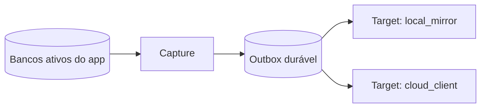
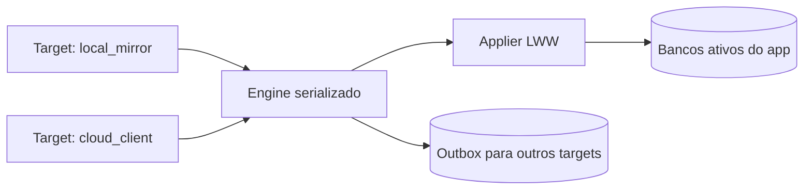

# Arquitetura De Replicação Local-First

Este documento explica a arquitetura de `src-tauri/src/replication`.
Ele existe para deixar claro onde cada peça atua, qual ordem o ciclo segue e
quais proteções reduzem risco de race condition, colisão de patches ou
inconsistência entre app, backup local e cloud.

## Ideia Central

A replicação do app deve ser entendida como dois fluxos, ambos passando pelo
mesmo motor serializado:





O ponto mais importante: **nenhum target aplica mudanças diretamente no app**.
Todo inbound entra no `engine`, passa pelo `applier` e, se foi aceito, é
reenfileirado para os demais targets.

## Componentes

### `engine.rs`

É o orquestrador do cliente. Ele possui um `CYCLE_LOCK` global, então apenas
um ciclo de replicação roda por vez.

Isso protege contra estes casos:

- timer de 10 segundos rodando ao mesmo tempo que uma ação manual;
- bootstrap de pasta local concorrendo com pull/push;
- restore concorrendo com captura de mudanças;
- dois targets inbound tentando aplicar patches no app simultaneamente.

O ciclo normal segue esta ordem:

1. captura mudanças locais;
2. entrega outbox para targets;
3. puxa patches externos dos targets configurados;
4. aplica patches inbound no app;
5. enfileira o patch inbound para todos os outros targets;
6. confirma o target de origem;
7. reseta baselines depois que app/outbox/target estão coerentes.

### `capture/`

Compara os bancos ativos do app contra baselines locais usando SQLite Session.

Domínios monitorados:

- `UserData`: `veterinary_clinic_user.db`;
- `UserMedia`: `veterinary_clinic_user_media.db`;
- `UserLogs`: `veterinary_clinic_user_logs.db`.

Cada domínio possui uma dirty flag em memória. O app marca a flag quando há
escrita real no banco. Assim o ciclo não precisa fazer diff caro a cada 10
segundos quando nada mudou.

No primeiro ciclo após abrir o app, as flags começam marcadas. Isso força uma
checagem inicial segura caso exista baseline anterior e o app tenha fechado
antes de emitir algum patch.

### `outbox/`

E a fila durável de patches ainda não entregues. Ela guarda:

- envelope completo;
- estágio (`micro`, `c1`, `c2`, `c3`);
- target de origem, quando o patch veio de fora;
- targets já entregues;
- tentativas, backoff e último erro.

A entrega é por target. Se o patch já foi entregue ao backup local, mas cloud
falhou, o próximo ciclo tenta somente cloud.

Rollup usa `rusqlite::session::Changegroup`, e só consolida patches que ainda
não foram entregues a nenhum target. Isso evita apagar rastreabilidade de
entrega parcial.

### `targets/local_mirror/`

Representa uma pasta local, USB ou NAS com acesso direto ao disco.

Ele mantém:

- bancos base no destino;
- CAS do usuário no destino;
- uma baseline própria por domínio.

Quando recebe patch do app:

1. grava anexos CAS do envelope;
2. aplica o changeset no banco base do mirror;
3. reseta a baseline do mirror naquele domínio.

Quando outro computador altera o mesmo mirror:

1. compara banco base do mirror contra baseline do mirror;
2. gera um `PatchEnvelope` com origem `local`;
3. entrega o envelope ao `engine`;
4. o `engine` aplica no app;
5. o `engine` coloca o mesmo patch na outbox para os outros targets, como
   cloud.

### `targets/cloud_client.rs`

Representa o cliente de uma API cloud futura.

Ele **não abre banco remoto** e **não decide conflito sozinho**. O papel dele é
apenas:

- fazer push de envelopes pendentes;
- fazer pull de envelopes novos;
- informar erro/backoff quando a rede falhar.

O servidor cloud, quando existir, deverá ter sua própria fila/router. O cliente
desktop não deve tentar simular banco remoto via filesystem.

### `applier.rs`

Aplica changesets inbound nos bancos ativos usando `apply_strm`.

Conflitos usam LWW, com prioridade de timestamp por tabela:

1. `updated_at`;
2. `removed_at`;
3. `uploaded_at`;
4. `created_at`;
5. `applied_at`.

Regra:

- patch recebido mais novo: `REPLACE`;
- linha local mais nova: `OMIT`;
- conflito FK/constraint sem solução clara: `OMIT`.

Essa regra é conservadora. Ela evita corromper o banco tentando adivinhar
relações ausentes.

## CAS E Mídias

Arquivos originais não ficam dentro do SQLite. Eles ficam em CAS:

```text
vault/user/xx/yy/<hash_sha256>.bin
```

O SQLite de mídia guarda metadados, thumbnail e hash.

Na replicação, CAS não é um fluxo paralelo. O arquivo entra como anexo do
`PatchEnvelope` quando o patch de `UserMedia` precisa de bytes que o target
ainda não conhece.

Como o hash é do conteúdo, o arquivo é imutável:

- se já existe, não precisa gravar de novo;
- se falta, pode ser copiado com segurança;
- se o patch falhar, o arquivo ainda pode existir sem causar conflito, porque
  o metadado SQLite é quem define o que está ativo.

## Bootstrap De Local Mirror

Quando o usuário escolhe uma pasta:

1. cria bancos base ausentes;
2. copia CAS ausente por hash;
3. se já houver dados dos dois lados, gera changesets de estado completo a partir de
   baselines vazias;
4. aplica app -> mirror e mirror -> app com o mesmo LWW;
5. reseta baselines do app e do mirror;
6. executa um ciclo normal ainda dentro do lock.

Esse processo evita uma reconciliação manual permanente. Depois do bootstrap,
o mirror volta a operar por patches.

## Proteções Contra Corrida

### Um engine por vez

`CYCLE_LOCK` serializa:

- timer;
- bootstrap;
- restore;
- aplicação inbound manual;
- pull/push.

Isso evita dois applys simultâneos no app.

### Bancos protegidos por mutex

Cada conexão SQLite principal está em `Arc<Mutex<Connection>>`.
Enquanto uma captura segura difere e salva baseline de um domínio, outra thread
não usa aquela mesma conexão.

### Dirty flags

O ciclo não faz diff de banco limpo. Isso reduz engasgos sem perder segurança:

- ao abrir o app, flags começam marcadas;
- escritas via SQL genérico marcam a flag;
- escritas de mídia marcam `UserMedia` explicitamente, porque `blobs` é
  `WITHOUT ROWID` e `update_hook` não cobre esse caso;
- hard delete marca o domínio afetado e `UserLogs`.

### Outbox durável

Patch capturado primeiro entra na outbox. Só depois é entregue.
Se target falhar, o patch permanece local.

### Baseline resetada tarde

Baselines são resetadas apenas quando o estado já foi representado no próximo
ponto do fluxo:

- captura local: patch já está na outbox;
- inbound: patch já foi aplicado e reenfileirado;
- target local: patch já foi aplicado no mirror ou confirmado.

## Onde Ainda Existe Risco

Nenhum desenho local-first elimina todos os conflitos. Os riscos conhecidos e
controlados são:

- dois dispositivos editarem o mesmo campo quase ao mesmo tempo;
- um patch chegar antes de outro que traz uma FK necessária;
- NAS/USB sumir no meio de uma entrega;
- cloud aceitar push mas cliente cair antes de confirmar.

Como mitigação atual:

- LWW evita aplicar dado mais antigo sobre dado mais novo;
- FK/constraint incerto vira `OMIT`;
- outbox tem retry/backoff;
- local mirror usa fallback se destino fica indisponível;
- CAS é deduplicado por hash.

## O Que Não Fazer

- Não deixar `local_mirror` escrever nos bancos ativos do app.
- Não deixar `cloud_client` abrir banco remoto.
- Não aplicar patch fora do `engine`.
- Não resetar baseline antes de enfileirar/aplicar/confirmar.
- Não tratar CAS como canal separado de sincronização lógica.
- Não consolidar rollup de patch parcialmente entregue.

## Como Ler O Código

Ordem recomendada:

1. `types.rs`: contratos e nomes;
2. `engine.rs`: ordem real do ciclo;
3. `capture/mod.rs`: como patches locais nascem;
4. `outbox/queue.rs`: como patches ficam duráveis;
5. `outbox/transport.rs`: como targets recebem;
6. `targets/local_mirror/mod.rs`: como pasta local/NAS conversa com o engine;
7. `applier.rs`: como inbound é aplicado;
8. `orchestrator.rs`: comandos Tauri e loop de background.

## Resumo Em Uma Frase

O app não sincroniza “banco com banco” em vários lugares; ele sincroniza
**patches serializados pelo engine**, guarda pendências na outbox e trata
local/NAS e cloud como targets que empurram e recebem envelopes.
