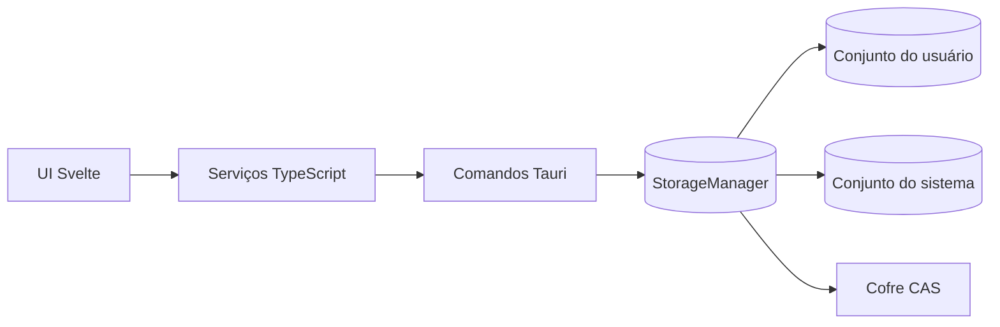
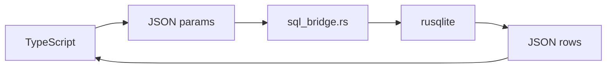
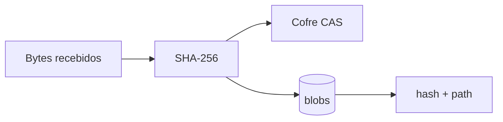
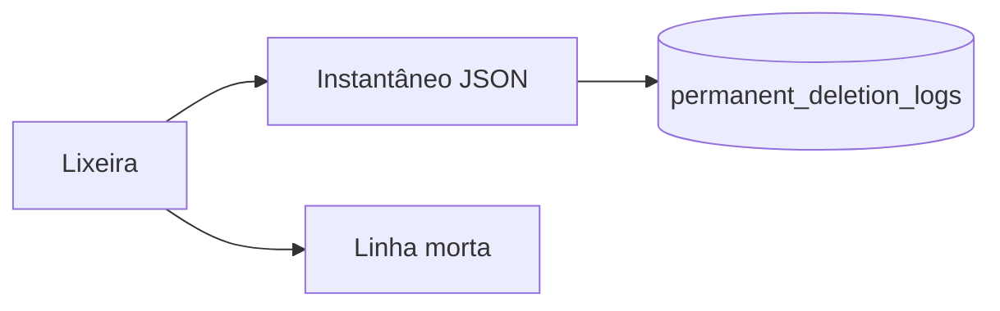

# Arquitetura De Armazenamento

Este documento explica a arquitetura de `src-tauri/src/storage`.
Ele é a camada Rust que mantém os bancos ativos e o CAS físico do app.

`storage` é propositalmente menor do que a lógica de importação/exportação e de
replicação. Ele não decide fluxo de backup, não empacota dados e não tenta
resolver conflitos entre dispositivos. Ele abre, escreve, lê e protege os
arquivos ativos.

## Ideia Central



Resumo mental:

```text
storage      = arquivos e bancos ativos
distribution = pacotes completos que entram ou saem
replication  = patches contínuos entre app, espelho local e cloud
```

## Fronteiras

`storage` faz:

- abrir bancos SQLite gerenciados pelo app;
- aplicar PRAGMAs e cache de instruções preparadas;
- manter conexões compartilhadas por `Arc<Mutex<Connection>>`;
- executar SQL vindo da camada TypeScript;
- salvar mídia original em CAS por SHA-256;
- manter metadados de mídia no SQLite;
- criar e validar o `database_manifest`;
- manter indicadores de alteração por domínio do usuário;
- executar exclusão definitiva por linha morta e auditoria.

`storage` não faz:

- exportação/importação ZIP ou CSV;
- sincronização contínua com local/NAS/cloud;
- fila de patches;
- rollup de changesets;
- resolução de conflito entre bases;
- migrações semânticas do banco operacional;
- regras de negócio clínicas.

## Conjuntos De Dados

O app separa dados do usuário e dados de sistema.

Conjunto do usuário:

```text
veterinary_clinic_user.db
veterinary_clinic_user_media.db
veterinary_clinic_user_logs.db
vault/user/xx/yy/<hash_sha256>.bin
```

Conjunto do sistema:

```text
veterinary_clinic_system.db
veterinary_clinic_system_media.db
vault/system/xx/yy/<hash_sha256>.bin
```

O conjunto do usuário é importado, exportado e replicado. O conjunto do sistema
é reconstruído pelo app a partir dos defaults incluídos no programa.

## Bancos SQLite

`StorageManager` abre cinco conexões fixas:

- `user_db`: dados operacionais da clínica;
- `system_db`: dados de referência do sistema;
- `user_media_db`: índice de mídias do usuário;
- `system_media_db`: índice de mídias do sistema;
- `user_logs_db`: identidade da base e logs de auditoria.

Cada conexão fica em `Arc<Mutex<Connection>>`.

Isso deixa claro que `rusqlite` é síncrono e que cada comando precisa entrar em
uma seção crítica por conexão. No lado Tauri, comandos usam `spawn_blocking`
para que essas operações não travem a UI.

## Abertura SQLite

Todo banco gerenciado passa por `open_sqlite_db`.

PRAGMAs comuns:

```sql
PRAGMA journal_mode = WAL;
PRAGMA foreign_keys = ON;
PRAGMA synchronous = NORMAL;
PRAGMA page_size = 4096;
```

Pragmáticas específicas:

- operacional: cache maior para consultas de domínio;
- mídia: cache menor e `mmap_size` para leitura rápida de índice/thumbnail;
- logs: cache menor, pois é banco auxiliar.

`sqlite.rs` também cria estruturas que pertencem ao storage Rust:

- `blobs` de mídia do usuário;
- `blobs` de mídia do sistema;
- `database_manifest`;
- `permanent_deletion_logs`;
- `system_audit_logs`.

A estrutura operacional principal continua sob responsabilidade do migrador do
app.

## Ponte SQL Para A UI



`storage_select` e `storage_execute` aceitam SQL e valores JSON vindos da
camada TypeScript.

A ponte:

- converte placeholders `$1`, `$2` para o formato aceito por `rusqlite`;
- converte JSON para tipos SQLite;
- converte BLOBs para arrays de bytes;
- devolve cada linha como objeto JSON.

A UI não abre banco diretamente. A ponte Tauri de `storage` é o contrato atual
entre TypeScript e `rusqlite`.

## CAS De Mídias

Arquivos originais de mídia ficam fora do SQLite.

Fluxo de gravação:



Exemplo de caminho:

```text
vault/user/a1/b2/a1b2...bin
```

O arquivo é salvo sem extensão e com nome derivado do SHA-256. Se o arquivo já
existe, a escrita física é ignorada.

A confirmação usa arquivo temporário, `sync_all` e `rename`. Isso reduz risco
de um arquivo parcialmente escrito aparecer como mídia válida.

O banco de mídia guarda:

- hash de 32 bytes;
- thumbnail;
- tipo MIME;
- tamanho;
- dimensões;
- status de sincronização;
- datas de criação/atualização;
- remoção lógica no caso de mídia de usuário.

## Identidade Da Base

`database_manifest` vive no banco de logs do usuário.

Ela contém o `database_id` UUIDv7 da base. Esse ID é usado para validar:

- importação/exportação;
- espelho local de backup;
- restauração;
- sincronização com dados que já existem em outra pasta.

Regra: pacote ou espelho sem manifesto válido não deve ser aceito como a mesma
base.

## Indicadores De Alteração

`dirty.rs` mantém indicadores atômicos de alteração para:

- `UserData`;
- `UserMedia`;
- `UserLogs`.

Esses indicadores são usados por `replication`. Quando uma escrita afeta uma
conexão do usuário, o indicador do domínio é marcado. O ciclo de replicação só
tenta comparar o domínio quando esse indicador sinaliza mudança.

Isso reduz engasgos e evita varreduras caras a cada ciclo.

Observação importante: tabelas `WITHOUT ROWID`, como `blobs`, nem sempre são
cobertas pelo gancho de atualização do SQLite. Por isso operações de mídia marcam
`UserMedia` explicitamente.

## Exclusão Definitiva

Exclusão definitiva não remove a linha operacional de forma bruta.

Fluxo:



A linha é reduzida a uma linha morta:

- mantém `id`;
- mantém metadados de sincronização;
- atualiza `updated_at`;
- preenche `removed_at`;
- remove ou zera conteúdo sensível.

O instantâneo do conteúdo anterior vai para `permanent_deletion_logs`. Assim a
lixeira e auditoria conseguem saber o que foi excluído, enquanto replicação
continua tendo uma linha morta para resolver LWW e evitar que dados antigos
voltem por engano.

## Relação Com `distribution`

`distribution` usa `storage` para:

- descobrir caminhos dos bancos ativos;
- criar instantâneos consistentes;
- fechar conexões antes de substituir arquivos;
- reabrir conexões depois da importação;
- acessar `vault/user`.

`distribution` não deve abrir bancos ativos por fora do `StorageManager`.

## Relação Com `replication`

`replication` usa `storage` para:

- saber quais domínios estão dirty;
- abrir os bancos ativos por domínio;
- aplicar patches inbound;
- gravar anexos CAS recebidos;
- validar identidade da base.

`storage` não decide quando sincronizar. Ele só oferece as primitivas seguras.

## Proteções

### Conexões Serializadas

Cada banco tem seu próprio mutex. Isso impede dois comandos Rust de usarem a
mesma conexão SQLite ao mesmo tempo.

### Trabalho Bloqueante Fora Da UI

Comandos Tauri usam `spawn_blocking`. O SQL síncrono roda fora da thread
assíncrona principal.

### CAS Imutável

Arquivo físico é identificado pelo conteúdo. A deduplicação é natural e não
depende de nome original.

### Manifesto No Banco De Logs

A identidade da base viaja com importação, exportação e replicação.

### Linha Morta Em Vez De Remoção Bruta

Exclusão definitiva preserva metadados suficientes para sincronização e impede
ressurreição de linhas antigas.

## O Que Não Fazer

- Não salvar bytes originais de mídia no SQLite.
- Não abrir banco gerenciado fora de `open_sqlite_db`.
- Não usar `std::fs::copy` para substituir banco ativo sem fechar conexões.
- Não colocar regra clínica em `storage`.
- Não fazer importação/exportação completa em `storage`.
- Não aplicar lógica de cloud em `storage`.
- Não esquecer de marcar indicador de alteração em escrita que não passa pelo
  gancho de atualização do SQLite.

## Como Ler O Código

Ordem recomendada:

1. `mod.rs`: fachada pública do módulo;
2. `data.rs`: `StorageManager`, conexões e caminhos;
3. `sqlite.rs`: abertura, PRAGMAs e estruturas pequenas;
4. `commands.rs`: comandos Tauri e `spawn_blocking`;
5. `sql_bridge.rs`: conversão JSON/SQLite;
6. `cas.rs`: caminhos e escrita CAS;
7. `media.rs`: metadados de mídia;
8. `database_manifest.rs`: identidade da base;
9. `dirty.rs`: indicadores usados por replicação;
10. `deletion.rs`: linhas mortas e logs de exclusão;
11. `uuid.rs`: geração local de UUIDv7.

## Resumo Em Uma Frase

`storage` é a camada que mantém **bancos ativos e CAS físico** do app, deixando
pacotes completos para `distribution` e sincronização contínua para
`replication`.
