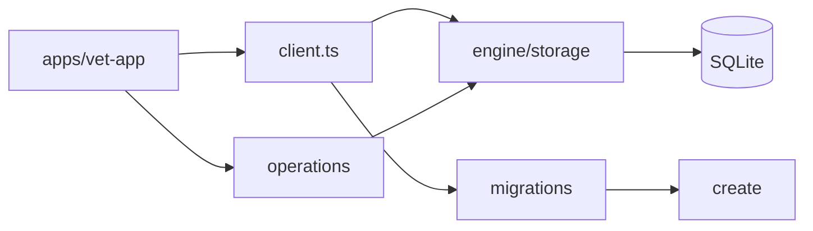

# SQLite (`core-local/sqlite`)

Este módulo é a fronteira TypeScript de SQLite do `@vet/core-local`.

Ele abre adaptadores para os bancos gerenciados pelo app, executa criação e
migrations dos bancos operacionais em TypeScript, expõe fachadas públicas para
operações de mídia e mantém definições de versão usadas pela UI, pelos
repositórios locais e pelo `engine`.

## Modelo Mental



`core-local/sqlite` é a camada TypeScript que conhece o formato atual dos
bancos e entrega uma API prática para o restante do app. O acesso físico aos
arquivos SQLite gerenciados pelo app passa pelo `engine/storage`.

## Responsabilidades

`core-local/sqlite` faz:

- expor adaptadores `SqliteDatabase` para comandos SQL usados no TypeScript;
- abrir os bancos `user/main`, `user/media`, `system/main` e `system/media`;
- rodar migrations do banco operacional de usuário;
- criar e atualizar o banco operacional de sistema;
- configurar bancos de mídia e validar suas versões;
- manter constantes de versão por banco;
- declarar perfis de tabelas por banco e por domínio;
- fornecer operações reutilizáveis de mídia para repositórios e serviços.

`core-local/sqlite` não faz:

- abrir arquivos SQLite diretamente fora do `engine/storage`;
- salvar bytes originais de mídia no SQLite;
- executar operações Tauri fora de `client.ts`;
- decidir regra clínica de módulos de negócio;
- exportar ou importar pacotes de dados;
- fazer replicação contínua;
- criar schema físico de tabelas cujo runtime de criação é do `engine`.

## Conjunto De Bancos

Usuário:

```text
user/main   -> veterinary_clinic_user.db
user/media  -> veterinary_clinic_user_media.db
user/logs   -> veterinary_clinic_user_logs.db
```

Sistema:

```text
system/main  -> veterinary_clinic_system.db
system/media -> veterinary_clinic_system_media.db
```

Cada banco tem versão própria em `PRAGMA user_version`, declarada em
`schema-versions.ts`.

## Módulos

`client.ts`

Fachada de abertura dos bancos para TypeScript. Cria adaptadores baseados nos
comandos Tauri `storage_select`, `storage_execute`, `storage_reopen` e
`storage_close`, mantém cache de conexões e aciona as rotinas de criação e
migration no momento certo.

`migrations.ts`

Fachada pública das migrations. Exporta versões atuais, status de schema,
perfil de banco e funções de migration sem expor a organização interna das
pastas.

`media.ts`

Fachada pública das operações de mídia. Exporta SQL, tipos, normalização de hash,
DDL dos índices de mídia e funções de leitura/escrita de metadados.

`schema-versions.ts`

Constantes de versão por banco:

- `CURRENT_USER_MAIN_SCHEMA_VERSION`;
- `CURRENT_USER_MEDIA_SCHEMA_VERSION`;
- `CURRENT_USER_LOGS_SCHEMA_VERSION`;
- `CURRENT_SYSTEM_MAIN_SCHEMA_VERSION`;
- `CURRENT_SYSTEM_MEDIA_SCHEMA_VERSION`.

`create/`

Criação, validação estrutural e preparação de schemas na versão atual. Esta
pasta descreve o formato atual de cada banco e não guarda versões incrementais.

`create/user/main/`

Schema, índices, assertions e limpeza de dados de sistema no banco operacional
do usuário.

`create/user/media/`

Schema e perfil do banco de mídia do usuário. Guarda metadados de mídia; os
arquivos originais ficam no CAS.

`create/user/logs/`

Perfil e descrição de schema do banco de logs do usuário. O runtime de criação é
do `engine`, declarado em `schema.ts`.

`create/system/main/`

Schema, índices, assertions, refresh estrutural e seeds do banco de referência
do sistema.

`create/system/media/`

Schema e perfil do banco de mídia do sistema.

`create/shared/`

Utilitários compartilhados de SQL, introspecção de tabelas, leitura/escrita de
`PRAGMA user_version`, validação de integridade e tipos usados pela camada
SQLite.

`migrations/`

Pipeline incremental de mudança de versão. Contém a classificação do estado do
schema, o runner transacional e o registro de migrations aplicáveis ao banco
`user/main`.

`migrations/user/main/`

Registro, tipos e versões incrementais do banco operacional do usuário.

`operations/`

Operações de uso diário sobre bancos já abertos e já preparados.

`operations/media/`

Repositório, SQL, tipos, hash e thumbnail de metadados de mídia.

## Regras De Manutenção

- Manter `migrations.ts` e `media.ts` como fachadas públicas pequenas.
- Colocar criação de schema atual em `create/`.
- Colocar alteração incremental de versão em `migrations/`.
- Colocar leitura/escrita de uso diário em `operations/`.
- Não misturar SQL de criação, migration e operação no mesmo arquivo.
- Não criar regras clínicas dentro de `sqlite`.
- Ao adicionar tabela, registrar o banco e o domínio em `create/profiles.ts`.
- Ao alterar versão de um banco, atualizar `schema-versions.ts` e os testes
  correspondentes.
- Ao mover uma criação de schema para Rust, manter a descrição TypeScript em
  `schema.ts` e declarar o runtime dono da criação no próprio arquivo.
- Ao criar estrutura física no `engine`, atualizar também o README de
  `engine/storage`.
