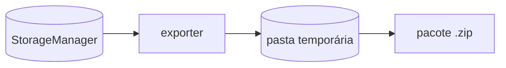
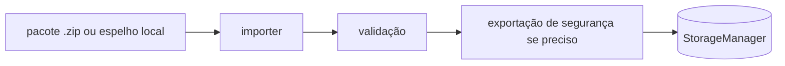
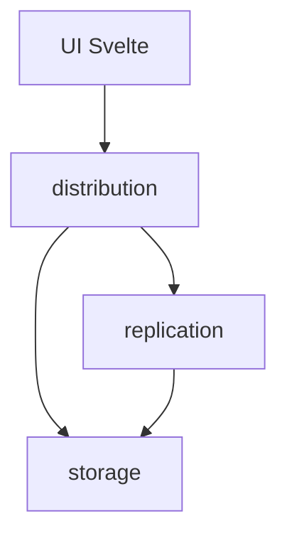

# Distribuição

Este módulo cuida de **importação e exportação local completa**. Ele gera e
consome pacotes portáteis para mover a base do usuário entre máquinas, analisar
dados fora do app ou restaurar manualmente um estado escolhido.

Backup contínuo local/NAS/cloud não mora aqui. Esse fluxo é baseado em patches
e fica em `replication`.

## Modelo Mental

Exportação:



Importação:



## Responsabilidades

`distribution` faz:

- exportação nativa completa em ZIP;
- exportação CSV completa em ZIP;
- importação nativa a partir de ZIP;
- importação CSV a partir de ZIP;
- importação a partir de uma pasta de `local_mirror` validada;
- exportação de segurança antes de substituir a base atual quando a replicação não
  conseguiu fazer a última sincronização.

`distribution` não faz:

- captura de micro-patches;
- entrega para local/NAS/cloud;
- resolução contínua de conflitos;
- garbage collection de backup;
- atualização de linhas-base de replicação;
- regras de negócio de tutores, pacientes, produtos ou prontuários.

## Formato Nativo

Um pacote nativo é sem perda e usa os mesmos arquivos de usuário que o app usa:

```text
data/
  veterinary_clinic_user.db
  veterinary_clinic_user_media.db
  veterinary_clinic_user_logs.db
vault/
  user/
    xx/
      yy/
        <hash_sha256>.bin
```

Os bancos são gerados com `VACUUM INTO`, nunca por cópia direta de arquivos
SQLite ativos. Isso consolida WAL/SHM e produz instantâneos consistentes.

O manifesto vive no banco de logs, na tabela `database_manifest`. Não há
`manifest.json` solto no pacote.

## Formato CSV

O pacote CSV é feito para inspeção humana e portabilidade:

```text
data_csv/
  <tabelas do user.db>.csv
media_csv/
  blobs.csv
logs_csv/
  database_manifest.csv
  permanent_deletion_logs.csv
  system_audit_logs.csv
vault/
  user/
    xx/
      yy/
        <hash_sha256>.bin
```

Colunas BLOB pequenas ou referências binárias, como hashes e thumbnails, são
renderizadas como hexadecimal no CSV. Os arquivos originais continuam no CAS do
pacote, não dentro das células CSV.

## Importação

Antes de substituir a base ativa:

1. o pacote é extraído para uma pasta temporária;
2. os bancos são validados com `PRAGMA integrity_check`;
3. a versão de estrutura é recusada se vier do futuro;
4. o manifesto em `user_logs.db` é validado;
5. `replication::orchestrator::prepare_for_database_import` tenta uma última
   sincronização com o backup contínuo atual;
6. se essa última sincronização falhar, é criada uma exportação nativa de segurança em
   `AppData/import_safety_exports/`;
7. as conexões do conjunto do usuário são fechadas;
8. os arquivos do usuário são substituídos e as conexões reabertas.

Quando a origem é uma pasta de `local_mirror`, o importer aceita tanto a pasta
efetiva do espelho quanto a pasta-pai escolhida pelo usuário, desde que encontre
exatamente um espelho válido. Se houver mais de um candidato, recusa por
ambiguidade.

## Módulos

`commands.rs`

Fronteira Tauri IPC. Mantém os comandos públicos estáveis para a UI:

- `export_user_native_package`
- `export_user_csv_package`
- `import_user_native_package`
- `import_user_csv_package`

`contracts.rs`

DTOs de entrada/saída dos comandos. Usa nomes neutros de distribuição:

- `safety_export_path`: pacote criado para segurança antes da importação;
- `replication_target_path`: raiz do backup contínuo a reutilizar após importar
  de um espelho local.

`exporter.rs`

Fluxo de exportação. Monta pasta temporária, chama instantâneos dos bancos e
copia CAS.

`importer.rs`

Fluxo de importação. Resolve origem, valida pacote, prepara segurança,
substitui o conjunto do usuário e devolve caminhos relevantes para a UI.

`database_package.rs`

Cria instantâneos consistentes dos três bancos de usuário com `VACUUM INTO`.

`csv.rs`

Parser/exportador CSV simples. Também converte BLOBs selecionados entre bytes e
hexadecimal.

`csv_tables.rs`

Lista declarativa das tabelas de usuário exportadas para CSV. Tabelas de
catálogo do sistema não entram aqui.

`files.rs`

Staging temporário, cópia recursiva, substituição de diretórios e troca segura
de arquivos SQLite removendo sidecars `-wal` e `-shm`.

`sqlite.rs`

Validação SQLite, clone de estrutura vazia para importação CSV e `VACUUM INTO`.

`zip.rs`

Leitor/escritor ZIP mínimo com entradas armazenadas sem compressão. A intenção
é manter distribuição auditável e sem dependência extra.

`time.rs`

Utilitários pequenos para timestamp de arquivo e metadados DOS do ZIP.

## Relação Com `storage` E `replication`



- `storage` abre bancos, gerencia conexões e CAS ativo.
- `distribution` cria/consome pacotes completos usando `storage`.
- `replication` sincroniza mudanças contínuas por patches.
- `distribution` só conversa com `replication` no preparo de importação, para
  evitar trocar a base ativa antes de tentar uma última sincronização.

## Regras De Manutenção

- Não colocar timer, outbox ou lógica de nuvem aqui.
- Não copiar banco SQLite ativo com `std::fs::copy`; usar `VACUUM INTO`.
- Não exportar tabelas de sistema no CSV do usuário.
- Não colocar regras de domínio nos pacotes; o pacote é transporte.
- Não criar `manifest.json`; a identidade da base vive em `user_logs.db`.
- Ao adicionar tabela de usuário, atualizar `csv_tables.rs` e este README.
- Ao mudar o formato nativo, manter compatibilidade apenas quando isso for
  explicitamente desejado. A direção atual do projeto é limpa, sem legacy
  interno desnecessário.
