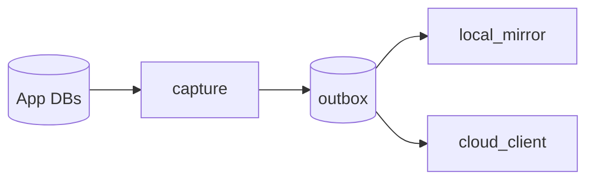
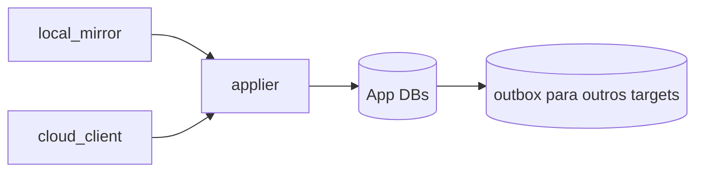

# Replication

Este módulo mantém os dados locais sincronizados usando SQLite Session
changesets e arquivos CAS anexados aos patches. A UI ainda pode chamar isso de
"Backup", mas internamente o desenho é sincronização local-first.

Para uma explicação mais detalhada da arquitetura, da ordem do ciclo e das
proteções contra race condition, veja
[`docs/replication-architecture.md`](../../../docs/replication-architecture.md).

## Modelo Mental

Fluxo local de edição:

Fluxo inbound:

Todo patch recebido de um target é aplicado no app e reenfileirado para os
outros targets, exceto o target de origem.

## Módulos

`engine.rs`

Ponto unico e serializado do ciclo. A cada 10 segundos ele:

1. chama `capture::capture_once`;
2. entrega a outbox para targets;
3. puxa patches inbound dos targets;
4. aplica inbound no app via `applier`;
5. enfileira inbound para os demais targets;
6. reseta baselines somente depois da aplicação e propagação.

`capture/`

Compara os 3 bancos ativos contra baselines locais:

- `veterinary_clinic_user.db`
- `veterinary_clinic_user_media.db`
- `veterinary_clinic_user_logs.db`

Se há delta, gera `PatchEnvelope`. Para `UserMedia`, os arquivos CAS ainda não
conhecidos entram como anexos imutáveis do patch.

`outbox/`

Fila durável de patches pendentes. Cada item guarda:

- envelope;
- stage (`micro`, `c1`, `c2`, `c3`);
- target de origem, se houver;
- targets já entregues;
- tentativas, backoff e último erro.

Rollup usa `rusqlite::session::Changegroup` e só consolida itens que ainda não
foram entregues a nenhum target.

`targets/`

Boundary dos destinos e fontes de sincronização.

- `local_mirror/`: target com acesso direto ao disco local, USB ou NAS.
- `cloud_client.rs`: cliente futuro de API cloud. Ele nunca abre banco remoto.

O servidor cloud terá seu próprio router/fila. O cliente cloud apenas faz
`push` e `pull` de envelopes.

`applier/`

Aplica changesets inbound nos bancos ativos com `apply_strm`.

- `mod.rs`: coordena aplicação de envelope e patch.
- `lww.rs`: decide conflitos por Last-Write-Wins.
- `media.rs`: grava anexos CAS de patches de mídia.
- `restore.rs`: restauração completa do bundle do usuário.
- `sqlite.rs`: abertura de banco por domínio e transação inbound.

O handler LWW compara timestamps por tabela, nesta prioridade:

1. `updated_at`
2. `removed_at`
3. `uploaded_at`
4. `created_at`
5. `applied_at`

Ele usa `REPLACE` somente quando o patch recebido é claramente mais novo.
Quando o local é mais novo, ou quando FK/constraint não pode ser resolvida,
usa `OMIT`.

## Local Mirror

O local mirror é um target com acesso direto ao filesystem. Ele mantém bancos
base no destino e uma baseline própria por domínio.

O banco `base_veterinary_clinic_user_logs.db` carrega a tabela
`database_manifest`. O campo `database_id` é um UUIDv7 criado uma única vez
quando a base de dados nasce. Antes de fazer bootstrap ou aplicar patches, o
local mirror compara esse identificador com o `database_id` do app ativo. Se a
pasta escolhida pertence a outra base, a sincronização é recusada para evitar
mistura acidental de clínicas/bases diferentes.

A pasta definida na tela de Backups é uma raiz escolhida pelo usuário. Dentro
dela o local mirror cria uma subpasta de trabalho com o rótulo
`Veterinary Clinic - <database_id>`, mantendo os arquivos do backup separados de
outros arquivos que já existam no destino. O rótulo não é fonte de verdade:
sempre que há dúvida, o código lê e valida a tabela `database_manifest`.

Quando recebe patch do app:

1. grava anexos CAS recebidos;
2. aplica o changeset no banco base do mirror;
3. reseta a baseline daquele domínio no mirror.

Quando detecta alteração feita por outra máquina:

1. compara banco base do mirror contra a baseline do mirror;
2. gera `PatchEnvelope` com origem `local`;
3. o engine aplica no app;
4. o engine enfileira para outros targets, como cloud;
5. o engine confirma o target e reseta a baseline do mirror.

## Bootstrap

Quando uma pasta local/NAS é selecionada:

- a pasta efetiva do backup é resolvida como subpasta
  `Veterinary Clinic - <database_id>` dentro da raiz escolhida;
- se faltam bancos base, eles são criados por snapshot seguro do app;
- CAS do usuário é copiado por hash, sem duplicar arquivos;
- se já existe conteúdo no destino, app e mirror geram changesets de estado completo
  contra baselines vazias e aplicam esses patches um no outro com LWW;
- depois disso, as baselines do app e do mirror são resetadas e o ciclo normal
  passa a usar patches.

## Regras De Manutenção

- Não colocar lógica local/NAS em `cloud_client`.
- Não colocar lógica cloud/API em `local_mirror`.
- Não deixar targets aplicarem mudanças no app diretamente.
- Todo inbound passa pelo `engine`, depois pelo `applier`, depois pela outbox.
- CAS não é um fluxo paralelo: é anexo imutável do patch.
- Ao adicionar domínio de banco, atualizar `StorageDomain`, `capture`,
  `local_mirror`, `applier`, export/import e este README.
