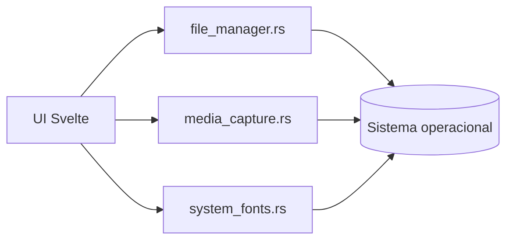

# Plataforma

Este módulo é a fronteira Rust de integrações nativas reutilizáveis do sistema
operacional.

Ele expõe comandos Tauri para a UI sem misturar essas capacidades com regras
clínicas, persistência SQLite, distribuição ou replicação.

## Modelo Mental

`apps/vet-app/src-tauri` registra os comandos. A implementação fica em
`platform`, dentro de `vet-engine`.

## Responsabilidades

`platform` faz:

- abrir caminhos no gerenciador de arquivos do sistema;
- configurar captura de mídia da WebView quando a plataforma exige ajuste
  nativo;
- listar fontes disponíveis no sistema e em diretórios extras informados pelo
  app;
- normalizar pequenas diferenças entre Linux, macOS e Windows para esses
  comandos.

`platform` não faz:

- regra clínica, cadastral ou de catálogo;
- leitura ou escrita de SQLite;
- importação/exportação de pacotes;
- backup ou replicação;
- navegação de UI, toast, tradução ou decisão visual;
- dependência direta de rotas Svelte.

## Módulos

`mod.rs`

Fachada do módulo. Exporta as integrações nativas disponíveis em `platform`.

`file_manager.rs`

Implementa `open_file_manager`. Quando o caminho informado é um arquivo, abre a
pasta pai no gerenciador de arquivos do sistema.

Plataformas suportadas:

- Linux: `xdg-open`;
- macOS: `open`;
- Windows: `explorer`.

Erros públicos:

- `path_empty`;
- `path_not_found: <path>`;
- `file_manager_open_failed: <error>`;
- `file_manager_open_unsupported`.

`media_capture.rs`

Implementa `configure_media_capture`. No Linux, configura a WebView para liberar
recursos de mídia e WebRTC usados por captura de câmera/microfone. Em Windows e
macOS, a função existe como no-op para manter a API multiplataforma estável.

`system_fonts.rs`

Implementa `list_system_fonts`. Retorna uma lista ordenada e deduplicada de
famílias de fontes disponíveis no sistema e em diretórios extras informados pelo
app.

Fontes do sistema:

- Linux: `fc-list`;
- macOS: `system_profiler SPFontsDataType`;
- Windows: registro de fontes via PowerShell.

Diretórios extras são varridos em busca de arquivos `.ttf`, `.otf`, `.ttc` e
`.otc`. A varredura é limitada em profundidade para evitar percorrer árvores de
arquivos grandes demais.

## Regras De Manutenção

- Não adicionar regra de domínio clínico aqui.
- Não acessar SQLite, CAS, import/export ou backup por este módulo.
- Não colocar navegação, labels, tradução, classes ou comportamento visual aqui.
- Não criar dependência com rotas ou estado específico de `apps/vet-app`.
- Ao adicionar integração nativa reutilizável, criar um módulo próprio em
  `platform/` e atualizar este README.
- Integrações específicas de uma janela, plugin de app ou comportamento visual
  permanecem em `apps/vet-app/src-tauri`.
