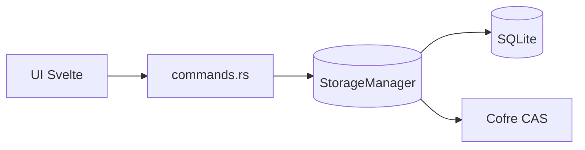

# Armazenamento (`storage`)

Este módulo é a fronteira Rust de armazenamento ativo do app.

Ele abre os bancos SQLite, aplica PRAGMAs, valida versões de schema, resolve
arquivos CAS, expõe comandos Tauri para a UI e mantém o conjunto ativo de
usuário e sistema.

Documentação maior: [Arquitetura De Armazenamento](../../../docs/storage-architecture.md).

## Modelo Mental



`storage` é usado por dois módulos maiores:

- `distribution`: cria/importa pacotes completos usando os arquivos ativos.
- `replication`: captura/aplica patches e usa o CAS para anexos de mídia.

## Responsabilidades

`storage` faz:

- abrir os bancos fixos do app;
- aplicar PRAGMAs de SQLite;
- classificar e validar `PRAGMA user_version`;
- manter conexões em `Arc<Mutex<Connection>>`;
- executar SQL solicitado pela camada TypeScript;
- salvar mídia original no CAS por SHA-256;
- registrar metadados e thumbnails nos bancos de mídia;
- criar schemas pequenos de storage em Rust;
- manter `database_manifest` no banco de logs;
- marcar indicadores de alteração para a replicação;
- executar exclusão definitiva por linha morta e trilha de auditoria.

`storage` não faz:

- empacotar ZIP nativo ou CSV;
- manter backup contínuo;
- decidir conflito entre dispositivos;
- rodar migração de domínio do banco operacional;
- criar schema clínico do banco operacional;
- conhecer regras clínicas de tutores, pets, produtos ou prontuários.

## Conjunto De Bancos

Todos os bancos ficam no diretório lógico `<app_database_dir>`, resolvido pelo
engine como `<app_data_dir>/databases`. O cofre CAS fica em
`<app_data_dir>/vault`.

Usuário:

```text
databases/veterinary_clinic_user.db
databases/veterinary_clinic_user_media.db
databases/veterinary_clinic_user_logs.db
databases/backups/<backup>.db
vault/user/xx/yy/<hash_sha256>.bin
```

Sistema:

```text
databases/veterinary_clinic_system.db
databases/veterinary_clinic_system_media.db
vault/system/xx/yy/<hash_sha256>.bin
```

## Versão De Schema

Cada banco SQLite tem versão técnica em `PRAGMA user_version`.

`storage` classifica versões com uma regra única:

| Estado | Condição | Ação |
| --- | --- | --- |
| `current` | versão igual à suportada | o banco pode ser aberto |
| `migration_required` | versão `0` ou menor que a suportada | o banco só é elevado quando o schema de storage é reconhecido |
| `from_future` | versão maior que a suportada | o banco é recusado |

Os bancos `user/media`, `system/media` e `user/logs` são schemas de storage.
Quando estão vazios, recebem o schema atual e a versão atual. Quando têm
estrutura reconhecida e versão menor, recebem a versão atual. Quando têm versão
futura ou estrutura desconhecida, são recusados.

O banco operacional usa esta fronteira apenas para abertura e execução SQL. As
migrations de domínio do banco operacional ficam na camada TypeScript.

## Módulos

`mod.rs`

Fachada do módulo. Exporta comandos, DTOs e utilitários usados por
`distribution`, `replication` e `lib.rs`.

`data.rs`

Define `StorageManager`, resolve `<app_database_dir>`, abre conexões fixas,
controla bancos adicionais e implementa `storage_select`/`storage_execute` por
meio da ponte SQL.

`sqlite.rs`

Abre SQLite com PRAGMAs, cache de instruções preparadas e estruturas pequenas
que pertencem ao Rust: `blobs`, `database_manifest`, `permanent_deletion_logs` e
`system_audit_logs`. Também valida a versão e a estrutura dos bancos cujo schema
é criado pelo storage.

`schema_version.rs`

Lê e grava `PRAGMA user_version`, classifica a versão encontrada e recusa bancos
criados por uma versão superior do app.

`cas.rs`

Resolve caminhos CAS e grava arquivos físicos de mídia por hash. A confirmação
é feita por arquivo temporário seguido de `rename`.

`media.rs`

Salva e lê metadados de mídia. O arquivo original fica no CAS; SQLite guarda
hash, thumbnail, dimensões, tipo MIME, status de sincronização e remoção lógica.

`sql_bridge.rs`

Converte valores JSON da UI para parâmetros `rusqlite` e converte linhas SQLite
de volta para JSON.

`commands.rs`

Fronteira Tauri IPC. Encapsula operações síncronas em background para não
travar a UI.

`contracts.rs`

DTOs usados entre TypeScript e Rust.

`database_manifest.rs`

Garante e valida a identidade da base do usuário.

`dirty.rs`

Indicadores de alteração por domínio de usuário, usados por `replication` para
evitar comparações caras quando nada mudou.

`deletion.rs`

Exclusão definitiva. Reduz linhas removidas a linhas mortas, preserva metadados
de sincronização e grava instantâneo no banco de logs.

`uuid.rs`

Gerador local de UUIDv7 em string para linhas criadas pelo Rust.

## Regras De Manutenção

- Não adicionar regras de domínio clínico aqui.
- Não salvar bytes originais de mídia no SQLite.
- Não copiar arquivo CAS com nome fornecido pelo usuário; sempre usar SHA-256.
- Não abrir SQLite fora de `open_sqlite_db` quando for banco gerenciado pelo app.
- Não elevar versão de banco com estrutura desconhecida.
- Não rodar migration de domínio do banco operacional em Rust.
- Não executar `rusqlite` direto em comando assíncrono; usar `spawn_blocking`.
- Ao criar tabela de storage em Rust, atualizar este README e
  `docs/storage-architecture.md`.
