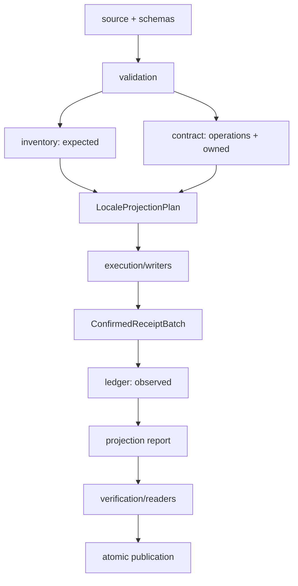

# Manutenção Do Knowledge Builder

Este documento orienta alterações no compilador, nos contratos de autoria e nos
artefatos produzidos. O [README](./README.md) apresenta o uso da ferramenta e o mapa
da saída. O [README de `data/knowledge`](../../data/knowledge/README.md) define
como editar o conteúdo canônico.

## Invariantes

- `data/knowledge` é a única fonte de autoria do conhecimento público.
- O builder produz exatamente os seis locales declarados por `LOCALES`.
- Não existe fallback de locale.
- Diretórios editoriais não definem identidade, taxonomia, ordem ou relação.
- JSON Schema valida cada documento antes da desserialização Serde.
- O digest da fonte representa o modelo semântico, não caminhos editoriais.
- O inventário e o contrato percorrem a fonte de forma independente.
- Toda obrigação projetável pertence a exatamente uma operação.
- Efeitos entram no ledger somente por recibos confirmados após materialização.
- Writers e readers são implementações independentes.
- Toda versão finalizada passa pelo mesmo verificador integral.
- Bancos, relatórios, checksums e objetos CAS são determinísticos.
- `system`, `system_media` e `CAS/system` não compartilham código de autoria ou
  escrita com o ramo `user`.
- A ferramenta não consulta rede, apps, i18n ou packages de runtime.

## Arquitetura



### Fechamento De Cobertura

`expected` descreve tudo que a fonte validada exige. `owned` é a união das
obrigações declaradas pelas operações do contrato. `observed` contém somente os
efeitos confirmados pela execução.

```text
expected == owned == observed
```

Essa igualdade detecta tanto dados não projetados quanto projeções sem origem
canônica. Não derive uma visão a partir da outra e não conclua obrigações por
contagens aproximadas.

### Persistência E Verificação

Cada `SystemRow` declara sua identidade lógica, tabela e colunas. Writers usam
SQL fixo e parâmetros; nomes de tabela ou coluna nunca vêm da fonte. Depois do
commit, os recibos confirmam os efeitos no ledger.

O verificador abre os artefatos finalizados por readers próprios, reconstrói as
rows tipadas e compara o resultado com o contrato. Ele também confere árvore de
arquivos, metadados, fingerprints, checksums, integridade SQLite, relações,
mídia, CAS, relatório e evidências.

## Fontes De Verdade Técnicas

| Contrato | Arquivo proprietário |
| --- | --- |
| Locales e ordem | `src/contracts/locale.rs` |
| Nomes e caminhos de artefatos | `src/contracts/artifact.rs` |
| Identidade, versão e filename dos bancos | `src/contracts/database.rs` |
| Versões serializadas e técnicas | `src/contracts/version.rs` |
| Matriz de taxonomias | `src/contracts/taxonomy.rs` |
| DDL de `system` | `schemas/system/system.sql` |
| DDL de `system_media` | `schemas/system_media/system_media.sql` |
| Formato de `build-result.json` | `schemas/build-result.schema.json` e `src/report/mod.rs` |
| Formato de `projection-report.json` | `schemas/projection-report.schema.json` e `src/report/mod.rs` |
| Formato de conteúdo compilado | `schemas/system/content-document.schema.json` |
| Schemas da autoria | `schemas/source/*.schema.json` |
| Padrões editoriais | `data/knowledge/_standards/sections.json` |
| Casos externos de fixture | `fixtures/registry.json` |
| Contagens editoriais atuais | `data/knowledge/inventory.json` |

Valores transversais são alterados no contrato proprietário e propagados aos
consumidores. Não replique versões, nomes de arquivos, locales, taxonomias,
tabelas ou colunas em validadores auxiliares.

## Módulos

### Raiz E CLI

`src/lib.rs` expõe `validate`, `build`, `BuildOptions` e os tipos públicos
necessários às automações. Ela mantém os módulos internos privados.

`src/cli.rs` implementa o parser fechado dos comandos `validate` e `build`.
Parsing e mensagens de uso ficam separados das falhas do pipeline.

`src/main.rs` converte o resultado da CLI em diagnóstico e código de saída.

`src/life_queries.rs` contém consultas puras sobre a árvore validada de vida. A
API permanece ligada ao domínio veterinário e não acessa SQLite ou filesystem.

### Contratos

`src/contracts/` reúne somente valores imutáveis que atravessam subsistemas:

- `artifact.rs`: nomes públicos, layout CAS e construtores de caminhos;
- `database.rs`: versão, application ID e filename de cada banco;
- `locale.rs`: tipo e ordem fechada dos seis locales;
- `source_layout.rs`: namespace reservado e caminhos autorais;
- `taxonomy.rs`: matriz de domínio, propósito e cardinalidade;
- `version.rs`: versões dos documentos serializados e dos bancos;
- `tests.rs`: equivalência entre constantes, schemas e DDLs.

Constantes exclusivas de um subsistema permanecem em seu módulo proprietário.

### Fonte E Validação

`src/source/` define os tipos Serde da autoria já validada por schema.
`Localized<T>` pertence a esse modelo.

`src/validation/` transforma a árvore de arquivos em `ValidatedSource`:

- `pipeline.rs` coordena o fluxo;
- `model.rs` define diagnósticos, erros e o grafo validado;
- `filesystem.rs` valida namespace, propriedade e cobertura dos arquivos;
- `entity_shape.rs` aplica regras próprias de cada entidade;
- `localized.rs` valida mapas localizados e seções;
- `standards.rs` valida e indexa padrões editoriais;
- `taxonomy.rs` valida as florestas e monta seus índices;
- `references.rs` fecha referências entre entidades e termos;
- `aliases.rs` valida ownership e unicidade de aliases;
- `life/` valida hierarquia, aplicabilidade e métricas corporais;
- `primitives.rs` valida UUIDs, textos, chaves e coleções;
- `digest.rs` produz contagens e o digest lógico determinístico.

`src/schemas/` embute e compila os JSON Schemas locais. Nenhum schema é
resolvido por rede ou filesystem externo.

### Normalização, Markdown E Mídia

`src/normalization/` concentra NFC, identidade canônica e texto pesquisável.

`src/markdown/` analisa CommonMark por AST, aplica a allowlist, delimita seções,
normaliza a representação compilada e resolve links e imagens autorizados.

`src/media/` resolve caminhos dentro da entidade proprietária, inspeciona
fontes, calcula SHA-256, gera `mediaKey`, produz thumbnails JPEG e define os
objetos destinados ao CAS.

### Projeção

`src/projection/build.rs` coordena staging, contratos, bancos, ledger,
verificação, reutilização e publicação.

`src/projection/inventory/` produz `expected` por uma travessia independente:

- `authoring.rs` mapeia folhas autorais para o vocabulário de cobertura;
- `entities.rs` cobre entidades e relações;
- `taxonomy.rs` cobre registro, termos, hierarquia e associações;
- `search.rs` cobre os candidatos de busca;
- `media.rs` cobre `system_media` e CAS;
- `metadata.rs` cobre os metadados dos bancos e da release;
- `model.rs` mantém destinos e inserção única.

`src/projection/contract/` produz valores, operações e `owned`:

- `model.rs` define os containers e `LocaleProjectionPlan`;
- `build.rs` monta o contrato completo do locale;
- `rows/model.rs` define o enum fechado `SystemRow`;
- `rows/descriptor.rs` define tabela, identidade e colunas de cada row;
- `declarations/` declara cobertura e candidatos de busca sem ler o inventário;
- `metadata.rs` projeta metadados de build e release;
- `compilation.rs` projeta documentos compilados;
- `taxonomy.rs` projeta taxonomias e relações;
- `catalog.rs` projeta catálogo e protocolos;
- `search.rs` projeta o read model textual;
- `media.rs` projeta referências, ativos e operações CAS;
- `values.rs` extrai valores localizados e codifica valores persistidos;
- `ownership.rs` atribui uma operação a cada obrigação;
- `validation.rs` fecha cardinalidade, destinos e unicidade;
- `metrics.rs` e `operations.rs` identificam operações e contagens.

`src/projection/execution/` materializa efeitos:

- `writers/` contém transações, SQLs fixos e bindings dos dois bancos;
- `receipts.rs` modela recibos pendentes e confirmados;
- `compilation.rs` confirma documentos compilados;
- `cas.rs` prepara e promove objetos por conteúdo.

`src/projection/ledger/` valida lotes integralmente, publica `observed` e produz
evidências canônicas.

`src/projection/reporting.rs` deriva o relatório somente de resultados
confirmados. `filesystem.rs`, `reuse.rs` e `build.rs` controlam o ciclo de vida
do staging e da versão.

### Bancos, Relatórios E Verificação

`src/databases/` cria os bancos pelos DDLs canônicos, aplica metadados técnicos,
finaliza arquivos e calcula fingerprints.

`src/report/` define contexto de build, DTOs públicos, JSON canônico e caminhos
relativos normalizados.

`src/verification/` contém o único pipeline de verificação:

- `readers/` relê metadados, rows de `system` e ativos de `system_media` sem
  consumir writers;
- `artifact/identity.rs` valida contexto, versões e identidade;
- `artifact/tree.rs` valida a árvore permitida;
- `artifact/manifest.rs` valida relatórios e checksums;
- `artifact/database.rs` valida SQLite, schema e rows;
- `artifact/media.rs` valida referências e propriedades de mídia;
- `artifact/cas.rs` valida conjuntos e objetos CAS;
- `artifact/evidence.rs` valida cobertura e evidências.

### Erros

`src/errors.rs` mantém as famílias públicas:

- `ValidationError`: fonte canônica;
- `BuildContextError`: contexto de build;
- `ContractError`: inventário, contrato e ownership;
- `DatabaseError`: SQLite e invariantes dos bancos;
- `MediaError`: fonte, decodificação e thumbnail;
- `CasError`: hashing, staging e objetos CAS;
- `VerificationError`: identidade e equivalência dos artefatos;
- `PublicationError`: filesystem e publicação atômica.

Erros concretos preservam caminho, locale, operação, banco, tabela e
`Error::source()` quando aplicáveis. A CLI apresenta o erro, mas não redefine
sua classificação.

## Contratos Relacionais Sensíveis

### Taxonomias

`taxonomy_registry` possui uma entrada por par de domínio e propósito.
`taxonomy_terms` representa todas as florestas por adjacency list. Raízes usam
`parent_term_key IS NULL`; filhos usam o termo pai explícito. Os dois casos
ordenam por `sort_order, term_key`.

`sort_order` é local ao grupo de irmãos. Índices únicos parciais impedem duas
raízes na mesma posição ou dois filhos do mesmo pai na mesma posição, mas
permitem reutilizar a posição sob pais diferentes.

Os índices possuem papéis distintos:

- `idx_entity_taxonomy_filter(taxonomy_id, term_key, entity_type, entity_id)`
  atende filtros e facetas que partem de um termo;
- `idx_entity_taxonomy_entity(entity_type, entity_id, taxonomy_id, sort_order)`
  atende a leitura ordenada das classificações de uma entidade;
- `idx_life_type_profile` garante no máximo uma `LifeEntity` por termo de
  `life:type`.

Consultas de ancestralidade, descendência, aplicabilidade e rank usam CTEs
recursivas sobre `taxonomy_terms`. Elas não dependem de segmentos da chave nem
de cópias de ancestrais nos descendentes.

### Vida

`life:type` é a única árvore de domínio, reino, filo, classe, ordem, família,
gênero, espécie, raça e variedade. Um termo pode existir sem perfil.
`LifeEntity.id` e `typeTermKey` são identidades independentes, e a associação
fica em `entity_taxonomy_terms`. `life_reference_items` guarda apenas aliases,
conteúdo, origens e métricas próprias da entidade.

`bodyMetrics.size` resolve zero ou um termo de `life:size`.
`bodyMetrics.stageMetrics` permanece em `stage_metrics_json` e conserva
unidade, sexo, estágios, períodos e intervalos. Nenhum valor é herdado ou
inferido de outro nível taxonômico.

### Busca

`entity_search_terms` é o read model textual. Para produtos, ele combina nome e
aliases próprios com nomes localizados das relações autorizadas, como princípios
ativos e alvos. `applicableLifeStages` e `therapeuticSpectrum` permanecem campos
estruturados de filtro e seus códigos não entram automaticamente na busca.

Para `LifeEntity`, o label do termo de `life:type` e os aliases da entidade
entram com proveniências distintas. A expansão para uma subárvore continua
pertencendo à consulta taxonômica, não ao índice textual.

### Conteúdo E Mídia

Cada entidade editorial persiste um único `content_json`. O documento contém
`schemaVersion` e uma lista plana e ordenada de seções com `sectionKey` e
`compiledMarkdown`. Títulos de seção pertencem à interface.

`entity_media_references` liga a entidade à `mediaKey`.
`system_media.media_assets` resolve `mediaKey -> contentHash` e conserva
thumbnail e metadados técnicos. A foreign key entre bancos não é possível, por
isso o contrato é verificado logicamente. `contentHash` resolve o objeto em
`CAS/system/<2-hex>/<2-hex>/<hash>.bin`.

## Matriz De Alterações

### Campo De Autoria Sem Persistência

1. Atualize o tipo proprietário em `source/`.
2. Atualize o JSON Schema correspondente.
3. Adicione validação estrutural e semântica.
4. Inclua o campo no digest lógico quando ele altera o significado da fonte.
5. Cubra casos válidos e inválidos no módulo proprietário.

### Campo Persistido

Além das etapas da autoria:

1. Declare a obrigação em `inventory/`.
2. Projete o valor no owner correto em `contract/`.
3. Atualize `SystemRow` e seu descritor.
4. Atualize o DDL, constraints e índices.
5. Atualize SQL e bindings do writer.
6. Atualize o reader independente e a comparação semântica.
7. Inclua recibo, evidência e relatório quando aplicável.
8. Acrescente adulteração que sobreviva à mera troca de checksum.
9. Avalie as versões técnicas e serializadas proprietárias.

Nenhuma dessas etapas é substituída por uma contagem agregada.

### Novo Tipo De Entidade

1. Defina o schema fechado e o tipo Serde.
2. Integre a descoberta e a regra de identidade.
3. Defina locales, aliases, referências, seções e mídia permitidos.
4. Registre relações e taxonomias autorizadas.
5. Acrescente inventário e operações de projeção.
6. Defina rows, DDL, writer e reader.
7. Integre busca, mídia e relatório conforme o contrato do tipo.
8. Adicione fixture mínima e testes da fonte completa.
9. Atualize o mapa dos bancos no [README](./README.md).

### Taxonomia

1. Adicione o manifesto canônico com `terms` e `children`.
2. Registre domínio, propósito e cardinalidade em
   `contracts/taxonomy.rs`.
3. Defina quais entidades podem referenciar seus termos.
4. Atualize validação, digest, inventário, contrato e busca.
5. Projete tudo pelas tabelas universais `taxonomy_registry`,
   `taxonomy_terms` e `entity_taxonomy_terms`.
6. Cubra raízes, irmãos, profundidade, referências e filtros.
7. Atualize `data/knowledge/inventory.json` pelo comando proprietário.

A chave do termo é opaca. Pai e `sort_order` são derivados exclusivamente da
árvore autoral.

### Padrão Editorial

1. Edite `data/knowledge/_standards/sections.json`.
2. Preserve chave única, `entityType` autorizado e `sectionKeys` ordenadas.
3. Referencie o padrão por `sectionStandardKey` nas entidades consumidoras.
4. Forneça os seis documentos em `_content` com headings `# <n>` contínuos.
5. Atualize schemas e validações se o contrato do registro mudar.
6. Cubra consumo do padrão, compilação e digest.

Os títulos das seções pertencem ao i18n da interface. O texto após o número do
heading não integra o conteúdo compilado.

### Tabela, Coluna Ou Relação

1. Atualize o DDL canônico e suas constraints.
2. Atualize `DatabaseIdentity` e a versão técnica correspondente.
3. Atualize `SystemTable`, `SystemColumn` e `SystemRow` quando aplicáveis.
4. Atualize descritor, load order, SQL fixo e bindings.
5. Atualize inventário, owner e recibos.
6. Atualize reader, equivalência semântica e fingerprint.
7. Cubra commit, rollback, foreign keys, integridade e adulteração.

Relações polimórficas ou entre bancos recebem validação lógica explícita quando
uma foreign key SQLite não consegue expressar o contrato.

### Mídia

1. Declare a referência no `_entity.json` ou no Markdown proprietário.
2. Mantenha o arquivo dentro do `_media` irmão.
3. Preserve `mediaKey` como identidade lógica e SHA-256 como identidade física.
4. Atualize resolução, thumbnail ou metadados somente no módulo `media`.
5. Atualize rows de referência, `media_assets`, CAS e readers.
6. Cubra travessia de caminho, symlink, codec, hash, deduplicação e adulteração.

Alterar bytes preservando o caminho editorial mantém a `mediaKey` e gera outro
objeto CAS. Renomear o caminho altera a chave lógica e exige atualizar suas
referências.

### Documento Público

Ao alterar `build-result.json` ou `projection-report.json`:

1. atualize o DTO em `report/`;
2. atualize o JSON Schema fechado;
3. incremente a versão do documento;
4. atualize serialização, geração e verificação;
5. atualize os testes de campos ausentes, adicionais e divergentes;
6. atualize consumidores e exemplos documentados no mesmo trabalho.

### Fixture

Todo diretório novo sob `fixtures/`:

1. recebe uma entrada em `fixtures/registry.json`;
2. possui uma asserção executável na suíte proprietária;
3. declara `success` ou `failure`;
4. não depende do estado mutável de outra fixture.

## Versionamento

As constantes vigentes vivem em `src/contracts/version.rs`:

| Constante | Versão | Protege |
| --- | ---: | --- |
| `SOURCE_ENTITY_SCHEMA_VERSION` | 1 | Envelope dos `_entity.json` |
| `SOURCE_DIGEST_SCHEMA_VERSION` | 5 | Algoritmo e significado do digest da fonte |
| `SECTION_STANDARDS_SCHEMA_VERSION` | 1 | Registro de padrões editoriais |
| `CONTENT_DOCUMENT_SCHEMA_VERSION` | 1 | JSON compilado das seções |
| `BUILD_CONTEXT_SCHEMA_VERSION` | 1 | Entrada de contexto do build |
| `BUILD_RESULT_SCHEMA_VERSION` | 1 | Manifesto `build-result.json` |
| `PROJECTION_REPORT_SCHEMA_VERSION` | 5 | Relatório público de projeção |
| `PROJECTION_EVIDENCE_SCHEMA_VERSION` | 2 | Codificação das evidências |
| `SYSTEM_SCHEMA_VERSION` | 7 | DDL de `system` |
| `SYSTEM_MEDIA_SCHEMA_VERSION` | 2 | DDL de `system_media` |

Uma mudança incrementa a versão do contrato cujo formato ou significado
observável muda. Alterações no DDL avaliam a versão do banco; mudanças no
conjunto que participa do digest avaliam `SOURCE_DIGEST_SCHEMA_VERSION`; mudanças
em DTOs públicos avaliam o schema do documento correspondente.

`contracts/tests.rs` comprova que constantes, DDLs e schemas concordam. A versão
do crate em `Cargo.toml` identifica a implementação do builder registrada nos
artefatos.

## Dependências

| Dependência | Configuração | Responsabilidade |
| --- | --- | --- |
| `comrak` | `=0.35.0`, sem features padrão | AST CommonMark |
| `image` | `=0.25.5`, codecs `png`, `jpeg`, `gif` e `webp` | Inspeção de mídia e thumbnails |
| `jsonschema` | `=0.26.2`, sem features padrão | JSON Schema Draft 2020-12 local |
| `rusqlite` | `0.32`, `bundled` e `modern_sqlite` | Escrita, leitura e verificação SQLite |
| `serde` | `1.0` com `derive` | Contratos tipados |
| `serde_json` | `1.0` | JSON de entrada, saída e conteúdo persistido |
| `sha2` | `0.10.9` | SHA-256 |
| `thiserror` | `2` | Erros estruturados e cadeias de causa |
| `unicode-normalization` | `=0.1.24` | NFC e normalização de busca |

Versões exatas de parser, codecs, validador e normalização tornam deliberada
qualquer atualização que possa mudar bytes produzidos. Ao atualizar uma dessas
dependências, execute duas builds independentes da fonte completa e compare
bancos, documentos e conjuntos CAS.

Não adicione uma dependência para substituir uma função pequena e proprietária.
Uma nova crate precisa possuir responsabilidade clara no pipeline e testes que
comprovem o comportamento incorporado.

## Inventário Editorial

`pnpm knowledge:audit` compara a fonte com
`data/knowledge/inventory.json`. Quando uma alteração intencional muda entidades,
relações, documentos, seções, taxonomias ou mídia, atualize o inventário com:

```text
node scripts/audit-knowledge.mjs --write-inventory
```

Revise o diff do inventário e execute novamente `pnpm knowledge:audit`. O
inventário registra contagens derivadas; não substitui schemas, validação
semântica ou o contrato de projeção.

## Topologia De Testes

```text
tests/
├── support/
│   └── mod.rs
├── component.rs
├── component_cases/
│   ├── mod.rs
│   └── filesystem.rs
├── integral.rs
└── integral_cases/
    ├── mod.rs
    ├── cli.rs
    ├── determinism.rs
    ├── reuse.rs
    └── tampering.rs
```

Testes puramente internos ficam junto dos módulos proprietários em `src/` e
rodam em `cargo test --lib`.

`component.rs` atravessa a API pública `validate` com filesystem e fixtures
pequenas. Ele não constrói os seis locales.

`integral.rs` exercita o pipeline completo, incluindo CLI, determinismo,
reutilização e adulterações com checksums recalculados.

`tests/support/mod.rs` contém somente infraestrutura de teste: diretórios
temporários, cópia determinística, localização de fixtures e mutações
controladas. Ele não implementa regras do builder.

### Seleção Da Camada

- Contratos puros, normalização, Markdown, validação, rows, ownership, recibos e
  erros começam por `--lib`.
- DDL, transações, writers, readers, filesystem, mídia, CAS e verificação
  executam `--lib` e `--test component`.
- Orquestração, determinismo, publicação, reutilização, relatórios, checksums e
  CLI executam as três camadas.
- Schemas, rows persistidas e evidências exigem também os casos integrais de
  adulteração.

### Comandos

```text
cargo test -p knowledge-builder --lib
cargo test -p knowledge-builder --test component
cargo test -p knowledge-builder --test integral
```

Gate específico completo:

```text
cargo fmt --all -- --check
cargo check -p knowledge-builder --all-targets
cargo clippy -p knowledge-builder --all-targets -- -D warnings
cargo test -p knowledge-builder --all-targets --locked
```

Implementações provenientes de plano também concluem com a skill
`$validate-workspace`.

## Diagnóstico De Falhas

- `ValidationError`: comece pelo caminho e pelo diagnostic ordenado; confirme o
  JSON Schema antes das regras semânticas.
- `BuildContextError`: confira o schema, `buildVersion` e a identidade opcional
  da release.
- `ContractError`: compare `expected` e `owned` e localize a operação que não
  declarou ou declarou em excesso uma obrigação.
- `DatabaseError`: identifique banco, tabela, operação e causa SQLite; confira
  DDL, descriptor, SQL e bindings juntos.
- `MediaError`: confira ownership da entidade, caminho resolvido, formato,
  dimensões e geração do thumbnail.
- `CasError`: confira bytes, SHA-256, fan-out e estado do staging.
- `VerificationError`: trate o artefato observado como independente do writer;
  confira primeiro identidade, depois árvore, checksums, bancos, mídia e
  evidência.
- `PublicationError`: confira a operação de filesystem e preserve versões já
  finalizadas.

Não faça o verificador aceitar uma divergência para concluir um build. Corrija a
fonte, o contrato ou a materialização proprietária do dado.

## Checklist De Entrega

1. A alteração possui um único módulo proprietário.
2. Schemas e tipos Serde descrevem o mesmo contrato.
3. Digest e inventário incluem todo novo significado canônico.
4. `expected`, `owned` e `observed` permanecem iguais.
5. Rows, descriptors, DDL, writers e readers permanecem alinhados.
6. Erros preservam contexto e causa concreta.
7. Testes cobrem sucesso, recusa e adulteração aplicáveis.
8. Versões técnicas e serializadas foram avaliadas.
9. README, este manual e fixtures descrevem o estado vigente.
10. O gate específico e a validação geral exigida passam sem alterar artefatos
    rastreados.
