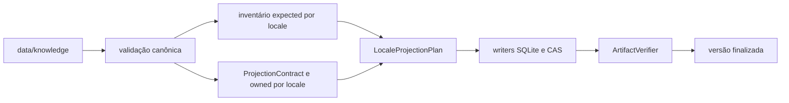
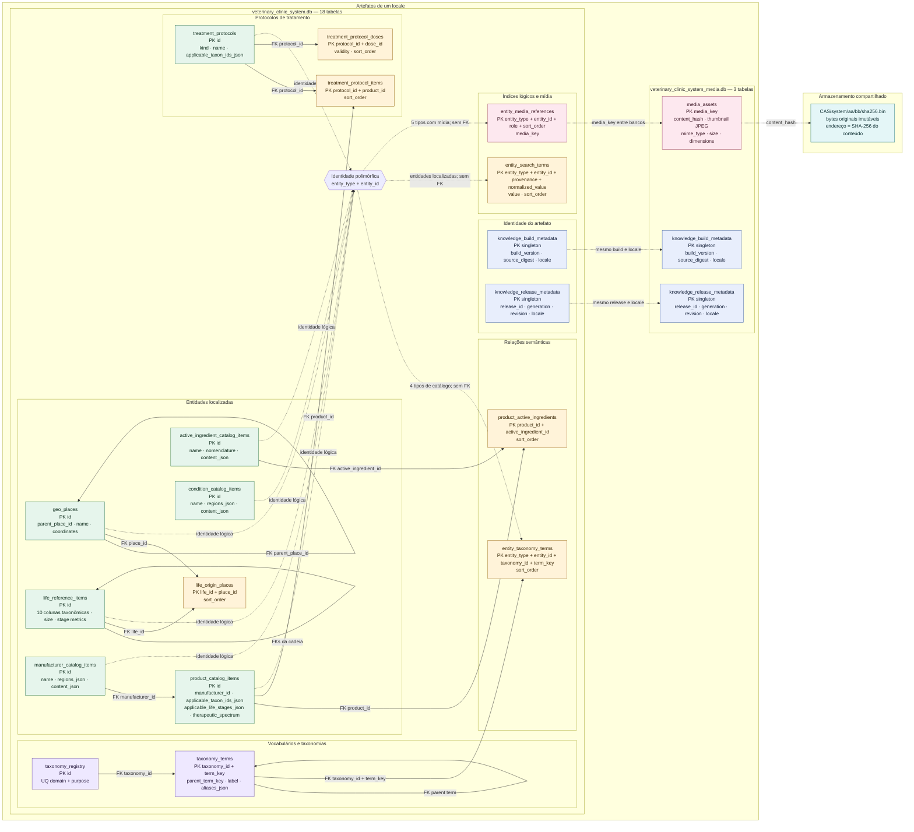

# Knowledge Builder

Este tool é o **compilador offline e verificável da fonte canônica de
conhecimento veterinário**. Ele transforma `data/knowledge` em versões completas
dos bancos públicos `system` e `system_media`, acompanhadas pelo `CAS/system`,
manifestos, checksums e evidências executáveis da projeção.

O app e os packages de runtime não participam do build. Eles consomem os
artefatos finalizados; não leem JSON, Markdown ou mídia diretamente da fonte de
autoria.

## Modelo Mental



O build sempre trabalha para os seis locales fechados:

```text
pt-BR
pt-PT
gn-PY
en-US
es-ES
fr-FR
```

Cada locale recebe duas travessias independentes antes da abertura dos bancos. O
inventário produz `expected`; o contrato produz operações que declaram suas
próprias obrigações, cuja união forma `owned`. O `LocaleProjectionPlan` só é
aceito quando os dois conjuntos são exatamente iguais. Os writers persistem as
operações validadas e o verificador relê os artefatos, usando `expected` para a
cobertura e o contrato para a equivalência semântica.

## Responsabilidades

`knowledge-builder` faz:

- descoberta e leitura dos `_entity.json` canônicos;
- validação por JSON Schema Draft 2020-12 antes da desserialização Serde;
- validação estrutural, referencial, localizada e semântica da fonte;
- normalização determinística de Unicode, identidades e termos de busca;
- compilação de documentos por AST CommonMark;
- resolução segura de mídia local e geração de thumbnails JPEG;
- construção dos contratos tipados dos seis locales;
- projeção dos bancos SQLite `system` e `system_media`;
- materialização deduplicada de objetos em `CAS/system`;
- emissão de manifestos, checksums e evidências de cobertura;
- verificação física e semântica antes da publicação ou reutilização.

`knowledge-builder` não faz:

- leitura de apps, packages de runtime, i18n, seeds ou bancos do ramo `user`;
- download de conteúdo ou qualquer consulta de rede;
- edição ou correção automática da fonte canônica;
- publicação remota, empacotamento Tauri ou instalação no app;
- fallback entre locales ou múltiplas fontes de verdade.

## Pré-Requisitos

Execute os comandos a partir da raiz do workspace.

- Rust 1.87 ou superior;
- dependências resolvidas pelo `Cargo.lock` do workspace;
- permissão de leitura sobre a fonte e o contexto;
- permissão de escrita sobre o diretório de saída no comando `build`.

O crate declara Rust 1.87 como MSRV. Para builds reprodutíveis, mantenha o lockfile
do workspace e use `--locked` em ambientes de integração e publicação.

## Dependências Rust

O `Cargo.toml` declara somente crates usadas diretamente pelo pipeline. O
`Cargo.lock` fixa a resolução completa, incluindo dependências transitivas;
estas não constituem APIs escolhidas diretamente pelo `knowledge-builder`.

| Dependência | Configuração | Responsabilidade no tool |
| --- | --- | --- |
| `comrak` | `=0.35.0`, sem features padrão | Interpreta Markdown como AST CommonMark. O builder inspeciona tipos de nós, links e imagens antes de produzir o documento compilado. As features padrão de CLI, syntax highlighting e builders auxiliares não são necessárias. |
| `image` | `=0.25.5`, somente `png`, `jpeg`, `gif` e `webp` | Detecta e decodifica os formatos de mídia aceitos, aplica orientação visual, lê dimensões e gera thumbnails JPEG determinísticos. A seleção explícita evita habilitar codecs e paralelismo que não pertencem ao contrato de mídia. |
| `jsonschema` | `=0.26.2`, sem features padrão | Compila e executa os JSON Schemas Draft 2020-12 embutidos para fontes, conteúdo, manifestos e relatórios. A desativação das features padrão remove resolução HTTP e filesystem: todos os schemas usados pelo build pertencem ao próprio crate. |
| `rusqlite` | `0.32`, com `bundled` e `modern_sqlite` | Cria, escreve, finaliza e relê os bancos `system` e `system_media`; também executa PRAGMAs, transações, checks de integridade e consultas de verificação. `bundled` fornece uma implementação SQLite conhecida sem depender da biblioteca instalada no sistema, e `modern_sqlite` usa os bindings da API SQLite moderna. |
| `serde` | `1.0`, com `derive` | Define a serialização e desserialização tipada da autoria, contexto, contratos públicos, relatórios e evidências. `derive` mantém os nomes e formatos declarados junto dos próprios tipos. |
| `serde_json` | `1.0` | Lê JSON validado, produz JSON canônico, manipula documentos durante validação e serializa manifestos, relatórios, conteúdo compilado e valores persistidos em SQLite. |
| `sha2` | `0.10.9` | Calcula SHA-256 para o digest lógico da fonte, checksums de artefatos, fingerprints de schemas, evidências e endereços do CAS. |
| `thiserror` | `2` | Implementa as famílias públicas de erros estruturados e suas cadeias de causas sem concentrar a apresentação da CLI dentro das regras de domínio. |
| `unicode-normalization` | `=0.1.24` | Aplica NFC e decomposição Unicode na identidade canônica, na comparação de conteúdo e na normalização dos termos de busca. |

As versões exatas de `comrak`, `image`, `jsonschema` e
`unicode-normalization` tornam deliberada qualquer alteração de parser, codec,
validador ou normalização que possa mudar artefatos. As demais dependências usam
faixas compatíveis, sempre resolvidas pelo lockfile em execuções com `--locked`.

Não há seção `[dev-dependencies]`: os testes exercitam as mesmas bibliotecas e
os mesmos codecs usados pelo binário e pela API de produção.

## Comandos

### Validar A Fonte

```text
cargo run --locked -p knowledge-builder -- \
  validate \
  --source data/knowledge
```

`validate` executa todo o contrato da fonte sem criar artefatos. Em caso de
sucesso, informa em `stderr` as quantidades de entidades, relações e fragmentos
localizados, além do digest lógico SHA-256 da fonte.

### Construir Uma Versão

```text
cargo run --locked -p knowledge-builder -- \
  build \
  --source data/knowledge \
  --output build/knowledge-artifacts \
  --context tools/knowledge-builder/fixtures/contexts/local-context.json
```

`build` valida novamente a fonte, lê o contexto, compila os seis locales,
verifica o staging e publica a versão. Em caso de sucesso, informa em `stderr` a
versão construída, o número de locales e o digest da fonte.

Os comandos exigem todas as opções mostradas, recusam opções desconhecidas ou
repetidas e retornam código diferente de zero quando qualquer etapa falha.

## Contexto De Build

O arquivo passado em `--context` define a identidade da versão, não o conteúdo
editorial. Seu contrato atual usa `schemaVersion: 1` e um `buildVersion` inteiro
positivo.

Build local:

```json
{
  "schemaVersion": 1,
  "buildVersion": 1,
  "release": null
}
```

Build associado a uma release:

```json
{
  "schemaVersion": 1,
  "buildVersion": 2,
  "release": {
    "releaseId": "37ef9309-c8fd-42ac-99a5-050b195d747f",
    "generation": 1,
    "revision": 1
  }
}
```

`releaseId` é um UUID minúsculo válido. `generation` e `revision` são inteiros
positivos. Os exemplos executáveis vivem em `fixtures/contexts/`.

## Fonte De Entrada

`--source` aponta para a raiz descrita em
[`data/knowledge`](../../data/knowledge/README.md). Entidades são descobertas por
`_entity.json`; os diretórios servem apenas à organização editorial, enquanto
`entityType` e `id` definem a identidade lógica.

A fonte pode conter:

- produtos, fabricantes, princípios ativos e condições;
- entidades de vida nos dez níveis e localidades geográficas;
- taxonomias e relações semânticas;
- protocolos e doses;
- conteúdo localizado simples;
- documentos Markdown declarados por `contentPath`;
- mídia local pertencente à entidade.

Não existe fallback de idioma. Todo campo localizado presente obedece ao
conjunto fechado dos seis locales e à política específica do tipo da entidade.

### Layout Reservado Da Autoria

O namespace técnico é fechado e sensível a maiúsculas e minúsculas:

```text
<entidade>/
├── _entity.json
├── _content/
│   └── <locale>.md
└── _media/
    └── <caminho editorial>
```

- `_entity.json` é o único nome descoberto como manifesto;
- `_content` contém exatamente os seis documentos canônicos e exige
  `contentPath: "./_content"`;
- `_media` contém somente arquivos referenciados pela entidade proprietária;
- ambos os diretórios reservados são filhos diretos do diretório da entidade;
- nomes desconhecidos iniciados por `_`, recursos órfãos, subdiretórios em
  `_content`, symlinks, arquivos especiais e arquivos técnicos adicionais são
  recusados antes da desserialização;
- pastas sem `_` são apenas organização editorial e podem ser movidas sem
  alterar a identidade lógica.

Referências estruturais usam `./_media/<caminho>` e imagens Markdown usam
`../_media/<caminho>`. O resolvedor separa o arquivo físico, o caminho interno
sob `_media` e o caminho compilado `media/<caminho>`. A chave pública resultante
é `<entity_type>/<entity_id>/media/<caminho>`; `_media` nunca aparece em
`system_media` ou no Markdown compilado.

## Pipeline De Compilação

### 1. Leitura E Validação

Cada JSON é validado contra seu schema embutido antes de entrar no modelo Rust.
Depois disso, o validator verifica IDs, referências, taxonomias, aliases,
locales, seções, arquivos declarados, limites e cobertura da árvore de autoria.
Uma fonte válida declara exatamente os dez pares canônicos de domínio e propósito;
taxonomias ausentes, adicionais ou com proprietário duplicado são recusadas
mesmo quando nenhuma entidade referencia o vocabulário afetado.

O digest lógico usa o conteúdo canônico, não a organização editorial dos
diretórios. Renomear ou mover uma entidade sem alterar seu contrato não muda a
identidade lógica do build.

### 2. Normalização E Markdown

`normalize_identity_key` remove diacríticos e caracteres fora de ASCII
alfanumérico e alimenta identidades normalizadas. `normalize_search_text`
preserva separação lexical por um único espaço e alimenta labels e termos de
busca.

Documentos são interpretados por AST CommonMark. O perfil aceita somente os nós
declarados pela fonte; links externos usam `https`, imagens são locais e
resolvidas dentro da entidade, e HTML bruto ou protocolos inseguros são
recusados.

### 3. Mídia E CAS

Fontes PNG, JPEG, GIF e WebP preservam seus bytes originais no CAS. A orientação
EXIF é aplicada antes do thumbnail. O thumbnail atual é sempre JPEG, qualidade
72, lado máximo de 200 pixels, filtro Lanczos3 e transparência composta sobre
branco.

Objetos usam SHA-256 hexadecimal minúsculo e o layout:

```text
CAS/system/<hash[0..2]>/<hash[2..4]>/<hash>.bin
```

Conteúdo idêntico gera um único objeto global, mesmo quando é referenciado por
mais de uma entidade, papel ou locale.

### 4. Contrato De Projeção

Para cada locale, o inventário deriva independentemente o conjunto `expected`
de obrigações da fonte validada. O `ProjectionContract` puro, tipado e
determinístico contém os valores finais de bancos, relações ordenadas, busca,
documentos, mídia, CAS e metadados, além do owner fechado de cada obrigação por
`ProjectionOperationId`.

A execução produz `PendingReceipt` para cada efeito. Writers SQLite confirmam o
lote somente após o `commit`; compilação e CAS confirmam seus próprios efeitos
após materialização. O `ProjectionLedger` aceita apenas `ConfirmedReceiptBatch`
compatível com locale, operação, cardinalidade e ownership, e exige igualdade
exata entre `expected`, `owned` e `observed`.

Operações, obrigações e eventos observados são mantidos em `BTreeSet`. Cada lote
é validado por inteiro, inclusive contra duplicações internas e contra o estado
acumulado, antes de qualquer conjunto do ledger ser alterado. Assim, um lote
recusado não publica observações parciais e a unicidade permanece logarítmica.

Colunas projetáveis usam o enum fechado `SystemColumn`. Cada forma de
`SystemRow` declara tabela, identidade lógica e colunas materializadas. Os SQLs
dos writers também são fixos: uma matriz estrutural cobre todas as formas de
`INSERT`, todos os destinos fechados e todas as variantes de
`SystemColumn`.

### 5. Escrita, Verificação E Publicação

Os bancos são criados a partir dos DDLs canônicos do crate e finalizados antes
da emissão dos relatórios. O `ArtifactVerifier` então recalcula e compara:

- JSON Schemas dos manifestos;
- identidade da fonte, contexto e versões técnicas;
- conjunto exato de arquivos e caminhos relativos;
- tamanhos, checksums SHA-256 e fingerprints dos schemas SQLite;
- `PRAGMA integrity_check`, foreign keys e contagens;
- metadados e todas as linhas projetáveis relidas em tipos fechados;
- relações, ordenações, busca e conteúdo compilado;
- referências de mídia, propriedades originais e thumbnails;
- conjuntos CAS globais e por locale;
- cobertura e digest das evidências de projeção.

Somente depois dessa verificação `versions/.<buildVersion>.staging` é renomeado
para `versions/<buildVersion>`. Objetos CAS são imutáveis e endereçados pelo
próprio conteúdo.

## Artefatos De Saída

Para uma versão `<buildVersion>`, `--output` recebe esta estrutura:

```text
<output>/
├── CAS/
│   └── system/
│       └── aa/
│           └── bb/
│               └── <sha256>.bin
└── versions/
    └── <buildVersion>/
        ├── build-result.json
        ├── projection-report.json
        ├── checksums.sha256
        └── locales/
            ├── pt-BR/
            │   ├── veterinary_clinic_system.db
            │   └── veterinary_clinic_system_media.db
            ├── pt-PT/
            ├── gn-PY/
            ├── en-US/
            ├── es-ES/
            └── fr-FR/
```

### Mapa Completo Dos Bancos E Do CAS System

Cada locale possui seu próprio par de bancos `system` e `system_media`. O
`CAS/system` é global para a saída e pode ser compartilhado por todos os
locales e versões que declarem o mesmo hash.



Setas contínuas representam `FOREIGN KEY` efetivamente aplicadas pelo SQLite.
Setas tracejadas representam contratos lógicos verificados pelo builder e pelo
`ArtifactVerifier`, mas que não podem ser expressos como FK por serem
polimórficos, atravessarem bancos diferentes ou apontarem para arquivos CAS.
Colunas `*_json` guardam atributos compostos do próprio registro; elas não
representam tabelas ou relacionamentos ocultos.

As dez taxonomias canônicas usam `taxonomy_registry` e `taxonomy_terms`.
Fabricantes, princípios ativos, condições e produtos materializam relações N:N
em `entity_taxonomy_terms`. `life:size` é `ZeroOrOne` e ocupa exclusivamente
`life_reference_items.size_term_key`; identidade taxonômica, origens e métricas
de vida usam suas colunas e tabelas fechadas, sem relações duplicadas.

Estágios de vida aplicáveis e espectro terapêutico são atributos opcionais do
próprio produto, persistidos respectivamente em
`product_catalog_items.applicable_life_stages_json` e
`product_catalog_items.therapeutic_spectrum`. Descritores vacinais são aliases
localizados comuns: aparecem em `aliases_json` e em `entity_search_terms`, sem
registro ou relação taxonômica. Assim, os atributos diretos atendem filtros
estruturados e os nomes e aliases atendem a pesquisa textual.

O banco `system` usa schema técnico 5. `system_media` permanece no schema
técnico 2.

`idx_entity_taxonomy_filter(taxonomy_id, term_key, entity_type, entity_id)`
atende filtros e facetas que partem de um termo.
`idx_entity_taxonomy_entity(entity_type, entity_id, taxonomy_id, sort_order)`
atende a leitura ordenada de todas as taxonomias de uma entidade. Labels e
Aliases associados também alimentam `entity_search_terms`, o read model textual
da busca, distinto da relação taxonômica.

`build-result.json`

Manifesto público da versão. Declara builder, contexto de release, digest da
fonte, versões dos bancos, artefatos por locale, CAS, relatório e arquivo de
checksums. O formato atual usa `schemaVersion: 1`.

`projection-report.json`

Evidência agregada da compilação: entidades por tipo, relações, fragmentos
localizados, linhas por banco e tabela, operações, obrigações esperadas e
concluídas e digest de evidências por locale. O formato atual usa
`schemaVersion: 5`.

`checksums.sha256`

Lista determinística dos checksums dos bancos, do relatório e dos objetos CAS
declarados pela versão.

`veterinary_clinic_system.db`

Catálogo localizado de entidades, taxonomias, relações, protocolos, busca e
referências estruturais de mídia. O schema atual possui versão técnica 4.

`veterinary_clinic_system_media.db`

Índice localizado dos ativos, hashes, propriedades das fontes e thumbnails
JPEG. O schema usa versão técnica 2; o CAS compartilhado contém os bytes
originais.

O crate `knowledge-builder` usa versão `0.5.0`. O relatório usa
`schemaVersion: 5`; `build-result.json` usa `schemaVersion: 1`.

## Determinismo E Reutilização

O mesmo conteúdo lógico, contexto, versão do builder e schemas produz os mesmos
artefatos. JSON e relatórios usam serialização canônica; tabelas, relações,
checksums e evidências possuem ordenação estável.

Se `versions/<buildVersion>` já existe, o tool não sobrescreve a pasta. Ele
reconstrói os contratos esperados e só reutiliza a versão quando identidade,
manifestos, checksums, bancos, mídia, CAS e equivalência semântica continuam
válidos. Conteúdo divergente ou adulterado é recusado.

## API Rust

Além do binário, o crate expõe uma API pequena para testes e automações internas:

```rust
use knowledge_builder::{build, validate, BuildOptions, LifeEntity};

let validated = validate("data/knowledge")?;

let result = build(&BuildOptions {
    source: "data/knowledge".into(),
    output: "build/knowledge-artifacts".into(),
    context: "tools/knowledge-builder/fixtures/contexts/local-context.json".into(),
})?;
```

- `validate` devolve `ValidatedSource` ou `ValidationError` com diagnósticos;
- `build` devolve o `BuildResult` verificado ou `KnowledgeBuilderError`, cujo
  enum preserva a família responsável e a cadeia de causas;
- `cli::run` devolve `CliError`, separando parsing/usage de falhas do builder;
- `BuildContext`, `ReleaseContext`, `KnowledgeLocale` e `LOCALES` também são
  públicos;
- `LifeEntity` é o contrato público único da hierarquia biológica.

## Erros E Código De Saída

A CLI escreve diagnósticos em `stderr` e retorna `0` em sucesso ou `1` em
falha. `CliError` separa erros de argumentos (`CliArgumentError`) das falhas do
pipeline (`KnowledgeBuilderError`).

`KnowledgeBuilderError` preserva a fronteira responsável:

- `ValidationError`: diagnósticos ordenados da fonte;
- `BuildContextError`: leitura, JSON e semântica do contexto;
- `ContractError`: inventário, ownership e contrato de projeção;
- `DatabaseError`: criação, transação, escrita, finalização e invariantes SQLite;
- `MediaError`: leitura, decodificação e thumbnail;
- `CasError`: staging, hashing e publicação dos objetos CAS;
- `VerificationError`: identidade e equivalência física ou semântica;
- `PublicationError`: diretórios, staging e publicação atômica.

As variantes carregam o contexto aplicável, como caminho, operação, locale,
banco, tabela e artefato. Causas concretas de I/O, JSON, SQLite e imagem ficam
disponíveis pela cadeia de `Error::source`.

## Módulos

`cli.rs`

Parser fechado dos comandos `validate` e `build`. Não depende do diretório
corrente além dos caminhos explicitamente recebidos.

`contracts/`

Registro privado dos valores imutáveis que atravessam subsistemas. A raiz do
crate reexporta `KnowledgeLocale` e `LOCALES`; `LifeEntity` é reexportado do
modelo de autoria. O diretório separa:

- `artifact.rs`: nomes públicos, descritores CAS e construtores de caminhos;
- `database.rs`: versão, application ID e filename de cada banco;
- `locale.rs`: tipo e ordem fechada dos seis locales;
- `source_layout.rs`: nomes reservados, caminhos autorais e namespace compilado
  de mídia;
- `taxonomy.rs`: matriz única dos dez pares e suas cardinalidades;
- `version.rs`: versões dos documentos serializados e dos bancos;
- `tests.rs`: equivalência com JSON Schemas e DDLs declarativos.

`source/`

Tipos da autoria canônica, descoberta de arquivos e desserialização após JSON
Schema. `Localized<T>` pertence a esse modelo.

`validation/`

Validação estrutural e semântica, resolução de referências, política localizada,
cobertura de arquivos e digest lógico da fonte. A fachada `mod.rs` preserva a
API pública e distribui o pipeline entre:

- `model.rs`: diagnósticos, erros e grafo validado;
- `pipeline.rs`: coordenação completa da validação da fonte;
- `entity_shape.rs`: regras estruturais específicas por entidade;
- `localized.rs`: campos localizados e seções editoriais;
- `taxonomy.rs`: árvores de termos e registro fechado de taxonomias;
- `references.rs`: referências entre entidades e termos;
- `aliases.rs`: ownership localizado de aliases;
- `filesystem.rs`: namespace reservado, propriedade, descoberta e cobertura de
  arquivos;
- `digest.rs`: digest lógico e contagens determinísticas;
- `life/`: taxonomia, classificações corporais e aplicabilidade;
- `primitives.rs`: UUIDs, textos e coleções;
- `tests.rs`: testes dos validadores primitivos.

`errors.rs`

Famílias públicas de erro por responsabilidade: contexto, contrato, SQLite,
mídia, CAS, verificação e publicação. `Display` concentra o texto apresentado
pela CLI, enquanto as variantes mantêm caminho, locale, operação, banco, tabela
e causas concretas disponíveis para automações.

`normalization/`

Normalização Unicode NFC, identidades canônicas e texto pesquisável.

`markdown/`

Compilação por AST CommonMark, allowlist de nós, links seguros, seções e
referências de mídia.

`media/`

Resolução segura de caminhos, inspeção das fontes, hashes, chaves de mídia,
layout CAS e geração determinística de thumbnails JPEG.

`projection/`

Coordena o pipeline tipado por locale. A fachada `mod.rs` expõe o orquestrador e
mantém as seguintes fronteiras:

- `build.rs`: staging, bancos, ledger, verificação e publicação atômica;
- `filesystem.rs`: limpeza de staging e descoberta determinística de arquivos;
- `reporting.rs`: relatório público derivado das evidências concluídas;
- `reuse.rs`: validação de versões finalizadas candidatas à reutilização;
- `coverage/`: vocabulário fechado compartilhado por inventário, contrato,
  execução e ledger, incluindo operações, obligations, targets, tabelas,
  colunas e identidades de rows;
- `inventory/mod.rs`: coordena a travessia independente que produz `expected`;
- `inventory/model.rs`: conjunto esperado, destinos e inserção única;
- `inventory/authoring.rs`: mapeamento comum das folhas autorais para o
  vocabulário neutro de cobertura;
- `inventory/metadata.rs`: obrigações dos metadados dos bancos e da release;
- `inventory/entities.rs`: campos e relações das entidades canônicas;
- `inventory/taxonomy.rs`: destinos de registry, termos, hierarquia e relações;
- `inventory/search.rs`: candidatos e obrigações esperadas de busca;
- `inventory/media.rs`: ativos de `system_media` e objetos CAS esperados;
- `contract.rs`: fachada dos payloads, operações e ownership do contrato;
- `contract/model.rs`: containers operacionais e `LocaleProjectionPlan`;
- `contract/rows/model.rs`: enum fechado dos payloads `SystemRow`;
- `contract/rows/descriptor.rs`: caso, tabela, identidade e colunas ordenadas de
  cada `SystemRow`;
- `contract/build.rs`: montagem completa do contrato de um locale;
- `contract/declarations/`: cobertura própria das operações e candidatos de
  busca, derivados sem consumir o inventário;
- `contract/metadata.rs`: operações dos metadados de build e release;
- `contract/compilation.rs`: operações de validação e conteúdo compilado;
- `contract/taxonomy.rs`: rows e relações taxonômicas;
- `contract/catalog.rs`: rows dos catálogos e protocolos;
- `contract/search.rs`: rows de busca construídas pelo contrato;
- `contract/media.rs`: referências estruturais, rows de `system_media` e
  operações CAS;
- `contract/values.rs`: extração localizada e codificação dos valores;
- `contract/ownership.rs`: atribuição única das obrigações aos owners;
- `contract/validation.rs`: fechamento e compatibilidade entre operações,
  obligations e targets;
- `contract/metrics.rs` e `contract/operations.rs`: contagens e identidades;
- `execution/`: efeitos tipados e emissão de recibos confirmados;
- `execution/cas.rs`: staging e commit dos objetos endereçados por conteúdo;
- `execution/compilation.rs`: confirmação do conteúdo compilado;
- `execution/receipts.rs`: recibos pendentes e confirmados;
- `execution/writers/`: transações, metadata e SQLs fixos de `system` e
  `system_media`;
- `ledger/`: comparação entre `expected`, `owned` e `observed`, unicidade
  ordenada, publicação atômica dos lotes e digest canônico.

`databases/`

DDLs canônicos de `system` e `system_media`, criação, finalização e
fingerprints. Cada `DatabaseKind` resolve sua identidade técnica no registro de
contratos.

`verification/`

Fachada única de verificação integral do staging e de versões finalizadas. O
diretório `readers/` relê metadata, rows de `system` e ativos de `system_media`
sem consumir writers. O diretório `artifact/` verifica identidade, árvore,
manifesto, bancos, mídia, CAS e evidência, recalculando observações sem escrever
nos artefatos.

`report/`

Contexto de build, DTOs públicos, serialização JSON canônica e caminhos
relativos normalizados.

`schemas/`

JSON Schemas embutidos da fonte, do conteúdo compilado e dos relatórios públicos.

`fixtures/`

Casos autocontidos de sucesso e falha. `registry.json` exige correspondência
exata entre diretórios e asserções executadas; detalhes estão no
[README das fixtures](fixtures/README.md).

## Topologia De `tests/`

O diretório `tools/knowledge-builder/tests` contém os testes que atravessam uma
fronteira externa do crate, como filesystem, SQLite, CAS, processo da CLI ou uma
versão completa de artefatos. Testes puramente internos ficam junto dos módulos
proprietários em `src/` e são executados por `cargo test --lib`.

```text
tests/
├── support/
│   └── mod.rs
├── component.rs
├── component_cases/
│   ├── mod.rs
│   └── filesystem.rs
├── integral.rs
└── integral_cases/
    ├── mod.rs
    ├── cli.rs
    ├── determinism.rs
    ├── reuse.rs
    └── tampering.rs
```

### Raízes Dos Binários De Teste

`component.rs` e `integral.rs` são raízes deliberadamente finas. Cada uma
declara o `support` compartilhado e seu diretório de casos, sem conter cenários,
fixtures ou lógica auxiliar. Essa separação mantém os comandos Cargo estáveis e
impede que um único arquivo volte a concentrar responsabilidades distintas.

### Infraestrutura Compartilhada

`support/mod.rs` contém somente infraestrutura de teste:

- criação e remoção de diretórios temporários exclusivos;
- resolução da raiz do workspace, fonte canônica e contexto de build;
- cópia determinística de fixtures;
- localização de manifestos usados pelos casos;
- leitura e atualização controlada de manifestos e checksums adulterados;
- cálculo auxiliar de SHA-256 para conferir adulterações;
- distinção explícita entre construção nova (`fresh_build`) e verificação de
  uma versão finalizada (`verify_reuse`) nos casos integrais.

O suporte não implementa validação, projeção, normalização, persistência ou
verificação. Os testes sempre acionam a API ou o binário de produção para essas
responsabilidades.

### Casos De Componente

`component_cases/filesystem.rs` atravessa a API pública `validate` com fixtures
pequenas para comprovar descoberta, layout reservado, digest lógico e rejeições
estruturais ou semânticas da fonte. Essa camada não importa `BuildOptions` nem
chama `build`; cada caso usa um diretório temporário próprio e não depende da
saída ou da ordem de outro teste.

Transações, commit, rollback, round-trip de rows, readers, mídia, thumbnail,
CAS, ownership, ledger e estágios individuais do verificador são testados como
componentes privados junto dos módulos proprietários em `src/`. Esses testes
acessam contratos internos sem ampliar a API pública e pertencem à execução
`cargo test --lib`.

### Casos Integrais

`integral_cases/` comprova propriedades do pipeline completo:

- `determinism.rs`: build dos seis locales, igualdade entre execuções e
  invariantes dos artefatos canônicos;
- `reuse.rs`: reutilização válida, identidade da versão e contexto divergente;
- `tampering.rs`: adulterações de manifesto, relatório, bancos, rows, mídia,
  thumbnails e CAS, inclusive com checksums recalculados;
- `cli.rs`: execução do binário com caminhos explícitos fora da raiz do
  workspace.

Mutações do mesmo artefato compartilham apenas uma cópia canônica imutável
dentro do próprio teste matricial. Os bytes originais são restaurados antes de
cada caso, e testes diferentes não compartilham diretórios mutáveis.

## Desenvolvimento E Testes

A suíte possui três camadas explícitas. A camada rápida reúne testes unitários
junto dos módulos proprietários e não chama um build integral dos seis locales:

```text
cargo test -p knowledge-builder --lib
```

A camada de componente usa fixtures e diretórios temporários exclusivos para
exercitar a validação pública da fonte sem construir os seis locales:

```text
cargo test -p knowledge-builder --test component
```

A camada integral preserva os builds determinísticos dos seis locales,
reutilização, contexto divergente, adulterações com checksums recalculados e a
CLI executada fora da raiz do workspace:

```text
cargo test -p knowledge-builder --test integral
```

Antes de entregar uma mudança, executar também:

```text
cargo fmt --all -- --check
cargo check -p knowledge-builder --all-targets
cargo clippy -p knowledge-builder --all-targets -- -D warnings
cargo test -p knowledge-builder --all-targets --locked
```

### Escolha Da Camada Por Mudança

- alterações puras em contratos, normalização, Markdown, validação, rows,
  ownership, recibos ou erros começam por `--lib`;
- alterações em DDL, transações, writers, readers, filesystem, mídia, thumbnail,
  CAS ou verificação executam `--lib` e `--test component`;
- alterações no orquestrador, determinismo, publicação, reutilização, relatórios,
  checksums ou CLI executam as três camadas;
- alterações em schemas, rows persistidas ou evidência também exigem os casos
  integrais de adulteração correspondentes.

## Regras De Manutenção

- Manter a fonte canônica independente do layout dos artefatos compilados.
- Iniciar uma alteração transversal no arquivo proprietário de `contracts/` e
  atualizar deliberadamente schemas declarativos e testes de equivalência; não
  repetir o valor em validators, projection, reuse ou verifier.
- Manter constantes exclusivas de mídia, Markdown, tabelas e colunas junto de
  seus próprios módulos, em vez de transformar `contracts/` em um agrupamento
  genérico.
- Não adicionar leitura de rede, apps, packages, i18n, seeds ou bancos `user`.
- Não introduzir fallback de locale ou segunda fonte de verdade.
- Não montar SQL, tabela ou coluna a partir de entrada canônica; writers usam
  comandos fechados.
- Ao adicionar ou alterar um campo de autoria, começar no tipo proprietário em
  `source/`, atualizar o JSON Schema aplicável e sua validação semântica, e então
  declarar cada folha projetável no owner fechado da operação.
- Ao adicionar uma relação, row ou tabela, atualizar o payload `SystemRow`, seu
  descritor único de tabela/identidade/colunas, `SystemTable` e `SystemColumn`
  quando aplicáveis, o DDL e as constraints. Relações ordenadas também declaram
  `sort_order` no contrato e nas obrigações.
- Writers consomem rows e produzem recibos confirmados somente depois do commit.
  Ao adicionar uma forma de `SystemRow`, atualizar o `INSERT` fixo, bindings e a
  matriz estrutural que prova caso, destino, colunas e parâmetros.
- Readers são independentes dos writers. Para cada row nova ou alterada,
  atualizar o `SELECT`, a reconstrução tipada e a comparação exata com o
  contrato projetado.
- Toda folha projetável deve entrar em `expected` pelo inventário e possuir um
  único owner por `ProjectionOperationId`. Atualizar ambos deliberadamente; o
  diff entre expected, owned e observed deve continuar vazio.
- Cada efeito persistido recebe um `PendingReceipt` com operação, obrigações,
  evento e cardinalidade. O writer confirma o lote depois do commit e o ledger
  só então publica observações e evidência.
- Ao adicionar uma propriedade persistida, incluí-la no contrato, writer,
  reader independente, equivalência semântica, recibo, evidência e testes de
  adulteração aplicáveis.
- Classificar erros na fronteira proprietária em `ValidationError`,
  `BuildContextError`, `ContractError`, `DatabaseError`, `MediaError`, `CasError`,
  `VerificationError` ou `PublicationError`. Preservar caminho, locale, banco,
  tabela, operação e a causa concreta disponíveis; a CLI apenas separa erros de
  argumentos de `KnowledgeBuilderError` e apresenta `Display`.
- Ao alterar DDL, atualizar a versão técnica, fingerprint, queries e testes no
  mesmo fluxo.
- Ao alterar `build-result.json` ou `projection-report.json`, atualizar DTO,
  schema, versão pública, verificador e testes no mesmo fluxo.
- Ao adicionar fixture, registrar o diretório em `fixtures/registry.json` e
  implementar sua asserção executável.
- Nunca sobrescrever uma versão finalizada divergente; um novo conteúdo exige
  outro `buildVersion`.
