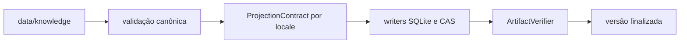

# Knowledge Builder

Este tool é o **compilador offline e verificável da fonte canônica de
conhecimento veterinário**. Ele transforma `data/knowledge` em versões completas
dos bancos públicos `system` e `system_media`, acompanhadas pelo `CAS/system`,
manifestos, checksums e evidências executáveis da projeção.

O app e os packages de runtime não participam do build. Eles consomem os
artefatos finalizados; não leem JSON, Markdown ou mídia diretamente da fonte de
autoria.

## Modelo Mental



O build sempre trabalha para os seis locales fechados:

```text
pt-BR
pt-PT
gn-PY
en-US
es-ES
fr-FR
```

Cada locale recebe um contrato completo antes da abertura dos bancos. Os writers
apenas persistem operações já validadas; depois, o verificador relê os artefatos
e exige equivalência integral com o contrato que os originou.

## Responsabilidades

`knowledge-builder` faz:

- descoberta e leitura dos `entity.json` canônicos;
- validação por JSON Schema Draft 2020-12 antes da desserialização Serde;
- validação estrutural, referencial, localizada e semântica da fonte;
- normalização determinística de Unicode, identidades e termos de busca;
- compilação de documentos por AST CommonMark;
- resolução segura de mídia local e geração de thumbnails JPEG;
- construção dos contratos tipados dos seis locales;
- projeção dos bancos SQLite `system` e `system_media`;
- materialização deduplicada de objetos em `CAS/system`;
- emissão de manifestos, checksums e evidências de cobertura;
- verificação física e semântica antes da publicação ou reutilização.

`knowledge-builder` não faz:

- leitura de apps, packages de runtime, i18n, seeds ou bancos do ramo `user`;
- download de conteúdo ou qualquer consulta de rede;
- edição ou correção automática da fonte canônica;
- migrations, conversões ou backfills de artefatos anteriores;
- publicação remota, empacotamento Tauri ou instalação no app;
- fallback entre locales ou entre contratos substituídos.

## Pré-Requisitos

Execute os comandos a partir da raiz do workspace.

- Rust 1.87 ou superior;
- dependências resolvidas pelo `Cargo.lock` do workspace;
- permissão de leitura sobre a fonte e o contexto;
- permissão de escrita sobre o diretório de saída no comando `build`.

O crate declara Rust 1.87 como MSRV. Para builds reprodutíveis, mantenha o lockfile
do workspace e use `--locked` em ambientes de integração e publicação.

## Comandos

### Validar A Fonte

```text
cargo run --locked -p knowledge-builder -- \
  validate \
  --source data/knowledge
```

`validate` executa todo o contrato da fonte sem criar artefatos. Em caso de
sucesso, informa em `stderr` as quantidades de entidades, relações e fragmentos
localizados, além do digest lógico SHA-256 da fonte.

### Construir Uma Versão

```text
cargo run --locked -p knowledge-builder -- \
  build \
  --source data/knowledge \
  --output build/knowledge-artifacts \
  --context tools/knowledge-builder/fixtures/contexts/local-context.json
```

`build` valida novamente a fonte, lê o contexto, compila os seis locales,
verifica o staging e publica a versão. Em caso de sucesso, informa em `stderr` a
versão construída, o número de locales e o digest da fonte.

Os comandos exigem todas as opções mostradas, recusam opções desconhecidas ou
repetidas e retornam código diferente de zero quando qualquer etapa falha.

## Contexto De Build

O arquivo passado em `--context` define a identidade da versão, não o conteúdo
editorial. Seu contrato atual usa `schemaVersion: 1` e um `buildVersion` inteiro
positivo.

Build local:

```json
{
  "schemaVersion": 1,
  "buildVersion": 1,
  "release": null
}
```

Build associado a uma release:

```json
{
  "schemaVersion": 1,
  "buildVersion": 2,
  "release": {
    "releaseId": "37ef9309-c8fd-42ac-99a5-050b195d747f",
    "generation": 1,
    "revision": 1
  }
}
```

`releaseId` é um UUID minúsculo válido. `generation` e `revision` são inteiros
positivos. Os exemplos executáveis vivem em `fixtures/contexts/`.

## Fonte De Entrada

`--source` aponta para a raiz descrita em
[`data/knowledge`](../../data/knowledge/README.md). Entidades são descobertas por
`entity.json`; os diretórios servem apenas à organização editorial, enquanto
`entityType` e `id` definem a identidade lógica.

A fonte pode conter:

- produtos, fabricantes, princípios ativos e condições;
- raças e localidades geográficas;
- taxonomias e relações semânticas;
- protocolos e doses;
- conteúdo localizado simples;
- documentos Markdown declarados por `contentPath`;
- mídia local pertencente à entidade.

Não existe fallback de idioma. Todo campo localizado presente obedece ao
conjunto fechado dos seis locales e à política específica do tipo da entidade.

## Pipeline De Compilação

### 1. Leitura E Validação

Cada JSON é validado contra seu schema embutido antes de entrar no modelo Rust.
Depois disso, o validator verifica IDs, referências, taxonomias, aliases,
locales, seções, arquivos declarados, limites e cobertura da árvore de autoria.

O digest lógico usa o conteúdo canônico, não a organização editorial dos
diretórios. Renomear ou mover uma entidade sem alterar seu contrato não muda a
identidade lógica do build.

### 2. Normalização E Markdown

`normalize_identity_key` remove diacríticos e caracteres fora de ASCII
alfanumérico e alimenta identidades normalizadas. `normalize_search_text`
preserva separação lexical por um único espaço e alimenta labels e termos de
busca.

Documentos são interpretados por AST CommonMark. O perfil aceita somente os nós
declarados pela fonte; links externos usam `https`, imagens são locais e
resolvidas dentro da entidade, e HTML bruto ou protocolos inseguros são
recusados.

### 3. Mídia E CAS

Fontes PNG, JPEG, GIF e WebP preservam seus bytes originais no CAS. A orientação
EXIF é aplicada antes do thumbnail. O thumbnail atual é sempre JPEG, qualidade
72, lado máximo de 200 pixels, filtro Lanczos3 e transparência composta sobre
branco.

Objetos usam SHA-256 hexadecimal minúsculo e o layout:

```text
CAS/system/<hash[0..2]>/<hash[2..4]>/<hash>.bin
```

Conteúdo idêntico gera um único objeto global, mesmo quando é referenciado por
mais de uma entidade, papel ou locale.

### 4. Contrato De Projeção

Cada locale produz um `ProjectionContract` puro, tipado e determinístico. Ele
contém os valores finais de bancos, relações ordenadas, busca, documentos,
mídia, CAS e metadados.

Cada folha validada declara diretamente seu proprietário fechado por
`ProjectionOperationId`. O `ProjectionJournal` conclui apenas o lote concreto
daquela operação, e as evidências SQLite entram no ledger somente depois do
`commit`.

Colunas projetáveis usam o enum fechado `SystemColumn`. Cada forma de
`SystemRow` declara tabela, identidade lógica e colunas materializadas. Os SQLs
dos writers também são fixos: uma matriz estrutural cobre todas as formas de
`INSERT`, todos os destinos polimórficos e todas as variantes de
`SystemColumn`.

### 5. Escrita, Verificação E Publicação

Os bancos são criados a partir dos DDLs canônicos do crate e finalizados antes
da emissão dos relatórios. O `ArtifactVerifier` então recalcula e compara:

- JSON Schemas dos manifestos;
- identidade da fonte, contexto e versões técnicas;
- conjunto exato de arquivos e caminhos relativos;
- tamanhos, checksums SHA-256 e fingerprints dos schemas SQLite;
- `PRAGMA integrity_check`, foreign keys e contagens;
- metadados e todas as linhas projetáveis relidas em tipos fechados;
- relações, ordenações, busca e conteúdo compilado;
- referências de mídia, propriedades originais e thumbnails;
- conjuntos CAS globais e por locale;
- cobertura e digest das evidências de projeção.

Somente depois dessa verificação `versions/.<buildVersion>.staging` é renomeado
para `versions/<buildVersion>`. Objetos CAS são imutáveis e endereçados pelo
próprio conteúdo.

## Artefatos De Saída

Para uma versão `<buildVersion>`, `--output` recebe esta estrutura:

```text
<output>/
├── CAS/
│   └── system/
│       └── aa/
│           └── bb/
│               └── <sha256>.bin
└── versions/
    └── <buildVersion>/
        ├── build-result.json
        ├── projection-report.json
        ├── checksums.sha256
        └── locales/
            ├── pt-BR/
            │   ├── veterinary_clinic_system.db
            │   └── veterinary_clinic_system_media.db
            ├── pt-PT/
            ├── gn-PY/
            ├── en-US/
            ├── es-ES/
            └── fr-FR/
```

`build-result.json`

Manifesto público da versão. Declara builder, contexto de release, digest da
fonte, versões dos bancos, artefatos por locale, CAS, relatório e arquivo de
checksums. O formato atual usa `schemaVersion: 1`.

`projection-report.json`

Evidência agregada da compilação: entidades por tipo, relações, fragmentos
localizados, linhas por banco e tabela, operações, obrigações esperadas e
concluídas e digest de evidências por locale. O formato atual usa
`schemaVersion: 3`.

`checksums.sha256`

Lista determinística dos checksums dos bancos, do relatório e dos objetos CAS
declarados pela versão.

`veterinary_clinic_system.db`

Catálogo localizado de entidades, taxonomias, relações, protocolos, busca e
referências estruturais de mídia. O schema atual possui versão técnica 2.

`veterinary_clinic_system_media.db`

Índice localizado dos ativos, hashes, propriedades das fontes e thumbnails
JPEG. O schema atual possui versão técnica 2; os bytes originais permanecem no
CAS compartilhado.

## Determinismo E Reutilização

O mesmo conteúdo lógico, contexto, versão do builder e schemas produz os mesmos
artefatos. JSON e relatórios usam serialização canônica; tabelas, relações,
checksums e evidências possuem ordenação estável.

Se `versions/<buildVersion>` já existe, o tool não sobrescreve a pasta. Ele
reconstrói os contratos esperados e só reutiliza a versão quando identidade,
manifestos, checksums, bancos, mídia, CAS e equivalência semântica continuam
válidos. Conteúdo divergente ou adulterado é recusado.

## API Rust

Além do binário, o crate expõe uma API pequena para testes e automações internas:

```rust
use knowledge_builder::{build, validate, BuildOptions};

let validated = validate("data/knowledge")?;

let result = build(&BuildOptions {
    source: "data/knowledge".into(),
    output: "build/knowledge-artifacts".into(),
    context: "tools/knowledge-builder/fixtures/contexts/local-context.json".into(),
})?;
```

- `validate` devolve `ValidatedSource` ou `ValidationError` com diagnósticos;
- `build` devolve o `BuildResult` verificado;
- `BuildContext`, `ReleaseContext`, `KnowledgeLocale` e `LOCALES` também são
  públicos.

## Módulos

`cli.rs`

Parser fechado dos comandos `validate` e `build`. Não depende do diretório
corrente além dos caminhos explicitamente recebidos.

`source/`

Tipos da autoria canônica, locales, descoberta de arquivos e desserialização
após JSON Schema.

`validation/`

Validação estrutural e semântica, resolução de referências, política localizada,
cobertura de arquivos e digest lógico da fonte. A fachada `mod.rs` preserva a
API pública e distribui o pipeline entre:

- `model.rs`: diagnósticos, erros e grafo validado;
- `pipeline.rs`: coordenação completa da validação da fonte;
- `entity_shape.rs`: regras estruturais específicas por entidade;
- `localized.rs`: campos localizados e seções editoriais;
- `taxonomy.rs`: árvores de termos e registro fechado de taxonomias;
- `references.rs`: referências entre entidades e termos;
- `aliases.rs`: ownership localizado de aliases;
- `filesystem.rs`: descoberta, caminhos editoriais e cobertura de arquivos;
- `digest.rs`: digest lógico e contagens determinísticas;
- `primitives.rs`: UUIDs, ranges, espécies, textos e coleções;
- `tests.rs`: testes dos validadores primitivos.

`normalization/`

Normalização Unicode NFC, identidades canônicas e texto pesquisável.

`markdown/`

Compilação por AST CommonMark, allowlist de nós, links seguros, seções e
referências de mídia.

`media/`

Resolução segura de caminhos, inspeção das fontes, hashes, chaves de mídia,
layout CAS e geração determinística de thumbnails JPEG.

`projection/`

Constrói e materializa um contrato puro por locale. A fachada `mod.rs` expõe o
orquestrador, enquanto o diretório separa:

- `build.rs`: staging, bancos, ledger, verificação e publicação atômica;
- `cas.rs`: staging e commit dos objetos endereçados por conteúdo;
- `reporting.rs`: relatório público derivado das evidências concluídas;
- `reuse.rs`: verificação de versões reutilizáveis, artefatos e digests;
- `filesystem.rs`: limpeza de staging e descoberta determinística de arquivos;
- `contract.rs`: fachada dos payloads e operações do contrato;
- `contract/model.rs`: tipos de payload e containers operacionais;
- `contract/row_*.rs`: tabela, identidade e colunas de cada `SystemRow`;
- `contract/build.rs`: montagem completa do contrato de um locale;
- `contract/taxonomy.rs` e `contract/catalog.rs`: projeções por domínio;
- `contract/helpers.rs`: relações, conteúdo localizado, busca, mídia e emissão;
- `contract/validation.rs`: ownership e compatibilidade entre owners e targets;
- `contract/metrics.rs` e `contract/operations.rs`: contagens e identidades;
- `writers.rs`: fachada da persistência SQLite;
- `writers/metadata.rs`, `writers/system.rs` e `writers/system_media.rs`: SQLs
  fixos para cada destino;
- `tests.rs`, `contract/tests.rs` e `writers/tests.rs`: testes estruturais dos
  helpers, do contrato e da matriz entre `SystemRow` e `INSERT`.

`databases/`

DDLs canônicos de `system` e `system_media`, criação, finalização, versões
técnicas e fingerprints.

`ledger/`

Fachada das obrigações tipadas e evidências de projeção. O diretório separa:

- `model.rs`: vocabulário fechado de owners, sources, targets, tabelas e colunas;
- `journal.rs`: commits de evidência, conclusão e contagens agregadas;
- `ownership.rs`: lotes declarados por `ProjectionOperationId`;
- `entity_obligations.rs`: matriz de obrigações de cada entidade canônica;
- `obligation_helpers.rs`: campos, relações, localização, documentos e mídia;
- `search.rs`: candidatos de busca localizados e deterministicamente ordenados;
- `evidence.rs`: DTO canônico e digest das evidências;
- `tests.rs`: atomicidade, ownership e fechamento do vocabulário de colunas.

`verification/`

Releitura tipada dos bancos e equivalência semântica com o contrato de projeção.

`artifact_verifier.rs`

Verificação integral do staging e de versões existentes antes da reutilização.

`report/`

Contexto de build, DTOs públicos, serialização JSON canônica e caminhos
relativos normalizados.

`schemas/`

JSON Schemas embutidos da fonte, do conteúdo compilado e dos relatórios públicos.

`fixtures/`

Casos autocontidos de sucesso e falha. `registry.json` exige correspondência
exata entre diretórios e asserções executadas; detalhes estão no
[README das fixtures](fixtures/README.md).

## Desenvolvimento E Testes

Validação rápida do crate:

```text
cargo check -p knowledge-builder --all-targets --offline
cargo clippy -p knowledge-builder --all-targets --offline -- -D warnings
cargo test -p knowledge-builder --all-targets --offline
```

Formatação:

```text
cargo fmt --all -- --check
```

Os testes integrais constroem e reutilizam versões completas para os seis
locales. Também adulteram isoladamente bancos, relatórios, checksums, mídia,
thumbnails e CAS para comprovar que declarações físicas recalculadas não vencem
a comparação semântica.

## Regras De Manutenção

- Manter a fonte canônica independente do layout dos artefatos compilados.
- Não adicionar leitura de rede, apps, packages, i18n, seeds ou bancos `user`.
- Não introduzir fallback de locale, compatibilidade legada ou segunda fonte de
  verdade.
- Não montar SQL, tabela ou coluna a partir de entrada canônica; writers usam
  comandos fechados.
- Ao adicionar uma forma de `SystemRow`, atualizar o descritor de `INSERT`, a
  matriz estrutural e a cobertura de `SystemColumn` no mesmo fluxo.
- Ao adicionar uma propriedade persistida, incluí-la no contrato, writer,
  releitura tipada, equivalência semântica e testes de adulteração aplicáveis.
- Ao alterar DDL, atualizar a versão técnica, fingerprint, queries e testes no
  mesmo fluxo.
- Ao alterar `build-result.json` ou `projection-report.json`, atualizar DTO,
  schema, versão pública, verificador e testes no mesmo fluxo.
- Ao adicionar fixture, registrar o diretório em `fixtures/registry.json` e
  implementar sua asserção executável.
- Nunca sobrescrever uma versão finalizada divergente; um novo conteúdo exige
  outro `buildVersion`.
