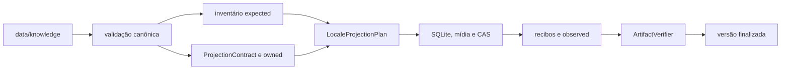
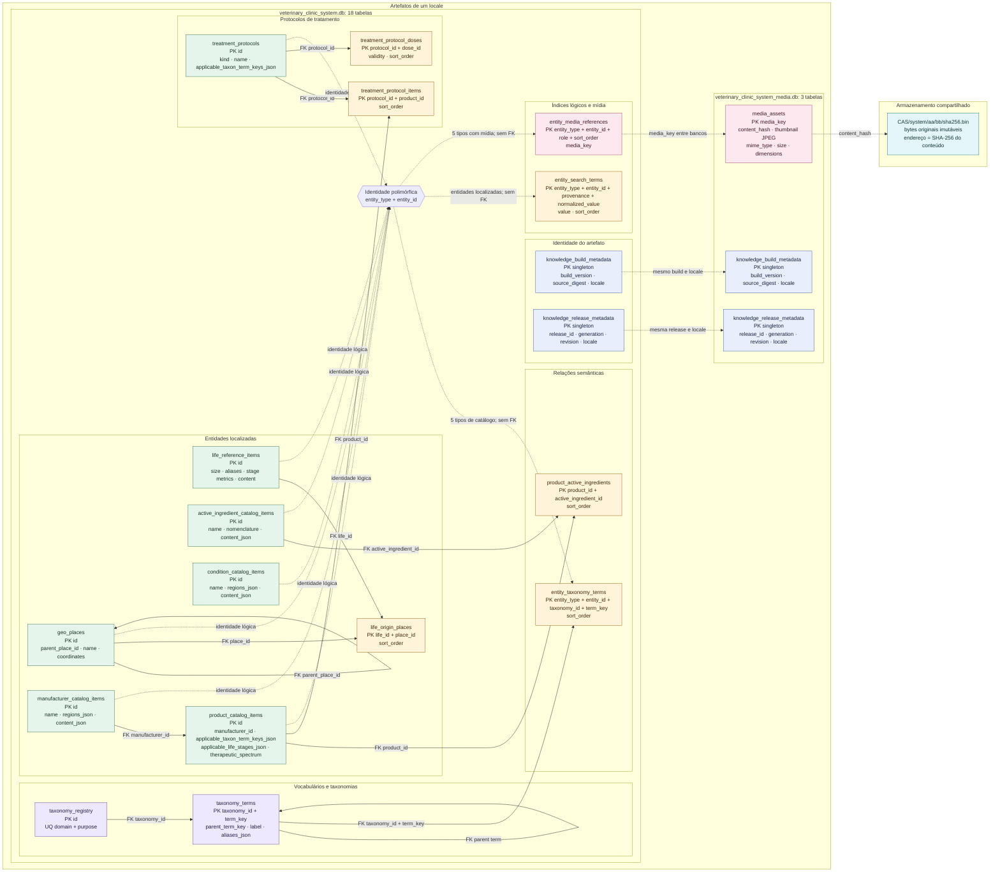

# Knowledge Builder

`knowledge-builder` é o compilador offline e verificável da fonte canônica de
conhecimento veterinário. Ele transforma `data/knowledge` em versões completas
dos bancos públicos `system` e `system_media`, acompanhadas pelo
`CAS/system`, manifestos, checksums e evidências executáveis da projeção.

Apps e packages de runtime consomem somente os artefatos finalizados. Eles não
leem JSON, Markdown ou mídia diretamente da fonte de autoria.

## Documentação

- [Fonte canônica](../../data/knowledge/README.md): regras para editar entidades,
  taxonomias, conteúdo localizado e mídia.
- [Manutenção](./MAINTENANCE.md): arquitetura interna, contratos, versionamento,
  receitas de alteração, testes e diagnóstico de falhas.
- [Fixtures](./fixtures/README.md): catálogo dos casos autocontidos usados pelos
  testes.

## Responsabilidades

O `knowledge-builder`:

- descobre e valida os `_entity.json` canônicos;
- valida estrutura, referências, locales, taxonomias, conteúdo e mídia;
- normaliza identidades, Unicode, Markdown e termos de busca;
- constrói contratos tipados para os seis locales;
- materializa os bancos SQLite `system` e `system_media`;
- gera thumbnails JPEG e objetos deduplicados em `CAS/system`;
- emite `build-result.json`, `projection-report.json` e
  `checksums.sha256`;
- relê e verifica toda a saída antes da publicação ou reutilização;
- publica cada `buildVersion` local de maneira atômica.

O `knowledge-builder` não:

- lê apps, packages de runtime, i18n, seeds ou bancos do ramo `user`;
- baixa conteúdo ou consulta a rede;
- edita ou corrige automaticamente a fonte canônica;
- instala artefatos no app, empacota Tauri ou publica releases remotas;
- aplica fallback entre locales ou mantém outra fonte de verdade.

## Fluxo



Para cada locale, o inventário deriva `expected` e o contrato tipado declara
operações e `owned` por uma travessia independente. A execução confirma
`observed` somente depois de materializar cada efeito. A publicação exige
igualdade entre os três conjuntos e equivalência física e semântica entre a
fonte validada, o contrato e os artefatos relidos.

O conjunto fechado de locales é:

```text
pt-BR
pt-PT
gn-PY
en-US
es-ES
fr-FR
```

Todo build produz os seis pares de bancos. Não existe fallback de idioma.

## Pré-Requisitos

Execute os comandos a partir da raiz do workspace.

- Rust 1.87 ou superior;
- dependências resolvidas pelo `Cargo.lock` do workspace;
- permissão de leitura sobre a fonte e o contexto;
- permissão de escrita sobre o diretório de saída no comando `build`.

O crate declara Rust 1.87 como MSRV. Ambientes de integração e publicação usam
o lockfile do workspace e comandos Cargo com `--locked`.

## Comandos

### Auditoria Editorial

```text
pnpm knowledge:audit
```

A auditoria confere o inventário editorial, os nomes reservados, as referências
e as contagens derivadas da fonte.

### Validação Canônica

```text
pnpm knowledge:validate
```

A validação executa os JSON Schemas e todas as regras estruturais, referenciais,
localizadas e semânticas sem criar artefatos. Em caso de sucesso, informa
quantidades e o digest lógico SHA-256 da fonte.

O comando Cargo equivalente aceita uma raiz explícita:

```text
cargo run --locked -p knowledge-builder -- \
  validate \
  --source data/knowledge
```

### Construção

```text
pnpm knowledge:build
```

O script da raiz usa a fonte canônica, `build/knowledge-artifacts` como saída e
o contexto local das fixtures. O comando Cargo completo é:

```text
cargo run --locked -p knowledge-builder -- \
  build \
  --source data/knowledge \
  --output build/knowledge-artifacts \
  --context tools/knowledge-builder/fixtures/contexts/local-context.json
```

`build` valida novamente a fonte, compila os seis locales, verifica o staging
e publica a versão. Os comandos recusam opções ausentes, desconhecidas ou
repetidas e retornam código diferente de zero diante de qualquer falha.

## Contexto De Build

O arquivo informado por `--context` define a identidade da compilação, não o
conteúdo editorial. O contrato atual usa `schemaVersion: 1` e um
`buildVersion` inteiro positivo.

Build local:

```json
{
  "schemaVersion": 1,
  "buildVersion": 1,
  "release": null
}
```

Build associado a uma release:

```json
{
  "schemaVersion": 1,
  "buildVersion": 2,
  "release": {
    "releaseId": "37ef9309-c8fd-42ac-99a5-050b195d747f",
    "generation": 1,
    "revision": 1
  }
}
```

`releaseId` é um UUID minúsculo válido. `generation` e `revision` são
inteiros positivos. Os exemplos executáveis vivem em `fixtures/contexts/`.

## Fonte De Entrada

`--source` aponta para a raiz descrita no
[README de `data/knowledge`](../../data/knowledge/README.md). Entidades são
descobertas por `_entity.json`; os diretórios servem apenas à organização
editorial, enquanto `entityType` e `id` definem a identidade lógica.

A fonte contém entidades de catálogo e vida, localidades geográficas,
taxonomias, relações semânticas, protocolos, conteúdo localizado, padrões
editoriais, documentos Markdown e mídia pertencente às entidades.

Na organização canônica, `biomedical` contém `active-ingredients`, `conditions`
e `life`; `catalog` contém `manufacturers` e `products`. Cada uma dessas cinco
coleções separa vocabulários em `taxonomies/` e entidades em `editorial/`.
`clinical`, `geo` e `_standards` permanecem domínios transversais. Essa
disposição organiza a autoria; tipo, identidade, relações e projeção continuam
determinados exclusivamente pelos manifestos.

O namespace técnico reservado é:

```text
data/knowledge/
├── _standards/
│   └── sections.json
└── <diretórios editoriais>/<entidade>/
    ├── _entity.json
    ├── _content/
    │   ├── pt-BR.md
    │   ├── pt-PT.md
    │   ├── gn-PY.md
    │   ├── en-US.md
    │   ├── es-ES.md
    │   └── fr-FR.md
    └── _media/
        └── <caminho editorial>
```

- `_entity.json` é o único nome descoberto como manifesto;
- `_standards` existe somente na raiz e contém `sections.json`;
- `_content` exige os seis documentos quando a entidade declara
  `sectionStandardKey`;
- `_media` contém somente arquivos referenciados pela entidade proprietária;
- nomes reservados desconhecidos, recursos órfãos, symlinks e arquivos especiais
  são recusados;
- pastas sem `_` são organização editorial e podem ser movidas sem alterar a
  identidade lógica.

Referências estruturais usam `./_media/<caminho>`, e imagens Markdown usam
`../_media/<caminho>`. O caminho compilado usa
`<entity_type>/<entity_id>/media/<caminho>`; nomes editoriais reservados não
aparecem nos bancos.

## Compilação

1. O registro de padrões e cada entidade passam por JSON Schema antes da
   desserialização tipada.
2. O validator resolve referências, árvores taxonômicas, locales, seções e
   arquivos e calcula o digest lógico independente da organização das pastas.
3. Markdown é analisado por AST CommonMark, limitado por allowlist e normalizado
   deterministicamente.
4. Mídias PNG, JPEG, GIF e WebP preservam os bytes originais; thumbnails usam
   JPEG, qualidade 72, lado máximo de 200 pixels e filtro Lanczos3.
5. O contrato de projeção produz rows, busca, mídia, CAS e metadados por locale.
6. Writers persistem transações SQLite e recibos confirmados; o ledger fecha a
   cobertura.
7. O verificador relê bancos, relatórios, mídia e CAS antes da publicação
   atômica.

Detalhes sobre cada etapa e seu módulo proprietário estão no
[manual de manutenção](./MAINTENANCE.md).

## Artefatos De Saída

Para uma versão `<buildVersion>`, `--output` recebe:

```text
<output>/
├── CAS/
│   └── system/
│       └── aa/
│           └── bb/
│               └── <sha256>.bin
└── versions/
    └── <buildVersion>/
        ├── build-result.json
        ├── projection-report.json
        ├── checksums.sha256
        └── locales/
            ├── pt-BR/
            │   ├── veterinary_clinic_system.db
            │   └── veterinary_clinic_system_media.db
            ├── pt-PT/
            ├── gn-PY/
            ├── en-US/
            ├── es-ES/
            └── fr-FR/
```

Cada locale possui seu próprio par `system` e `system_media`. O
`CAS/system` é global para a saída e compartilha objetos de mesmo hash entre
locales e versões.

### Mapa Dos Bancos E Do CAS



Setas contínuas representam foreign keys aplicadas pelo SQLite. Setas
tracejadas representam contratos lógicos comprovados pelo builder, mas que
atravessam identidades polimórficas, bancos diferentes ou arquivos CAS.
Colunas `*_json` guardam atributos compostos do próprio registro.

As onze taxonomias canônicas usam `taxonomy_registry` e `taxonomy_terms`.
Na autoria, cada taxonomia é uma floresta ordenada; o builder deriva
`parent_term_key` do aninhamento e `sort_order` da posição entre irmãos.
`entity_taxonomy_terms` é a relação indexada entre entidades e termos.

`life:type` organiza os dez ranks biológicos e associa uma `LifeEntity`
opcional por `typeTermKey`. O nome localizado pertence ao termo; aliases e
fatos próprios pertencem à entidade.

### Contratos Públicos Da Saída

`build-result.json`

Declara `builderVersion`, `buildVersion`, contexto de release, digest da
fonte, versões dos bancos, os seis pares em `locales`, CAS, relatório de
projeção e arquivo de checksums. O formato usa `schemaVersion: 1`.

`projection-report.json`

Registra entidades, relações, fragmentos localizados, rows, operações,
obrigações esperadas e concluídas e digest das evidências por locale. O formato
usa `schemaVersion: 5`.

`checksums.sha256`

Lista deterministicamente os checksums dos doze bancos, do relatório e dos
objetos CAS declarados pela versão.

`veterinary_clinic_system.db`

Contém catálogo localizado, taxonomias, relações, protocolos, busca e
referências estruturais de mídia. O schema técnico usa versão 7.

`veterinary_clinic_system_media.db`

Indexa `mediaKey -> contentHash`, propriedades das fontes e thumbnails JPEG.
O schema técnico usa versão 2; o CAS contém os bytes originais.

`CAS/system`

Armazena objetos imutáveis pelo SHA-256 hexadecimal minúsculo em
`<2-hex>/<2-hex>/<hash>.bin`.

O crate `knowledge-builder` usa versão `0.5.0`.

## Determinismo E Reutilização

O mesmo conteúdo lógico, contexto, versão do builder e schemas produz os mesmos
artefatos. JSON, rows, relações, checksums e evidências possuem ordenação
estável; caminhos absolutos, timestamps ambientais e a organização editorial
das pastas não entram na identidade lógica.

Se `versions/<buildVersion>` já existe, a ferramenta não sobrescreve a pasta. Ela
reconstrói os contratos esperados e só reutiliza a versão quando identidade,
manifestos, checksums, bancos, mídia, CAS e equivalência semântica continuam
válidos. Conteúdo divergente ou adulterado é recusado.

## API Rust

Além da CLI, o crate expõe uma API pequena para testes e automações internas:

```rust
use knowledge_builder::{build, validate, BuildOptions};

let validated = validate("data/knowledge")?;

let result = build(&BuildOptions {
    source: "data/knowledge".into(),
    output: "build/knowledge-artifacts".into(),
    context: "tools/knowledge-builder/fixtures/contexts/local-context.json".into(),
})?;
```

`validate` devolve `ValidatedSource` ou `ValidationError`. `build` devolve
um `BuildResult` já verificado ou `KnowledgeBuilderError`. A API também expõe
os contratos públicos necessários para locales, contexto de build, vida,
padrões editoriais e diagnósticos.

Mudanças na implementação, nos schemas ou nos artefatos seguem o
[manual de manutenção](./MAINTENANCE.md).
